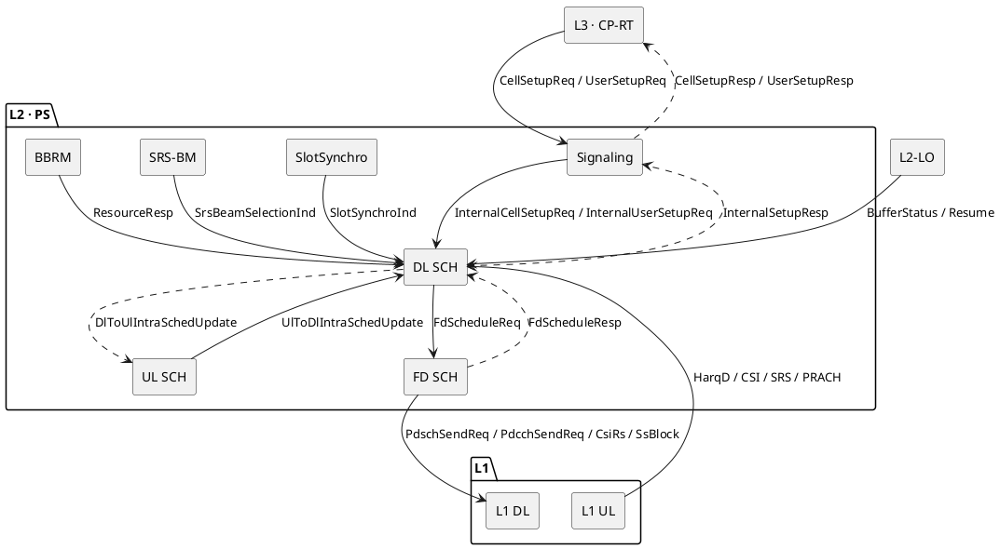

# L2PS DL Scheduler Runtime Position

```plantuml
@startuml L2PS DL Scheduler Runtime Position
!pragma graphviz svg
' scale 1920*1080

' skinparam linetype ortho
skinparam componentStyle rectangle
top to bottom direction

package "L2 · PS" as L2PS {
  rectangle "Signaling" as SGNL
  rectangle "SlotSynchro" as SYNC
  rectangle "UL SCH" as ULSCH
  rectangle "SRS-BM" as SRSBM
  rectangle "BBRM" as BBRM
  rectangle "DL SCH" as DLSCH
  rectangle "FD SCH" as FDSCH
}

package "L1" as L1 {
  rectangle "L1 DL" as L1TX
  rectangle "L1 UL" as L1RX
}

rectangle "L3 · CP-RT" as CPRT
rectangle "L2-LO" as LOCTRL

CPRT --> SGNL : CellSetupReq / UserSetupReq
SGNL --> DLSCH : InternalCellSetupReq / InternalUserSetupReq
LOCTRL --> DLSCH : BufferStatus / Resume
SYNC --> DLSCH : SlotSynchroInd
ULSCH --> DLSCH : UlToDlIntraSchedUpdate
DLSCH ..> ULSCH : DlToUlIntraSchedUpdate
SRSBM --> DLSCH : SrsBeamSelectionInd
BBRM --> DLSCH : ResourceResp
DLSCH --> FDSCH : FdScheduleReq
FDSCH ..> DLSCH : FdScheduleResp
FDSCH --> L1TX : PdschSendReq / PdcchSendReq / CsiRs / SsBlock
L1RX --> DLSCH : HarqD / CSI / SRS / PRACH
DLSCH ..> SGNL : InternalSetupResp
SGNL ..> CPRT : CellSetupResp / UserSetupResp
@enduml
```
