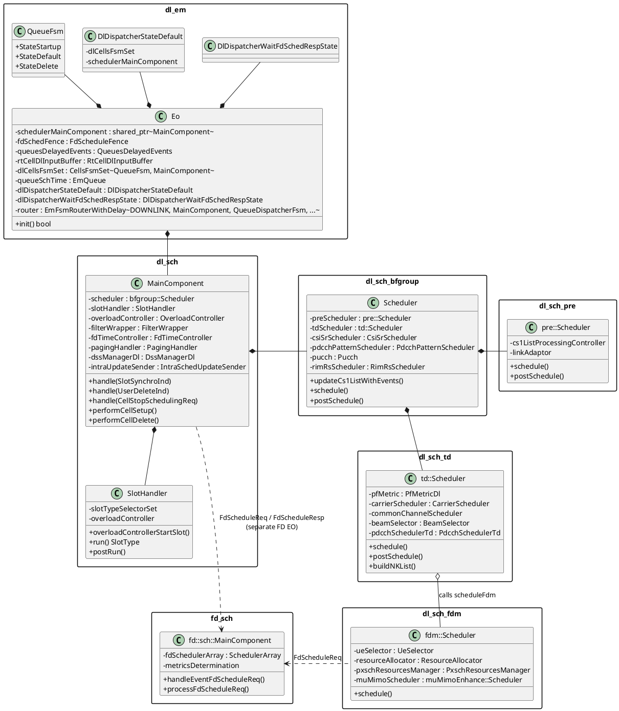

# L2PS DL Scheduler Top-Level Class Overview

```plantuml
@startuml L2PS DL Scheduler Top-Level Class Overview
!pragma graphviz svg
' scale 1920*1080

' skinparam linetype ortho
set namespaceSeparator ::
skinparam classAttributeIconSize 0
skinparam packageStyle rectangle

package dl_em {
  class Eo {
    -schedulerMainComponent : shared_ptr~MainComponent~
    -fdSchedFence : FdScheduleFence
    -queuesDelayedEvents : QueuesDelayedEvents
    -rtCellDlInputBuffer : RtCellDlInputBuffer
    -dlCellsFsmSet : CellsFsmSet~QueueFsm, MainComponent~
    -queueSchTime : EmQueue
    -dlDispatcherStateDefault : DlDispatcherStateDefault
    -dlDispatcherWaitFdSchedRespState : DlDispatcherWaitFdSchedRespState
    -router : EmFsmRouterWithDelay~DOWNLINK, MainComponent, QueueDispatcherFsm, ...~
    +init() bool
  }
  class QueueFsm {
    +StateStartup
    +StateDefault
    +StateDelete
  }
  class DlDispatcherStateDefault {
    -dlCellsFsmSet
    -schedulerMainComponent
  }
  class DlDispatcherWaitFdSchedRespState
}
package dl_sch {
  class MainComponent {
    -scheduler : bfgroup::Scheduler
    -slotHandler : SlotHandler
    -overloadController : OverloadController
    -filterWrapper : FilterWrapper
    -fdTimeController : FdTimeController
    -pagingHandler : PagingHandler
    -dssManagerDl : DssManagerDl
    -intraUpdateSender : IntraSchedUpdateSender
    +handle(SlotSynchroInd)
    +handle(UserDeleteInd)
    +handle(CellStopSchedulingReq)
    +performCellSetup()
    +performCellDelete()
  }
  class SlotHandler {
    -slotTypeSelectorSet
    -overloadController
    +overloadControllerStartSlot()
    +run() SlotType
    +postRun()
  }
}
package dl_sch_bfgroup {
  class Scheduler {
    -preScheduler : pre::Scheduler
    -tdScheduler : td::Scheduler
    -csiSrScheduler : CsiSrScheduler
    -pdcchPatternScheduler : PdcchPatternScheduler
    -pucch : Pucch
    -rimRsScheduler : RimRsScheduler
    +updateCs1ListWithEvents()
    +schedule()
    +postSchedule()
  }
}
package dl_sch_pre {
  class "pre::Scheduler" as PreScheduler {
    -cs1ListProcessingController
    -linkAdaptor
    +schedule()
    +postSchedule()
  }
}
package dl_sch_td {
  class "td::Scheduler" as TdScheduler {
    -pfMetric : PfMetricDl
    -carrierScheduler : CarrierScheduler
    -commonChannelScheduler
    -beamSelector : BeamSelector
    -pdcchSchedulerTd : PdcchSchedulerTd
    +schedule()
    +postSchedule()
    +buildNKList()
  }
}
package dl_sch_fdm {
  class "fdm::Scheduler" as FdmScheduler {
    -ueSelector : UeSelector
    -resourceAllocator : ResourceAllocator
    -pxschResourcesManager : PxschResourcesManager
    -muMimoScheduler : muMimoEnhance::Scheduler
    +schedule()
  }
}
package fd_sch {
  class "fd::sch::MainComponent" as FdMainComponent {
    -fdSchedulerArray : SchedulerArray
    -metricsDetermination
    +handleEventFdScheduleReq()
    +processFdScheduleReq()
  }
}
Eo *-d- MainComponent
Eo *-u- QueueFsm
Eo *-u- DlDispatcherStateDefault
Eo *-u- DlDispatcherWaitFdSchedRespState
MainComponent *-r- Scheduler
MainComponent *-- SlotHandler
MainComponent ..> FdMainComponent : FdScheduleReq / FdScheduleResp\n(separate FD EO)
Scheduler *-r- PreScheduler
Scheduler *-d- TdScheduler
TdScheduler o-d- FdmScheduler : calls scheduleFdm
FdmScheduler .l.> FdMainComponent : FdScheduleReq
@enduml
```
