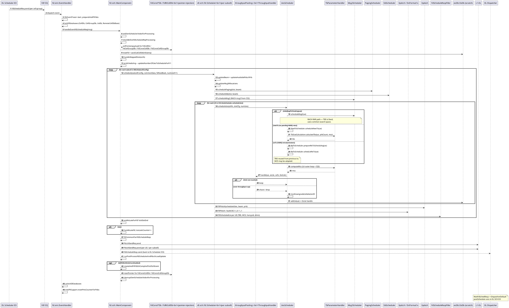

# L2PS FD Complete Scheduling Sequence (per slot per cell-group per subcell)

```plantuml
@startuml L2PS FD Complete Scheduling Sequence (per slot per cell-group per subcell)
!pragma graphviz svg
' scale 1920*1080

    autonumber
participant "DL Scheduler EO" as DLS
participant "FdY EQ" as EQ
participant "fd::em::EventHandler" as EH
participant "fd::sch::MainComponent" as MC
participant "FdConst*Db / FdRtCellDb<br/>(pointer-injection)" as DBP
participant "dl::sch::fd::Scheduler<br/>(per subcell)" as SCH
participant "throughputPooling::<br/>ThroughputHandler" as TPUT
participant "UesScheduler" as UES
participant "TbParameterHandler" as TB
participant "Msg2Scheduler" as MSG2
participant "PagingScheduler" as PAG
participant "SibScheduler" as SIB
participant "Xpdcch / DciFormat1x" as DCI
participant "Xpdsch" as TBR
participant "FdScheduleRespFiller" as FILL
participant "eoDb::EoDb (scratch)" as EODB
participant "L1-DL" as L1DL
participant "DL Dispatcher" as DLDISP
    DLS->EQ: FdScheduleReq.send (per cell-group)
    EQ->EH: dispatch event
    EH->EH: OlcEventTracer start, prepareIntelPtPebs
    EH->EH: lockDlDatabases (CellDb, CellGroupDb, UeDb, RemoteCellDbBase)
    EH->MC: handleEventFdScheduleReq(msg)
    MC->MC: setOwnSchedulerIndexForProcessing
    MC->MC: checkBeforeFdScheduleReqProcessing
    MC->DBP: setPointer(payload) for FdCellDb /\nFdCellGroupDb / FdConstCellDb / FdConstCellGroupDb
    MC->EODB: resetFd + saveSubCellIdsInEo(req)
    MC->MC: handleSkippedSlots(xsfn)
    MC->MC: preScheduling -- updateNumberOfUesToScheduleForFr1
    loop for each subcell in fdSchSubcellConfig
        MC->SCH: schedule(subcellConfig, commonData, fdFeedBack, numUesFr1)
        SCH->SCH: updateBeam + updateAvailablePdschPrb
        SCH->SCH: updateMsg3Allocations
        SCH->PAG: schedulePaging(slot, beam)
        SCH->SIB: scheduleSib(slot, beam)
        SCH->MSG2: scheduleMsg2 (RACH msg2 from CS2)
        loop for each UE in CS2 (UesScheduler.scheduleUes)
            SCH->UES: scheduleUes(xhfn, slotCfg, numUes)
            alt isRaMsg2TxPending(ue)
                UES->MSG2: scheduleMsg2(ue)
                note over UES,MSG2
                  RACH RAR path — TBS is fixed,
                  uses common search space.
                end note
            else newTx (no pending HARQ retx)
                UES->UES: NewTxScheduler.scheduleNewTx(ue)
                UES->TB: TbSizeCalculation.calculateTbs(ue, prbCount, mcs)
                TB-->UES: tbs
            else reTx (HARQ retransmission)
                UES->UES: ReTxScheduler.prepareReTxScheduling(ue)
                UES->UES: ReTxScheduler.scheduleReTx(ue)
                note over UES
                  TBS reused from previous tx;
                  MCS may be adapted.
                end note
            end
            UES->TB: computeMcs (LA outer-loop + CQI)
            TB-->UES: mcs
            UES->TPUT: handle(ue, eoUe, xsfn, tbsCalc)
            alt limit not reached
                TPUT-->UES: keep
            else over throughput cap
                TPUT-->UES: shave / drop
                UES->UES: mcsDowngradeUeSelectorDl
            end
            UES->EODB: addUe(ue) → EoUe handle
        end
        SCH->TBR: fillPdsch(scheduledUes, beam, prb)
        SCH->DCI: fillPdcch / build DCI 1_0 / 1_1
        SCH->FILL: fillScheduledUe per UE (TBS, MCS, harq pid, dmrs)
    end
    MC->MC: areWeLateForFd? tickSlotEnd
    alt late
        MC->MC: handleLateFd, tooLateCounter++
    end
    MC->MC: fillCommonPartFdScheduleResp
    MC->L1DL: PdcchSendReq.send
    MC->L1DL: PdschSendReq.send (per UE / per subcell)
    MC-->DLDISP: FdScheduleResp.send (back to DL Scheduler EO)
    MC->MC: runPostProcessFdSchedulerAndPdschLoadUpdate
    opt isDlFdSchOnULCoreEnabled
        MC->MC: createAndFillFdSchCompIndToUlSchEvent
    end
    MC->DBP: resetPointer for FdConstCellDb / FdConstCellGroupDb
    MC->MC: cleanupOwnSchedulerIndexForProcessing
    EH->EH: unlockDlDatabases
    EH->EH: intelPtSupport.resetPmcCounterForPebs
    note over DLDISP
      WaitFdSchedResp → DispatcherDefault
      postSchedule runs in DL SCH EO
    end note
@enduml
```
