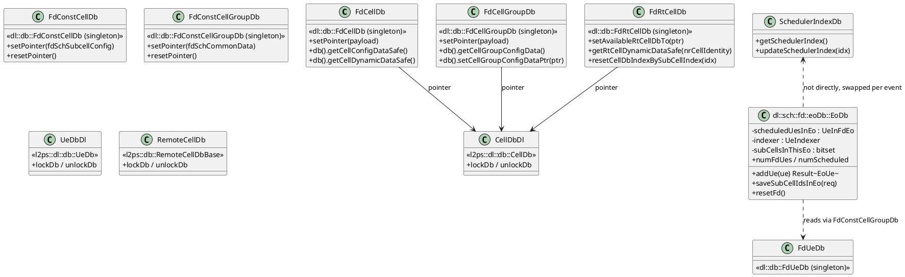

# L2PS FD DB Model

```plantuml
@startuml L2PS FD DB Model
!pragma graphviz svg
' scale 1920*1080

' skinparam linetype ortho
set namespaceSeparator ::
skinparam classAttributeIconSize 0
skinparam packageStyle rectangle

class FdCellDb {
    <<dl::db::FdCellDb (singleton)>>
    +setPointer(payload)
    +db().getCellConfigDataSafe()
    +db().getCellDynamicDataSafe()
}
class FdCellGroupDb {
    <<dl::db::FdCellGroupDb (singleton)>>
    +setPointer(payload)
    +db().getCellGroupConfigData()
    +db().setCellGroupConfigDataPtr(ptr)
}
class FdConstCellDb {
    <<dl::db::FdConstCellDb (singleton)>>
    +setPointer(fdSchSubcellConfig)
    +resetPointer()
}
class FdConstCellGroupDb {
    <<dl::db::FdConstCellGroupDb (singleton)>>
    +setPointer(fdSchCommonData)
    +resetPointer()
}
class FdRtCellDb {
    <<dl::db::FdRtCellDb (singleton)>>
    +setAvailableRtCellDbTo(ptr)
    +getRtCellDynamicDataSafe(nrCellIdentity)
    +resetCellDbIndexBySubCellIndex(idx)
}
class FdUeDb {
    <<dl::db::FdUeDb (singleton)>>
}
class CellDbDl {
    <<l2ps::dl::db::CellDb>>
    +lockDb / unlockDb
}
class UeDbDl {
    <<l2ps::dl::db::UeDb>>
    +lockDb / unlockDb
}
class RemoteCellDb {
    <<l2ps::db::RemoteCellDbBase>>
    +lockDb / unlockDb
}
class SchedulerIndexDb {
    +getSchedulerIndex()
    +updateSchedulerIndex(idx)
}
class "dl::sch::fd::eoDb::EoDb" as EoDbPerSlot {
    -scheduledUesInEo : UeInFdEo
    -indexer : UeIndexer
    -subCellsInThisEo : bitset
    +numFdUes / numScheduled
    +addUe(ue) Result~EoUe~
    +saveSubCellIdsInEo(req)
    +resetFd()
}
FdCellDb --> CellDbDl : pointer
FdCellGroupDb --> CellDbDl : pointer
FdRtCellDb --> CellDbDl : pointer
EoDbPerSlot ..> FdUeDb : reads via FdConstCellGroupDb
SchedulerIndexDb <.. EoDbPerSlot : not directly, swapped per event
@enduml
```
