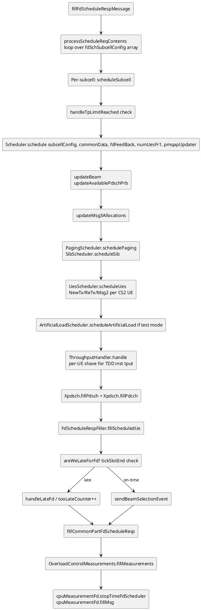

# L2PS FD Fill FdScheduleResp Message

```plantuml
@startuml L2PS FD Fill FdScheduleResp Message
!pragma graphviz svg
' scale 1920*1080

' skinparam linetype ortho
skinparam componentStyle rectangle
top to bottom direction

rectangle "fillFdScheduleRespMessage" as A
rectangle "processScheduleReqContents\nloop over fdSchSubcellConfig array" as B
rectangle "Per-subcell: scheduleSubcell" as C
rectangle "handleTpLimitReached check" as D
rectangle "Scheduler.schedule subcellConfig, commonData, fdFeedBack, numUesFr1, pmqapUpdater" as E
rectangle "updateBeam\nupdateAvailablePdschPrb" as E1
rectangle "updateMsg3Allocations" as E2
rectangle "PagingScheduler.schedulePaging\nSibScheduler.scheduleSib" as E3
rectangle "UesScheduler.scheduleUes\nNewTx/ReTx/Msg2 per CS2 UE" as E4
rectangle "ArtificialLoadScheduler.scheduleArtificialLoad if test mode" as E5
rectangle "ThroughputHandler.handle\nper-UE shave for TDD inst tput" as E6
rectangle "Xpdsch.fillPdsch + Xpdcch.fillPdcch" as E7
rectangle "FdScheduleRespFiller.fillScheduledUe" as E8
rectangle "areWeLateForFd? tickSlotEnd check" as F
rectangle "handleLateFd / tooLateCounter++" as G
rectangle "sendBeamSelectionEvent" as H
rectangle "fillCommonPartFdScheduleResp" as I
rectangle "OverloadControlMeasurements.fillMeasurements" as J
rectangle "cpuMeasurementFd.stopTimeFdScheduler\ncpuMeasurementFd.fillMsg" as K

A --> B
B --> C
C --> D
D --> E
E --> E1
E1 --> E2
E2 --> E3
E3 --> E4
E4 --> E5
E5 --> E6
E6 --> E7
E7 --> E8
E8 --> F
F --> G : late
F --> H : on-time
G --> I
H --> I
I --> J
J --> K
@enduml
```
