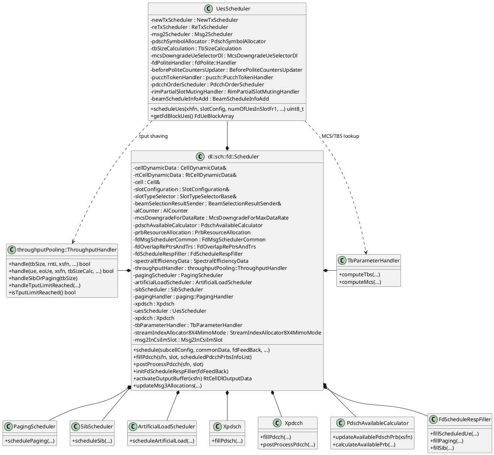

# L2PS FD Per-Subcell Scheduler Class Diagram

```plantuml
@startuml L2PS FD Per-Subcell Scheduler Class Diagram
!pragma graphviz svg
' scale 1920*1080

' skinparam linetype ortho
set namespaceSeparator ::
skinparam classAttributeIconSize 0
skinparam packageStyle rectangle

class "dl::sch::fd::Scheduler" as Scheduler {
    -cellDynamicData : CellDynamicData&
    -rtCellDynamicData : RtCellDynamicData&
    -cell : Cell&
    -slotConfiguration : SlotConfiguration&
    -slotTypeSelector : SlotTypeSelectorBase&
    -beamSelectionResultSender : BeamSelectionResultSender&
    -alCounter : AlCounter
    -mcsDowngradeForDataRate : McsDowngradeForMaxDataRate
    -pdschAvailableCalculator : PdschAvailableCalculator
    -prbResourceAllocation : PrbResourceAllocation
    -fdMsgSchedulerCommon : FdMsgSchedulerCommon
    -fdOverlapRePtrsAndTrs : FdOverlapRePtrsAndTrs
    -fdScheduleRespFiller : FdScheduleRespFiller
    -spectralEfficiencyData : SpectralEfficiencyData
    -throughputHandler : throughputPooling::ThroughputHandler
    -pagingScheduler : PagingScheduler
    -artificialLoadScheduler : ArtificialLoadScheduler
    -sibScheduler : SibScheduler
    -pagingHandler : paging::PagingHandler
    -xpdsch : Xpdsch
    -uesScheduler : UesScheduler
    -xpdcch : Xpdcch
    -tbParameterHandler : TbParameterHandler
    -streamIndexAllocator8X4MimoMode : StreamIndexAllocator8X4MimoMode
    -msg2InCsiImSlot : Msg2InCsiImSlot
    +schedule(subcellConfig, commonData, fdFeedBack, ...)
    +fillPdcch(sfn, slot, scheduledPdcchPrbsInfoList)
    +postProcessPdcch(sfn, slot)
    +initFdScheduleRespFiller(fdFeedBack)
    +activateOutputBuffer(xsfn) RtCellDlOutputData
    +updateMsg3Allocations(...)
}
class UesScheduler {
    -newTxScheduler : NewTxScheduler
    -reTxScheduler : ReTxScheduler
    -msg2Scheduler : Msg2Scheduler
    -pdschSymbolAllocator : PdschSymbolAllocator
    -tbSizeCalculation : TbSizeCalculation
    -mcsDowngradeUeSelectorDl : McsDowngradeUeSelectorDl
    -fdPoliteHandler : fdPolite::Handler
    -beforePoliteCountersUpdater : BeforePoliteCountersUpdater
    -pucchTokenHandler : pucch::PucchTokenHandler
    -pdcchOrderScheduler : PdcchOrderScheduler
    -rimPartialSlotMutingHandler : RimPartialSlotMutingHandler
    -beamScheduleInfoAdd : BeamScheduleInfoAdd
    +scheduleUes(xhfn, slotConfig, numOfUesInSlotFr1, ...) uint8_t
    +getFdBlockUes() FdUeBlockArray
}
class PagingScheduler {
    +schedulePaging(...)
}
class SibScheduler {
    +scheduleSib(...)
}
class ArtificialLoadScheduler {
    +scheduleArtificialLoad(...)
}
class "throughputPooling::ThroughputHandler" as ThroughputHandler {
    +handle(tbSize, rnti, xsfn, ...) bool
    +handle(ue, eoUe, xsfn, tbSizeCalc, ...) bool
    +handleSibOrPaging(tbSize)
    +handleTputLimitReached(...)
    +isTputLimitReached() bool
}
class Xpdsch {
    +fillPdsch(...)
}
class Xpdcch {
    +fillPdcch(...)
    +postProcessPdcch(...)
}
class TbParameterHandler {
    +computeTbs(...)
    +computeMcs(...)
}
class PdschAvailableCalculator {
    +updateAvailablePdschPrb(xsfn)
    +calculateAvailablePrb(...)
}
class FdScheduleRespFiller {
    +fillScheduledUe(...)
    +fillPaging(...)
    +fillSib(...)
}
Scheduler *-u- UesScheduler
Scheduler *-- PagingScheduler
Scheduler *-- SibScheduler
Scheduler *-- ArtificialLoadScheduler
Scheduler *-l- ThroughputHandler
Scheduler *-- Xpdsch
Scheduler *-- Xpdcch
Scheduler *-r- TbParameterHandler
Scheduler *-- PdschAvailableCalculator
Scheduler *-- FdScheduleRespFiller
UesScheduler .d.> ThroughputHandler : tput shaving
UesScheduler .r.> TbParameterHandler : MCS/TBS lookup
@enduml
```
