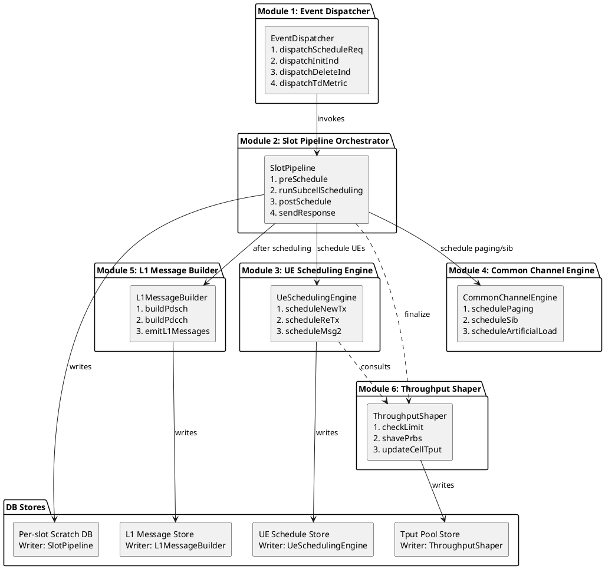

# L2PS FD Proposed Module Structure (modules)

```plantuml
@startuml L2PS FD Proposed Module Structure (modules)
!pragma graphviz svg
' scale 1920*1080

' skinparam linetype ortho
skinparam componentStyle rectangle
top to bottom direction

package "Module 1: Event Dispatcher" as Dispatcher {
  rectangle "EventDispatcher\n1. dispatchScheduleReq\n2. dispatchInitInd\n3. dispatchDeleteInd\n4. dispatchTdMetric" as DISP
}

package "Module 2: Slot Pipeline Orchestrator" as SlotPipeline {
  rectangle "SlotPipeline\n1. preSchedule\n2. runSubcellScheduling\n3. postSchedule\n4. sendResponse" as SP
}

package "Module 3: UE Scheduling Engine" as UeSched {
  rectangle "UeSchedulingEngine\n1. scheduleNewTx\n2. scheduleReTx\n3. scheduleMsg2" as UE
}

package "Module 4: Common Channel Engine" as CommonCh {
  rectangle "CommonChannelEngine\n1. schedulePaging\n2. scheduleSib\n3. scheduleArtificialLoad" as CC
}

package "Module 5: L1 Message Builder" as L1Builder {
  rectangle "L1MessageBuilder\n1. buildPdsch\n2. buildPdcch\n3. emitL1Messages" as L1B
}

package "Module 6: Throughput Shaper" as TputShaper {
  rectangle "ThroughputShaper\n1. checkLimit\n2. shavePrbs\n3. updateCellTput" as TS
}

package "DB Stores" as Stores {
  rectangle "Per-slot Scratch DB\nWriter: SlotPipeline" as SLOT_STORE
  rectangle "UE Schedule Store\nWriter: UeSchedulingEngine" as UE_STORE
  rectangle "L1 Message Store\nWriter: L1MessageBuilder" as L1_STORE
  rectangle "Tput Pool Store\nWriter: ThroughputShaper" as TPUT_STORE
}


DISP --> SP : invokes
SP --> UE : schedule UEs
SP --> CC : schedule paging/sib
SP --> L1B : after scheduling
UE ..> TS : consults
SP ..> TS : finalize
SP --> SLOT_STORE : writes
UE --> UE_STORE : writes
L1B --> L1_STORE : writes
TS --> TPUT_STORE : writes
@enduml
```
