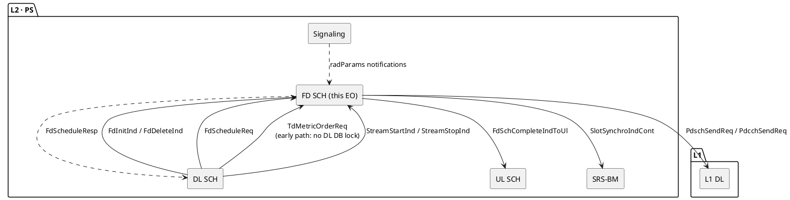

# L2PS FD Scheduler Runtime Position

```plantuml
@startuml L2PS FD Scheduler Runtime Position
!pragma graphviz svg
' scale 1920*1080

' skinparam linetype ortho
skinparam componentStyle rectangle
top to bottom direction

package "L2 · PS" as L2PS {
  rectangle "Signaling" as SGNL
  rectangle "DL SCH" as DLSCH
  rectangle "UL SCH" as ULSCH
  rectangle "SRS-BM" as SRSBM
  rectangle "FD SCH (this EO)" as FDSCH
}

package "L1" as L1 {
  rectangle "L1 DL" as L1TX
}


DLSCH --> FDSCH : FdInitInd / FdDeleteInd
DLSCH --> FDSCH : FdScheduleReq
DLSCH --> FDSCH : TdMetricOrderReq\n(early path: no DL DB lock)
DLSCH --> FDSCH : StreamStartInd / StreamStopInd
FDSCH ..> DLSCH : FdScheduleResp
FDSCH --> ULSCH : FdSchCompleteIndToUl
FDSCH --> SRSBM : SlotSynchroIndCont
FDSCH --> L1TX : PdschSendReq / PdcchSendReq
SGNL ..> FDSCH : radParams notifications
@enduml
```
