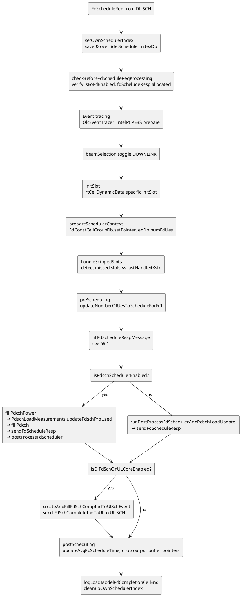

# L2PS FD Slot-Level Processing Flow (Main Hot Path)

```plantuml
@startuml L2PS FD Slot-Level Processing Flow (Main Hot Path)
!pragma graphviz svg
' scale 1920*1080

' skinparam linetype ortho
skinparam componentStyle rectangle
top to bottom direction

rectangle "FdScheduleReq from DL SCH" as A
rectangle "setOwnSchedulerIndex\nsave & override SchedulerIndexDb" as A0
rectangle "checkBeforeFdScheduleReqProcessing\nverify isEoFdEnabled, fdScheludeResp allocated" as A1
rectangle "Event tracing\nOlcEventTracer, IntelPt PEBS prepare" as A2
rectangle "beamSelection.toggle DOWNLINK" as A3
rectangle "initSlot\nrtCellDynamicData.specific.initSlot" as A4
rectangle "prepareSchedulerContext\nFdConstCellGroupDb.setPointer, eoDb.numFdUes" as A5
rectangle "handleSkippedSlots\ndetect missed slots vs lastHandledXsfn" as A6
rectangle "preScheduling\nupdateNumberOfUesToScheduleForFr1" as A7
rectangle "fillFdScheduleRespMessage\nsee §5.1" as B
rectangle "isPdcchSchedulerEnabled?" as C
rectangle "fillPdcchPower \n → PdschLoadMeasurements.updatePdschPrbUsed \n → fillPdcch \n → sendFdScheduleResp \n → postProcessFdScheduler" as D
rectangle "runPostProcessFdSchedulerAndPdschLoadUpdate \n → sendFdScheduleResp" as E
rectangle "isDlFdSchOnULCoreEnabled?" as F
rectangle "createAndFillFdSchCompIndToUlSchEvent\nsend FdSchCompleteIndToUl to UL SCH" as G
rectangle "postScheduling\nupdateAvgFdScheduleTime, drop output buffer pointers" as H
rectangle "logLoadModelFdCompletionCellEnd\ncleanupOwnSchedulerIndex" as I

A --> A0
A0 --> A1
A1 --> A2
A2 --> A3
A3 --> A4
A4 --> A5
A5 --> A6
A6 --> A7
A7 --> B
B --> C
C --> D : yes
C --> E : no
D --> F
E --> F
F --> G : yes
F --> H : no
G --> H
H --> I
@enduml
```
