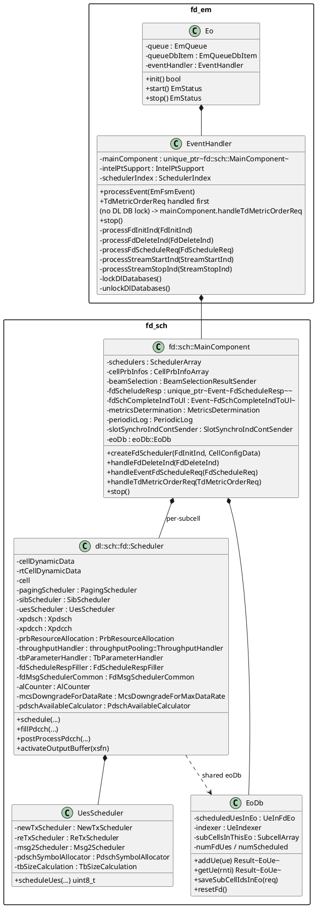

# L2PS FD Scheduler Top-Level Class Overview

Verified against `fd/em/Eo.hpp`, `fd/em/EventHandler.cpp`, and `fd/sch/MainComponent.hpp` under `/workspace/uplane/L2-PS/src/`.

```plantuml
@startuml L2PS FD Scheduler Top-Level Class Overview
!pragma graphviz svg
' scale 1920*1080

' skinparam linetype ortho
set namespaceSeparator ::
skinparam classAttributeIconSize 0
skinparam packageStyle rectangle

package fd_em {
    class Eo {
        -queue : EmQueue
        -queueDbItem : EmQueueDbItem
        -eventHandler : EventHandler
        +init() bool
        +start() EmStatus
        +stop() EmStatus
    }
    class EventHandler {
        -mainComponent : unique_ptr~fd::sch::MainComponent~
        -intelPtSupport : IntelPtSupport
        -schedulerIndex : SchedulerIndex
        +processEvent(EmFsmEvent)
        +TdMetricOrderReq handled first\n(no DL DB lock) -> mainComponent.handleTdMetricOrderReq
        +stop()
        -processFdInitInd(FdInitInd)
        -processFdDeleteInd(FdDeleteInd)
        -processFdScheduleReq(FdScheduleReq)
        -processStreamStartInd(StreamStartInd)
        -processStreamStopInd(StreamStopInd)
        -lockDlDatabases()
        -unlockDlDatabases()
    }
}
package fd_sch {
    class "fd::sch::MainComponent" as FdMainComponent {
        -schedulers : SchedulerArray
        -cellPrbInfos : CellPrbInfoArray
        -beamSelection : BeamSelectionResultSender
        -fdScheludeResp : unique_ptr~Event~FdScheduleResp~~
        -fdSchCompleteIndToUl : Event~FdSchCompleteIndToUl~
        -metricsDetermination : MetricsDetermination
        -periodicLog : PeriodicLog
        -slotSynchroIndContSender : SlotSynchroIndContSender
        -eoDb : eoDb::EoDb
        +createFdScheduler(FdInitInd, CellConfigData)
        +handleFdDeleteInd(FdDeleteInd)
        +handleEventFdScheduleReq(FdScheduleReq)
        +handleTdMetricOrderReq(TdMetricOrderReq)
        +stop()
    }
    class "dl::sch::fd::Scheduler" as FdSubScheduler {
        -cellDynamicData
        -rtCellDynamicData
        -cell
        -pagingScheduler : PagingScheduler
        -sibScheduler : SibScheduler
        -uesScheduler : UesScheduler
        -xpdsch : Xpdsch
        -xpdcch : Xpdcch
        -prbResourceAllocation : PrbResourceAllocation
        -throughputHandler : throughputPooling::ThroughputHandler
        -tbParameterHandler : TbParameterHandler
        -fdScheduleRespFiller : FdScheduleRespFiller
        -fdMsgSchedulerCommon : FdMsgSchedulerCommon
        -alCounter : AlCounter
        -mcsDowngradeForDataRate : McsDowngradeForMaxDataRate
        -pdschAvailableCalculator : PdschAvailableCalculator
        +schedule(...)
        +fillPdcch(...)
        +postProcessPdcch(...)
        +activateOutputBuffer(xsfn)
    }
    class UesScheduler {
        -newTxScheduler : NewTxScheduler
        -reTxScheduler : ReTxScheduler
        -msg2Scheduler : Msg2Scheduler
        -pdschSymbolAllocator : PdschSymbolAllocator
        -tbSizeCalculation : TbSizeCalculation
        +scheduleUes(...) uint8_t
    }
    class EoDb {
        -scheduledUesInEo : UeInFdEo
        -indexer : UeIndexer
        -subCellsInThisEo : SubcellArray
        -numFdUes / numScheduled
        +addUe(ue) Result~EoUe~
        +getUe(rnti) Result~EoUe~
        +saveSubCellIdsInEo(req)
        +resetFd()
    }
}
Eo *-- EventHandler
EventHandler *-- FdMainComponent
FdMainComponent *-- FdSubScheduler : per-subcell
FdMainComponent *-- EoDb
FdSubScheduler *-- UesScheduler
FdSubScheduler ..> EoDb : shared eoDb
@enduml
```
