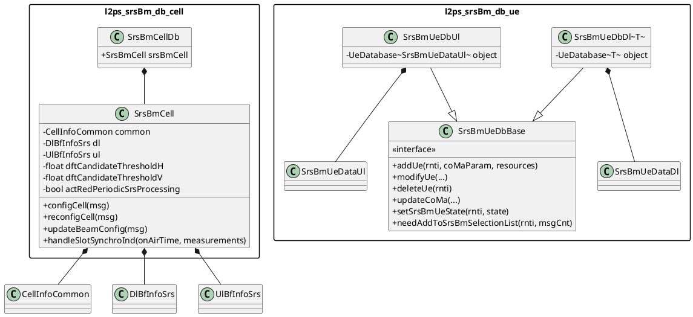

# L2PS SRSBM Cell And UE DB Model

```plantuml
@startuml L2PS SRSBM Cell And UE DB Model
!pragma graphviz svg
' scale 1920*1080

' skinparam linetype ortho
set namespaceSeparator ::
skinparam classAttributeIconSize 0
skinparam packageStyle rectangle

package l2ps_srsBm_db_cell {
  class SrsBmCellDb {
    +SrsBmCell srsBmCell
  }
  class SrsBmCell {
    -CellInfoCommon common
    -DlBfInfoSrs dl
    -UlBfInfoSrs ul
    -float dftCandidateThresholdH
    -float dftCandidateThresholdV
    -bool actRedPeriodicSrsProcessing
    +configCell(msg)
    +reconfigCell(msg)
    +updateBeamConfig(msg)
    +handleSlotSynchroInd(onAirTime, measurements)
  }
}
package l2ps_srsBm_db_ue {
  class SrsBmUeDbBase {
    <<interface>>
    +addUe(rnti, coMaParam, resources)
    +modifyUe(...)
    +deleteUe(rnti)
    +updateCoMa(...)
    +setSrsBmUeState(rnti, state)
    +needAddToSrsBmSelectionList(rnti, msgCnt)
  }
  class "SrsBmUeDbDl~T~" as SrsBmUeDbDlT {
    -UeDatabase~T~ object
  }
  class SrsBmUeDbUl {
    -UeDatabase~SrsBmUeDataUl~ object
  }
  class SrsBmUeDataDl
  class SrsBmUeDataUl
}
SrsBmCellDb *-- SrsBmCell
SrsBmCell *-- CellInfoCommon
SrsBmCell *-- DlBfInfoSrs
SrsBmCell *-- UlBfInfoSrs
SrsBmUeDbDlT --|> SrsBmUeDbBase
SrsBmUeDbUl --|> SrsBmUeDbBase
SrsBmUeDbDlT *-- SrsBmUeDataDl
SrsBmUeDbUl *-- SrsBmUeDataUl
@enduml
```
