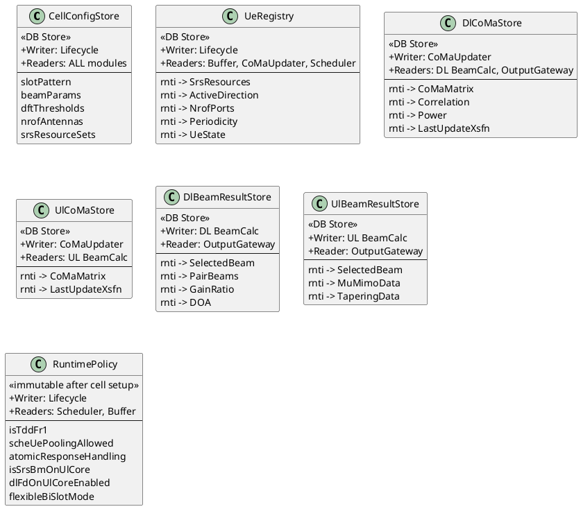

# L2PS SRSBM DB Isolation Design

```plantuml
@startuml L2PS SRSBM DB Isolation Design
!pragma graphviz svg
' scale 1920*1080

' skinparam linetype ortho
set namespaceSeparator ::
skinparam classAttributeIconSize 0
skinparam packageStyle rectangle

class CellConfigStore {
    <<DB Store>>
    +Writer: Lifecycle
    +Readers: ALL modules
    ---
    slotPattern
    beamParams
    dftThresholds
    nrofAntennas
    srsResourceSets
}
class UeRegistry {
    <<DB Store>>
    +Writer: Lifecycle
    +Readers: Buffer, CoMaUpdater, Scheduler
    ---
    rnti -> SrsResources
    rnti -> ActiveDirection
    rnti -> NrofPorts
    rnti -> Periodicity
    rnti -> UeState
}
class DlCoMaStore {
    <<DB Store>>
    +Writer: CoMaUpdater
    +Readers: DL BeamCalc, OutputGateway
    ---
    rnti -> CoMaMatrix
    rnti -> Correlation
    rnti -> Power
    rnti -> LastUpdateXsfn
}
class UlCoMaStore {
    <<DB Store>>
    +Writer: CoMaUpdater
    +Readers: UL BeamCalc
    ---
    rnti -> CoMaMatrix
    rnti -> LastUpdateXsfn
}
class DlBeamResultStore {
    <<DB Store>>
    +Writer: DL BeamCalc
    +Reader: OutputGateway
    ---
    rnti -> SelectedBeam
    rnti -> PairBeams
    rnti -> GainRatio
    rnti -> DOA
}
class UlBeamResultStore {
    <<DB Store>>
    +Writer: UL BeamCalc
    +Reader: OutputGateway
    ---
    rnti -> SelectedBeam
    rnti -> MuMimoData
    rnti -> TaperingData
}
class RuntimePolicy {
    <<immutable after cell setup>>
    +Writer: Lifecycle
    +Readers: Scheduler, Buffer
    ---
    isTddFr1
    scheUePoolingAllowed
    atomicResponseHandling
    isSrsBmOnUlCore
    dlFdOnUlCoreEnabled
    flexibleBiSlotMode
}
@enduml
```
