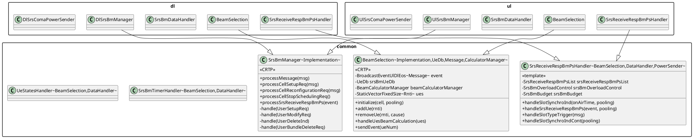

# L2PS SRSBM Direction Managers And Shared Template Layer

```plantuml
@startuml L2PS SRSBM Direction Managers And Shared Template Layer
!pragma graphviz svg
' scale 1920*1080

' skinparam linetype ortho
set namespaceSeparator ::
skinparam classAttributeIconSize 0
skinparam packageStyle rectangle

package common {
  class "SrsBmManager~Implementation~" as SrsBmManagerTemplate {
    <<CRTP>>
    +processMessage(msg)
    +processCellSetupReq(msg)
    +processCellReconfigurationReq(msg)
    +processCellStopSchedulingReq()
    +processSrsReceiveRespBmPs(event)
    -handle(UserSetupReq)
    -handle(UserModifyReq)
    -handle(UserDeleteInd)
    -handle(UserBundleDeleteReq)
  }
  class "SrsReceiveRespBmPsHandler~BeamSelection,DataHandler,PowerSender~" as SrsReceiveRespBmPsHandlerTemplate {
    <<template>>
    -SrsReceiveRespBmPsList srsReceiveRespBmPsList
    -SrsBmOverloadControl srsBmOverloadControl
    -SrsBmBudget srsBmBudget
    +handleSlotSynchroInd(onAirTime, pooling)
    +handleSrsReceiveRespBmPs(event, pooling)
    +handleSlotTypeTrigger(msg)
    +handleSlotSynchroIndCont(pooling)
  }
  class "BeamSelection~Implementation,UeDb,Message,CalculatorManager~" as BeamSelectionTemplate {
    <<CRTP>>
    -BroadcastEventUlDlEos~Message~ event
    -UeDb srsBmUeDb
    -BeamCalculatorManager beamCalculatorManager
    -StaticVectorFixedSize~Rnti~ ues
    +initialize(cell, pooling)
    +addUe(rnti)
    +removeUe(rnti, cause)
    +handleUesBeamCalculation(ues)
    +sendEvent(ueNum)
  }
  class "SrsBmTimerHandler~BeamSelection,DataHandler~" as SrsBmTimerHandlerTemplate
  class "UeStatesHandler~BeamSelection,DataHandler~" as UeStatesHandlerTemplate
}
package dl {
  class DlSrsBmManager
  class "BeamSelection" as DlBeamSelection
  class "SrsBmDataHandler" as DlSrsBmDataHandler
  class "SrsReceiveRespBmPsHandler" as DlSrsReceiveRespBmPsHandler
  class DlSrsComaPowerSender
}
package ul {
  class UlSrsBmManager
  class "BeamSelection" as UlBeamSelection
  class "SrsBmDataHandler" as UlSrsBmDataHandler
  class "SrsReceiveRespBmPsHandler" as UlSrsReceiveRespBmPsHandler
  class UlSrsComaPowerSender
}
DlSrsBmManager --|> SrsBmManagerTemplate
UlSrsBmManager --|> SrsBmManagerTemplate
DlBeamSelection --|> BeamSelectionTemplate
UlBeamSelection --|> BeamSelectionTemplate
DlSrsReceiveRespBmPsHandler --|> SrsReceiveRespBmPsHandlerTemplate
UlSrsReceiveRespBmPsHandler --|> SrsReceiveRespBmPsHandlerTemplate
@enduml
```
