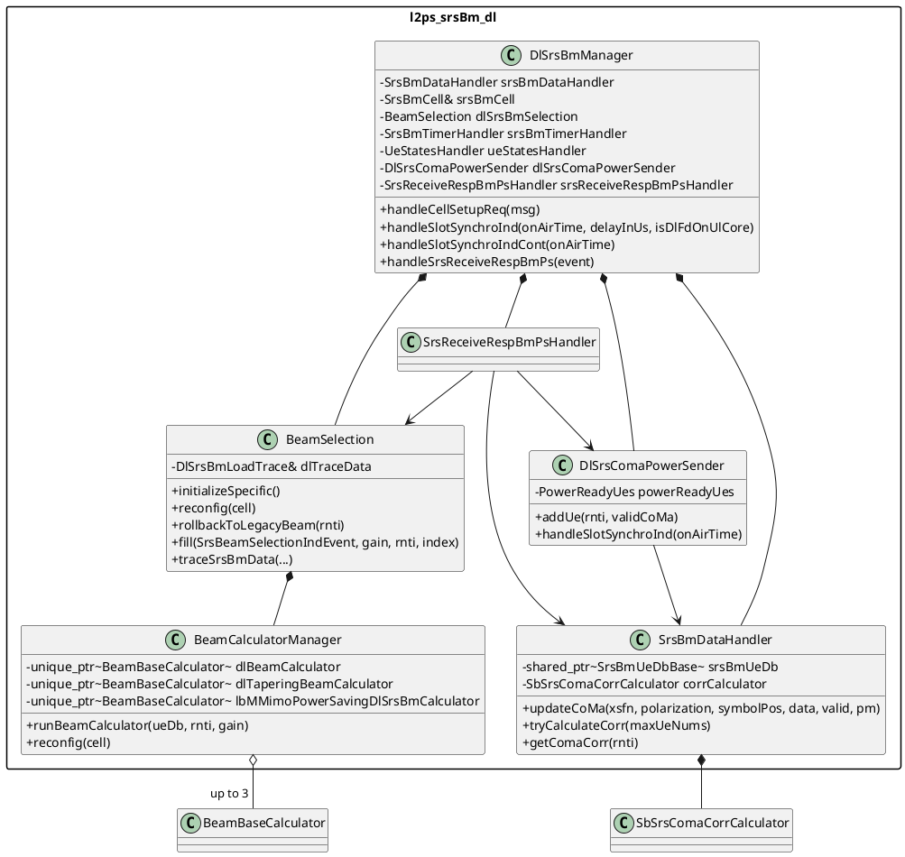

# L2PS SRSBM DL SRS-BM Details

```plantuml
@startuml L2PS SRSBM DL SRS-BM Details
!pragma graphviz svg
' scale 1920*1080

' skinparam linetype ortho
set namespaceSeparator ::
skinparam classAttributeIconSize 0
skinparam packageStyle rectangle

package l2ps_srsBm_dl {
  class DlSrsBmManager {
    -SrsBmDataHandler srsBmDataHandler
    -SrsBmCell& srsBmCell
    -BeamSelection dlSrsBmSelection
    -SrsBmTimerHandler srsBmTimerHandler
    -UeStatesHandler ueStatesHandler
    -DlSrsComaPowerSender dlSrsComaPowerSender
    -SrsReceiveRespBmPsHandler srsReceiveRespBmPsHandler
    +handleCellSetupReq(msg)
    +handleSlotSynchroInd(onAirTime, delayInUs, isDlFdOnUlCore)
    +handleSlotSynchroIndCont(onAirTime)
    +handleSrsReceiveRespBmPs(event)
  }
  class BeamSelection {
    -DlSrsBmLoadTrace& dlTraceData
    +initializeSpecific()
    +reconfig(cell)
    +rollbackToLegacyBeam(rnti)
    +fill(SrsBeamSelectionIndEvent, gain, rnti, index)
    +traceSrsBmData(...)
  }
  class BeamCalculatorManager {
    -unique_ptr~BeamBaseCalculator~ dlBeamCalculator
    -unique_ptr~BeamBaseCalculator~ dlTaperingBeamCalculator
    -unique_ptr~BeamBaseCalculator~ lbMMimoPowerSavingDlSrsBmCalculator
    +runBeamCalculator(ueDb, rnti, gain)
    +reconfig(cell)
  }
  class SrsBmDataHandler {
    -shared_ptr~SrsBmUeDbBase~ srsBmUeDb
    -SbSrsComaCorrCalculator corrCalculator
    +updateCoMa(xsfn, polarization, symbolPos, data, valid, pm)
    +tryCalculateCorr(maxUeNums)
    +getComaCorr(rnti)
  }
  class SrsReceiveRespBmPsHandler
  class DlSrsComaPowerSender {
    -PowerReadyUes powerReadyUes
    +addUe(rnti, validCoMa)
    +handleSlotSynchroInd(onAirTime)
  }
}
DlSrsBmManager *-- SrsBmDataHandler
DlSrsBmManager *-- BeamSelection
DlSrsBmManager *-- SrsReceiveRespBmPsHandler
DlSrsBmManager *-- DlSrsComaPowerSender
BeamSelection *-- BeamCalculatorManager
BeamCalculatorManager o-- "up to 3" BeamBaseCalculator
SrsBmDataHandler *-- SbSrsComaCorrCalculator
SrsReceiveRespBmPsHandler --> SrsBmDataHandler
SrsReceiveRespBmPsHandler --> BeamSelection
SrsReceiveRespBmPsHandler --> DlSrsComaPowerSender
DlSrsComaPowerSender --> SrsBmDataHandler
@enduml
```
