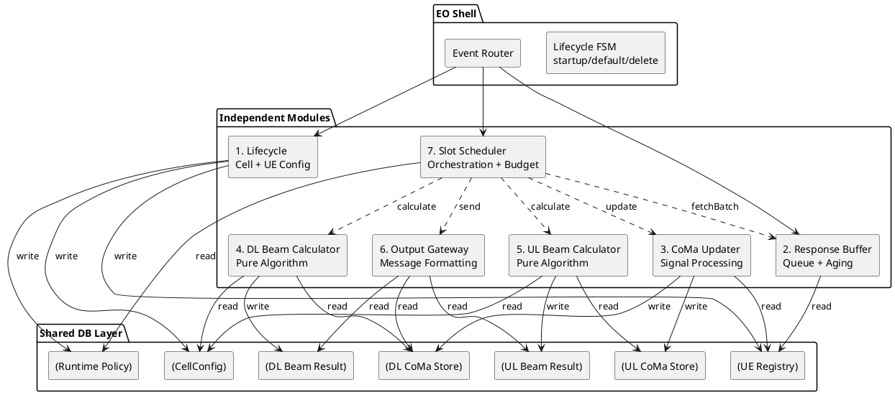

# L2PS SRSBM Module Decomposition

```plantuml
@startuml L2PS SRSBM Module Decomposition
!pragma graphviz svg
' scale 1920*1080

' skinparam linetype ortho
skinparam componentStyle rectangle
top to bottom direction

package "EO Shell" as shell {
  rectangle "Lifecycle FSM\nstartup/default/delete" as FSM
  rectangle "Event Router" as Router
}

package "Independent Modules" as modules {
  rectangle "1. Lifecycle\nCell + UE Config" as Lifecycle
  rectangle "2. Response Buffer\nQueue + Aging" as Buffer
  rectangle "3. CoMa Updater\nSignal Processing" as CoMa
  rectangle "4. DL Beam Calculator\nPure Algorithm" as DlCalc
  rectangle "5. UL Beam Calculator\nPure Algorithm" as UlCalc
  rectangle "6. Output Gateway\nMessage Formatting" as Output
  rectangle "7. Slot Scheduler\nOrchestration + Budget" as Sched
}

package "Shared DB Layer" as db {
  rectangle "(CellConfig)" as CellCfg
  rectangle "(UE Registry)" as UeReg
  rectangle "(DL CoMa Store)" as DlCoMa
  rectangle "(UL CoMa Store)" as UlCoMa
  rectangle "(DL Beam Result)" as DlBeam
  rectangle "(UL Beam Result)" as UlBeam
  rectangle "(Runtime Policy)" as Policy
}


Router --> Lifecycle
Router --> Buffer
Router --> Sched
Sched ..> Buffer : fetchBatch
Sched ..> CoMa : update
Sched ..> DlCalc : calculate
Sched ..> UlCalc : calculate
Sched ..> Output : send
Lifecycle --> CellCfg : write
Lifecycle --> UeReg : write
Lifecycle --> Policy : write
Buffer --> UeReg : read
CoMa --> UeReg : read
CoMa --> DlCoMa : write
CoMa --> UlCoMa : write
DlCalc --> DlCoMa : read
DlCalc --> CellCfg : read
DlCalc --> DlBeam : write
UlCalc --> UlCoMa : read
UlCalc --> CellCfg : read
UlCalc --> UlBeam : write
Output --> DlBeam : read
Output --> UlBeam : read
Output --> DlCoMa : read
Sched --> Policy : read
@enduml
```
