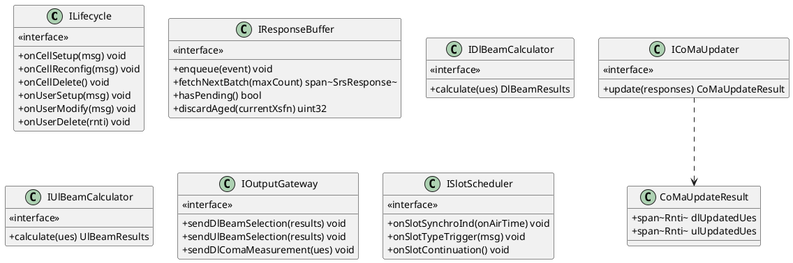

# L2PS SRSBM Module Interface Definitions

```plantuml
@startuml L2PS SRSBM Module Interface Definitions
!pragma graphviz svg
' scale 1920*1080

' skinparam linetype ortho
set namespaceSeparator ::
skinparam classAttributeIconSize 0
skinparam packageStyle rectangle

class ILifecycle {
    <<interface>>
    +onCellSetup(msg) void
    +onCellReconfig(msg) void
    +onCellDelete() void
    +onUserSetup(msg) void
    +onUserModify(msg) void
    +onUserDelete(rnti) void
}
class IResponseBuffer {
    <<interface>>
    +enqueue(event) void
    +fetchNextBatch(maxCount) span~SrsResponse~
    +hasPending() bool
    +discardAged(currentXsfn) uint32
}
class ICoMaUpdater {
    <<interface>>
    +update(responses) CoMaUpdateResult
}
class CoMaUpdateResult {
    +span~Rnti~ dlUpdatedUes
    +span~Rnti~ ulUpdatedUes
}
class IDlBeamCalculator {
    <<interface>>
    +calculate(ues) DlBeamResults
}
class IUlBeamCalculator {
    <<interface>>
    +calculate(ues) UlBeamResults
}
class IOutputGateway {
    <<interface>>
    +sendDlBeamSelection(results) void
    +sendUlBeamSelection(results) void
    +sendDlComaMeasurement(ues) void
}
class ISlotScheduler {
    <<interface>>
    +onSlotSynchroInd(onAirTime) void
    +onSlotTypeTrigger(msg) void
    +onSlotContinuation() void
}
ICoMaUpdater ..> CoMaUpdateResult
@enduml
```
