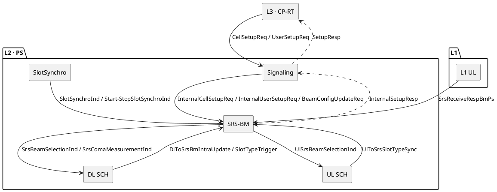

# L2PS SRS-BM Runtime Position

```plantuml
@startuml L2PS SRS-BM Runtime Position
!pragma graphviz svg
' scale 1920*1080

' skinparam linetype ortho
skinparam componentStyle rectangle
top to bottom direction

package "L2 · PS" as L2PS {
  rectangle "Signaling" as SGNL
  rectangle "SlotSynchro" as SYNC
  rectangle "DL SCH" as DLSCH
  rectangle "UL SCH" as ULSCH
  rectangle "SRS-BM" as SRSBM
}

package "L1" as L1 {
  rectangle "L1 UL" as L1RX
}

rectangle "L3 · CP-RT" as CPRT

CPRT --> SGNL : CellSetupReq / UserSetupReq
SGNL --> SRSBM : InternalCellSetupReq / InternalUserSetupReq / BeamConfigUpdateReq
SYNC --> SRSBM : SlotSynchroInd / Start-StopSlotSynchroInd
DLSCH --> SRSBM : DlToSrsBmIntraUpdate / SlotTypeTrigger
ULSCH --> SRSBM : UlToSrsSlotTypeSync
L1RX --> SRSBM : SrsReceiveRespBmPs
SRSBM --> DLSCH : SrsBeamSelectionInd / SrsComaMeasurementInd
SRSBM --> ULSCH : UlSrsBeamSelectionInd
SRSBM ..> SGNL : InternalSetupResp
SGNL ..> CPRT : SetupResp
@enduml
```
