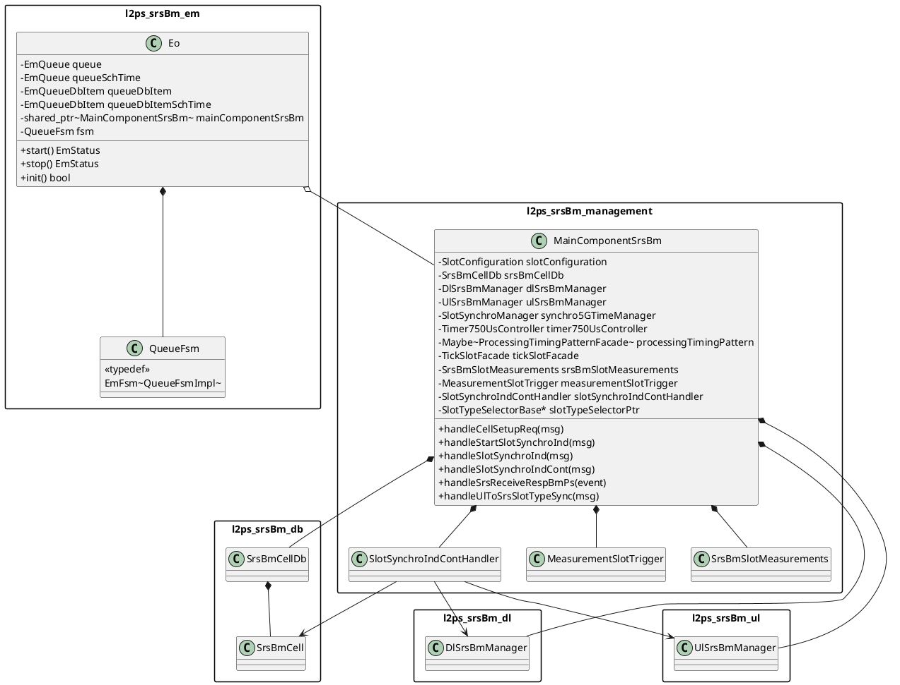

# L2PS SRS-BM Top-Level Class Overview

Verified against `srsBm/em/Eo.hpp` and `srsBm/management/MainComponentSrsBm.hpp` under `/workspace/uplane/L2-PS/src/`. The `MainComponentSrsBm` box lists the main composition edges used in coordination diagrams; additional private timing/state fields exist in the header.

