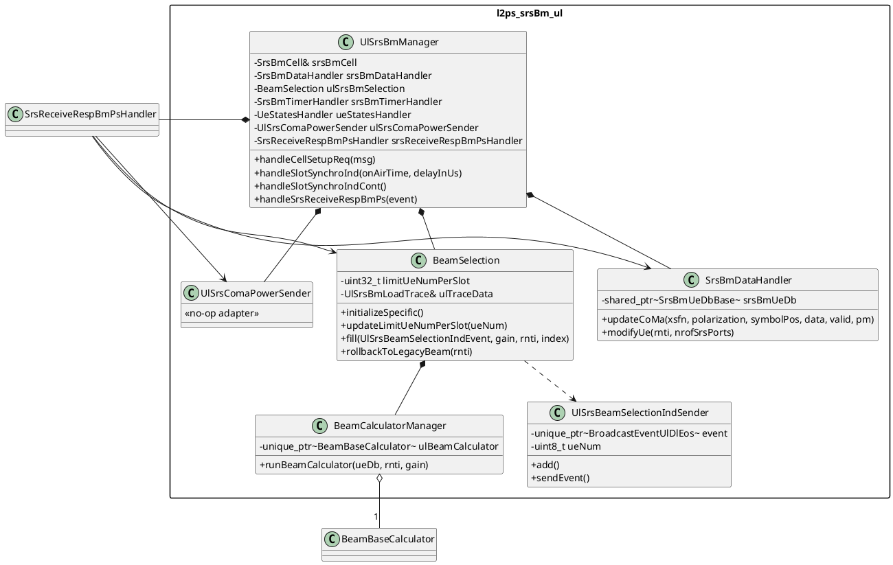

# L2PS SRSBM UL SRS-BM Details

```plantuml
@startuml L2PS SRSBM UL SRS-BM Details
!pragma graphviz svg
' scale 1920*1080

' skinparam linetype ortho
set namespaceSeparator ::
skinparam classAttributeIconSize 0
skinparam packageStyle rectangle

package l2ps_srsBm_ul {
  class UlSrsBmManager {
    -SrsBmCell& srsBmCell
    -SrsBmDataHandler srsBmDataHandler
    -BeamSelection ulSrsBmSelection
    -SrsBmTimerHandler srsBmTimerHandler
    -UeStatesHandler ueStatesHandler
    -UlSrsComaPowerSender ulSrsComaPowerSender
    -SrsReceiveRespBmPsHandler srsReceiveRespBmPsHandler
    +handleCellSetupReq(msg)
    +handleSlotSynchroInd(onAirTime, delayInUs)
    +handleSlotSynchroIndCont()
    +handleSrsReceiveRespBmPs(event)
  }
  class BeamSelection {
    -uint32_t limitUeNumPerSlot
    -UlSrsBmLoadTrace& ulTraceData
    +initializeSpecific()
    +updateLimitUeNumPerSlot(ueNum)
    +fill(UlSrsBeamSelectionIndEvent, gain, rnti, index)
    +rollbackToLegacyBeam(rnti)
  }
  class BeamCalculatorManager {
    -unique_ptr~BeamBaseCalculator~ ulBeamCalculator
    +runBeamCalculator(ueDb, rnti, gain)
  }
  class SrsBmDataHandler {
    -shared_ptr~SrsBmUeDbBase~ srsBmUeDb
    +updateCoMa(xsfn, polarization, symbolPos, data, valid, pm)
    +modifyUe(rnti, nrofSrsPorts)
  }
  class UlSrsBeamSelectionIndSender {
    -unique_ptr~BroadcastEventUlDlEos~ event
    -uint8_t ueNum
    +add()
    +sendEvent()
  }
  class UlSrsComaPowerSender {
    <<no-op adapter>>
  }
}
UlSrsBmManager *-- SrsBmDataHandler
UlSrsBmManager *-- BeamSelection
UlSrsBmManager *-- SrsReceiveRespBmPsHandler
UlSrsBmManager *-- UlSrsComaPowerSender
BeamSelection *-- BeamCalculatorManager
BeamCalculatorManager o-- "1" BeamBaseCalculator
BeamSelection ..> UlSrsBeamSelectionIndSender
SrsReceiveRespBmPsHandler --> SrsBmDataHandler
SrsReceiveRespBmPsHandler --> BeamSelection
SrsReceiveRespBmPsHandler --> UlSrsComaPowerSender
@enduml
```
