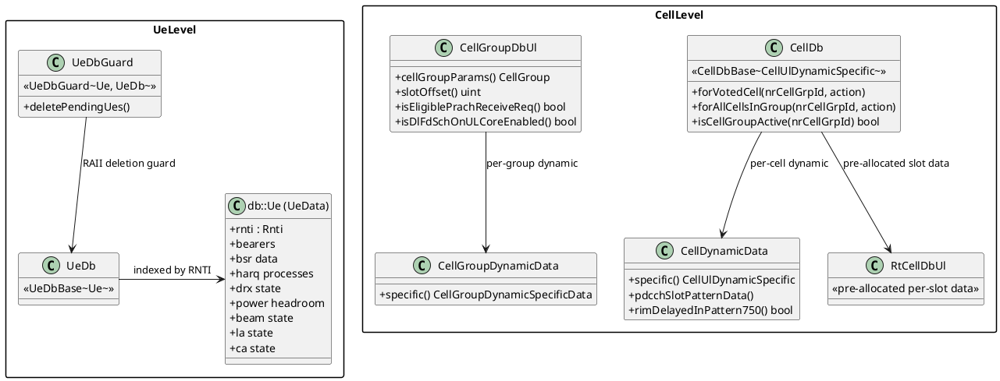

# L2PS ULSCH DB Model

```plantuml
@startuml L2PS ULSCH DB Model
!pragma graphviz svg
' scale 1920*1080

' skinparam linetype ortho
set namespaceSeparator ::
skinparam classAttributeIconSize 0
skinparam packageStyle rectangle

package CellLevel {
    class CellDb {
        <<CellDbBase~CellUlDynamicSpecific~>>
        +forVotedCell(nrCellGrpId, action)
        +forAllCellsInGroup(nrCellGrpId, action)
        +isCellGroupActive(nrCellGrpId) bool
    }
    class CellGroupDbUl {
        +cellGroupParams() CellGroup
        +slotOffset() uint
        +isEligiblePrachReceiveReq() bool
        +isDlFdSchOnULCoreEnabled() bool
    }
    class CellDynamicData {
        +specific() CellUlDynamicSpecific
        +pdcchSlotPatternData()
        +rimDelayedInPattern750() bool
    }
    class CellGroupDynamicData {
        +specific() CellGroupDynamicSpecificData
    }
    class RtCellDbUl {
        <<pre-allocated per-slot data>>
    }
}
package UeLevel {
    class UeDb {
        <<UeDbBase~Ue~>>
    }
    class UeDbGuard {
        <<UeDbGuard~Ue, UeDb~>>
        +deletePendingUes()
    }
    class "db::Ue (UeData)" as Ue {
        +rnti : Rnti
        +bearers
        +bsr data
        +harq processes
        +drx state
        +power headroom
        +beam state
        +la state
        +ca state
    }
}
CellDb --> CellDynamicData : per-cell dynamic
CellGroupDbUl --> CellGroupDynamicData : per-group dynamic
UeDb -r-> Ue : indexed by RNTI
UeDbGuard --> UeDb : RAII deletion guard
CellDb --> RtCellDbUl : pre-allocated slot data
@enduml
```
