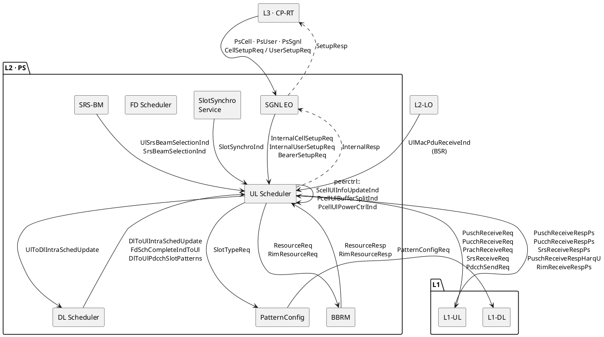

# L2PS UL Scheduler Runtime Position

```plantuml
@startuml L2PS UL Scheduler Runtime Position
!pragma graphviz svg
' scale 1920*1080

' skinparam linetype ortho
skinparam componentStyle rectangle
top to bottom direction

package "L2 · PS" as L2PS {
  rectangle "SGNL EO" as SGNL
  rectangle "SlotSynchro\nService" as SYNC
  rectangle "DL Scheduler" as DL
  rectangle "UL Scheduler" as UL
  rectangle "FD Scheduler" as FD
  rectangle "BBRM" as BBRM
  rectangle "SRS-BM" as SRSBM
  rectangle "PatternConfig" as PCFG
}

package "L1" as L1 {
  rectangle "L1-DL" as L1DL
  rectangle "L1-UL" as L1UL
}

rectangle "L3 · CP-RT" as CPRT
rectangle "L2-LO" as L2LO

CPRT --> SGNL : PsCell · PsUser · PsSgnl\nCellSetupReq / UserSetupReq
SGNL --> UL : InternalCellSetupReq\nInternalUserSetupReq\nBearerSetupReq
L2LO --> UL : UlMacPduReceiveInd\n(BSR)
SYNC --> UL : SlotSynchroInd
DL --> UL : DlToUlIntraSchedUpdate\nFdSchCompleteIndToUl\nDlToUlPdcchSlotPatterns
SRSBM --> UL : UlSrsBeamSelectionInd\nSrsBeamSelectionInd
BBRM --> UL : ResourceResp\nRimResourceResp
UL --> BBRM : ResourceReq\nRimResourceReq
UL --> DL : UlToDlIntraSchedUpdate
UL --> L1UL : PuschReceiveReq\nPucchReceiveReq\nPrachReceiveReq\nSrsReceiveReq\nPdcchSendReq
UL --> PCFG : SlotTypeReq
PCFG --> L1DL : PatternConfigReq
L1UL --> UL : PuschReceiveRespPs\nPucchReceiveRespPs\nSrsReceiveRespPs\nPuschReceiveRespHarqU\nRimReceiveRespPs
UL ..> SGNL : InternalResp
SGNL ..> CPRT : SetupResp
UL --> UL : peerctrl::\nScellUlInfoUpdateInd\nPcellUlBufferSplitInd\nPcellUlPowerCtrlInd
@enduml
```
