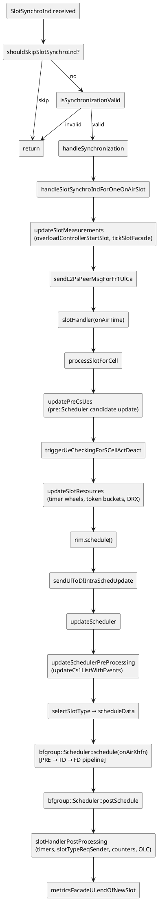

# L2PS ULSCH Scheduling Pipeline (SlotSynchroInd Flow)

```plantuml
@startuml L2PS ULSCH Scheduling Pipeline (SlotSynchroInd Flow)
!pragma graphviz svg
' scale 1920*1080

' skinparam linetype ortho
skinparam componentStyle rectangle
top to bottom direction

rectangle "SlotSynchroInd received" as A
rectangle "shouldSkipSlotSynchroInd?" as B
rectangle "return" as Z
rectangle "isSynchronizationValid" as C
rectangle "handleSynchronization" as D
rectangle "handleSlotSynchroIndForOneOnAirSlot" as E
rectangle "updateSlotMeasurements\n(overloadControllerStartSlot, tickSlotFacade)" as F
rectangle "sendL2PsPeerMsgForFr1UlCa" as G
rectangle "slotHandler(onAirTime)" as H
rectangle "processSlotForCell" as I
rectangle "updatePreCsUes\n(pre::Scheduler candidate update)" as J
rectangle "triggerUeCheckingForSCellActDeact" as K
rectangle "updateSlotResources\n(timer wheels, token buckets, DRX)" as L
rectangle "rim.schedule()" as M
rectangle "sendUlToDlIntraSchedUpdate" as N
rectangle "updateScheduler" as O
rectangle "updateSchedulerPreProcessing\n(updateCs1ListWithEvents)" as P
rectangle "selectSlotType → scheduleData" as Q
rectangle "bfgroup::Scheduler::schedule(onAirXhfn)\n[PRE → TD → FD pipeline]" as R
rectangle "bfgroup::Scheduler::postSchedule" as S
rectangle "slotHandlerPostProcessing\n(timers, slotTypeReqSender, counters, OLC)" as T
rectangle "metricsFacadeUl.endOfNewSlot" as U

A --> B
B --> Z : skip
B --> C : no
C --> Z : invalid
C --> D : valid
D --> E
E --> F
F --> G
G --> H
H --> I
I --> J
J --> K
K --> L
L --> M
M --> N
N --> O
O --> P
P --> Q
Q --> R
R --> S
S --> T
T --> U
@enduml
```
