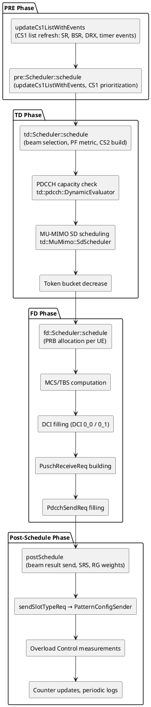

# L2PS ULSCH Slot-Level Processing Flow (Main Hot Path)

```plantuml
@startuml L2PS ULSCH Slot-Level Processing Flow (Main Hot Path)
!pragma graphviz svg
' scale 1920*1080

' skinparam linetype ortho
skinparam componentStyle rectangle
top to bottom direction

package "PRE Phase" as PrePhase {
  rectangle "updateCs1ListWithEvents\n(CS1 list refresh: SR, BSR, DRX, timer events)" as A1
  rectangle "pre::Scheduler::schedule\n(updateCs1ListWithEvents, CS1 prioritization)" as A2
}

package "TD Phase" as TdPhase {
  rectangle "td::Scheduler::schedule\n(beam selection, PF metric, CS2 build)" as B1
  rectangle "PDCCH capacity check\ntd::pdcch::DynamicEvaluator" as B2
  rectangle "MU-MIMO SD scheduling\ntd::MuMimo::SdScheduler" as B3
  rectangle "Token bucket decrease" as B4
}

package "FD Phase" as FdPhase {
  rectangle "fd::Scheduler::schedule\n(PRB allocation per UE)" as C1
  rectangle "MCS/TBS computation" as C2
  rectangle "DCI filling (DCI 0_0 / 0_1)" as C3
  rectangle "PuschReceiveReq building" as C4
  rectangle "PdcchSendReq filling" as C5
}

package "Post-Schedule Phase" as PostPhase {
  rectangle "postSchedule\n(beam result send, SRS, RG weights)" as D1
  rectangle "sendSlotTypeReq → PatternConfigSender" as D2
  rectangle "Overload Control measurements" as D3
  rectangle "Counter updates, periodic logs" as D4
}


A1 --> A2
A2 --> B1
B1 --> B2
B2 --> B3
B3 --> B4
B4 --> C1
C1 --> C2
C2 --> C3
C3 --> C4
C4 --> C5
C5 --> D1
D1 --> D2
D2 --> D3
D3 --> D4
@enduml
```
