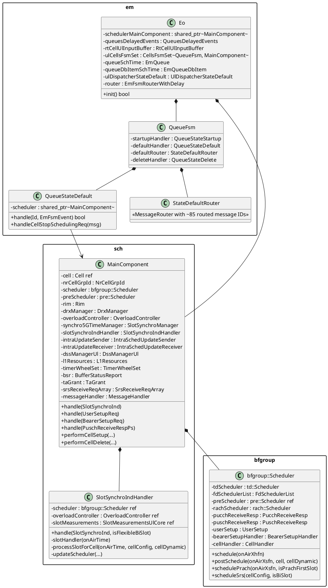

# L2PS UL Scheduler Top-Level Class Overview

Verified against `ul/em/Eo.hpp` and `ul/sch/MainComponent.hpp` under `/workspace/uplane/L2-PS/src/`.

```plantuml
@startuml L2PS UL Scheduler Top-Level Class Overview
!pragma graphviz svg
' scale 1920*1080

' skinparam linetype ortho
set namespaceSeparator ::
skinparam classAttributeIconSize 0
skinparam packageStyle rectangle

package em {
    class Eo {
        -schedulerMainComponent : shared_ptr~MainComponent~
        -queuesDelayedEvents : QueuesDelayedEvents
        -rtCellUlInputBuffer : RtCellUlInputBuffer
        -ulCellsFsmSet : CellsFsmSet~QueueFsm, MainComponent~
        -queueSchTime : EmQueue
        -queueDbItemSchTime : EmQueueDbItem
        -ulDispatcherStateDefault : UlDispatcherStateDefault
        -router : EmFsmRouterWithDelay
        +init() bool
    }
    class QueueFsm {
        -startupHandler : QueueStateStartup
        -defaultHandler : QueueStateDefault
        -defaultRouter : StateDefaultRouter
        -deleteHandler : QueueStateDelete
    }
    class QueueStateDefault {
        -scheduler : shared_ptr~MainComponent~
        +handle(Id, EmFsmEvent) bool
        +handleCellStopSchedulingReq(msg)
    }
    class StateDefaultRouter {
        <<MessageRouter with ~85 routed message IDs>>
    }
}
package sch {
    class MainComponent {
        -cell : Cell ref
        -nrCellGrpId : NrCellGrpId
        -scheduler : bfgroup::Scheduler
        -preScheduler : pre::Scheduler
        -rim : Rim
        -drxManager : DrxManager
        -overloadController : OverloadController
        -synchro5GTimeManager : SlotSynchroManager
        -slotSynchroIndHandler : SlotSynchroIndHandler
        -intraUpdateSender : IntraSchedUpdateSender
        -intraUpdateReceiver : IntraSchedUpdateReceiver
        -dssManagerUl : DssManagerUl
        -l1Resources : L1Resources
        -timerWheelSet : TimerWheelSet
        -bsr : BufferStatusReport
        -taGrant : TaGrant
        -srsReceiveReqArray : SrsReceiveReqArray
        -messageHandler : MessageHandler
        +handle(SlotSynchroInd)
        +handle(UserSetupReq)
        +handle(BearerSetupReq)
        +handle(PuschReceiveRespPs)
        +performCellSetup(...)
        +performCellDelete(...)
    }
    class SlotSynchroIndHandler {
        -scheduler : bfgroup::Scheduler ref
        -overloadController : OverloadController ref
        -slotMeasurements : SlotMeasurementsUlCore ref
        +handle(SlotSynchroInd, isFlexibleBiSlot)
        -slotHandler(onAirTime)
        -processSlotForCell(onAirTime, cellConfig, cellDynamic)
        -updateScheduler(...)
    }
}
package bfgroup {
    class "bfgroup::Scheduler" as BfgroupScheduler {
        -tdScheduler : td::Scheduler
        -fdSchedulerList : FdSchedulerList
        -preScheduler : pre::Scheduler ref
        -rachScheduler : rach::Scheduler
        -pucchReceiveResp : PucchReceiveResp
        -puschReceiveResp : PuschReceiveResp
        -userSetup : UserSetup
        -bearerSetupHandler : BearerSetupHandler
        -cellHandler : CellHandler
        +schedule(onAirXhfn)
        +postSchedule(onAirXsfn, cell, cellDynamic)
        +schedulePrach(onAirXsfn, isPrachFirstSlot)
        +scheduleSrs(cellConfig, isBiSlot)
    }
}
Eo *-- QueueFsm
Eo *-- MainComponent
QueueFsm *-- QueueStateDefault
QueueFsm *-- StateDefaultRouter
QueueStateDefault --> MainComponent
MainComponent *-- SlotSynchroIndHandler
MainComponent *-- BfgroupScheduler
@enduml
```
