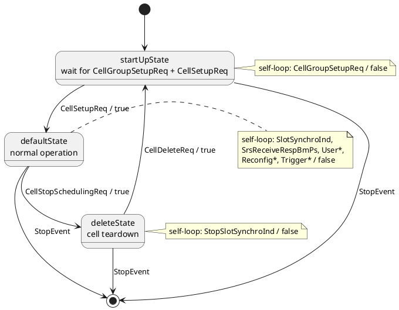
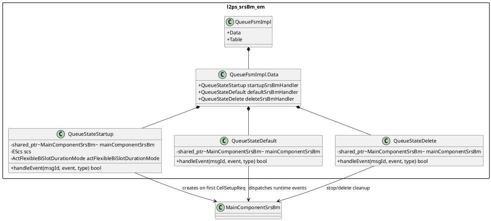
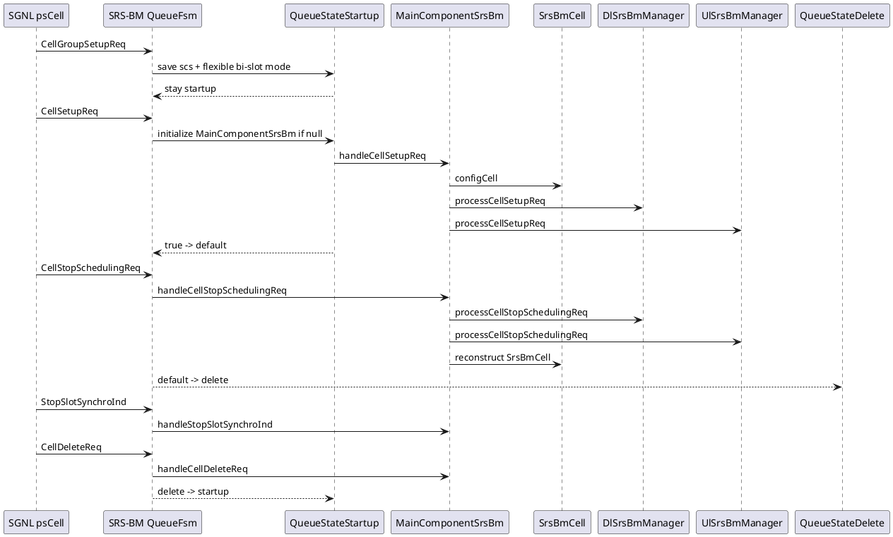
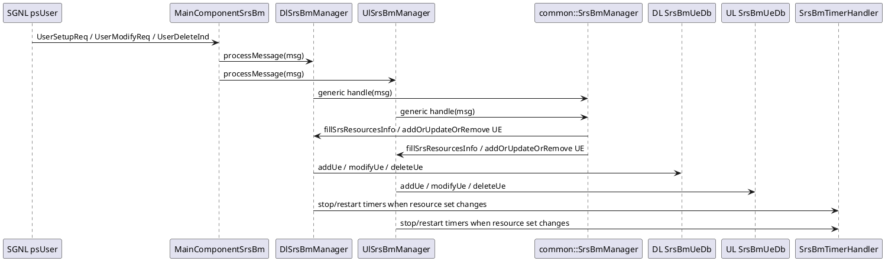
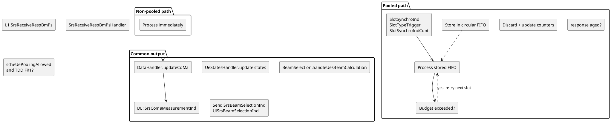
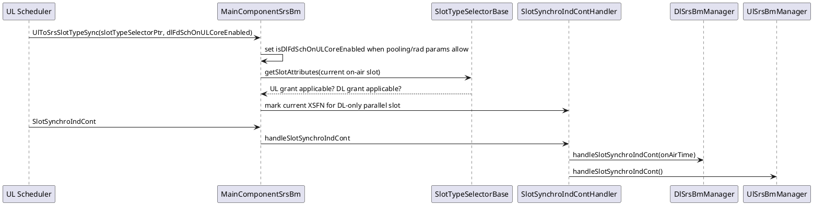
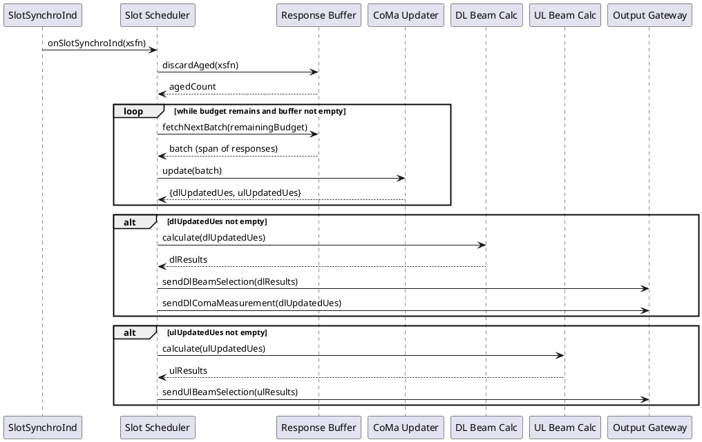
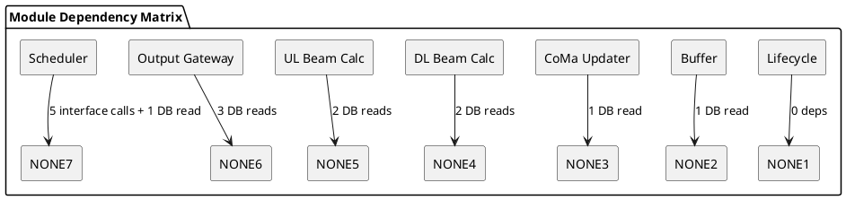

# L2-PS SRS-BM Architecture And PlantUML Diagrams

本文档描述 SRS Beam Management 在 L2-PS 运行时中的位置、类关系、主要事件流、当前设计问题和可重构方向。

范围：TDD FR1 下的 L2-PS SRS-BM EO。FDD 或 `actSrsBmCalcInL1 == true` 时，SRS-BM EO 不会作为 per-cell-group EO 参与调度。

**Reference baseline.** EO architecture layout follows `/home/ptr476/work/doc/ai/.cursor/agents/l2ps-eo-architecture.agent.md`（编辑器镜像：`/home/ptr476/work/doc/ai/.github/agents/l2ps-eo-architecture.agent.md`）。**§2** 采用 *Package / subsystem connection overview* 与 *Detailed class views* 分层，与同目录 [`l2ps-bbrm.md`](./l2ps-bbrm.md) 的范式一致。可选对照：内部维护的 `l2ps-architecture.md`。与源码一致的表述以环境中可访问的 `/workspace/uplane/L2-PS/src/` 及 `/home/ptr476/work/doc/ai/storage/L2PS_Architecture.md` 为准。

> **PlantUML rendering notes.**
> - Diagrams use fenced ` ```plantuml ` blocks with `@startuml` / `@enduml`; large figures live in sibling `diagrams/*.md` notes and are embedded from this vault folder。每个 `diagrams/*.md` 在与 `/workspace` 核对后应在 YAML 中填写 **`last_verified_src_date`** / **`last_verified_gnb_git`**。
> - Component and class diagrams use `package`, explicit arrow directions, and hidden links to guide layout.
> - Large class diagrams are split into overview and focused diagram notes under `diagrams/` where useful.
> - Sequence diagrams keep the original lifeline order and use PlantUML `alt` / `opt` blocks.
> - `skinparam linetype ortho` is intentionally left disabled unless strict right-angle routing improves readability.

## 1. Runtime Position

SRS-BM 是 L2-PS per-cell-group EO 之一，EO 名称形态为 `L2RtPool<P>_L2PsSrsBmYy`。每个 SRS-BM EO 有两个 atomic queue：普通事件队列 `L2PsSrsXxYy` 和调度时间队列 `L2PsSrtXxYy`。它消费来自 SGNL、DL、UL、L1-UL 和平台 slot timer 的内部事件，输出 DL/UL beam selection 结果以及 DL CoMa power/correlation measurement。

![[diagrams/l2ps-srsbm-runtime-position]]

## 2. Top-Level Class Overview

### Package / subsystem connection overview

`Eo` owns queues and the FSM. `MainComponentSrsBm` is the central coordinator: it owns the SRS-BM cell DB, DL/UL managers, slot timing/synchro state, flexible bi-slot timing facade, measurement objects, and continuation-slot handler. DL and UL managers own direction-specific data handlers, beam selection algorithms, timers, UE state handlers, response handlers, and optional power senders.

![[diagrams/l2ps-srsbm-top-level-class-overview]]

### Detailed class views

Further class-level slices are **not** duplicated here — each lives in its numbered section with the matching diagram note:

| Concern | Section | Diagram note |
|--------|---------|----------------|
| CRTP direction managers + shared template layer | §4 | `diagrams/l2ps-srsbm-direction-managers-and-shared-template-layer` |
| DL beam / CoMa / selection stack | §5 | `diagrams/l2ps-srsbm-dl-srs-bm-details` |
| UL beam / selection stack | §6 | `diagrams/l2ps-srsbm-ul-srs-bm-details` |
| Cell + UE DB | §7 | `diagrams/l2ps-srsbm-cell-and-ue-db-model` |

## 3. EO FSM And Event Dispatch

SRS-BM 使用 `boost::sml` 经 `emBase::EmFsm<QueueFsmImpl>` 包装。三个状态分别对应 cell bring-up、normal operation 和 delete phase。状态动作返回 `true` 时才触发到下一个状态：startup 处理 `CellSetupReq` 后进 default；default 处理 `CellStopSchedulingReq` 后进 delete；delete 处理 `CellDeleteReq` 后回 startup。





Default-state handled events include `CellReconfigurationReq`, `StartSlotSynchroInd`, `SlotSynchroInd`, `SlotSynchroIndCont`, `UserSetupReq`, `UserModifyReq`, `UserDeleteInd`, `UserBundleDeleteReq`, `PowerSavingConfigurationReq`, `SrsReceiveRespBmPs`, `SlotTypeTrigger`, `DlToSrsBmIntraUpdate`, `DynamicSwitchReq`, `StreamStartInd`, `StreamStopInd`, `SrsPortsUpdateInd`, `BeamConfigUpdateReq`, and `UlToSrsSlotTypeSync`.

## 4. Direction Managers And Shared Template Layer

DL and UL managers both inherit `common::SrsBmManager<Implementation>` through CRTP. The template layer owns the generic procedure handling for UE add/modify/delete and delegates direction-specific details such as SRS resource extraction, UE DB update, rollback, beam calculation, and timer handling.

![[diagrams/l2ps-srsbm-direction-managers-and-shared-template-layer]]

## 5. DL SRS-BM Details

DL SRS-BM uses TAS/codebook SRS resources, optional subband CoMa/correlation calculation, DFT beam selection, tapering beam calculation, and LB-MIMO power-saving calculator. It sends `SrsBeamSelectionInd` to DL/UL scheduler targets via broadcast event, and sends `SrsComaMeasurementInd` to the DL user EQ.

![[diagrams/l2ps-srsbm-dl-srs-bm-details]]

## 6. UL SRS-BM Details

UL SRS-BM is structurally similar, but the power sender is currently a no-op and UL sends `UlSrsBeamSelectionInd` through `UlSrsBeamSelectionIndSender`. UL beam calculation has combined/separated method implementations and UL MU-MIMO/tapering-specific payload filling.

![[diagrams/l2ps-srsbm-ul-srs-bm-details]]

## 7. Cell And UE DB Model

SRS-BM has a small per-EO cell DB and direction-specific UE DBs. The cell object is shared by DL/UL managers by reference. UE DB access is hidden behind `SrsBmUeDbBase`, while concrete DBs use the common `UeDatabase<T>` storage.

![[diagrams/l2ps-srsbm-cell-and-ue-db-model]]

## 8. Cell Bring-Up And Delete Flow



## 9. UE Configuration Flow

User setup/modify/delete is one-way from psUser to SRS-BM; SRS-BM does not contribute to the aggregated psUser response. `MainComponentSrsBm::processDlUlManagers` dispatches to both managers. The common CRTP layer filters inactive direction, invalid add causes, SCell-addition corner cases, and absent BWP configs; direction-specific managers extract usable SRS resources and update their UE DBs.



## 10. Slot-Level SRS Response And Beam Selection Flow

SRS-BM has two processing modes:

- Non-pooled or non-TDD-FR1 path: `SrsReceiveRespBmPs` is processed immediately, and normal beam selection runs from slot sync.
- TDD FR1 with `scheUePoolingAllowed`: L1 SRS responses are stored in `CircularFifoSrsReceiveRespBmPs`; slot sync, slot-type trigger, and slot continuation decide when and how much to process. Atomic mode can stop mid-message when `SrsBmBudget` is exceeded and resume later.



## 11. Parallel Scheduling And Slot Continuation

When SRS-BM runs on the same core as the UL scheduler and DL FD is enabled on UL cores, `UlToSrsSlotTypeSync` provides a `SlotTypeSelectorBase*` and a flag. `MainComponentSrsBm` uses this pointer to detect DL-only slots and coordinates `SlotSynchroIndCont` through `SlotSynchroIndContHandler`.



## 12. Output Messages

| Message                 | Sender                                               | Receiver                               | Main payload intent                                                   |
| ----------------------- | ---------------------------------------------------- | -------------------------------------- | --------------------------------------------------------------------- |
| `SrsBeamSelectionInd`   | DL `BeamSelection`                                   | DL and UL scheduler user EOs           | DL selected beam, pair beams, gain ratios, DOA, DL-specific beam info |
| `UlSrsBeamSelectionInd` | UL `BeamSelection` via `UlSrsBeamSelectionIndSender` | UL and sometimes DL scheduler user EOs | UL selected beam info, UL MU-MIMO/tapering data                       |
| `SrsComaMeasurementInd` | `DlSrsComaPowerSender`                               | DL user EQ                             | SRS/CoMa power and CoMa correlation data                              |

## 13. Design Issues Observed

1. `MainComponentSrsBm` has too many reasons to change. It coordinates cell lifecycle, user messages, SRS response processing, slot timing, flexible bi-slot switching, parallel scheduling, measurement persistence, streaming, and DL/UL dispatch. This makes timing behavior hard to reason about and increases risk when adding feature flags.

2. Lifecycle FSM and event routing are coupled. `QueueStateDefault` is a large switch over message IDs and directly calls `MainComponentSrsBm`. Adding a new event requires touching FSM routing, state handling, and main component code, even when the feature only belongs to one direction.

3. Direction symmetry is implemented by templates, but direction differences leak everywhere. DL and UL managers share many method names, yet DL has CoMa correlation and power sender while UL has a no-op power sender and a different beam-selection sender. CRTP keeps runtime overhead low, but the compile-time interface is implicit and error-prone.

4. `SrsReceiveRespBmPsHandler` mixes buffering, aging, budget slicing, CoMa update, PM counters, overload control, UE state transitions, and beam-selection triggering. This is the most important hot-path class and also the least separated by responsibility.

5. `UlToSrsSlotTypeSync` passes `SlotTypeSelectorBase*` through an integer payload and uses `reinterpret_cast`. That is fast, but it creates an undocumented pointer-lifetime contract between UL scheduler and SRS-BM EO. It is fragile under refactoring and hard to validate statically.

6. Feature activation depends on global DB flags and RAD params checked deep inside handlers. Examples include `scheUePoolingAllowed`, `isTddFr1`, `isSrsBmInSameCoreAsUlScheduler`, slot sync processing flags, atomic handling flags, and flexible bi-slot mode. The effective mode is distributed across many functions rather than represented as one immutable runtime policy.

7. DL/UL UE DB abstraction uses virtual `SrsBmUeDbBase` behind `shared_ptr`, while surrounding manager/selection code is CRTP/static. This mixed polymorphism makes ownership and performance characteristics less obvious.

8. Some naming and API drift is visible: `Rescource` typo appears in method names, `ProcessingState::unkown` is misspelled, and UL has no-op adapter methods only to satisfy a common template shape. These are small individually, but they signal interface pressure.

## 14. Refactoring Direction

核心原则：将 SRS-BM 拆成 **7 个独立子模块**，子模块之间 **不直接调用**，而是通过 **DB 读写隔离** 共享数据、由唯一的 **Slot Scheduler** 编排执行顺序。每个子模块可以独立 mock DB 进行单元测试。

### 14.1 Module Decomposition

![[diagrams/l2ps-srsbm-module-decomposition]]

### 14.2 DB Isolation Design

每个 DB Store 有且仅有 **一个 Writer**，多个 Reader 只拿到 read-only view。任何模块不能同时读写同一个 Store（CoMa Updater 写 CoMa Store，但不读它自己写的结果；DL Beam Calculator 读 CoMa Store 但不写它）。

![[diagrams/l2ps-srsbm-db-isolation-design]]

### 14.3 Module Interface Definitions

每个模块暴露 **1-3 个公开方法**，无隐式依赖。

![[diagrams/l2ps-srsbm-module-interface-definitions]]

### 14.4 Orchestration Pipeline

Slot Scheduler 是唯一知道执行顺序的模块。它不包含业务逻辑，只负责 timing + budget + 调用顺序。



### 14.5 Module Details

#### Module 1: Lifecycle

| 属性     | 内容                                                                                     |
| -------- | ---------------------------------------------------------------------------------------- |
| 职责     | Cell/UE 配置管理，RuntimePolicy 计算                                                     |
| 触发     | CellSetupReq, CellReconfigReq, UserSetupReq, UserModifyReq, UserDeleteInd, CellDeleteReq |
| DB Write | CellConfig, UE Registry, RuntimePolicy                                                   |
| DB Read  | 无                                                                                       |
| 对外接口 | `ILifecycle` (6 methods)                                                                 |
| UT 策略  | Mock DB writers，注入消息，验证 DB 状态正确                                              |

关键设计：RuntimePolicy 在 CellSetup 时一次性计算，封装所有 mode flag。后续模块只读此 policy，不再分散查询 RAD params。

#### Module 2: Response Buffer

| 属性     | 内容                                                              |
| -------- | ----------------------------------------------------------------- |
| 职责     | 缓冲 L1 SRS 响应，执行 aging 丢弃，提供批量读取 API               |
| 触发     | SrsReceiveRespBmPs 事件 (enqueue)；Scheduler 调用 (fetch/discard) |
| DB Read  | UE Registry (验证 RNTI 有效性)，RuntimePolicy (aging 阈值)        |
| DB Write | 无                                                                |
| 对外接口 | `IResponseBuffer` (4 methods)                                     |
| UT 策略  | Feed 响应事件，验证 FIFO 行为、aging 策略、overflow 处理          |

关键设计：Buffer 不做任何 CoMa 计算，它只是一个智能队列。这与当前 `SrsReceiveRespBmPsHandler` 混合 buffering + processing 的设计完全不同。

#### Module 3: CoMa Updater

| 属性     | 内容                                                            |
| -------- | --------------------------------------------------------------- |
| 职责     | 将原始 SRS 响应数据转换为 CoMa 矩阵，更新 per-UE CoMa Store     |
| 触发     | Scheduler 调用 update(batch)                                    |
| DB Read  | UE Registry (SRS resource config, nrofPorts)                    |
| DB Write | DL CoMa Store, UL CoMa Store                                    |
| 对外接口 | `ICoMaUpdater` (1 method, returns updated UE lists)             |
| UT 策略  | Mock UE Registry + CoMa Store，注入原始响应，验证矩阵计算正确性 |

关键设计：CoMa Updater 返回 "哪些 UE 被更新了"，Scheduler 用这个列表决定调用哪个 Calculator。模块之间无直接依赖。

#### Module 4: DL Beam Calculator

| 属性     | 内容                                                              |
| -------- | ----------------------------------------------------------------- |
| 职责     | 纯算法 — DFT beam, tapering beam, LB-MIMO power saving            |
| 触发     | Scheduler 调用 calculate(ues)                                     |
| DB Read  | DL CoMa Store, CellConfig (beam params, thresholds)               |
| DB Write | DL Beam Result Store                                              |
| 对外接口 | `IDlBeamCalculator` (1 method)                                    |
| UT 策略  | 构造已知 CoMa 数据 + cell config，验证 beam 选择结果和 gain ratio |

关键设计：Calculator 不知道 timing、budget、消息发送。它是无副作用的纯计算（除了写 result store）。可以用确定性输入做 golden-value 测试。

#### Module 5: UL Beam Calculator

| 属性     | 内容                                                   |
| -------- | ------------------------------------------------------ |
| 职责     | 纯算法 — combined/separated UL beam, MU-MIMO, tapering |
| 触发     | Scheduler 调用 calculate(ues)                          |
| DB Read  | UL CoMa Store, CellConfig                              |
| DB Write | UL Beam Result Store                                   |
| 对外接口 | `IUlBeamCalculator` (1 method)                         |
| UT 策略  | 同 DL Beam Calculator                                  |

关键设计：DL 和 UL Calculator 完全独立，不共享代码。当前 CRTP 让它们共享模板层导致互相牵制；拆开后，DL 可以有 3 个 sub-calculator，UL 只有 1 个，互不影响。

#### Module 6: Output Gateway

| 属性     | 内容                                                             |
| -------- | ---------------------------------------------------------------- |
| 职责     | 格式化 + 发送 beam selection / CoMa measurement 消息             |
| 触发     | Scheduler 调用 send*()                                           |
| DB Read  | DL/UL Beam Result Store, DL CoMa Store (power/correlation)       |
| DB Write | 无                                                               |
| 对外接口 | `IOutputGateway` (3 methods)                                     |
| UT 策略  | Mock DB read + mock BroadcastEvent sender，验证消息 payload 正确 |

关键设计：所有输出消息的 queue lookup、event allocation、target scope 逻辑集中在这一个模块。当前散落在 `DlSrsComaPowerSender`、`UlSrsBeamSelectionIndSender`、`BroadcastEventUlDlEos` 等处。

#### Module 7: Slot Scheduler

| 属性     | 内容                                                                  |
| -------- | --------------------------------------------------------------------- |
| 职责     | Timing 编排 — 决定何时处理、处理多少 UE (budget)、何时发送            |
| 触发     | SlotSynchroInd, SlotTypeTrigger, SlotSynchroIndCont                   |
| DB Read  | RuntimePolicy, CellConfig (slot pattern)                              |
| Calls    | Buffer, CoMaUpdater, DL/UL Calculator, OutputGateway (via interfaces) |
| 对外接口 | `ISlotScheduler` (3 methods)                                          |
| UT 策略  | Mock 所有子模块接口，验证调用顺序、budget 控制、continuation 逻辑     |

关键设计：Scheduler 是唯一 "知道全局顺序" 的模块，但它不包含任何业务算法。它只做 if/when/how-many 的决策。这让 timing 逻辑可以独立测试，不需要真实的 beam 计算。

### 14.6 Coupling Analysis



| 模块               |  依赖其他模块?   |          DB Read          |    DB Write    | 接口方法数 |
| ------------------ | :--------------: | :-----------------------: | :------------: | :--------: |
| Lifecycle          |        否        |             0             |    3 stores    |     6      |
| Response Buffer    |        否        |     2 (UeReg, Policy)     |       0        |     4      |
| CoMa Updater       |        否        |         1 (UeReg)         | 2 (DL/UL CoMa) |     1      |
| DL Beam Calculator |        否        |   2 (DL CoMa, CellCfg)    | 1 (DL Result)  |     1      |
| UL Beam Calculator |        否        |   2 (UL CoMa, CellCfg)    | 1 (UL Result)  |     1      |
| Output Gateway     |        否        | 3 (DL/UL Result, DL CoMa) |       0        |     3      |
| Slot Scheduler     | **5 interfaces** |        1 (Policy)         |       0        |     3      |

**只有 Scheduler 依赖其他模块的接口**。其余 6 个模块互不依赖 — 它们只通过 DB 间接交换数据。

### 14.7 Unit Test Independence

每个模块的 UT 只需要：

```cpp
// Example: DL Beam Calculator UT
class DlBeamCalculatorTest : public ::testing::Test {
protected:
    MockCellConfigReader cellConfig;       // read-only view of CellConfig Store
    MockDlCoMaReader dlCoMaStore;          // read-only view of DL CoMa Store
    MockDlBeamResultWriter dlBeamResult;   // write-only view of DL Beam Result Store
    DlBeamCalculator sut{cellConfig, dlCoMaStore, dlBeamResult};
};

// Example: Slot Scheduler UT
class SlotSchedulerTest : public ::testing::Test {
protected:
    MockResponseBuffer buffer;
    MockCoMaUpdater coMaUpdater;
    MockDlBeamCalculator dlCalc;
    MockUlBeamCalculator ulCalc;
    MockOutputGateway output;
    MockRuntimePolicyReader policy;
    SlotScheduler sut{buffer, coMaUpdater, dlCalc, ulCalc, output, policy};
};
```

不需要创建完整的 MainComponentSrsBm 或初始化 EO 框架就能测试任何单个模块。

### 14.8 与当前代码的映射关系

| 新模块             | 当前代码来源                                                                                               | 要拆出的责任                          |
| ------------------ | ---------------------------------------------------------------------------------------------------------- | ------------------------------------- |
| Lifecycle          | `QueueStateStartup` + `MainComponentSrsBm::handleCell*` + `SrsBmManager::handle(User*)`                    | 从 FSM state + manager 中剥离配置逻辑 |
| Response Buffer    | `SrsReceiveRespBmPsHandler` 的 FIFO + aging + overload                                                     | 从 hot-path handler 中分离队列管理    |
| CoMa Updater       | `SrsBmDataHandler::updateCoMa` + `SbSrsComaCorrCalculator`                                                 | 从 DataHandler 中提取为独立模块       |
| DL Beam Calculator | `dl::BeamSelection` + `dl::BeamCalculatorManager` + 3 calculators                                          | 剥离发送逻辑，保留纯计算              |
| UL Beam Calculator | `ul::BeamSelection` + `ul::BeamCalculatorManager`                                                          | 剥离发送逻辑，保留纯计算              |
| Output Gateway     | `DlSrsComaPowerSender` + `UlSrsBeamSelectionIndSender` + `BroadcastEventUlDlEos`                           | 合并所有发送点                        |
| Slot Scheduler     | `SrsReceiveRespBmPsHandler::handleSlotSynchroInd` + `SlotSynchroIndContHandler` + `MeasurementSlotTrigger` | 提取 timing/budget 编排逻辑           |

### 14.9 Target Directory Structure

```
srsBm/
├── eo/                          # EO Shell (thin)
│   ├── Eo.hpp/cpp
│   ├── LifecycleFsm.hpp/cpp     # 3-state FSM, no business logic
│   └── EventRouter.hpp/cpp      # message-id → module dispatch
├── lifecycle/                   # Module 1
│   ├── Lifecycle.hpp/cpp
│   └── ut/TestLifecycle.cpp
├── buffer/                      # Module 2
│   ├── ResponseBuffer.hpp/cpp
│   ├── AgingPolicy.hpp
│   └── ut/TestResponseBuffer.cpp
├── coma/                        # Module 3
│   ├── CoMaUpdater.hpp/cpp
│   ├── CoMaCalculation.hpp      # low-level matrix math
│   └── ut/TestCoMaUpdater.cpp
├── dl/                          # Module 4
│   ├── DlBeamCalculator.hpp/cpp
│   ├── DftBeam.hpp
│   ├── TaperingBeam.hpp
│   ├── LbMimoPowerSaving.hpp
│   └── ut/TestDlBeamCalculator.cpp
├── ul/                          # Module 5
│   ├── UlBeamCalculator.hpp/cpp
│   └── ut/TestUlBeamCalculator.cpp
├── output/                      # Module 6
│   ├── OutputGateway.hpp/cpp
│   └── ut/TestOutputGateway.cpp
├── scheduler/                   # Module 7
│   ├── SlotScheduler.hpp/cpp
│   ├── Budget.hpp
│   └── ut/TestSlotScheduler.cpp
├── db/                          # Shared DB Layer
│   ├── CellConfigStore.hpp
│   ├── UeRegistry.hpp
│   ├── DlCoMaStore.hpp
│   ├── UlCoMaStore.hpp
│   ├── DlBeamResultStore.hpp
│   ├── UlBeamResultStore.hpp
│   ├── RuntimePolicy.hpp
│   └── views/                   # Read-only view interfaces
│       ├── ICellConfigReader.hpp
│       ├── IUeRegistryReader.hpp
│       ├── IDlCoMaReader.hpp
│       ├── IUlCoMaReader.hpp
│       ├── IDlBeamResultReader.hpp
│       └── IUlBeamResultReader.hpp
└── interfaces/                  # Module interfaces (for mock)
    ├── ILifecycle.hpp
    ├── IResponseBuffer.hpp
    ├── ICoMaUpdater.hpp
    ├── IDlBeamCalculator.hpp
    ├── IUlBeamCalculator.hpp
    ├── IOutputGateway.hpp
    └── ISlotScheduler.hpp
```

### 14.10 Self-Check: 是否达到最佳效果?

| 问题                             | 回答                                                                            |
| -------------------------------- | ------------------------------------------------------------------------------- |
| 模块之间是否有直接函数调用?      | 只有 Scheduler → 其他 5 个模块 (通过 interface)                                 |
| 模块之间是否共享 mutable state?  | 否。每个 DB Store 只有一个 Writer                                               |
| 添加新功能需要改几个模块?        | 通常 1 个 (algorithm change) 或 2 个 (new output + gateway)                     |
| 删掉 UL 方向会影响 DL 吗?        | 完全不影响。删除 UL Beam Calculator + UL CoMa Store + UL Beam Result Store 即可 |
| 能否并行开发?                    | 7 个模块可以 7 个人同时写，只要先定义 DB schema + interface                     |
| Timer 行为是否容易验证?          | Scheduler UT 只验证调用顺序和 budget，不需要真实 beam 计算                      |
| Hot path 是否零分配?             | DB stores 用 fixed-size array/UeDatabase，module 本身 member-owned              |
| 当前 CRTP 共享层还需要吗?        | 不需要。DL/UL 各自独立，不再强制共享模板接口                                    |
| `reinterpret_cast` 问题是否解决? | RuntimePolicy + Scheduler 内部管理 slot type，不再传裸指针                      |
| no-op adapter 是否消除?          | 是。UL 没有 CoMa power sender → OutputGateway 条件不调用                        |

### 14.11 Migration Risk Notes

- **阶段化**：先提取 DB Layer (创建 read-only view interfaces)，然后逐模块抽取。每一步可独立提交。
- **Hot-path 保护**：所有 DB store 使用 `UeDatabase<T>` 同类 fixed-size 存储，CoMa/Beam Result Store 预分配 max UE 数量，zero-heap 保证不变。
- **Timing 等价性**：Scheduler 的调用顺序必须与当前 `handleSlotSynchroInd` → `handleSrsReceiveRespBmPs` → beam calculation → send 的顺序完全一致。用 trace-level golden comparison 验证。
- **Budget 语义保持**：当前 `SrsBmBudget` 在 atomic 处理中可以 mid-message 暂停；新设计中 `fetchNextBatch(budget)` 返回的 batch 大小就是 budget 控制点，语义等价。
- **FSM 兼容**：`handleEvent` 的 `bool` 返回值逻辑保持不变 — Lifecycle FSM 仍然在 CellSetupReq 时返回 `true` 触发 startup→default 转换。
- **消息兼容**：所有外部消息 ID 和 payload 格式不变，只是内部组织改变。

### 14.12 Boundary clarifications (consistent with other EO refactorings)

| # | Item | Clarification |
|---|------|---------------|
| 1 | Module 6 "Output Gateway" | Sole producer of `SrsBeamSelectionInd` / `DlSrsBeamSelectionInd` / `UlSrsBeamSelectionInd` / `DlSrsComaPowerInd` to DL SCH (M2 / M4) and UL SCH (M2). |
| 2 | Module 2 "Response Buffer" | Sole consumer of `SrsReceiveRespBmPs` from L1-UL. Output Gateway uses the resulting beam data via `DlBeamResultStore` / `UlBeamResultStore`. |
| 3 | Module 7 "Slot Scheduler" | Subscribes to `SlotSynchroInd` (own slot tick); orchestrates the pipeline (Buffer → CoMa → Calculators → Output). |
| 4 | `RuntimePolicy` | SRS-BM-local; computed once at CellSetup. Other EOs have functionally equivalent stores (`CellConfigStore` / `TimeBudgetStore`). |

## 15. Cross-EO Refactoring Consistency

This section validates that the SRS-BM refactoring above is mutually consistent with the parallel proposals in `l2ps-dlsch.md`, `l2ps-ulsch.md`, `l2ps-fd.md`, and `l2ps-bbrm.md`. **You are here: SRS-BM**.

### 15.1 Common refactoring shape

| Property                              | SRS-BM (here) | DL SCH      | UL SCH      | FD EO       | BBRM        |
| ------------------------------------- | ------------- | ----------- | ----------- | ----------- | ----------- |
| Module count                          | **7**         | 7           | 7           | 6           | 7           |
| Has Event Dispatcher module?          | **No (FSM)**  | No (FSM)    | No (FSM)    | Yes (M1)    | Yes (M1)    |
| Has Orchestrator / Pipeline module?   | **Yes (M7)**  | Yes (M1)    | Yes (M1)    | Yes (M2)    | No (M6 sync)|
| Single-writer DB store invariant      | **✓**         | ✓           | ✓           | ✓           | ✓           |
| ≤ 4 public methods per module         | **✓** (mostly; M1 has 6) | ✓ | ✓        | ✓           | ✓           |
| Self-Check Table                      | **✓**         | ✓           | ✓           | ✓           | ✓           |
| Hot-path fixed-size storage           | **✓**         | ✓           | ✓           | ✓           | ✓           |

### 15.2 Inter-EO message-to-module mapping (SRS-BM endpoint highlighted)

| Message                                    | Producer EO (Module)                          | Consumer EO (Module)                          |
| ------------------------------------------ | --------------------------------------------- | --------------------------------------------- |
| `SrsReceiveRespBmPs`                       | L1-UL                                         | **SRS-BM (M2 Response Buffer)**               |
| `SrsBeamSelectionInd` / `DlSrsBeamSelectionInd` | **SRS-BM (M6 Output Gateway)**           | DL SCH (M2 Eligibility Engine, via UE DB beam state) |
| `UlSrsBeamSelectionInd`                    | **SRS-BM (M6 Output Gateway)**                | UL SCH (M2 Pre-Scheduler)                     |
| `DlSrsComaPowerInd` / `SrsComaMeasurementInd` | **SRS-BM (M6 Output Gateway)**             | DL SCH (M4 Resource Allocator / M2 Eligibility) |
| `MeasurementSlotTrigger`                   | DL/UL SCH (slot tick relay)                   | **SRS-BM (M7 Slot Scheduler)**                |
| `CellSetupReq` / `UserSetupReq` / `*DeleteReq` | SGNL EO                                   | **SRS-BM (M1 Lifecycle)**, DL SCH (M7), UL SCH (M6), FD EO (M1), BBRM (M2) |
| `SlotSynchroInd` / `SlotSynchroIndCont`    | Platform Timer / FD EO                        | **SRS-BM (M7 Slot Scheduler)**                |
| `StreamStartInd` / `StreamStopInd`         | TTI tracer / mgmt                             | (n/a for SRS-BM directly; consumed by FD EO M1)|

### 15.3 DB store namespace check (no collisions)

Each EO owns its DB stores; identically-named stores in different docs are distinct.

| Logical concept   | SRS-BM (here)                | DL SCH                                 | UL SCH                  | FD EO                                | BBRM                                |
| ----------------- | ---------------------------- | -------------------------------------- | ----------------------- | ------------------------------------ | ----------------------------------- |
| Cell config       | **`CellConfigStore` (SRS-BM local)** | `CellConfigStore` (DL local)   | (Cell DB)               | (pointer hand-off from DL SCH)       | `CellConfigStore` (pool config)     |
| UE state          | **`UeRegistry` (SRS-BM local)** | `UeEligibilityStore` + `UeMetricStore` | (UE DB)              | `EoDb`                               | `UePoolStore`                        |
| Beam result       | **`DlBeamResultStore` + `UlBeamResultStore`** | (consumed via UE state)  | (consumed via UE state) | (consumed via UE state)              | (n/a)                                |
| CoMa              | **`DlCoMaStore` + `UlCoMaStore`** | (n/a)                              | (n/a)                   | (n/a)                                | (n/a)                                |
| Runtime policy    | **`RuntimePolicy` (immutable after setup)** | `TimeBudgetStore`           | `Slot Dynamic DB`       | (slot-scoped)                        | `SyncStore`                          |

### 15.4 Observed cross-EO issues and resolutions

| # | Issue                                                                           | Resolution                                                                                                                                |
| - | ------------------------------------------------------------------------------- | ----------------------------------------------------------------------------------------------------------------------------------------- |
| 1 | SRS-BM has 4 beam/CoMa stores; DL/UL SCH refactorings reference "beam state" but no dedicated store | DL/UL consume beam result via UE DB updates (the SRS-BM Output Gateway writes per-UE beam fields). No shared store, only message passing. |
| 2 | SRS-BM `RuntimePolicy` has no equivalent in DL SCH refactoring                   | DL SCH equivalent is `CellConfigStore` (set once at setup, read-only thereafter) + `TimeBudgetStore` (slot-scoped). Each EO computes its own. |
| 3 | SRS-BM Module 7 is the Orchestrator (last); DL/UL SCH put Orchestrator at M1     | Numbering convention only — functionally equivalent. SRS-BM's pipeline reads naturally Lifecycle → Buffer → CoMa → Calc → Output → Sched. |
| 4 | SRS-BM does not have an Event Dispatcher (vs BBRM / FD EO)                       | SRS-BM dispatch is handled by the existing 3-state Lifecycle FSM (Startup / Default / Delete). Same approach as DL SCH and UL SCH.        |
| 5 | SRS-BM `MeasurementSlotTrigger` source is DL/UL slot tick relay                  | Cross-EO trigger; SRS-BM M7 treats it as an external slot event (same as `SlotSynchroInd`). No timing-skew risk because all EOs share the platform timer. |
| 6 | DL/UL CRTP sharing (`SrsBmManager`) is dropped by SRS-BM refactoring             | DL Beam Calculator (M4) and UL Beam Calculator (M5) are independent; no cross-coupling. Aligns with DL/UL SCH refactoring's "no CRTP sharing" rule. |

**Conclusion**: The five refactoring proposals are **mutually consistent**. SRS-BM is the only EO producing beam/CoMa data; DL/UL/FD/BBRM all consume it via typed messages (`SrsBeamSelectionInd` family) or via UE-DB beam-state updates. No DB store is shared across EOs.

---

## 16. Reading Map

| Topic                                 | Code                                                                                                                                                                                    |
| ------------------------------------- | --------------------------------------------------------------------------------------------------------------------------------------------------------------------------------------- |
| EO queues and FSM ownership           | `/workspace/uplane/L2-PS/src/srsBm/em/Eo.hpp`, `/workspace/uplane/L2-PS/src/srsBm/em/Eo.cpp`                                                                                            |
| FSM transition table                  | `/workspace/uplane/L2-PS/src/srsBm/em/QueueFsm.hpp`                                                                                                                                     |
| Startup/default/delete event dispatch | `/workspace/uplane/L2-PS/src/srsBm/em/QueueStateStartup.cpp`, `/workspace/uplane/L2-PS/src/srsBm/em/QueueStateDefault.cpp`, `/workspace/uplane/L2-PS/src/srsBm/em/QueueStateDelete.cpp` |
| Central coordination and slot timing  | `/workspace/uplane/L2-PS/src/srsBm/management/MainComponentSrsBm.hpp`, `/workspace/uplane/L2-PS/src/srsBm/management/MainComponentSrsBm.cpp`                                            |
| DL manager and algorithms             | `/workspace/uplane/L2-PS/src/srsBm/dl/DlSrsBmManager.hpp`, `/workspace/uplane/L2-PS/src/srsBm/dl/BeamSelection.hpp`, `/workspace/uplane/L2-PS/src/srsBm/dl/SrsBmDataHandler.hpp`        |
| UL manager and algorithms             | `/workspace/uplane/L2-PS/src/srsBm/ul/UlSrsBmManager.hpp`, `/workspace/uplane/L2-PS/src/srsBm/ul/BeamSelection.hpp`, `/workspace/uplane/L2-PS/src/srsBm/ul/SrsBmDataHandler.hpp`        |
| Shared CRTP manager                   | `/workspace/uplane/L2-PS/src/srsBm/common/SrsBmManager.hpp`                                                                                                                             |
| SRS response hot path                 | `/workspace/uplane/L2-PS/src/srsBm/common/SrsReceiveRespBmPsHandler.hpp`, `/workspace/uplane/L2-PS/src/srsBm/common/SrsReceiveRespBmPsHandler.tpl.hpp`                                  |
| Cell and UE DB                        | `/workspace/uplane/L2-PS/src/srsBm/db/cell/SrsBmCell.hpp`, `/workspace/uplane/L2-PS/src/srsBm/db/ue/SrsBmUeDbDl.hpp`, `/workspace/uplane/L2-PS/src/srsBm/db/ue/SrsBmUeDbUl.hpp`         |

## Document sync (source)

| Field | Value |
|-------|--------|
| **Sync date** | 2026-06-11 |
| **gNB `/workspace` git** | `45617cfb9a73` |
| **EO source** | `/workspace/uplane/L2-PS/src/srsBm/` |

**Verified**

- `srsBm/em/QueueFsm.hpp` — Boost.SML transition table uses `startupAction` / `defaultAction` / `deleteAction` delegating to `QueueStateStartup` / `QueueStateDefault` / `QueueStateDelete` (matches §3 high-level lifecycle).
- Reading-map paths (`Eo.hpp`, `MainComponentSrsBm.hpp`, `SrsBmManager.hpp`, `QueueStateDefault.cpp`, …) — spot-checked for presence under `/workspace`.

**Doc corrections this pass**

- First **Phase 5** vault sync block added; no path renames required vs the checked revision.
- **`diagrams/`** — verification YAML on all SRS-BM diagram notes; **`l2ps-srsbm-top-level-class-overview.md`**: added explicit source verification paragraph (Eo shell matches `Eo.hpp`; `MainComponentSrsBm` remains a curated subset of the full private member list).

## Related

- [[navigation-nokia-home]]
- [[navigation-implementation]]
