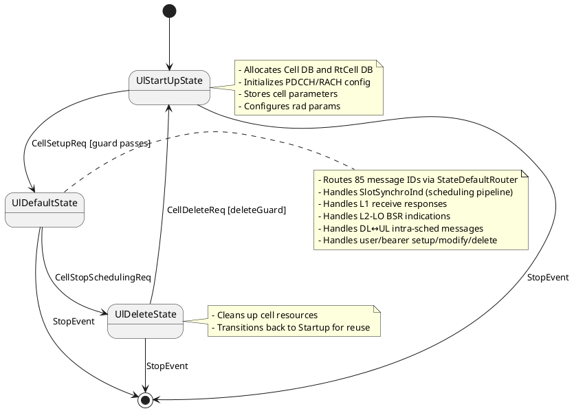
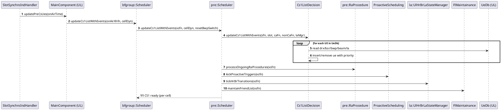
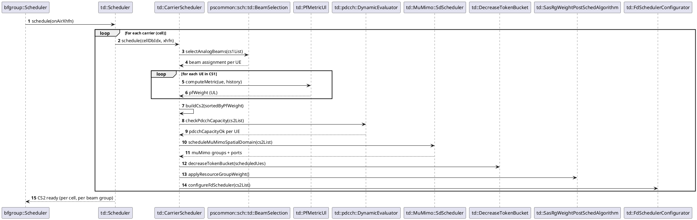
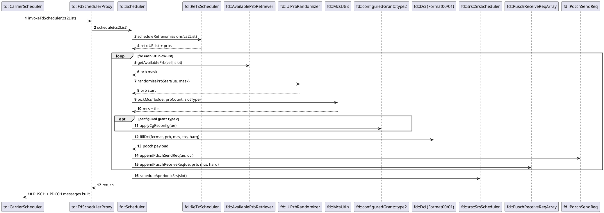
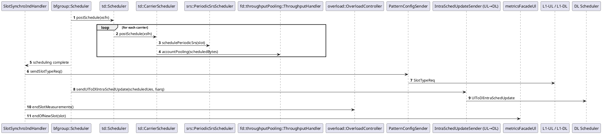
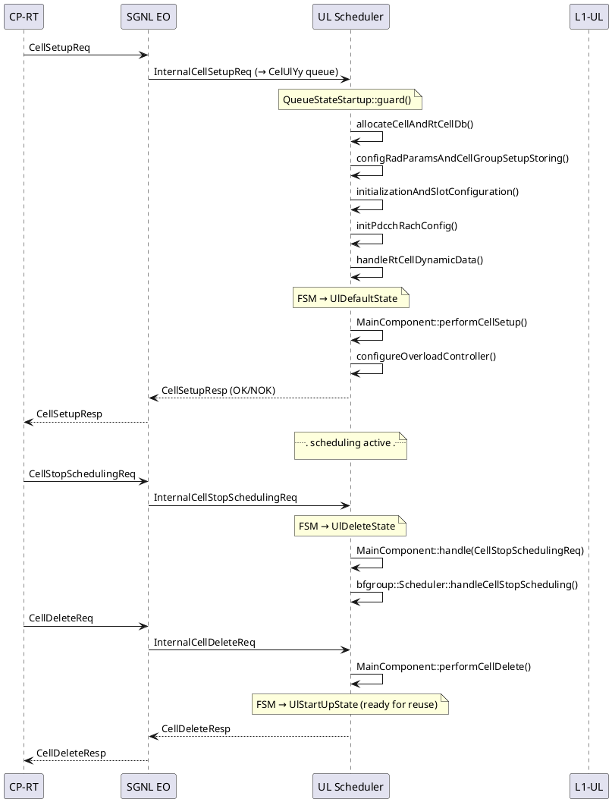
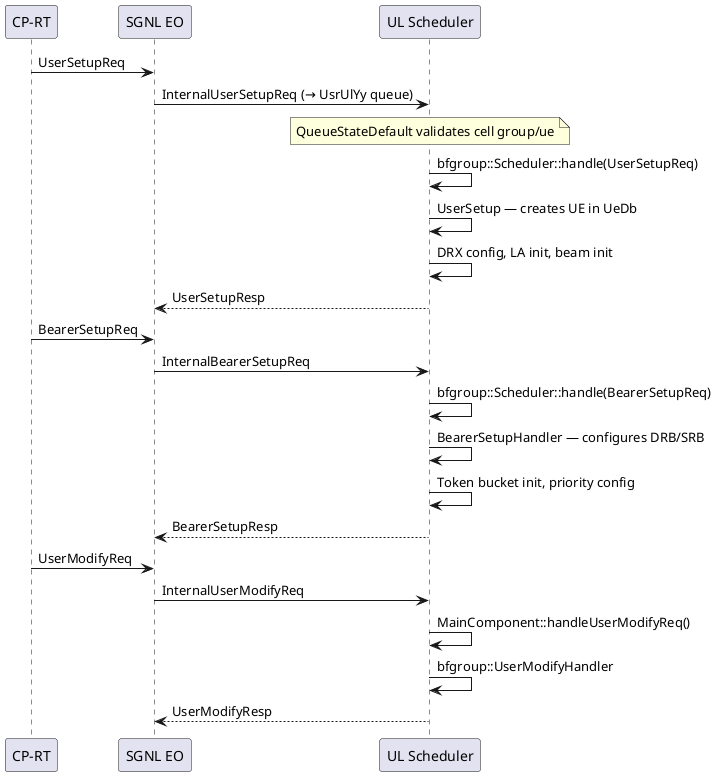
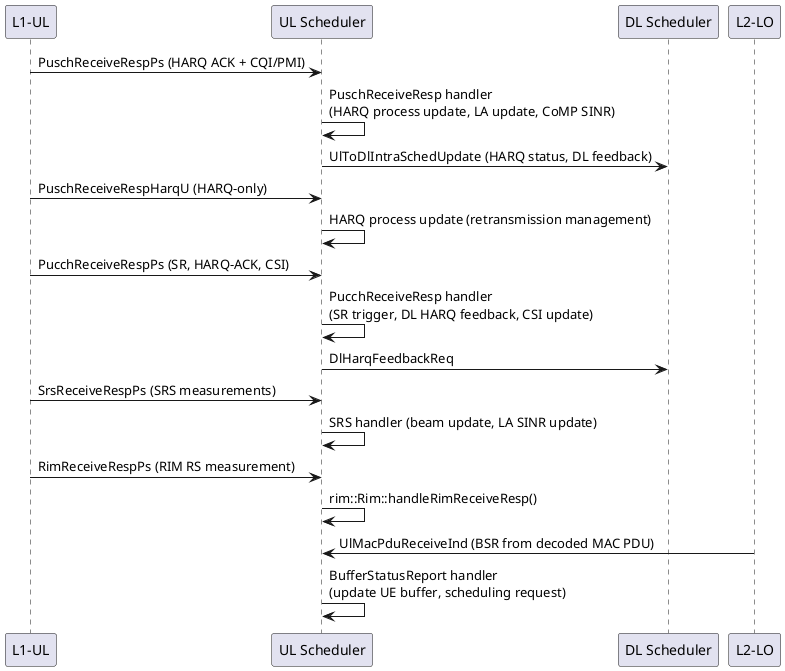
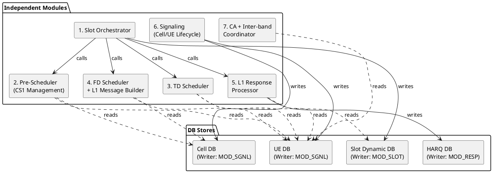

# L2-PS UL Scheduler (ulSch) Architecture And PlantUML Diagrams

**Scope.** This document describes the architecture of the **UL Scheduler EO** (`L2RtPool<P>_L2PsUlYySch`) within the L2-PS subsystem. It covers the per-cell-group UL scheduling pipeline for **FR1** (TDD and FDD), including RACH, PRE/TD/FD scheduling, PUSCH/PUCCH management, SRS, CoMP, link adaptation, DRX, overload control, and inter-band CA coordination.

**Applicability.** FR1 TDD and FDD. FR2-specific paths are intentionally excluded.

**Reference baseline.** EO architecture layout follows `/home/ptr476/work/doc/ai/.cursor/agents/l2ps-eo-architecture.agent.md` (editor mirror: `/home/ptr476/work/doc/ai/.github/agents/l2ps-eo-architecture.agent.md`). **§2** uses a *Package / subsystem connection overview* plus *Detailed class views*, per that agent (canonical split example: [`l2ps-bbrm.md`](./l2ps-bbrm.md) in this folder). Optional cross-check: Nokia-internal `l2ps-architecture.md` where maintained. Source-backed statements assume `/workspace/uplane/L2-PS/src/` and `/home/ptr476/work/doc/ai/storage/L2PS_Architecture.md` when those paths are available in the environment.

> **PlantUML rendering notes.**
> - Diagrams use fenced ` ```plantuml ` blocks with `@startuml` / `@enduml`; large figures live in sibling `diagrams/*.md` notes and are embedded from this vault folder. Each diagram note carries **`last_verified_src_date`** / **`last_verified_gnb_git`** when reconciled with `/workspace`.
> - Component and class diagrams use `package`, explicit arrow directions, and hidden links to guide layout.
> - Large class diagrams are split into overview and focused diagram notes under `diagrams/` where useful.
> - Sequence diagrams keep the original lifeline order and use PlantUML `alt` / `opt` blocks.
> - `skinparam linetype ortho` is intentionally left disabled unless strict right-angle routing improves readability.

---

## 1. Runtime Position

![[diagrams/l2ps-ulsch-runtime-position]]

---

## 2. Top-Level Class Overview

### Package / subsystem connection overview

Coarse map of the UL Scheduler EO shell, **EO-level router** vs **per-cell queue FSM**, EQ layout, and main interaction edges to peers (DL SCH, BBRM, L1, L2-LO, SRS-BM).

![[diagrams/l2ps-ulsch-top-level-class-overview]]

### Detailed class views

Additional class-level detail is split across later sections (EO agent **§2** convention — avoid one unreadable mega-diagram):

- **Scheduling pipeline:** §4–§5 (inline PlantUML plus subsystem narrative).
- **DB model (classes):** §6 — `![[diagrams/l2ps-ulsch-db-model]]`.

---

## 3. EO FSM And Event Dispatch

Like DL, the UL Scheduler EO has a **two-tier dispatcher**:

1. **EO-level router** — `EmFsmRouterWithDelay<Direction::UPLINK, ...>` (in `ul/em/Eo.hpp`) handles cell-group-level events directly: `CellGroupSetupReq`, `CellGroupReconfigReq`, `CellGroupDeleteReq`, `GetResourceUsageReq`, `SlotSynchroInd`, `StartSlotSynchroInd`, `StopSlotSynchroInd`, `UlCompConfigInd`.
2. **Per-cell FSM** — Boost.SML `QueueFsm` with three states (Startup / Default / Delete), one per cell, managed by `CellsFsmSet<QueueFsm, MainComponent>`. The `StateDefaultRouter` then dispatches **85** message IDs to handlers within the Default state (`ul/em/StateDefaultRouter.hpp`, counted at the git revision in **Document sync (source)**).



The **85** routes are the `::msgId()` template parameters on `pscommon::em::MessageRouter<QueueStateDefault, pscommon::em::Routes<…>>` in `ul/em/StateDefaultRouter.hpp` (same revision as **Document sync (source)**).

**EQ Layout.** The UL Scheduler EO owns multiple Event Queues:

| EQ Name Pattern | Priority | Purpose |
|-----------------|----------|---------|
| `L2PsSchUlYy` | `EQ_PRIO_3` | Slot scheduling trigger (SlotSynchroInd, L1 responses) |
| `L2PsMsgUlYy` | `EQ_PRIO_2` | Non-slot messages (DlToUlIntraSchedUpdate, etc.) |
| `L2PsUsrUlYy` | `EQ_PRIO_2` | User/bearer management (UserSetupReq, BearerSetupReq) |
| `L2PsCelUlYy` | `EQ_PRIO_0` | Cell lifecycle (CellSetupReq, CellReconfigurationReq) |
| `L2PsXpiUlYy` | `EQ_PRIO_2` | DSS cross-pool-interface messages |
| `L2PsCaxUlYy` | `EQ_PRIO_2` | Inter-gNB CA messages |

---

## 4. Scheduling Pipeline (SlotSynchroInd Flow)

The core hot-path of the UL Scheduler is triggered every slot by `SlotSynchroInd` from the platform timer service.

![[diagrams/l2ps-ulsch-scheduling-pipeline]]

---

## 5. PRE / TD / FD Scheduling Subsystems

### 5.1 Pre-Scheduler (`pre::Scheduler`)

Responsible for CS1 list maintenance — the candidate set of UEs eligible for UL scheduling.

| Responsibility | Class |
|----------------|-------|
| CS1 list management (add/remove/prioritize) | `pre::Scheduler` |
| Random Access procedure (Msg1→Msg3) | `pre::RaProcedure` |
| Proactive scheduling | `pre::ProactiveScheduling` |
| UL HR/BR LA state transitions | `la::UlHrBrLaStateManager` |
| Friend List maintenance | `pscommon::sch::td::FlMaintainance` |

### 5.2 TD Scheduler (`td::Scheduler`)

Time-Domain scheduling: selects UEs from CS1 into CS2, applies PF metric, beam selection, PDCCH capacity check, BBRM resource coordination.

| Responsibility | Class |
|----------------|-------|
| Per-carrier scheduling | `td::CarrierScheduler` |
| PF metric computation | `td::PfMetricUl` |
| Beam selection | `pscommon::sch::td::BeamSelection` |
| PDCCH resource check | `td::pdcch::DynamicEvaluator` |
| Resource group weight | `td::SasRgWeightPostSchedAlgorithm` |
| Token bucket decrease | `td::DecreaseTokenBucket` |
| FD scheduler proxy/configurator | `td::FdSchedulerProxy`, `td::FdSchedulerConfigurator` |
| MU-MIMO SD scheduler | `td::MuMimo::SdScheduler` |

### 5.3 FD Scheduler (`fd::Scheduler`)

Frequency-Domain scheduling: PRB allocation, MCS/TBS calculation, DCI filling, PUSCH/PDCCH L1 message building.

| Responsibility | Class |
|----------------|-------|
| FD orchestration | `fd::Scheduler` |
| PRB allocation | `fd::AvailablePrbRetriever`, `fd::UlPrbRandomizer` |
| PUSCH grant building | `fd::PuschReceiveReqArray`, `fd::PuschReceiveReqArrayContainer` |
| PDCCH DCI filling | `fd::PdcchSendReq`, `fd::Dci`, `fd::DciFormat00`, `fd::DciFormat01` |
| MCS/TBS computation | `fd::McsUtils`, `fd::McsDowngradeForMaxDataRate` |
| Retransmission | `fd::ReTxScheduler` |
| SRS scheduling | `fd::srs::SrsScheduler` |
| Configured Grant Type 2 | `fd::configuredGrant::type2::CgReconfigurator` |
| Throughput pooling | `fd::throughputPooling::ThroughputHandler` |
| UL CoMP allocation | `comp::fd::Allocator`, `comp::fd::SinglePuschSlotAllocator` |
| Counters | `fd::counters::PuschCounterUpdater` |

### 5.4 PRE Stage — Sequence



### 5.5 TD Stage — Sequence (per carrier)



### 5.6 FD Stage — Sequence (per carrier)



### 5.7 Post Stage — Sequence



---

## 6. DB Model

![[diagrams/l2ps-ulsch-db-model]]

**DB Access Pattern:**
- Cell DB: singleton static access via `db::CellDb::db()`
- UE DB: singleton static access via `db::UeDb::db()`
- Cell Group DB: singleton via `db::CellGroupDb::db()`
- All stores use fixed-size pre-allocated arrays (zero heap allocation on hot path)

---

## 7. Cell Bring-Up And Delete Flow



---

## 8. UE Configuration Flow



---

## 9. Slot-Level Processing Flow (Main Hot Path)

![[diagrams/l2ps-ulsch-slot-level-processing-flow]]

---

## 10. L1 Response Processing

The UL Scheduler receives asynchronous L1 responses carrying HARQ feedback, CSI, SRS measurements, and decoded UL MAC PDU indications.



---

## 11. Output Messages

| Direction | Message | Destination | Trigger |
|-----------|---------|-------------|---------|
| UL → L1-UL | `PuschReceiveReq` | L1-UL | FD scheduler scheduled a PUSCH grant |
| UL → L1-UL | `PucchReceiveReq` | L1-UL | PUCCH resource allocated for SR/HARQ-ACK/CSI |
| UL → L1-UL | `PrachReceiveReq` | L1-UL | PRACH slot, RACH scheduler active |
| UL → L1-UL | `SrsReceiveReq` | L1-UL | Periodic/aperiodic SRS scheduled |
| UL → L1-DL | `PdcchSendReq` | L1-DL | UL DCI (DCI 0_0 / 0_1) scheduled on PDCCH |
| UL → DL | `UlToDlIntraSchedUpdate` | DL Scheduler | Per-slot UE status, HARQ, beam info |
| UL → DL | `DlHarqFeedbackReq` | DL Scheduler | DL HARQ feedback from PUCCH decode |
| UL → BBRM | `ResourceReq` / `RimResourceReq` | BBRM | Request PRB resources / RIM resources |
| UL → PatternConfig | `SlotTypeReq` | PatternConfig | Per-slot L1 slot type configuration |
| UL → L2-HI | `UlRadioLinkStatusInd` (via PsCtrl) | L2-HI DU | Split-mode detection (RLF) |
| UL → peer UL | `ScellUlControlInd` | Peer UL | Inter-band CA SCell coordination |

---

## 12. Design Issues Observed

| # | Issue | Impact | Location |
|---|-------|--------|----------|
| 1 | **God class: `MainComponent`** (400+ lines header, ~50 handle methods, ~40 owned members) | Extremely difficult to test in isolation; every change risks regression | `ul/sch/MainComponent.hpp` |
| 2 | **`SlotSynchroIndHandler` monolith** (~1500 lines `.cpp`) | Single method orchestrates all slot processing; unclear boundaries between phases | `ul/sch/mainComponent/SlotSynchroIndHandler.cpp` |
| 3 | **`bfgroup::Scheduler` conflates TD + FD + RACH + SRS + CA** | One class owns `td::Scheduler`, `FdSchedulerList`, `rach::Scheduler`, `PeriodicSrsScheduler`, plus 15+ handlers | `ul/sch/bfgroup/Scheduler.hpp` |
| 4 | **Testable mock indirection everywhere** | `#include TESTABLE_MOCK(...)` pattern forces UT mocking at class level, not interface level; complicates dependency injection | Every `.hpp` file |
| 5 | **Static singleton DB access** (`CellDb::db()`, `UeDb::db()`) | Hidden global state; impossible to run parallel unit tests | `ul/db/cell/CellDbUl.hpp`, `ul/db/ue/UeDbUl.hpp` |
| 6 | **Overload controller tightly coupled to slot handler** | OLC metrics scattered across `processSlotForCell`, `updateSchedulerPostProcessing`, and `slotHandlerPostProcessing` | `SlotSynchroIndHandler.cpp` lines 460–600 |
| 7 | **Inter-band CA logic inlined into main path** | `interbandca/pcell/` and `interbandca/scell/` handlers called unconditionally even on single-carrier cells | `MainComponent.hpp` lines 60–75 |
| 8 | **85 message IDs in a single router** (`StateDefaultRouter`) | Flat dispatch table; no grouping by concern; adding a new message requires touching the router and the `QueueStateDefault` checker lists | `ul/em/StateDefaultRouter.hpp` |

---

## 13. Refactoring Direction (Modular Decomposition)

### Proposed Module Structure



### Module Definitions

| # | Module | Public Interface (max 4 methods) | DB Access |
|---|--------|----------------------------------|-----------|
| 1 | **Slot Orchestrator** | `handleSlotSynchroInd()`, `handleStopSlotSynchro()`, `configureOverload()` | Writes: Slot Dynamic DB; Reads: Cell DB |
| 2 | **Pre-Scheduler** | `updateCandidates(xsfn)`, `schedule(xsfn)`, `postSchedule(xsfn)` | Reads: UE DB, Cell DB |
| 3 | **TD Scheduler** | `schedule(xhfn, beamId)`, `postSchedule(xsfn)` | Reads: UE DB, Slot Dynamic DB |
| 4 | **FD Scheduler + L1 Builder** | `schedule(cs2List)`, `sendL1Messages()` | Reads: UE DB, Cell DB |
| 5 | **L1 Response Processor** | `handlePuschResp(msg)`, `handlePucchResp(msg)`, `handleSrsResp(msg)` | Writes: HARQ DB; Reads: UE DB |
| 6 | **Signaling (Cell/UE Lifecycle)** | `handleCellSetup(msg)`, `handleUserSetup(msg)`, `handleUserDelete(msg)`, `handleCellDelete(msg)` | Writes: Cell DB, UE DB |
| 7 | **CA + Inter-band Coordinator** | `handlePeerMsg(msg)`, `evaluatePowerSplit(xsfn)` | Reads: UE DB |

### Design Principles Applied

1. **Zero direct coupling:** Only the Slot Orchestrator (Module 1) calls other modules. Modules 2–7 never call each other.
2. **DB isolation:** Each mutable DB store has exactly ONE writer module.
3. **Interface minimalism:** Each module exposes 2–4 public methods.
4. **UT independence:** Each module testable by mocking only its DB read/write views.
5. **Hot-path guarantee:** All DB stores use fixed-size pre-allocated storage.
6. **No CRTP sharing between independent modules.**

### Self-Check Table

| Question | Answer |
|----------|--------|
| Are modules directly coupled? | No — only Slot Orchestrator calls others |
| Is mutable state shared? | No — each DB store has 1 writer, others get read-only views |
| How many modules change for a typical feature (e.g., new MCS table)? | 1 (FD Scheduler) |
| Can modules be developed in parallel? | Yes — clear interface boundaries |
| Is timing behavior independently testable? | Yes — Slot Orchestrator owns timing; others receive pre-computed time |

### Boundary clarifications (consistent with other EO refactorings)

| # | Item | Clarification |
|---|------|---------------|
| 1 | Module 1 "Slot Orchestrator" | Issues `ResourceReq` to BBRM and consumes `ResourceResp`; forwards PRB budget to Module 4 (FD Scheduler + L1 Builder). |
| 2 | Module 4 "FD Scheduler + L1 Builder" | Combines UL FD scheduling and L1 message build (PUSCH/PDCCH). This is the **UL counterpart** to FD EO's modules 3–5 — UL FD scheduling is **in-process** in UL SCH (no separate UL FD EO). |
| 3 | Module 5 "L1 Response Processor" | Sole writer of `HARQ DB`; also forwards UL→DL feedback via `UlToDlIntraSchedUpdate` and `DlHarqFeedbackReq` (consumed by DL SCH Module 6). |
| 4 | SRS-BM `UlSrsBeamSelectionInd` consumer | Consumed by Module 2 (Pre-Scheduler) via UE DB beam-state updates. |

---

## 14. Cross-EO Refactoring Consistency

This section validates that the UL SCH refactoring above is mutually consistent with the parallel proposals in `l2ps-srsbm.md`, `l2ps-dlsch.md`, `l2ps-fd.md`, and `l2ps-bbrm.md`. **You are here: UL SCH**.

### 14.1 Common refactoring shape

| Property                              | SRS-BM      | DL SCH      | UL SCH (here) | FD EO       | BBRM        |
| ------------------------------------- | ----------- | ----------- | ------------- | ----------- | ----------- |
| Module count                          | 7           | 7           | **7**         | 6           | 7           |
| Has Event Dispatcher module?          | No (FSM)    | No (FSM)    | **No (FSM)**  | Yes         | Yes         |
| Has Orchestrator / Pipeline module?   | Yes (M7)    | Yes (M1)    | **Yes (M1)**  | Yes (M2)    | No (M6 sync)|
| Single-writer DB store invariant      | ✓           | ✓           | **✓**         | ✓           | ✓           |
| ≤ 4 public methods per module         | ✓           | ✓           | **✓**         | ✓           | ✓           |
| Self-Check Table                      | ✓           | ✓           | **✓**         | ✓           | ✓           |
| Hot-path fixed-size storage           | ✓           | ✓           | **✓**         | ✓           | ✓           |

All five EOs follow the same skeleton: 6–7 independent modules, one writer per store, ≤ 4 public methods per module.

### 14.2 Inter-EO message-to-module mapping (UL SCH endpoint highlighted)

| Message                                    | Producer EO (Module)                          | Consumer EO (Module)                          |
| ------------------------------------------ | --------------------------------------------- | --------------------------------------------- |
| `FdInitInd` / `FdDeleteInd` / `FdScheduleReq` / `TdMetricOrderReq` | DL SCH                              | FD EO (M1 Event Dispatcher)                   |
| `FdScheduleResp`                           | FD EO (M5 L1 Builder)                         | DL SCH (M1 Slot Orchestrator)                 |
| `ResourceReq` / `RimResourceReq`           | DL SCH (M1), **UL SCH (M1 Slot Orchestrator)**| BBRM (M1 Dispatcher → M6 Period Sync → M7 Response Builder) |
| `ResourceResp` / `RimResourceResp`         | BBRM (M7 Response Builder)                    | DL SCH (M1), **UL SCH (M1 Slot Orchestrator → M4 FD Scheduler)** |
| `DlMetricInd`                              | DL SCH (M1)                                   | BBRM (M3 / M4 / M5)                           |
| `UlMetricInd`                              | **UL SCH (M1 Slot Orchestrator)**             | BBRM (M3 PRB / M4 UE / M5 SubCell Engines)    |
| `PuschReceiveReq` / `PucchReceiveReq` / `PrachReceiveReq` / `SrsReceiveReq` | **UL SCH (M4 FD + L1 Builder)** | L1-UL                                       |
| `PdcchSendReq` (UL DCI)                    | **UL SCH (M4 FD + L1 Builder)**               | L1-DL                                         |
| `PuschReceiveRespPs` / `PuschReceiveRespHarqU` | L1-UL                                     | **UL SCH (M5 L1 Response Processor)**         |
| `PucchReceiveRespPs`                       | L1-UL                                         | **UL SCH (M5 L1 Response Processor)**         |
| `SrsReceiveRespPs` / `RimReceiveRespPs`    | L1-UL                                         | **UL SCH (M5 L1 Response Processor)**         |
| `UlMacPduReceiveInd` (BSR)                 | L2-LO                                         | **UL SCH (M5 L1 Response Processor → M2 Pre-Scheduler)** |
| `UlToDlIntraSchedUpdate` / `DlHarqFeedbackReq` | **UL SCH (M5)**                           | DL SCH (M6 Feedback Processor)                |
| `DlToUlIntraSchedUpdate`                   | DL SCH (M6 Feedback Processor)                | **UL SCH (M5 L1 Response Processor)**         |
| `UlSrsBeamSelectionInd` / `SrsBeamSelectionInd` | SRS-BM (M6 Output Gateway)               | **UL SCH (M2 Pre-Scheduler)**, DL SCH (M2)    |
| `ScellUlControlInd` / peer CA messages     | **UL SCH (M7 CA + Inter-band Coordinator)**   | peer UL SCH (M7)                              |
| `SlotTypeReq`                              | **UL SCH (M1 Slot Orchestrator)**             | PatternConfig EO                              |
| `UlRadioLinkStatusInd`                     | **UL SCH (M5 → M7)**                          | L2-HI DU (via PsCtrl)                         |
| `CellSetupReq` / `UserSetupReq` / `*DeleteReq` | SGNL EO                                   | DL SCH (M7), **UL SCH (M6 Signaling)**, FD EO (M1), BBRM (M2), SRS-BM (M1) |
| `SlotSynchroInd`                           | Platform Timer                                | DL SCH (M1), **UL SCH (M1 Slot Orchestrator)**, BBRM (M6), SRS-BM (M7) |

### 14.3 DB store namespace check (no collisions)

Each EO owns its DB stores; identically-named stores in different docs are distinct.

| Logical concept   | SRS-BM                       | DL SCH                                 | UL SCH (here)               | FD EO                                | BBRM                                |
| ----------------- | ---------------------------- | -------------------------------------- | --------------------------- | ------------------------------------ | ----------------------------------- |
| Cell config       | `CellConfigStore`            | `CellConfigStore`                      | **Cell DB (UL local)**      | (pointer hand-off from DL SCH)       | `CellConfigStore` (pool config)     |
| UE state          | `UeRegistry`                 | `UeEligibilityStore` + `UeMetricStore` | **UE DB (UL local)**        | `EoDb` (per-slot scratch)            | `UePoolStore`                        |
| HARQ              | (n/a)                        | `HarqStore`                            | **`HARQ DB` (UL local)**    | (n/a)                                | (n/a)                                |
| PRB allocation    | (n/a)                        | `PrbAllocationStore`                   | **(FD Scheduler internal)** | (per-slot)                           | `PrbPoolStore`                       |
| L1 messages       | (n/a)                        | (FD EO owned)                          | **(built in M4 FD Scheduler)** | `L1MessageStore`                  | (n/a)                                |
| Runtime policy    | `RuntimePolicy`              | `TimeBudgetStore`                      | **`Slot Dynamic DB`**       | (slot-scoped)                        | `SyncStore`                          |

### 14.4 Observed cross-EO issues and resolutions

| # | Issue                                                                           | Resolution                                                                                                                                |
| - | ------------------------------------------------------------------------------- | ----------------------------------------------------------------------------------------------------------------------------------------- |
| 1 | UL does FD in-process (no separate UL FD EO), unlike DL                          | Intentional — UL FD is faster and doesn't need core-split. UL SCH M4 combines FD + L1 build; DL SCH externalizes to FD EO.                |
| 2 | UL `ResourceReq` producer is M1 Slot Orchestrator, DL is M4 Resource Allocator   | Both legal: DL has explicit Resource Allocator (M4); UL collapses it into Orchestrator since UL PRB allocation is part of FD scheduling.  |
| 3 | UL has no Feedback Processor module — L1 Response Processor (M5) does it         | UL M5 is functionally equivalent to DL M6. DL split is necessary because DL receives feedback indirectly via UL (PUCCH); UL receives L1 directly. |
| 4 | UL has CA / Inter-band Coordinator (M7); other EOs do not                        | Intentional — UL is the only EO with cross-cell-group/peer-EO traffic for inter-band CA. DL CA is handled inside Module 6.                |
| 5 | BBRM Period Synchronizer fires milestones that overlap UL slot ticks             | Resolved: BBRM `SyncStore` is BBRM-local. UL slot state lives in `Slot Dynamic DB`. Cross-EO via `MetricInd` / `ResourceResp` only.       |

**Conclusion**: The five refactoring proposals are **mutually consistent**. Cross-EO interaction is exclusively via typed messages, with each message having clearly identified producer/consumer modules. No DB store is shared across EOs.

---

## 15. Reading Map

| Priority | File / Directory | Purpose |
|----------|-----------------|---------|
| 1 | `ul/em/Eo.hpp` | EO shell, EQ wiring, FSM router template |
| 2 | `ul/em/QueueFsm.hpp` | Boost.SML FSM (Startup → Default → Delete) |
| 3 | `ul/em/QueueStateDefault.hpp` | Default state message dispatch |
| 4 | `ul/em/StateDefaultRouter.hpp` | Complete message-ID → handler routing table |
| 5 | `ul/sch/MainComponent.hpp` | Central coordinator, all handle() methods |
| 6 | `ul/sch/mainComponent/SlotSynchroIndHandler.cpp` | Hot-path slot pipeline (~1500 lines) |
| 7 | `ul/sch/bfgroup/Scheduler.hpp` | Beam-forming group scheduler (TD+FD+RACH+SRS) |
| 8 | `ul/sch/pre/Scheduler.hpp` | Pre-scheduler / CS1 list management |
| 9 | `ul/sch/td/Scheduler.hpp` | TD scheduler (PF metric, beam, CS2) |
| 10 | `ul/sch/fd/Scheduler.hpp` | FD scheduler (PRB, MCS, DCI, L1 message build) |
| 11 | `ul/sch/rach/Scheduler.hpp` | RACH/PRACH scheduling |
| 12 | `ul/db/cell/CellDbUl.hpp` | Cell database (static config per cell) |
| 13 | `ul/db/ue/UeDbUl.hpp` | UE database |
| 14 | `ul/db/cell/CellDynamicData.hpp` | Per-slot dynamic cell data |
| 15 | `ul/synchro/overload/OverloadController.hpp` | UL overload control |
| 16 | `ul/sch/intraSchedCom/IntraSchedUpdateSender.hpp` | UL→DL internal communication |
| 17 | `ul/sch/fd/PdcchSendReq.hpp` | PDCCH L1 message builder |
| 18 | `ul/sch/fd/PuschReceiveReqArray.hpp` | PUSCH L1 receive request array |
| 19 | `ul/sch/srs/PeriodicSrsScheduler.hpp` | Periodic SRS scheduling |
| 20 | `ul/drx/DrxManager.hpp` | UL DRX state machine |
| 21 | `ul/sch/la/UlHrBrLaStateManager.hpp` | Link Adaptation HR/BR state |
| 22 | `ul/comp/fd/Allocator.hpp` | UL CoMP frequency-domain allocator |
| 23 | `ul/sch/dss/DssManagerUl.hpp` | Dynamic Spectrum Sharing UL manager |
| 24 | `ul/sch/interbandca/pcell/NrRelSCellSetupReqHandler.hpp` | Inter-band CA PCell handler |

## Document sync (source)

| Field | Value |
|-------|--------|
| **Sync date** | 2026-06-11 |
| **gNB `/workspace` git** | `45617cfb9a73` |
| **EO source** | `/workspace/uplane/L2-PS/src/ul/` |

**Verified**

- `ul/em/StateDefaultRouter.hpp` — **85** `msgId()` entries in the `Routes<…>` template (shell `grep -c 'msgId()'`).
- `ul/em/Eo.hpp`, `ul/em/QueueFsm.hpp` — spot-checked against §3 two-tier narrative (EO router type parameters include **`UlCompConfigInd`**).

**Doc corrections this pass**

- Replaced approximate **~85** with exact **85** and cited the router header; tightened design-issue row wording.
- **`diagrams/`** — verification YAML on all UL SCH diagram notes; **`l2ps-ulsch-top-level-class-overview.md`**: `Eo` class aligned with `ul/em/Eo.hpp` (**`queuesDelayedEvents`**, **`rtCellUlInputBuffer`**, **`queueDbItemSchTime`** alongside existing router/FSM members); added source pointer comment.
- **§3** — EO-level router bullet list now includes **`UlCompConfigInd`** (matches `EmFsmRouterWithDelay<…>` template parameter list in `ul/em/Eo.hpp`).

## Related

- [[navigation-nokia-home]]
- [[navigation-implementation]]
