# L2-PS BBRM (Baseband Resource Manager) Architecture And Mermaid Diagrams

**Scope.** This document describes the **BBRM EO** (`L2RtPool
_L2PsBbrm`, queue name `L2PsBrmXxXx`). One BBRM per L2-RT pool (assigned only to scheduler-index 0, subpool 0). It is the **pool-wide baseband resource manager**: it owns cross-cell-group PRB / SubCell / SchedUE / Power / Throughput pooling, handles L1-pool address exchange during cell setup, drives the Sherpa milestone cycle, and answers `ResourceReq` from DL / UL Schedulers with `ResourceResp` carrying allocated PRB / SchedUE / SubCell budgets.

**Applicability.** FR1 only (TDD and FDD). BBRM is **not on the user-setup path** — it sees only cell-level lifecycle, pool deployment, and per-slot resource requests.

**Deployment.** One BBRM EO per L2-RT pool: `groupConfig.bbrm != invalidCoreId` and assigned only to scheduler-index 0 in subpool 0. EQ priority `EQ_PRIO_2`. Queue type `ATOMIC_QUEUE`. The BBRM does **not** receive `SlotSynchroInd` — its time anchor is the **SFN field** in incoming `ResourceReq` / `InterSubPoolsSynchroTriggerInd` / `RimResourceReq`.

> **Mermaid rendering notes.**
> - `flowchart LR` for Runtime Position uses `curve: "basis"` for smooth routing.
> - `flowchart TB` for pipelines uses `curve: "linear"`.
> - `classDiagram` uses `%%{init: {"layout": "elk"}}%%` for complex layouts.
> - `sequenceDiagram` has no special init.

---

## 1. Runtime Position

The BBRM EO sits **between SGNL** (cell-lifecycle inputs and L1 address-exchange relay) and the DL / UL **Schedulers** (per-slot resource requests). It also talks **directly to L1** pool brokers (`BbResourceReconfReq/Resp`) and receives `PoolingDeploymentReq` from CNFG at startup.

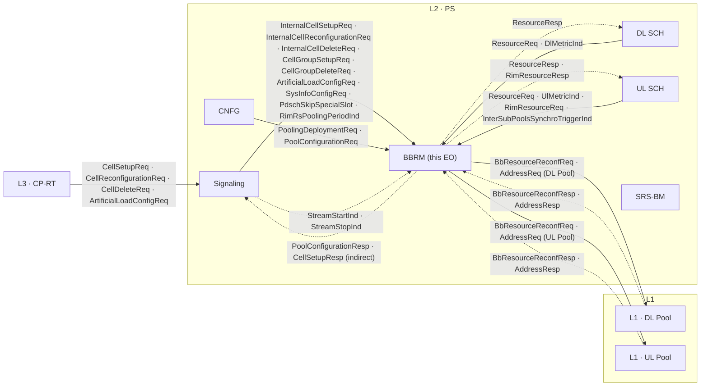

**Key facts:**
- BBRM is **per-pool**, not per-cell-group. It handles **all** cells in the pool (up to `maxNumOfCellsPerL2Rt`).
- BBRM is **not on the SlotSynchroInd path** — it has its own time domain anchored on SFN values inside incoming requests.
- The **L1 Pool address exchange** (`BbResourceReconfReq/Resp`, `AddressReq/Resp`) is BBRM ↔ L1 *directly*, not via SGNL.

---

## 2. Top-Level Class Overview

```mermaid
%%{init: {"layout": "elk"}}%%
classDiagram
direction TB

namespace bbrm_em {
    class Eo {
        -bbrmQueue : EmQueue
        -queueDbItem : EmQueueDbItem
        -eventRouter : fsm::EventRouter
        -fsm : QueueFsm
        +start() EmStatus
        +stop() EmStatus
    }
    class QueueFsm {
        <<single-state Boost.SML>>
        +startingState
        +on EmFsmEvent → eventRouter.processEvent
        +on StopEvent → X (terminate)
    }
}

namespace bbrm_fsm {
    class EventRouter {
        -dataModelFacade : DataModelFacade
        -dataModelViews : ViewsContainer&
        -cellList : CellList
        -bbPoolDeployInfo : BbPoolDeployInfo
        -l1PoolsMaxCapacitiesUl/Dl : L1PoolsMaxCapacities
        -subCellsAllocator : SubCellsAllocator
        -schedUeAllocator : SchedUeAllocator
        -poolingMapperManager : PoolingMapperManager
        -interSubPoolsPrbManagerUl/Dl : InterSubPoolsPrbManager
        -l1AddressExchangeManagerUl/Dl : L1AddressExchangeManager
        -resourceReqHandler : ResourceReqHandler
        -bbResourceReconfRespHandler : BbResourceReconfRespHandler
        -bbrmMilestoneHandler : BbrmMilestoneHandler
        -beginOfBbPoolingPeriodHandler : BeginOfBbPoolingPeriodHandler
        -commonTriggerManager : CommonTriggerManager
        -sherpaMilestoneEventHandler : SherpaMilestoneEventHandler
        -throughputHandler : throughputPooling::ThroughputHandler
        -throughputPoolingMapper : ThroughputPoolingMapper
        -multiPoolZabPrivilegeCtrl : MultiPoolZabPrivilegeCtrl
        -pwrPoolingMapper / pwrPoolingHandler
        -rimRs : RimRs
        -cellSetupManager : CellSetupManager
        -eventRouterForCellGroupProcess : EventRouterForCellGroupProcess
        -subcellDeactivationFacade : SubcellDeactivationFacade
        -interPoolingSwitchingFacade : InterPoolingSwitchingFacade
        -timingPattern750UsEligibilityUpdater
        -buddyCellEventHandler
        +processEvent(EmFsmEvent)
        +setBbrmEqid(localEqid)
    }
}

namespace bbrm {
    class CellSetupManager {
        -cellSetupContextList : StaticVectorFixedSize~CellSetupContext~
        +addCellSetupContext(nrId, result)
        +notifyStartL1AddressExchange(...)
        +notifyL1PoolAddressResponse(...)
        +notifyAddressExchangeNotNeeded(...)
        +notifyProcessingCellSetupReqDone(...)
        +removeHangingCellSetupContext(...)
    }
    class CommonTriggerManager {
        +setBbPoolEvalPeriod(period)
        +updateSynchroSfn(sfn)
        +notifyCellSetup(nrId)
        +notifyCellDelete(nrId, cellList)
        +notifySchedUeAllocChange()
        +notifyPrbAllocChange(direction)
        -nextSherpaMilestone : SFN
        -bbPoolEvalPeriodInSfn : SFN
    }
    class ResourceReqHandler {
        +handle(payload, numOfCells)
        +handle(InterSubPoolsSynchroTriggerInd payload)
        +notifyCellDelete(nrId)
        -resourceReqHandlerUtils
        -resourceRespPostponeController
    }
    class ResourceRespSender {
        +send()
        -fill(event)
        -handleResourcePrbTDD / FDD
        -handlePwrPoolResources(...)
        -fillZabData(...)
    }
    class BeginOfBbPoolingPeriodHandler {
        +beginOfBbPoolingPeriod(sfn)
        +execute(sfn)
        -state : waitingForBeginOfBbPoolingPeriod / waitingForExecute
        -lastBbrmComputationSfn
    }
    class SherpaMilestoneEventHandler {
        +sherpaMilestoneReached(sfn)
        +processFillSherpaIeInResourceResp(nrId, direction)
        -fsm : SherpaHandlerFsm
    }
    class BbrmMilestoneHandler {
        +beginOfBbPoolingPeriod(sfn)
        +processBbrmUsablePrbCalculationRequest(direction)
        -fsm : BbrmMilestoneFsm
    }
}

namespace bbrm_datamodel {
    class DataModelFacade {
        -dataBaseContainer : DataBaseContainer
        -dataBaseViews : ViewsContainer
        -cellSetupProcessor / cellGroupSetupProcessor / cellDeleteProcessor / cellGroupDeleteProcessor / cellReconfProcessor / poolingDeploymentProcessor / artificialLoadConfProcessor
        +process(CellSetupReq, isPwrPoolConfigValid)
        +process(CellGroupSetupReq)
        +process(CellDeleteReq)
        +process(CellGroupDeleteReq)
        +process(CellReconfigurationReq)
        +process(ArtificialLoadConfigReq)
        +handlePoolingDeployment(bbPoolInfos, freqRange, duplexMode)
        +getDataViews() ViewsContainer
    }
    class ViewsContainer {
        +getCellsContainerView()
        +getCellGroupsContainerView()
        +getDlSubcellsPoolingView()
        +getDeploymentInfosView()
        +getL1PoolSubpoolSubcellView()
        +getL2SubPoolView()
        +getPdcchIncreaseUplinkCapacityView()
    }
}

namespace bbrm_pooling {
    class PoolingMapperManager {
        -cellsListPerL1Pool : map~L1PoolIdKey, ListOfNrCell~
        -calculatorManagers : map~CalculatorManagersKey, CalculatorManager~
        +notifyAddCell(setupReq)
        +notifyDeleteCell(nrId, primaryPoolId)
        +notifyReconfigCell(nrId)
        +notifyDlMetricInd(payload)
        +notifyUlMetricInd(payload)
        +switchToNextPoolingPeriod()
    }
    class SubCellsAllocator {
        -cellsList / cellHandler / prbCapacityChecker
        +notifyCellSetup(setupReq, result)
        +notifyCellDelete(nrId)
        +notifyDlMetricInd(metricInd)
        +allocateSubCells(sfn, nrId) AvailableSubCells
        +buildCellAvailableSubcells(...)
    }
    class SchedUeAllocator {
        -schedUeResults / metricsByCell / metricBasedPolicy
        +notifyCellSetup(setupReq)
        +notifyCellDelete(nrId)
        +notifyUlMetricInd / notifyDlMetricInd
        +allocateSchedUe(sfn, nrId, direction) BbrmScheUeResult
        +setSchedUePolicy(deploymentReq)
    }
    class ThroughputHandler {
        +beginOfBbPoolingPeriod(sfn)
        -isTddInstTputPoolingAllowed
    }
    class PwrPoolingHandler {
        +execute(...)
        -pwrPoolingMapper / poolingMapperManager
    }
    class InterSubPoolsPrbManager {
        +make~Direction~(...)
        +notifyCellDelete()
        +handle(setupReq)
    }
    class L1AddressExchangeManager {
        +make~Direction~(config, deployInfo, cellSetupManager)
        +setAddress(eqId)
        +startL1AddressExchange(nrId)
        +handlePoolAddressResp(payload)
        +resetL1AddressExchange(nrId)
    }
    class RimRs {
        +notifyReq(payload, poolPeriodSfn, nextMetricSfn, synchroSfn)
        +notifyPoolingPeriodInd(payload)
        +notifyCellDelete(nrId)
        +notifyRimRsPoolingConfig(config)
    }
}

Eo *-- QueueFsm
Eo *-- EventRouter
QueueFsm ..> EventRouter : on EmFsmEvent
EventRouter *-- CellSetupManager
EventRouter *-- CommonTriggerManager
EventRouter *-- ResourceReqHandler
EventRouter *-- DataModelFacade
EventRouter *-- PoolingMapperManager
EventRouter *-- SubCellsAllocator
EventRouter *-- SchedUeAllocator
EventRouter *-- ThroughputHandler
EventRouter *-- PwrPoolingHandler
EventRouter *-- InterSubPoolsPrbManager : ×2 (UL,DL)
EventRouter *-- L1AddressExchangeManager : ×2 (UL,DL)
EventRouter *-- RimRs
EventRouter *-- BeginOfBbPoolingPeriodHandler
EventRouter *-- SherpaMilestoneEventHandler
EventRouter *-- BbrmMilestoneHandler
ResourceReqHandler ..> ResourceRespSender : creates per request
DataModelFacade *-- ViewsContainer
```

---

## 3. EO FSM And Event Dispatch

The BBRM EO uses a **trivial single-state Boost.SML FSM** (`startingState`). All EM events are routed unconditionally to `fsm::EventRouter::processEvent` which dispatches by message ID. Termination is the only state transition.

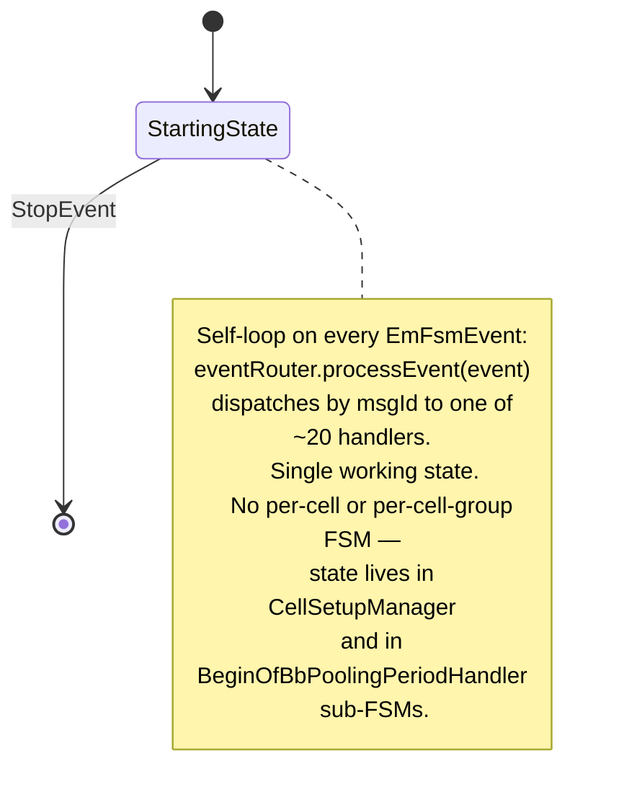

**No per-cell FSM.** Unlike DL / UL schedulers, BBRM has no `CellsFsmSet`. Cell lifecycle context is tracked by:
- `CellSetupManager::cellSetupContextList` (StaticVectorFixedSize of `CellSetupContext`) — one entry per cell currently in setup
- `CellList` (per-EO list of admitted cells)
- `cellSetupManager.PoolAddressExchangeState` (none / started / finished) for UL and DL directions

### Top-level event-ID dispatch

```mermaid
%%{init: {"flowchart": {"curve": "basis", "nodeSpacing": 30, "rankSpacing": 60}}}%%
flowchart TB
    A([EmFsmEvent → processEvent]) --> S{event.getEventId}
    S -->|UlMetricInd| H1[processUlMetricInd<br/>subcellDeactivation, l1ProcessingMode,<br/>schedUeAllocator, poolingMapper]
    S -->|DlMetricInd| H2[processDlMetricInd<br/>subcellDeactivation, subCellsAllocator,<br/>schedUeAllocator, poolingMapper]
    S -->|ResourceReq| H3[processResourceReq<br/>updateSynchroSfn → resourceReqHandler.handle]
    S -->|BbResourceReconfResp UL/DL| H4[bbResourceReconfRespHandler.handle]
    S -->|PoolingDeploymentReq| H5[processPoolingDeploymentReq<br/>storePoolsCapacities → dataModelFacade.handlePoolingDeployment]
    S -->|CellGroupSetupReq| H6[eventRouterForCellGroupProcess]
    S -->|CellGroupDeleteReq| H6
    S -->|CellSetupReq| H7[processCellSetupReq<br/>addCellSetupContext → proceedProcessingCellSetupReq]
    S -->|CellDeleteReq| H8[processCellDeleteReq<br/>notifyCellDelete + dataModelFacade.process]
    S -->|CellReconfigurationReq| H9[processCellReconfigReq<br/>dataModelFacade + pooling/pwrPooling notify]
    S -->|ArtificialLoadConfigReq| H10[dataModelFacade.process]
    S -->|UlPool::AddressResp| H11[L1AddressExchangeManagerUl.handlePoolAddressResp]
    S -->|DlPool::AddressResp| H12[L1AddressExchangeManagerDl.handlePoolAddressResp]
    S -->|StreamStartInd| H13[start tracer streaming DL+UL]
    S -->|StreamStopInd| H14[stop tracer streaming DL+UL]
    S -->|InterSubPoolsSynchroTriggerInd| H15[processInterSubPoolsSynchroTriggerInd<br/>updateSynchroSfn → resourceReqHandler.handle]
    S -->|RimResourceReq| H16[validate UL+RIMRS<br/>rimRs.notifyReq]
    S -->|SysInfoConfigReq| H17[timingPattern750UsEligibilityUpdater +<br/>buddyCellEventHandler]
    S -->|PoolConfigurationReq| H18[validate l2RtPoolId<br/>rimRs.notifyRimRsPoolingConfig<br/>→ PoolConfigurationResp]
    S -->|RimRsPoolingPeriodInd| H19[rimRs.notifyPoolingPeriodInd]
    S -->|PdschSkipSpecialSlot| H20[buddyCellEventHandler]
    S -->|default| HU[processUnexpectedEmFsmEvent / log error]
```

### Sub-FSMs inside EventRouter components

The "single-state" BBRM hides **two Boost.SML sub-FSMs** in helper components:

#### Sherpa Handler FSM (`SherpaHandlerFsm`)

Controls when Sherpa pooling-data IEs are filled into the next outbound `ResourceResp`. States in `SherpaHandlerFsmStates.hpp`. Driven by `sherpaMilestoneReached(sfn)` and by `processFillSherpaIeInResourceResp(nrId, direction)`.

#### BBRM Milestone FSM (`BbrmMilestoneFsm`)

Owns the `beginOfBbPoolingPeriod` milestone life-cycle: the **two-step** sequence where (1) the period start is detected and (2) the `processBbrmUsablePrbCalculationRequest(direction)` follow-up commits the new pool budget. The `BeginOfBbPoolingPeriodHandler` enum `State::waitingForBeginOfBbPoolingPeriod / waitingForExecute` is the externally visible projection of this FSM.

---

## 4. Pooling Sub-Systems

BBRM has six independent pooling sub-systems, each owning its own state and a clear external trigger:

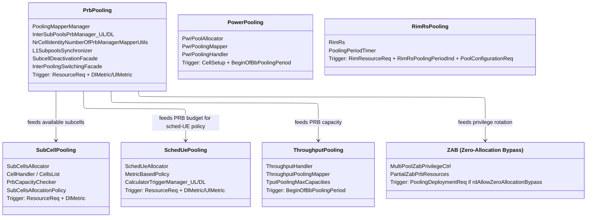

### Sub-system summary

| Sub-system          | Primary class(es)                                          | Trigger source                              | What it allocates                                  |
| ------------------- | ---------------------------------------------------------- | ------------------------------------------- | -------------------------------------------------- |
| **PRB pooling**     | `PoolingMapperManager`, `InterSubPoolsPrbManager` (UL+DL)  | `ResourceReq` + `Dl/UlMetricInd`            | Per-cell PRB / Stream / Layer / Bbrm-PRB budget    |
| **SubCell pooling** | `SubCellsAllocator` (`cellsList`, `cellHandler`)           | `ResourceReq` + `DlMetricInd`               | Per-cell active subcell mask (`AvailableSubCells`) |
| **SchedUE pooling** | `SchedUeAllocator` (`metricBasedPolicy`)                   | `ResourceReq` + `Dl/UlMetricInd`            | `BbrmScheUeResult` (max PUSCH/PDSCH UEs per cell)  |
| **Throughput pooling** | `throughputPooling::ThroughputHandler`, `ThroughputPoolingMapper`, `TputPoolingMaxCapacities` | `BeginOfBbPoolingPeriod` (SFN milestone)    | Per-cell-group throughput cap (TDD instantaneous)  |
| **Power pooling**   | `PwrPoolAllocator`, `PwrPoolingMapper`, `PwrPoolingHandler`| Cell setup + `BeginOfBbPoolingPeriod`       | Per-cell PA power-pool ID                          |
| **RIM-RS pooling**  | `rimRs::RimRs`                                             | `RimResourceReq` + `RimRsPoolingPeriodInd` + `PoolConfigurationReq` | RIM-RS PRBs to UL scheduler |
| **ZAB**             | `prb::zab::MultiPoolZabPrivilegeCtrl`                      | `PoolingDeploymentReq` (only if enabled)    | Zero-allocation bypass privilege rotation token    |

---

## 5. DB Model

BBRM's data model is owned by `DataModelFacade` and exposed via read-only typed `ViewsContainer`. No singleton `db()` access pattern is used (unlike DL / UL Schedulers).

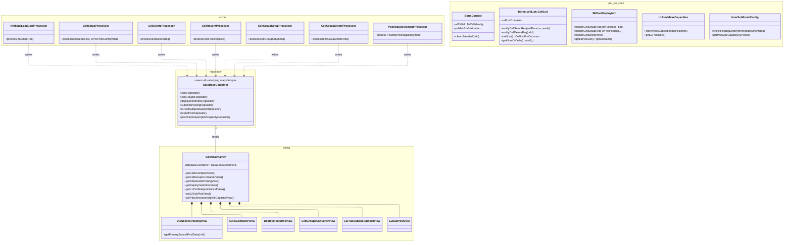

### Key DB characteristics

- **DataModelFacade** uses an Actor pattern: one `*Processor` per message type, all writing to a shared `DataBaseContainer`, all exposing read access via `ViewsContainer`.
- **Read-only consumers** (`ResourceReqHandler`, `ResourceRespSender`, `SubCellsAllocator`, `SchedUeAllocator`, `PoolingMapperManager`, etc.) take a `const ViewsContainer&` reference — they never see the underlying repositories directly.
- **Per-EO state** (`CellList`, `BbPoolDeployInfo`, `BbrmContext`, `L1PoolsMaxCapacities`, `InterSubPoolsConfig`) is owned by `EventRouter` and **not** part of `DataModelFacade` — these are mutable working buffers.
- **Fixed-size storage** everywhere: `StaticVectorFixedSize<..., maxNumOfCellsPerL2Rt>`, `StaticVectorFixedSize<..., maxNumOfSubCellsPerCell>` — no heap allocation after pool deployment.

---

## 6. Cell Bring-Up Flow

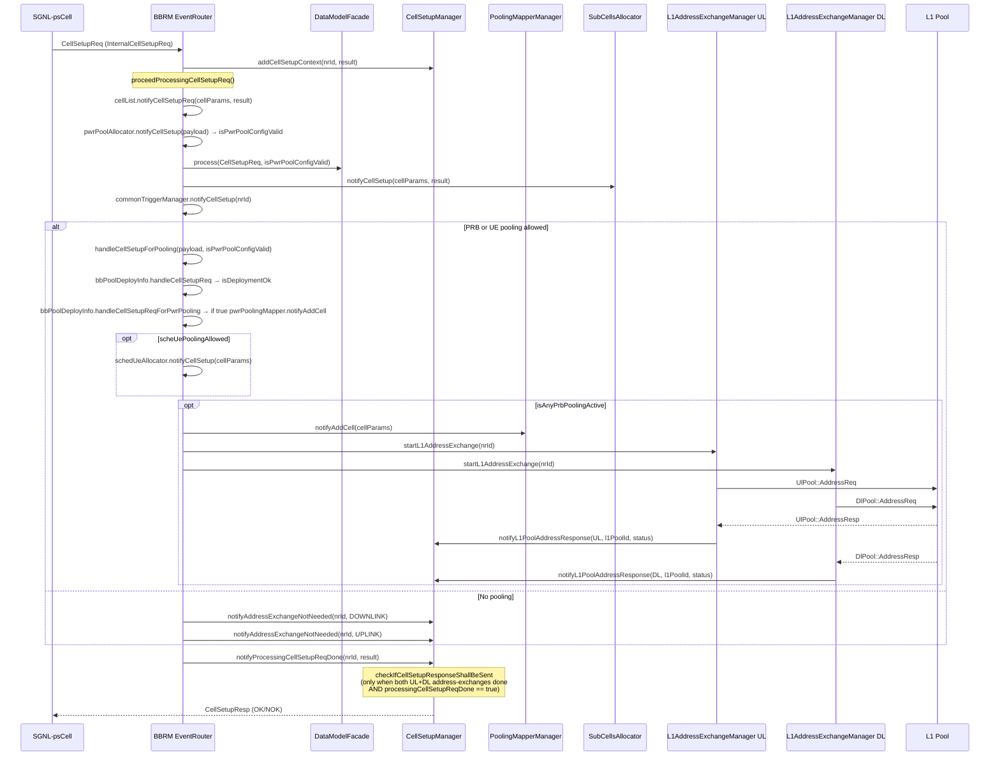

**Key invariant.** `CellSetupResp` is **only** sent after **all three** conditions are met for a `CellSetupContext`:
1. `processingCellSetupReqDone == true` (synchronous part finished),
2. UL pool address-exchange in {`finished`, `none` (not needed)},
3. DL pool address-exchange in {`finished`, `none` (not needed)}.

If any of UL / DL fails, the response is sent as NOK and the context removed.

---

## 7. Cell Delete Flow

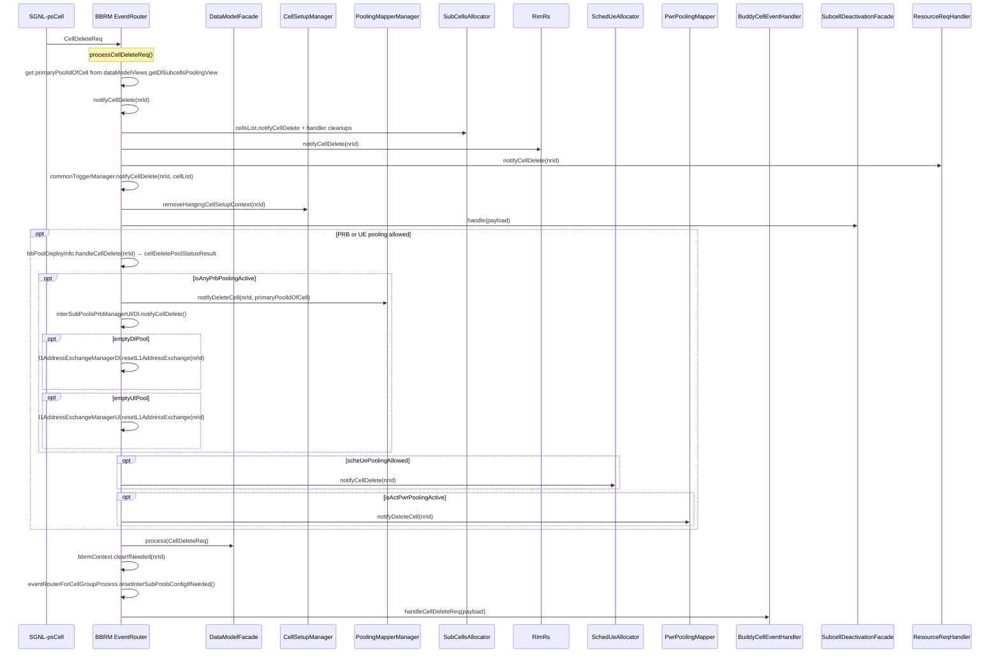

---

## 8. Resource Request / Response Flow (Per-Slot Hot Path)

DL and UL Schedulers periodically (per pool-eval period or on demand) send `ResourceReq` to ask for the current PRB / SchedUE / SubCell budget. BBRM has the per-slot **hottest path** in this flow.

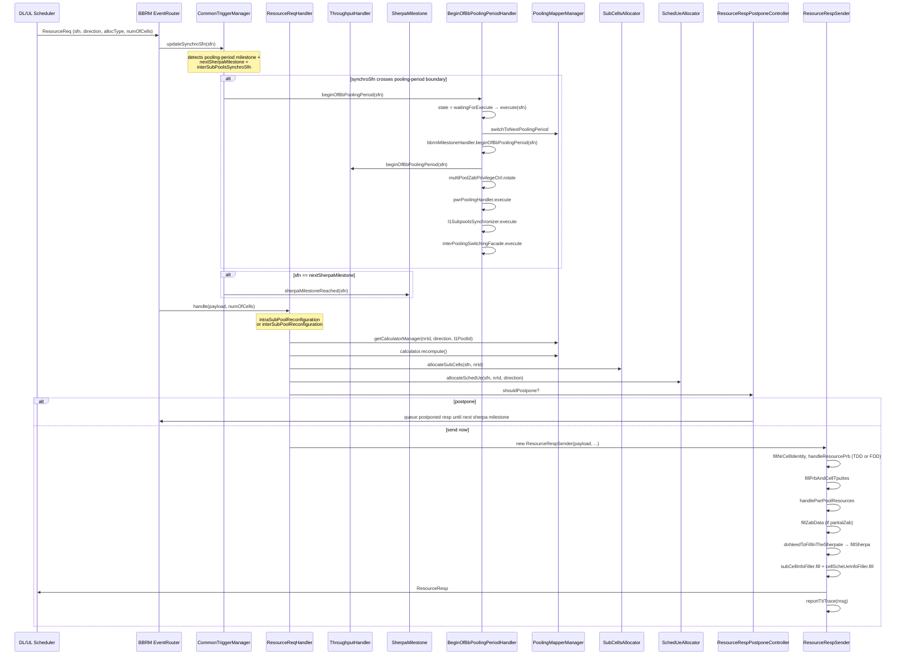

### 8.1 Hot-path timing budget (per ResourceReq)

| Phase                                              | Typical budget   |
| -------------------------------------------------- | ---------------- |
| `updateSynchroSfn` + milestone checks              | ~5 µs            |
| `beginOfBbPoolingPeriod` execution (when triggered)| ~30–80 µs (rare)|
| `ResourceReqHandler::handle` (calculator update + subcell + schedUe) | ~30–60 µs |
| `ResourceRespSender::send` (fill + send)           | ~15–30 µs        |
| **Total normal path**                              | **~50–100 µs**   |
| **Period-boundary path**                           | **~120–200 µs**  |

The `ResourceRespPostponeController` keeps the worst-case bounded: when the response computation needs the next Sherpa milestone, the response is deferred until that milestone arrives, reducing per-slot variance.

---

## 9. Pool Deployment Flow (Startup)

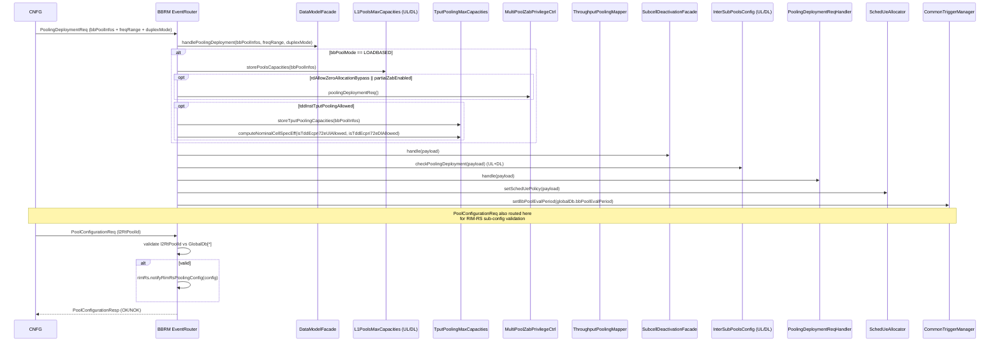

---

## 10. Output Messages

| Message                  | Destination          | Trigger                                              | Builder / Sender                                |
| ------------------------ | -------------------- | ---------------------------------------------------- | ----------------------------------------------- |
| `ResourceResp`           | DL or UL Scheduler   | Reply to `ResourceReq` (or unblocked postponed resp) | `resourceResp::ResourceRespSender`              |
| `RimResourceResp`        | UL Scheduler         | Reply to `RimResourceReq`                            | `rimRs::RimRs::sendResp`                        |
| `UlPool::AddressReq` / `DlPool::AddressReq` | L1-DL / L1-UL pool brokers | Cell setup with PRB pooling          | `L1AddressExchangeManager::startL1AddressExchange` |
| `UlPool::BbResourceReconfReq` / `DlPool::BbResourceReconfReq` | L1-DL / L1-UL pool brokers | Inter-sub-pool reconfig    | `InterSubPoolsPrbManager`                       |
| `PoolConfigurationResp`  | CNFG                 | Reply to `PoolConfigurationReq`                      | inline in `processPoolConfigurationReq`         |
| `BbrmScheUeResult`       | (in ResourceResp)    | Per-cell-direction max-sched-UE count                | `SchedUeAllocator::allocateSchedUe`              |
| Sherpa IE / ZAB IE / Power-pool IE / Subcell info IE | (fields in ResourceResp) | Per pool-period / per request | various `*Filler` classes               |

### Indirect outputs

BBRM does **not** send `CellSetupResp` / `CellDeleteResp` directly — those go from SGNL psCell. BBRM's role is to keep `CellSetupManager` state consistent so SGNL can aggregate the OK/NOK across DL Scheduler + UL Scheduler + BBRM and send the final response.

---

## 11. Design Issues Observed

| #   | Issue                                                                                                                              | Location                                              | Impact                                                                              |
| --- | ---------------------------------------------------------------------------------------------------------------------------------- | ----------------------------------------------------- | ----------------------------------------------------------------------------------- |
| 1   | **`EventRouter` is a god class** (~30 members, ~50 collaborators, ~20 message handlers)                                          | `bbrm/EventRouter.hpp` + `.cpp`                       | Adding any new message touches `EventRouter`; constructor init list has 30+ deps    |
| 2   | **Six pooling sub-systems coexist with implicit ordering** (PRB, SubCell, SchedUE, Tput, Power, RIM-RS, ZAB)                       | Throughout `bbrm/`                                    | Hard to verify "what happens when PRB pool changes mid-Sherpa-period?"             |
| 3   | **Cell-setup distributed state**: `CellSetupManager.cellSetupContextList` + `CellList` + `BbPoolDeployInfo` track overlapping facts | `CellSetupManager.hpp`, `cellList/CellList.hpp`, `BbPoolDeployInfo.hpp` | Drift risk if one is updated and another is not                       |
| 4   | **DL / UL symmetry maintained via 2× duplicated code paths** (`processBbResourceReconfRespUl/Dl`, `L1AddressExchangeManagerUl/Dl`, `InterSubPoolsPrbManagerUl/Dl`) | `EventRouter.cpp` | Same logic in two places; diverges easily on fixes                      |
| 5   | **No per-cell FSM** but per-cell state in many components                                                                          | `CellSetupManager`, `CellList`, `SubCellsAllocator.cellsList`, `SchedUeAllocator.schedUeResults`, `PoolingMapperManager.cellsListPerL1Pool` | Cell delete is a fan-out cleanup with no single source of truth |
| 6   | **Sherpa / BbrmMilestone / BeginOfBbPoolingPeriod are three overlapping sub-FSMs**                                                | `bbrm/fsm/SherpaHandlerFsm.hpp`, `BbrmMilestoneFsm.hpp`, `BeginOfBbPoolingPeriodHandler.hpp` | Three separate state-machine implementations with similar SFN-based triggers |
| 7   | **Hot path runs through ResourceReqHandler god-aggregator** (~12 collaborator refs in constructor)                                | `bbrm/resourceReq/ResourceReqHandler.hpp`             | Single function `handle()` exercises 6 sub-systems sequentially                     |
| 8   | **ResourceRespSender constructed per-request** with ~15 collaborator refs                                                          | `bbrm/resourceResp/ResourceRespSender.hpp`            | Per-slot construction overhead; could be a long-lived service                       |
| 9   | **Static singleton access for `GlobalDb`** still present (although main DB is via Facade)                                          | `prb::interpooling::InterSubPoolsPrbManager::make`, `EventRouter::storePoolCapacitiesForLoadBasedMode` | Hidden cross-cutting deps                                  |
| 10  | **`processUnexpectedEmFsmEvent` swallows errors as logs**                                                                          | `EventRouter::processUnexpectedEmFsmEvent`            | Misrouted messages silently lost from the BBRM perspective                          |

---

## 12. Refactoring Direction (Modular Decomposition)

### Proposed Module Structure (7 modules)

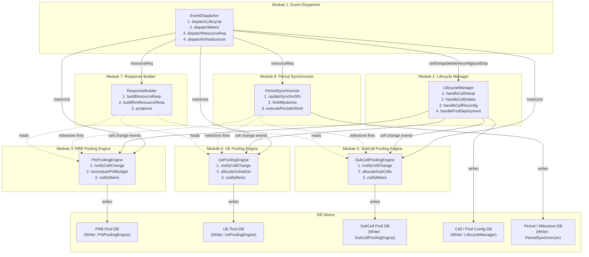

### Module Responsibilities

| Module                          | Public Interface (≤ 4 methods)                                                       | DB Access                                          | Writes To       |
| ------------------------------- | ------------------------------------------------------------------------------------ | -------------------------------------------------- | --------------- |
| **1. Event Dispatcher**         | `dispatchLifecycle()`, `dispatchMetric()`, `dispatchResourceReq()`, `dispatchInfrastructure()` | (none)                                       | (none)          |
| **2. Lifecycle Manager**        | `handleCellSetup()`, `handleCellDelete()`, `handleCellReconfig()`, `handlePoolDeployment()` | CellConfigStore (RW)                          | CellConfigStore |
| **3. PRB Pooling Engine**       | `notifyCellChange()`, `recomputePrbBudget()`, `notifyMetric()`                       | PrbPoolStore (RW), CellConfigStore (R)             | PrbPoolStore    |
| **4. UE Pooling Engine**        | `notifyCellChange()`, `allocateSchedUe()`, `notifyMetric()`                          | UePoolStore (RW), CellConfigStore (R)              | UePoolStore     |
| **5. SubCell Pooling Engine**   | `notifyCellChange()`, `allocateSubCells()`, `notifyMetric()`                         | SubCellPoolStore (RW), CellConfigStore (R)         | SubCellPoolStore|
| **6. Period Synchronizer**      | `updateSynchroSfn()`, `fireMilestones()`, `executePeriodicWork()`                    | SyncStore (RW)                                     | SyncStore       |
| **7. Response Builder**         | `buildResourceResp()`, `buildRimResourceResp()`, `postpone()`                        | All pool stores (R), SyncStore (R)                 | (output only)   |

### DB Store Isolation

| DB Store           | Single Writer Module       | Readers                                       |
| ------------------ | -------------------------- | --------------------------------------------- |
| CellConfigStore    | Lifecycle Manager          | All pooling engines, Response Builder         |
| PrbPoolStore       | PRB Pooling Engine         | Response Builder, Period Synchronizer         |
| UePoolStore        | UE Pooling Engine          | Response Builder                              |
| SubCellPoolStore   | SubCell Pooling Engine     | Response Builder                              |
| SyncStore          | Period Synchronizer        | All other modules (read-only "is-this-a-milestone-slot?") |

### Design Principles Applied

1. **Zero direct coupling**: Pooling engines never call each other; the Dispatcher fans out lifecycle / metric events, and the Response Builder *reads* from each engine.
2. **DB isolation**: Each pool's mutable state is owned by exactly one engine.
3. **Interface minimalism**: Each module exposes 3–4 public methods.
4. **UT independence**: Each engine testable by mocking only `CellConfigStore` read view and (for Response Builder) the engine read APIs.
5. **Hot-path guarantee**: All stores use fixed-size pre-allocated storage (already true today via `StaticVectorFixedSize`).
6. **Symmetric UL/DL** unified inside each engine — no more duplicate `*Ul` and `*Dl` classes.
7. **Three sub-FSMs (Sherpa / BbrmMilestone / BeginOfBbPoolingPeriod) collapsed** into Period Synchronizer's `fireMilestones()` interface that yields strongly-typed "milestone-reached" events.

### Self-Check Table

| Question                                                | Answer                                                                                       |
| ------------------------------------------------------- | -------------------------------------------------------------------------------------------- |
| Are modules directly coupled?                           | **No** — only Dispatcher → Modules (fan-out) and Response Builder → Pool Engines (read-only) |
| Is mutable state shared?                                | **No** — each store has 1 writer; readers get read-only views                                |
| How many modules change for a typical feature addition? | **1–2** (e.g., new tput-pooling rule → PrbPoolingEngine + possibly PeriodSynchronizer)       |
| Can modules be developed in parallel?                   | **Yes** — pool engines are independent; interfaces are stable                                |
| Is timing behavior independently testable?              | **Yes** — Period Synchronizer is mockable; pool engines take pre-computed `sfn`              |
| Are the UL/DL code-path duplications eliminated?         | **Yes** — each engine accepts `Direction` parameter; no `*Ul` / `*Dl` class split            |
| Can a single pooling sub-system be tested in isolation? | **Yes** — instantiate one engine + mock CellConfigStore + drive metric & resource-req inputs |

### Boundary clarifications (consistent with other EO refactorings)

| # | Item | Clarification |
|---|------|---------------|
| 1 | Module 1 "Event Dispatcher" | Replaces today's `EventRouter` god-class. Routes by message ID family (lifecycle / metric / resourceReq / infrastructure) to one of M2–M7. |
| 2 | Module 6 "Period Synchronizer" | Collapses three current sub-FSMs (Sherpa, BbrmMilestone, BeginOfBbPoolingPeriod) into one milestone broadcaster. Each pool engine reacts to milestone fire events. |
| 3 | Module 7 "Response Builder" | Sole producer of `ResourceResp` / `RimResourceResp` back to DL/UL Scheduler EOs. Reads (but never writes) the pool stores. |
| 4 | UL/DL symmetry | Today's duplicated `*Ul` / `*Dl` classes (`InterSubPoolsPrbManagerUl/Dl`, `L1AddressExchangeManagerUl/Dl`, etc.) merge into single direction-parameterized engines (M3 / M4 / M5). |

---

## 13. Cross-EO Refactoring Consistency

This section validates that the BBRM refactoring above is mutually consistent with the parallel proposals in `l2ps_srsbm_mermaid.md`, `l2ps_dlsch_mermaid.md`, `l2ps_ulsch_mermaid.md`, and `l2ps_fd_mermaid.md`. **You are here: BBRM**.

### 13.1 Common refactoring shape

| Property                              | SRS-BM      | DL SCH      | UL SCH      | FD EO       | BBRM (here) |
| ------------------------------------- | ----------- | ----------- | ----------- | ----------- | ----------- |
| Module count                          | 7           | 7           | 7           | 6           | **7**       |
| Has Event Dispatcher module?          | No (FSM)    | No (FSM)    | No (FSM)    | Yes (M1)    | **Yes (M1)**|
| Has Orchestrator / Pipeline module?   | Yes (M7)    | Yes (M1)    | Yes (M1)    | Yes (M2)    | **No (M6 sync)** |
| Single-writer DB store invariant      | ✓           | ✓           | ✓           | ✓           | **✓**       |
| ≤ 4 public methods per module         | ✓           | ✓           | ✓           | ✓           | **✓**       |
| Self-Check Table                      | ✓           | ✓           | ✓           | ✓           | **✓**       |
| Hot-path fixed-size storage           | ✓           | ✓           | ✓           | ✓           | **✓**       |

BBRM uses a Period-Synchronizer (M6) instead of a Slot Orchestrator because its work is gated by **pooling milestones** (SFN-anchored, ~10–100 ms) rather than every slot.

### 13.2 Inter-EO message-to-module mapping (BBRM endpoint highlighted)

| Message                                    | Producer EO (Module)                          | Consumer EO (Module)                          |
| ------------------------------------------ | --------------------------------------------- | --------------------------------------------- |
| `ResourceReq` / `RimResourceReq`           | DL SCH (M1 / M4), UL SCH (M1)                 | **BBRM (M1 Dispatcher → M6 Period Sync → M7 Response Builder)** |
| `ResourceResp` / `RimResourceResp`         | **BBRM (M7 Response Builder)**                | DL SCH (M1 Slot Orchestrator), UL SCH (M1)    |
| `DlMetricInd`                              | DL SCH (M1 Slot Orchestrator)                 | **BBRM (M3 PRB / M4 UE / M5 SubCell Engines)**|
| `UlMetricInd`                              | UL SCH (M1 Slot Orchestrator)                 | **BBRM (M3 PRB / M4 UE / M5 SubCell Engines)**|
| `PoolingDeploymentReq`                     | CP-RT (external, via SGNL)                    | **BBRM (M2 Lifecycle Manager)**               |
| `BbResourceReconfReq` / `BbResourceReconfResp` | **BBRM (M2 Lifecycle Manager via M7)** ↔ L1 | L1 ↔ **BBRM (M1 Dispatcher → M2)**          |
| `L1AddressExchangeReq` / `*Resp`           | **BBRM (M3 PRB Pooling Engine)**              | peer BBRM / SGNL                              |
| `SherpaDataInd` / `SherpaResultInd`        | **BBRM (M6 Period Synchronizer)**             | L1 / peer cells                               |
| `CellSetupReq` / `CellGroupSetupReq` / `*DeleteReq` | SGNL EO                              | **BBRM (M2 Lifecycle Manager)**, DL SCH (M7), UL SCH (M6), FD EO (M1), SRS-BM (M1) |
| `SlotSynchroInd`                           | Platform Timer                                | DL SCH (M1), UL SCH (M1), **BBRM (M6 Period Synchronizer)**, SRS-BM (M7) |
| `BeginOfBbPoolingPeriod` (internal trigger)| **BBRM (M6 Period Synchronizer)**             | **BBRM (M3 / M4 / M5 Pool Engines — fan-out)**|

### 13.3 DB store namespace check (no collisions)

Each EO owns its DB stores; identically-named stores in different docs are distinct.

| Logical concept   | SRS-BM                       | DL SCH                                 | UL SCH                  | FD EO                                | BBRM (here)                          |
| ----------------- | ---------------------------- | -------------------------------------- | ----------------------- | ------------------------------------ | ------------------------------------ |
| Cell config       | `CellConfigStore`            | `CellConfigStore` (DL local)           | (Cell DB)               | (pointer hand-off from DL SCH)       | **`CellConfigStore` (pool/cell config — distinct from DL SCH's CellConfigStore)** |
| UE state          | `UeRegistry`                 | `UeEligibilityStore` + `UeMetricStore` | (UE DB)                 | `EoDb`                               | **`UePoolStore` (max-sched UE policy)** |
| PRB allocation    | (n/a)                        | `PrbAllocationStore` (per-slot grant)  | (FD internal)           | (per-slot)                           | **`PrbPoolStore` (long-period pool budget)** |
| L1 messages       | (n/a)                        | (FD EO owned)                          | (FD Scheduler internal) | `L1MessageStore`                     | **(n/a — BBRM does not produce L1 messages)** |
| Throughput pool   | (n/a)                        | (n/a)                                  | (n/a)                   | `TputPoolStore` (instantaneous)      | **(part of `PrbPoolStore` — long-period)**|
| Period / milestone| (n/a)                        | `TimeBudgetStore`                      | `Slot Dynamic DB`       | (slot-scoped)                        | **`SyncStore` (SFN-anchored milestone clock)** |

### 13.4 Observed cross-EO issues and resolutions

| # | Issue                                                                           | Resolution                                                                                                                                |
| - | ------------------------------------------------------------------------------- | ----------------------------------------------------------------------------------------------------------------------------------------- |
| 1 | BBRM `CellConfigStore` vs DL SCH `CellConfigStore` (same name, different content)| Distinct stores: BBRM tracks pool deployment (`BbPoolDeployInfo`, `L1PoolsMaxCapacities`); DL SCH tracks cell scheduling params. No shared writer. |
| 2 | BBRM `PrbPoolStore` (long-period) vs FD EO `TputPoolStore` (per-slot)            | Orthogonal: BBRM allocates the per-pool PRB **budget** (~100ms); FD EO shaves the **instantaneous** TDD throughput within a slot. Communicated only via `ResourceResp`. |
| 3 | BBRM has Event Dispatcher (M1) but DL/UL SCH do not                              | Intentional — DL/UL keep their per-cell FSM as the dispatcher (Startup/Default/Delete); BBRM's trivial single-state FSM is replaced by an explicit Dispatcher module. Functionally equivalent at the boundary. |
| 4 | BBRM `SyncStore` vs DL/UL slot tick                                              | BBRM `SyncStore` is BBRM-local (pooling milestones only). DL/UL slot ticks are per-EO. Cross-EO is only via `MetricInd` (DL/UL → BBRM) and `ResourceResp` (BBRM → DL/UL). No shared state. |
| 5 | UL/DL symmetry today is duplicated; refactoring collapses to direction-param      | Each pooling engine accepts `Direction` parameter; the duplicated `*Ul` / `*Dl` classes vanish. No impact on cross-EO contracts (`MetricInd` already carries direction). |
| 6 | Three sub-FSMs collapsed into one Period Synchronizer (M6)                       | The combined M6 fires three milestone types (`SherpaMilestone`, `BbrmMilestone`, `BeginOfBbPoolingPeriod`) but as typed events; pool engines react to whichever they need. No external contract change. |

**Conclusion**: The five refactoring proposals are **mutually consistent**. BBRM's "long-period pool budget" model and DL/UL/FD's "per-slot allocation" model are explicitly separated. Cross-EO interaction is exclusively via `MetricInd` (incoming) and `ResourceResp` (outgoing). No DB store is shared across EOs.

---

## 14. Reading Map

| File / Directory                                                | Purpose                                                                       |
| --------------------------------------------------------------- | ----------------------------------------------------------------------------- |
| `bbrm/Eo.hpp` + `.cpp`                                          | EO shell: queue creation, FSM start                                            |
| `bbrm/QueueFsm.hpp`                                             | Trivial single-state Boost.SML FSM                                             |
| `bbrm/EventRouter.hpp` + `.cpp`                                 | **Top-level event dispatch** + all collaborator wiring                         |
| `bbrm/EventRouterForCellGroupProcess.hpp` + `.cpp`              | Cell-group setup / delete handling                                             |
| `bbrm/CellSetupManager.hpp` + `.cpp`                            | Per-cell setup context (pool-address-exchange aggregation)                     |
| `bbrm/CommonTriggerManager.hpp` + `.cpp`                        | SFN-anchored milestone time-driver (bbPoolEvalPeriod + sherpa + interSubPools) |
| `bbrm/BeginOfBbPoolingPeriodHandler.hpp` + `.cpp`               | "Begin-of-pooling-period" milestone runner; orchestrates Sherpa/Zab/Pwr/Tput   |
| `bbrm/SherpaMilestoneEventHandler.hpp` + `.cpp` + `bbrm/fsm/SherpaHandlerFsm.hpp` | Sherpa pooling-data IE FSM                                  |
| `bbrm/SherpaDataCtrl.hpp` + `.cpp`                              | Sherpa data emission control                                                   |
| `bbrm/BbResourceReconfRespHandler.hpp` + `.cpp`                 | L1 BbResourceReconfResp handler                                                |
| `bbrm/cellList/CellList.hpp`                                    | Per-EO admitted cell list                                                      |
| `bbrm/cellSlotModelCommon/BbPoolDeployInfo.hpp`                 | Pool deployment info (per-cell pool ID mapping)                                |
| `bbrm/cellSlotModelCommon/TimingPattern750UsEligibilityUpdater.hpp` | 750-µs timing pattern eligibility                                          |
| `bbrm/datamodel/DataModelFacade.hpp`                            | Actor-pattern facade for all cell config writes                                |
| `bbrm/datamodel/views/ViewsContainer.hpp`                       | Read-only view aggregation                                                     |
| `bbrm/datamodel/actors/*Processor.hpp`                          | Per-message actors writing to repositories                                     |
| `bbrm/poolingDeployment/L1PoolsMaxCapacities.hpp`               | L1-pool max-stream-PRB capacity from deployment                                |
| `bbrm/poolingDeployment/TputPoolingMaxCapacities.hpp`           | Throughput-pool nominal cell-spectral efficiency                               |
| `bbrm/poolingDeployment/PoolingDeploymentReqHandler.hpp`        | `PoolingDeploymentReq` handler                                                 |
| `bbrm/prb/PoolingMapperManager.hpp`                             | Per-cell-per-direction PRB calculator manager                                   |
| `bbrm/prb/CalculatorManager.hpp` + `.cpp`                       | PRB calculation per (cell, direction, l1Pool)                                  |
| `bbrm/prb/loadMetric/`                                          | Load-metric driven PRB calculators                                              |
| `bbrm/prb/interpooling/InterSubPoolsPrbManager.hpp`             | Cross-sub-pool PRB allocation                                                  |
| `bbrm/prb/interpooling/sgnl/L1AddressExchangeManager.hpp`       | L1 pool address exchange (UL/DL)                                               |
| `bbrm/prb/zab/MultiPoolZabPrivilegeCtrl.hpp`                    | ZAB privilege rotation                                                          |
| `bbrm/prb/subcellDeactivation/SubcellDeactivationFacade.hpp`    | Subcell-deactivation cross-cutting helper                                       |
| `bbrm/prb/ulSubCellManager/LoadMetricUlSubCellManager.hpp`      | UL subcell management driven by load metric                                     |
| `bbrm/prb/L1SubpoolsSynchronizer.hpp`                           | L1 subpool synchroniser                                                         |
| `bbrm/subCellsPooling/SubCellsAllocator.hpp`                    | Subcell allocator: per-cell available-subcell builder                          |
| `bbrm/schedUePooling/SchedUeAllocator.hpp`                      | Per-cell PUSCH/PDSCH max-UE allocator (metric-based policy)                    |
| `bbrm/throughputPooling/ThroughputHandler.hpp`                  | Tput pooling period start                                                       |
| `bbrm/throughputPooling/ThroughputPoolingMapper.hpp`            | Tput pooling mapping                                                            |
| `bbrm/pwrPooling/PwrPoolAllocator.hpp`                          | Power-pool allocation (cell setup)                                              |
| `bbrm/pwrPooling/PwrPoolingHandler.hpp`                         | Per-period power-pool reallocation                                              |
| `bbrm/pwrPooling/PwrPoolingMapper.hpp`                          | Cell ↔ power-pool ID mapping                                                    |
| `bbrm/resourceReq/ResourceReqHandler.hpp` + `.cpp`              | Main `ResourceReq` handler (hot path)                                          |
| `bbrm/resourceReq/ResourceReqHandlerUtils.hpp`                  | Common utilities for the handler                                                |
| `bbrm/resourceReq/RespFillerUtils.hpp`                          | Helpers for filling response                                                    |
| `bbrm/resourceResp/ResourceRespSender.hpp` + `.cpp`             | `ResourceResp` builder/sender                                                   |
| `bbrm/resourceResp/ResourceRespPostponeController.hpp`          | Defer responses to next Sherpa milestone if computation pending                |
| `bbrm/resourceResp/BbrmMilestoneHandler.hpp` + `BbrmMilestoneFsm.hpp` | Begin-of-pooling-period milestone sub-FSM                              |
| `bbrm/resourceResp/UsableCellPrbForDlGbrLoadCalculator.hpp`     | DL GBR-load usable-PRB calculator                                              |
| `bbrm/resourceResp/UsableCellPrbForUlGbrLoadCalculator.hpp`     | UL GBR-load usable-PRB calculator                                              |
| `bbrm/resourceResp/CellPrbInfoFiller.hpp`                       | Fill cell PRB info in response                                                 |
| `bbrm/resourceResp/CellScheUeInfoFiller.hpp`                    | Fill cell SchedUE info in response                                             |
| `bbrm/resourceResp/SubCellInfoFiller.hpp`                       | Fill subcell info in response                                                  |
| `bbrm/resourceResp/ResourceRespSherpaPayloadFiller.hpp`         | Sherpa IE filler                                                                |
| `bbrm/resourceResp/ZabFiller.hpp`                               | ZAB IE filler                                                                   |
| `bbrm/resourceResp/TtiTraceHandler.hpp`                         | TTI trace events for resp                                                       |
| `bbrm/rimRs/RimRs.hpp`                                          | RIM-RS pooling sub-system                                                       |
| `bbrm/ulOverload/BuddyCellEventHandler.hpp`                     | Buddy-cell coordination (UL overload)                                          |
| `bbrm/l1ProcessingMode/L1ProcessingModeSelector.hpp`            | L1 processing-mode selection                                                    |
| `bbrm/InterPoolingSwitchingFacade.hpp`                          | Inter-pooling switching trigger                                                 |
| `bbrm/BbrmContext.hpp`                                          | Cross-cutting BBRM context (alCellId, EMF validation flag)                      |
