# L2-PS DL Scheduler (dlSch) Architecture And Mermaid Diagrams

**Scope.** This document covers the DL Scheduler EO (`L2RtPool<P>_L2PsDlYySch`) and its companion FD Scheduler EO (`L2RtPool<P>_L2PsFdYySch`). Together they implement per-slot downlink scheduling for FR1 cells (TDD and FDD). The DL Scheduler is the most complex per-cell-group EO in L2-PS.

**Applicability.** TDD FR1 and FDD FR1. FR2 paths are excluded.

> **Mermaid rendering notes.**
> - `flowchart` diagrams use `%%{init: {"flowchart": {"curve": "basis", "nodeSpacing": 30, "rankSpacing": 60}}}%%`
> - `classDiagram` uses `%%{init: {"layout": "elk"}}%%` for complex hierarchies
> - `stateDiagram-v2` uses `direction TB` with `note right of` for self-loop events
> - `sequenceDiagram` has no special init

---

## 1. Runtime Position

The DL Scheduler sits in the per-cell-group tier of L2-PS. It receives slot triggers from the platform timer, configuration from CP-RT (SGNL psCell/psUser), L1-UL feedback (HARQ ACK/NACK, CSI via PUCCH/PUSCH rx-resp, SRS resp), beam selection from SRS-BM, resource grants from BBRM, buffer status from L2-LO, and intra-scheduler updates from UL Scheduler. It produces PDSCH/PDCCH/CsiRs/SSB requests to L1-DL (via FD Scheduler), and intra-scheduler updates to UL Scheduler.

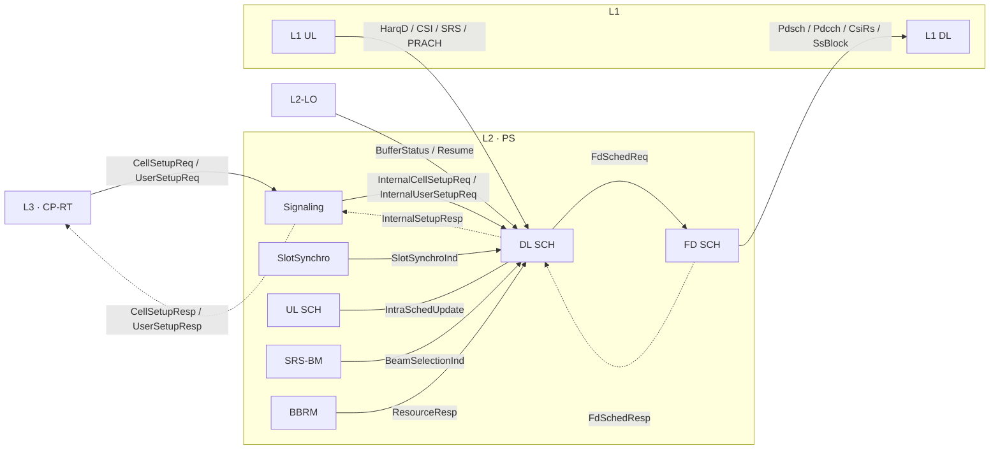

---

## 2. Top-Level Class Overview

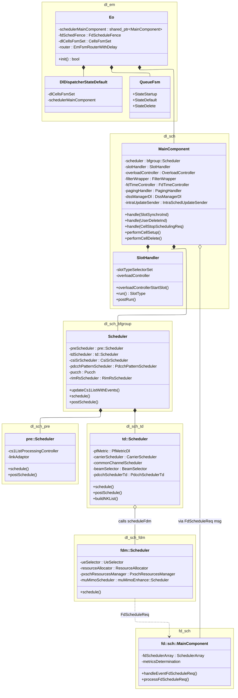

---

## 3. EO FSM And Event Dispatch

The DL Scheduler EO has a **two-tier event dispatch** structure:

1. **EO-level router** — `EmFsmRouterWithDelay<Direction::DOWNLINK, ...>` instance in `dl/em/Eo.hpp`. Handles **cell-group-level** events directly (no per-cell FSM gate): `CellGroupSetupReq`, `CellGroupReconfigReq`, `CellGroupDeleteReq`, `GetResourceUsageReq`, `SlotSynchroInd`, `StartSlotSynchroInd`, `StopSlotSynchroInd`, `TdMetricOrderResp`. All other messages fall through to the per-cell `QueueFsm`.
2. **Per-cell FSM** — Boost.SML state machine (`QueueFsm`) with three states: **Startup**, **Default**, **Delete**. One FSM per cell, managed by `CellsFsmSet<QueueFsm, MainComponent>`.

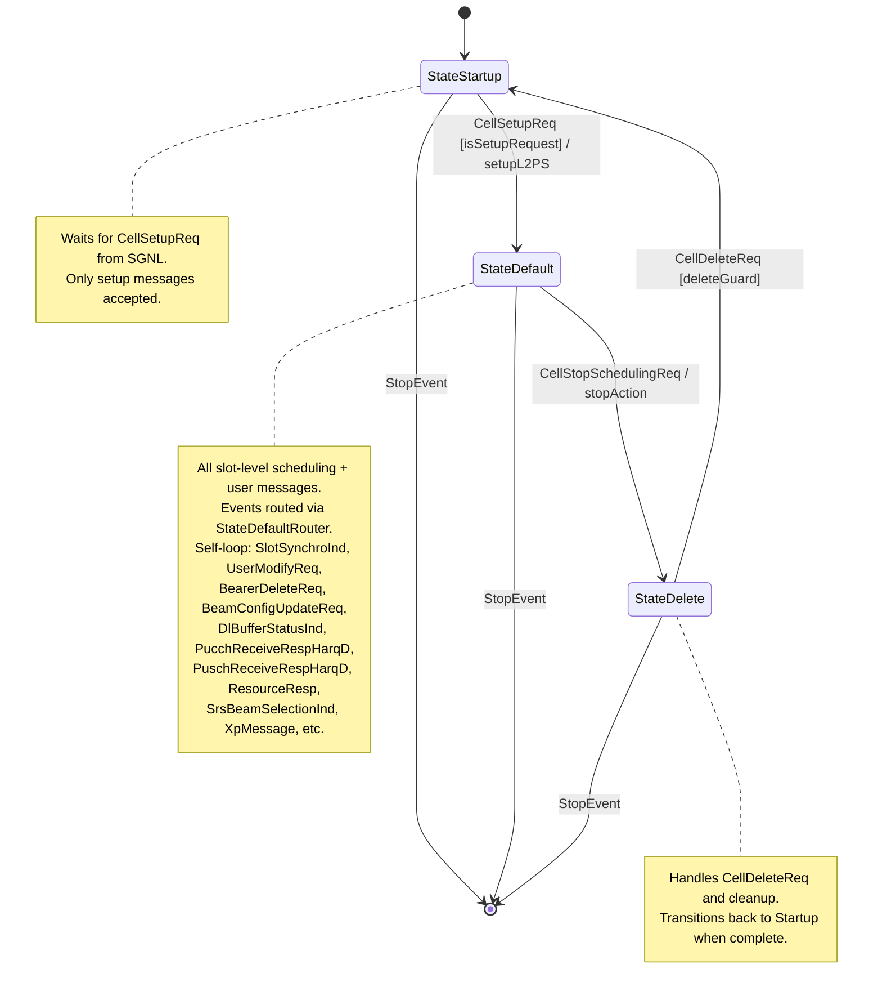

### 3.1 Dispatcher FSM (above the cell FSM)

The `DlDispatcherStateDefault` and `DlDispatcherWaitFdSchedRespState` form a two-state dispatcher that gates event processing while the DL EO is waiting for one or more `FdScheduleResp` from the FD EO. The dispatcher state lives in `l2ps::pscommon::dispatcherFsm::QueueDispatcherFsmImpl` and is the **outer** FSM (above the per-cell `QueueFsm` that owns Startup / Default / Delete).

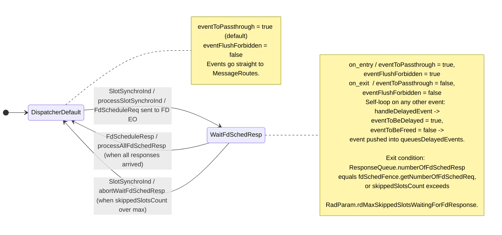

**Per-event flags carried by `EmFsmRouterWithDelay`** (in `pscommon/em/EmFsmRouterWithDelay.hpp`):

| Flag                  | Semantics                                                                                          |
| --------------------- | -------------------------------------------------------------------------------------------------- |
| `eventToBeDelayed`    | If `true` after FSM dispatch, the event is pushed into `queuesDelayedEvents` instead of consumed.   |
| `eventToBeFreed`      | If `true` after dispatch, `platform::EmIf::deleteEvent` releases the event memory.                  |
| `eventToPassthrough`  | If `true`, event goes through the FSM router immediately; if `false`, it is queued straight away.   |
| `eventFlushForbidden` | If `true`, `processDelayedEvents` is a no-op (used while waiting for `FdScheduleResp`).             |
| `isSplitEvent`        | If `true`, the event was only partially processed in the current slot; it is **re-pushed to the front** of its priority queue. |
| `isOverloaded`        | If `true`, lower-priority FIFOs are skipped (`fifoQueuesBlacklist` advances).                      |
| `isFifosFlushIndSent` | One-shot guard so `FifosFlushInd` is emitted at most once per slot boundary.                       |

### 3.2 Dispatcher Class Hierarchy

The FSM is built from a chain of generic templates (`EmFsmBase` → `EmFsm<FsmImpl>` → `EmFsmRouterWithMsgChecker<...>` → `EmFsmRouter<...>`), then bound to the DL-specific `QueueFsmImpl` and `MainComponent` via two type-aliases (`dl::em::QueueFsm`, `dl::em::DlDispatcherStateDefault`). The per-cell `QueueFsmImpl` itself aggregates the four state handlers (`Startup`, `Default`, `DefaultRouter`, `Delete`).

```mermaid
%%{init: {"layout": "elk"}}%%
classDiagram
direction TB

class StateStartupHandler
class StateDefaultHandler
class StateDefaultRouter
class StateDeleteHandler

class QueueFsmImpl {
    +StateStartupHandler startupHandler
    +StateDefaultHandler defaultHandler
    +StateDefaultRouter defaultRouter
    +StateDeleteHandler deleteHandler
}

QueueFsmImpl *-- StateStartupHandler
QueueFsmImpl *-- StateDefaultHandler
QueueFsmImpl *-- StateDefaultRouter
QueueFsmImpl *-- StateDeleteHandler

class EmFsmBase
class EmFsm["EmFsm~FsmImpl~"]
class EmFsmRouterWithMsgChecker["EmFsmRouterWithMsgChecker~FsmImpl, MsgChecker, EoType, Msgs...~"] {
    +Fsm~FsmImpl~ fsm
    +EventRouter router
}
class EmFsmRouter["pscommon::em::EmFsmRouter~FsmImpl, RoutedMessages~"]
class DispatcherStateDefault["DispatcherStateDefault~QueueFsm, MainComponent~"]
class QueueFsm["dl::em::QueueFsm"]
class DlDispatcherStateDefault
class DlMainComponent["dl::sch::MainComponent"]
class DlDispatcherWaitFdSchedRespState {
    -ResponseQueue responseQueue
    -uint32 skippedSlotsCount
    -uint32 maxSkippedSlotsCount
    -bool toBeFreed
    +handleEventFromFifoDuringWaitState(evt) bool
    +handleAllFdSchedResp()
    +handleAbortWaitFdSchedResp()
    +handleFdScheduleResp(evt) bool
    +canSkipOneMoreSlot() bool
}

EmFsm --|> EmFsmBase
EmFsmRouterWithMsgChecker --|> EmFsm
EmFsmRouter ..|> EmFsmRouterWithMsgChecker : bind\nQueueFsmImpl, TrivialTrueMessageChecker, CellStopSchedulingReq
QueueFsm ..|> EmFsmRouter : bind\nQueueFsmImpl, CellStopSchedulingReq
DlDispatcherStateDefault ..|> DispatcherStateDefault : bind\ndl::em::QueueFsm, dl::sch::MainComponent

DlDispatcherStateDefault --> DlMainComponent : routes to
DlDispatcherWaitFdSchedRespState --> DlMainComponent : routes FdScheduleResp / replays FIFO
```

### 3.3 FIFO Event Dispatch — Sequence

Every incoming EM event is steered through three phases inside `EmFsmRouterWithDelay`: (a) **passthrough** to the FSM if currently allowed, (b) **delay** into a per-priority `queuesDelayedEvents`, and (c) **bulk flush** via `processDelayedEvents` when the state machine exits the wait condition. The diagram below shows one event's full life cycle, including the delayed-event flush loop.

```mermaid
sequenceDiagram
    autonumber
    actor Sender as sender (CP-RT / L1 / peer EO)
    participant EH as DlEoHandler
    box "EmFsmRouterWithDelay"
    participant FR as fsmRouter
    participant FRDL as fsmRouterDl
    participant ROUT as EventRouter
    participant ROUTES as MessageRoutes
    participant FWD as EventForwarder
    queue QQ as queuesDelayedEvents
    end box
    participant FSM as Fsm~QueueDispatcherFsmImpl~
    participant PLAT as platform::EmIf

    Sender->>EH: receiveCallback(event)
    Note over EH: q_ctx → router
    EH->>FR: processEvent(event)
    Note over FR: eventToBeDelayed = false<br/>eventToBeFreed = true
    opt event == FifosFlushInd
        Note over FR: isFifosFlushIndSent = false
    end

    alt eventToPassthrough == true
        FR->>FRDL: processEvent()
        FRDL->>ROUT: route()
        ROUT->>ROUTES: route(msgId)
        alt routable msgId<br/>(CellGroup*Req, GetResourceUsageReq,<br/>SlotSynchroInd, Start/StopSlotSynchroInd,<br/>TdMetricOrderResp)
            ROUTES->>FWD: handle()
            FWD->>FSM: processEvent()
        else other msgIds
            ROUTES->>FWD: handleNotRoutableId()
            FWD->>FSM: processEvent()
        end
    else eventToPassthrough == false
        FR->>QQ: pushBack(priority)
    end

    EH->>FR: deleteEvent
    opt eventToBeFreed == true
        FR->>PLAT: deleteEvent()
    end

    EH->>FR: processDelayedEvents
    opt !eventFlushForbidden && !queuesDelayedEvents.isEmpty
        loop priority from HighestPriorityEvent to PriorityOfIncomingEvent
            loop each non-blacklisted priority
                opt isEnoughTimeInSlot && continue
                    FR->>QQ: pop(priority)
                    FR->>FRDL: processEvent()
                    FRDL->>ROUT: route()
                    ROUT->>ROUTES: route(msgId)
                    alt routable
                        ROUTES->>FWD: handle()
                        FWD->>FSM: processEvent()
                    else not routable
                        ROUTES->>FWD: handleNotRoutableId()
                        FWD->>FSM: processEvent()
                    end
                    opt eventToBeDelayed
                        FR->>QQ: pushFront(priority)
                    end
                    alt isSplitEvent
                        FR->>QQ: pushFront(priority)
                    else
                        FR->>PLAT: deleteEvent()
                    end
                end
            end
            opt !isOverloaded && priority > PriorityOfIncomingEvent && !isFifosFlushIndSent
                FR->>FR: FifosFlushInd
                Note over FR: isFifosFlushIndSent = true
            end
        end
    end
```

### 3.4 FIFO Dispatch Flowchart

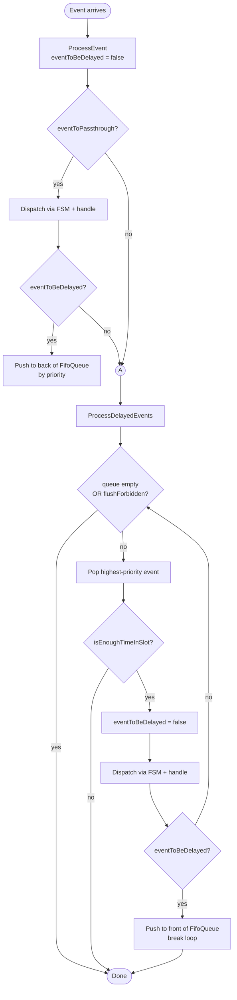

---

## 4. DL Scheduling Pipeline

The DL per-slot scheduling is a five-stage pipeline split across two EOs.

### 4.1 Slot Synchronization

Entry: `SlotSynchroIndHandler::handle` → `MainComponent::handle(SlotSynchroInd)` → `SlotHandler::run(onAirTime)` → validates against 5G timer → starts overload controller → measures slot delay → adjusts scheduling capacity → updates pre-CS UE list → swaps pooling DB snapshots → refreshes ZAB cells → sends HARQ status update.

The `dl::sch::SlotHandler` is the **per-cell orchestrator** that drives the rest of the pipeline. It calls into `bfgroup::Scheduler` in three distinct phases per slot:

| Phase                  | `bfgroup::Scheduler` method                                | Purpose                                                                                  |
| ---------------------- | ---------------------------------------------------------- | ---------------------------------------------------------------------------------------- |
| Reference signals      | `scheduleRs(xhfn, cellConfig, cellDyn)`                    | Reserves CSI-RS / TRS / SSB-tracking RS resources before the scheduling window           |
| CS1 refresh            | `updateCs1ListWithEvents(xsfn, cellDyn)`                   | Re-evaluates PRE candidate set against latest events (DRX / BWP / BSR)                   |
| Slot-type-mode dispatch| `scheduleBySlotTypeMode(...)` — branches into:             | One of three slot-mode paths (see §4.3a–c)                                               |
| &nbsp;&nbsp;• SSB slot | `scheduleSsBurst(sfn, slot)`                               | Schedule SS-burst on **SSB-only** slots (no PRE/TD/FDM)                                  |
| &nbsp;&nbsp;• DL slot  | `schedule(xhfnOnAir, hasTriggeredScheduling)`              | Run PRE → TD → FDM → FdScheduleReq (§4.2 – §4.4)                                         |
| &nbsp;&nbsp;• Other    | `scheduleAloneSrAndPerCsiReport(xsfn)`                     | Non-DL slot: still schedule alone-SR + periodic CSI report on PUCCH (via `CsiSrScheduler`) |

The DL→UL intra-update, `postSchedule`, and `postRun` happen **after** `FdScheduleResp` arrives (§4.6).

### 4.2 PRE Scheduling (CS1)

Entry: `pre::Scheduler::schedule` via `bfgroup::Scheduler::updateCs1ListWithEvents`.

Builds the Candidate Set 1 (CS1) — all UEs eligible for scheduling in this slot. Checks per-UE conditions: DRX active-time, BWP state, measurement gap, beam validity, flow control, buffer status.

Key classes:
- `Cs1ListCandidateConstraint` — per-UE eligibility checks
- `Cs1ListProcessingController` — orchestrates CS1 refresh
- `LinkAdaptor` — CQI expiry and initial link adaptation state

### 4.3 TD Scheduling (CS2 / PF Metric)

Entry: `td::Scheduler::schedule`.

From CS1, computes the Proportional Fair metric per UE and builds the sorted CS2 list per carrier. Also:
- Prepares paging resources (`PagingHandler`)
- Selects beams for SIB/CSI (`BeamSelectorForCsiOrSib`)
- Handles common channels (SSB, SIB, paging, MSG2)
- Allocates long-PUCCH HARQ resources (`PucchForHarqAllocator`)
- Builds N-K list for adaptive retransmission

Key classes:
- `PfMetricDl` — PF metric computation
- `CarrierScheduler` — per-carrier CS2 scheduling + FDM invocation
- `CommonChannelScheduler` — SIB, paging slot resource reservation
- `BeamSelector` — analog beam selection for scheduling
- `PdcchSchedulerTd` — PDCCH CCE reservation at TD level

### 4.4 FDM Scheduling

Entry: `td::CarrierScheduler::scheduleFdm` → `fdm::Scheduler::schedule`.

Selects UEs from CS2 to be scheduled, performs DL MU-MIMO pairing, distributes PRBs across sub-areas, and builds the `FdScheduleReq`.

Key classes:
- `UeSelector` — selects UEs from CS2 for this slot
- `ResourceAllocator` — RBG/PRB allocation
- `PxschResourcesManager` — PDSCH resource tracking
- `DlSubAreaManager` — sub-area PRB distribution
- `muMimoEnhance::Scheduler` — MU-MIMO Virtual UE pairing + DMRS ports
- `AllocationPolicy` — allocation type (Type 0 / Type 1) selection
- `DlFdmSchedulerHelper` — FDM helper utilities

### 4.5 FD Scheduling (FD EO)

Entry: `fd::sch::MainComponent::handleEventFdScheduleReq` → `processFdScheduleReq`.

Runs on the separate `L2PsFdYySch` EO. Performs per-UE MCS/TBS calculation, builds PDSCH/PDCCH L1 messages, handles SIB/paging/MSG2 scheduling, and returns `FdScheduleResp`.

Key classes:
- `fd::sch::MainComponent` — FD EO main component
- `dl::sch::fd::Scheduler` — per-subcell FD scheduler
- DCI builders: `DciFormat10`, `DciFormat11`
- L1 senders: `PdschSendReqSender`, `PdcchSendReqSender`

### 4.6 Post-Scheduling

Entry: `FdScheduleResp` from FD EO arrives at the **dispatcher** in `WaitFdSchedResp` state. Once `ResponseQueue::isNumberOfResponsesEqualToNumberOfRequests()` returns `true`, the dispatcher transitions to `DispatcherDefault` and calls into:

1. `MainComponent::handleAllFdSchedulerResp(fdScheduleRespArray)`
2. → `bfgroup::Scheduler::handle(fdScheduleRespArray)`
3. → `td::Scheduler::handle(fdScheduleRespArray)`
4. → `td::FdScheduleRespHandler::handleFdScheduleResp(fdScheduleRespArray)`
    - `PdcchSchedulerTd::schedulePdcch(fdScheduleRespArray)` — finalize PDCCH CCE bookkeeping from FD result
    - `postProcessFdScheduleResp(...)` — fold MCS / TBS / PRB-used back into TD bookkeeping
    - `CommonChannelScheduler::schedulePucch(fdScheduleRespArray)` — PUCCH resource accounting from scheduled UEs
5. → `SlotHandler::postRun(xsfn, cellDyn)` → `bfgroup::Scheduler::postSchedule` → `tdScheduler.postSchedule`

Other work in `postSchedule`: updates PF average rate (`PfMetricDl::updateAverageRate`), sends `DlToUlIntraSchedUpdate` via `IntraSchedUpdateSender`, schedules deferred CSI/SR, logs PCMD records, and runs `metricsFacadeDl.endOfNewSlot`.

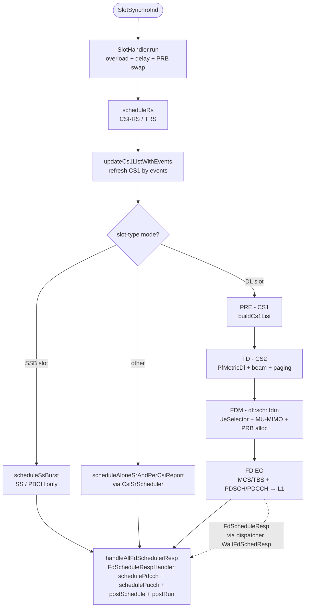

### 4.7 PRE Stage — Sequence

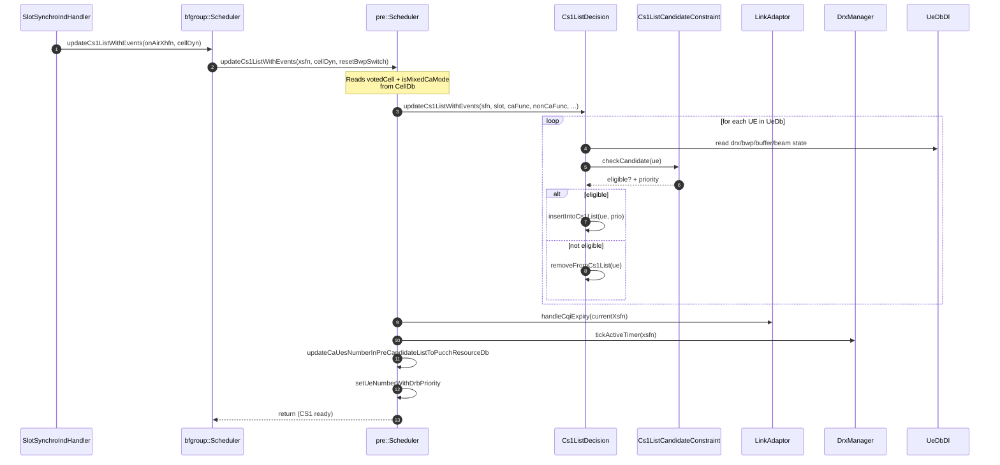

### 4.8 TD Stage — Sequence (per carrier / per slot)

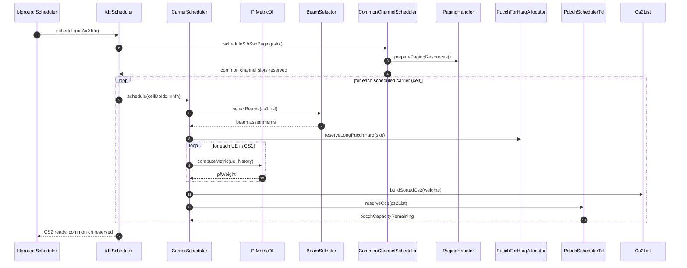

### 4.9 FDM Stage — Sequence (per carrier)

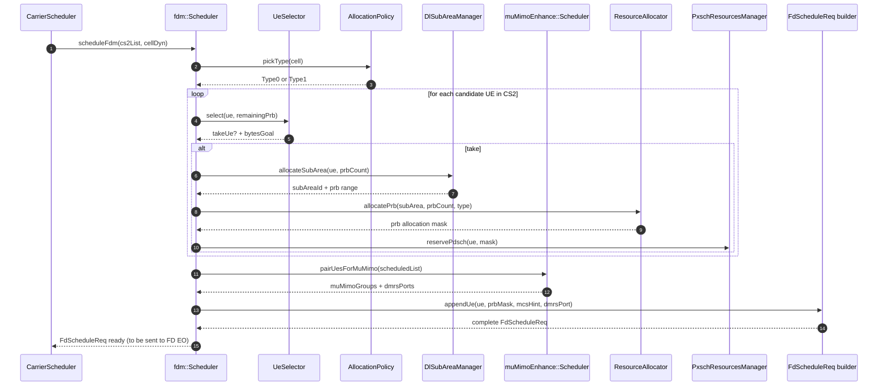

### 4.10 Post Stage — Sequence

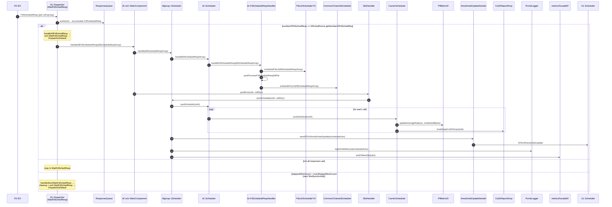

### 4.11 End-to-End Per-Slot Sequence

A single bird's-eye view spanning the **whole** DL slot — `SlotSynchroInd` arrival, all four scheduling stages, the FD EO round-trip, the FdScheduleResp handling and `postSchedule`. The dispatcher boundary (`DispatcherDefault` ↔ `WaitFdSchedResp`) is shown explicitly.

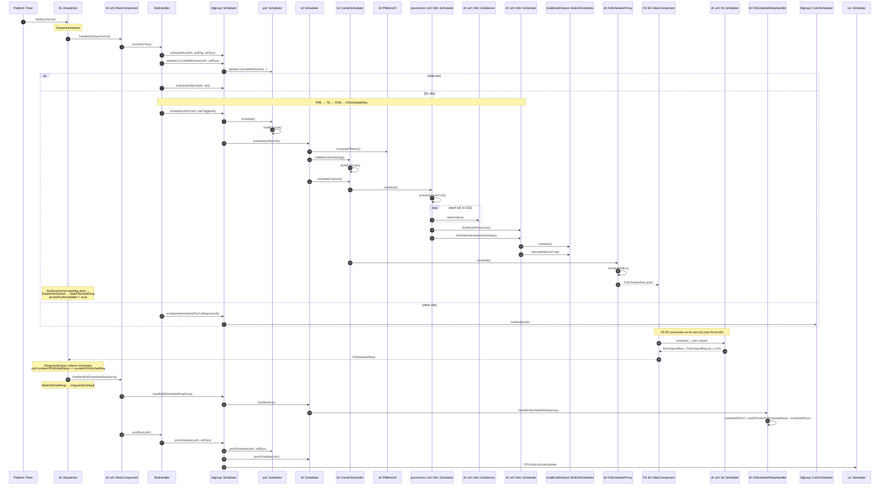

---

## 5. HARQ And Link Adaptation Subsystem

### 5.1 HARQ Feedback Processing

L1 sends `PucchReceiveRespHarqD` and `PuschReceiveRespHarqD` back to the DL Scheduler. These carry ACK/NACK/DTX per HARQ process. The DL scheduler:
1. Updates HARQ process state (free process for ACK, mark for retransmission on NACK)
2. Feeds BLER measurement to Link Adaptation
3. Updates token bucket levels

Key classes:
- `dl/sch/harq/` — HARQ state management, counters
- `dl/sch/dlHarqFeedback/` — DL HARQ feedback sender (to UL for long-PUCCH)
- `dl/sch/dlHarqStatusUpdate/` — HARQ status update request to L2-LO

### 5.2 Link Adaptation

DL Link Adaptation adjusts MCS based on channel quality (CQI from PUCCH/PUSCH CSI reports and HARQ BLER tracking).

Key classes (`dl/sch/la/`):
- `DlCqiMcsCalculator` — CQI → MCS mapping with outer-loop BLER adjustment
- `LaDlTimeControl` — time-domain LA control
- `CqiExpiry` — CQI staleness detection
- `DlHrBrLaStateManager` — high-rate/base-rate LA state management
- `DeltaCqiStepUpCalculator` — outer-loop step-up/down logic

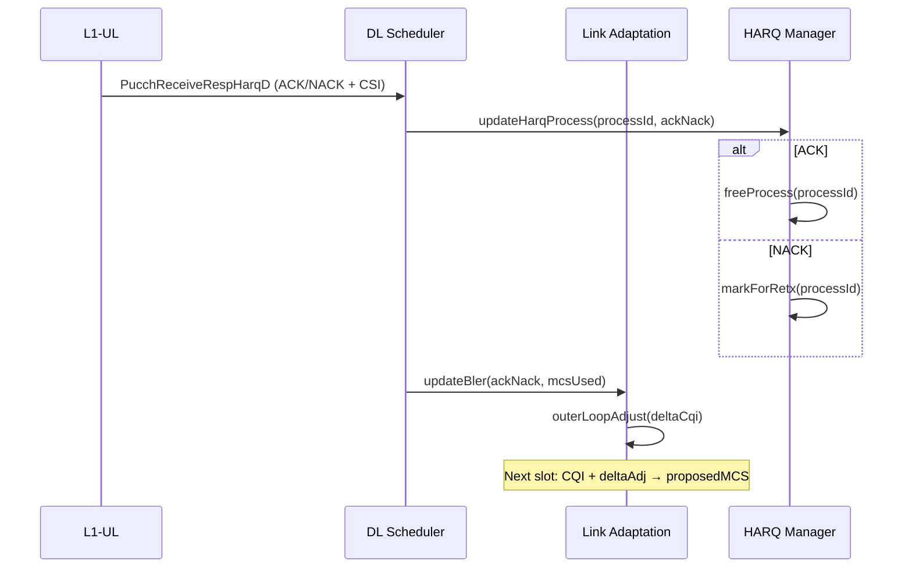

---

## 6. DB Model

The DL Scheduler operates on two main database layers: Cell DB and UE DB.

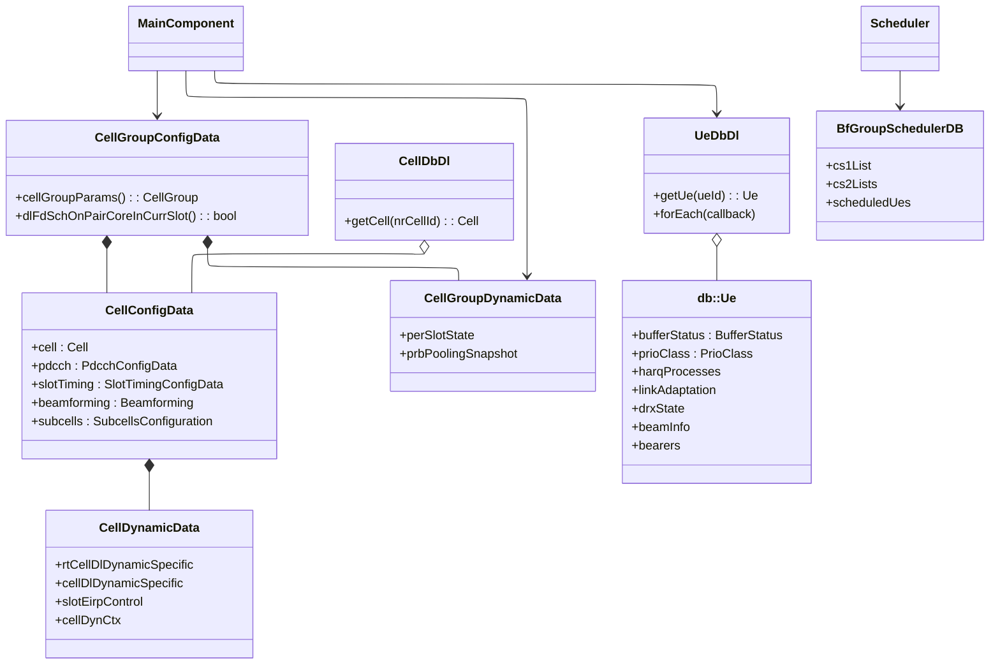

### Key DB characteristics:
- **CellConfigData**: Static cell configuration from CellSetupReq. Written once at setup, read every slot.
- **CellDynamicData**: Per-slot mutable state (EIRP, slot-specific context). Written by DL scheduler, read by FD EO.
- **UeData (db::Ue)**: Per-UE mutable state (buffer, LA, HARQ, DRX). Written by DL scheduler.
- **BfGroupSchedulerDB**: Transient per-slot CS1/CS2 lists. Written and read within one slot cycle.
- **CellGroupDynamicData**: Cross-cell-group state (PRB pooling snapshots). Swapped at slot start from BBRM writes.

---

## 7. Cell Bring-Up And Delete Flow

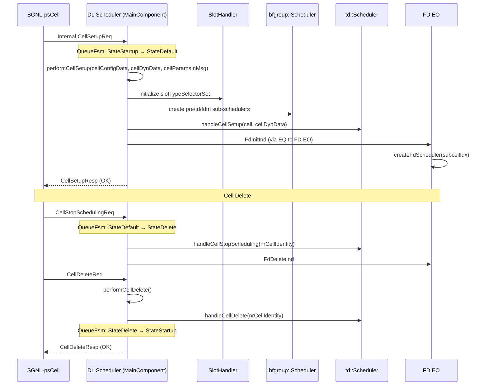

---

## 8. UE Configuration Flow

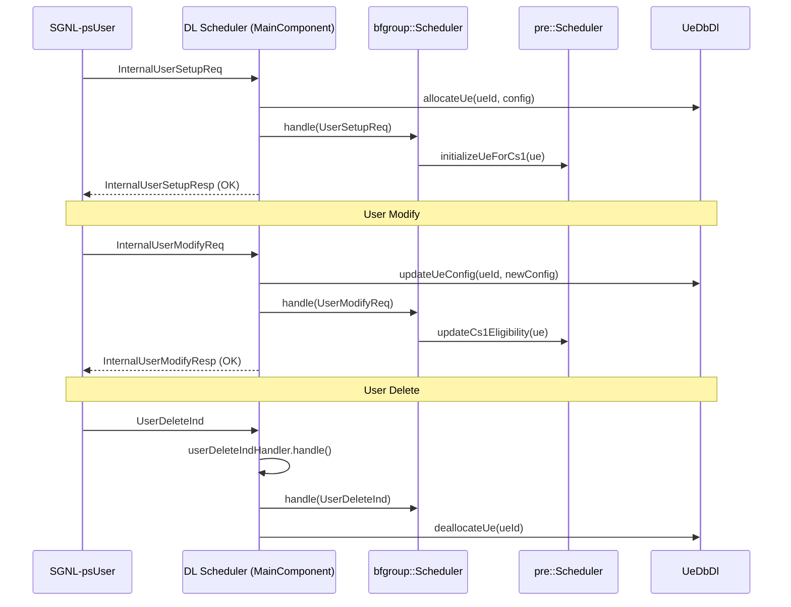

---

## 9. Slot-Level Processing Flow (Main Hot Path)

This is the most performance-critical path — executed every 0.5 ms (TDD FR1 30 kHz).

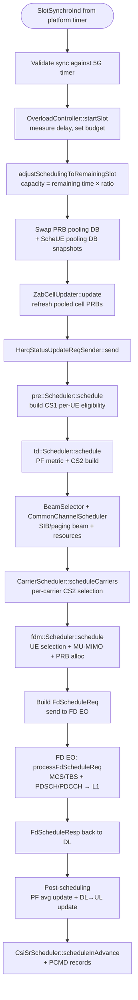

### Timing Budget (TDD FR1 30 kHz, single slot = 500 µs)

| Phase                       | Typical budget        |
| --------------------------- | --------------------- |
| Slot sync + PRB swap        | ~20 µs                |
| PRE (CS1)                   | ~30–60 µs             |
| TD (PF + CS2)               | ~40–80 µs             |
| FDM (UE select + PRB alloc) | ~50–100 µs            |
| FD EO (MCS/TBS + L1 msg)    | ~80–150 µs            |
| Post-scheduling             | ~20–40 µs             |
| **Total scheduling**        | **~250–450 µs**       |
| NRT message handling        | remaining (50–250 µs) |

Adaptive budgeting via `OverloadController` clamps FD-scheduled UEs when time is tight.

---

## 10. DL MU-MIMO And Beamforming Flow

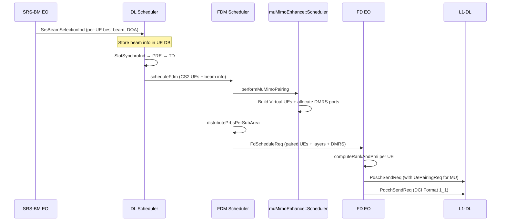

---

## 11. Output Messages

| Message                            | Destination    | Trigger                          | Builder/Sender                    |
| ---------------------------------- | -------------- | -------------------------------- | --------------------------------- |
| `PdschSendReq`                     | L1-DL          | Per UE scheduled in FD           | `fd/sch/` via L1 DlData interface |
| `PdcchSendReq`                     | L1-DL          | Per DCI (data + common channel)  | `fd/sch/` DCI builders            |
| `CsiRsSendReq`                     | L1-DL          | Periodic/semi-persistent CSI-RS  | `csiRsOpt/` scheduler             |
| `SsBlockSendReq`                   | L1-DL          | SSB burst                        | `ssblock/` scheduler              |
| `SlotTypeReq`                      | L1-DL          | Per slot per subcell             | `SlotTypeReqSender`               |
| `FdScheduleReq`                    | FD EO          | Per slot (carries scheduled UEs) | `FdSchMsgBufferizer` / EQ send    |
| `FdInitInd`                        | FD EO          | Per cell on cell setup           | `dl/sch/bfgroup/SchedulerFdHandle::createFdScheduler` |
| `FdDeleteInd`                      | FD EO          | Per cell on cell delete          | DL bfgroup cell-delete path       |
| `TdMetricOrderReq`                 | FD EO          | TD metric pre-compute hint       | `dl/sch/td/FdMetricOrder*`         |
| `DlToUlIntraSchedUpdate`           | UL Scheduler   | Per slot                         | `IntraSchedUpdateSender`          |
| `DlHarqFeedbackReq`                | UL Scheduler   | Per UE needing long-PUCCH        | `DlHarqFeedbackSender`            |
| `CellSetupResp`                    | SGNL           | On cell setup complete           | `MainComponent`                   |
| `UserSetupResp` / `UserModifyResp` | SGNL           | On UE procedure complete         | `MainComponent`                   |
| `PduMuxReq`                        | L2-LO (LoCtrl) | DL MAC PDU mux trigger           | via `LoCtrl` protocol             |
| `ResourceResp` (consume)           | BBRM           | PRB demand metrics               | `NumAllocCellPrbRepo`             |

---

## 12. Design Issues Observed

| #   | Issue                                                                                                                                                                          | Location                                               | Impact                                                                         |
| --- | ------------------------------------------------------------------------------------------------------------------------------------------------------------------------------ | ------------------------------------------------------ | ------------------------------------------------------------------------------ |
| 1   | **God class**: `MainComponent` has 50+ `handle()` methods and ~40 member objects                                                                                               | `dl/sch/MainComponent.hpp`                             | Hard to test in isolation; any change risks regressions                        |
| 2   | **Deep ownership chain**: `MainComponent` → `bfgroup::Scheduler` → `td::Scheduler` → `CarrierScheduler` → `fdm::Scheduler` — 4 levels of composition                           | Throughout `dl/sch/`                                   | Difficult to reason about data flow; mocking at intermediate levels is complex |
| 3   | **Mixed concerns in bfgroup::Scheduler**: Handles CS1 updates, TD delegation, CSI/SR scheduling, beam management, CA state machines, PCMD — all in one class                   | `dl/sch/bfgroup/Scheduler.hpp`                         | Single change in CSI scheduling requires understanding of entire bfgroup       |
| 4   | **Shared mutable state**: `CellDynamicData` is written by both DL Scheduler and partially read by FD EO with no explicit ownership boundary                                    | `dl/db/cell/CellDynamicData.hpp`                       | Potential for race conditions if FD EO deployment changes                      |
| 5   | **FilterWrapper complexity**: Message filtering logic interleaves time-critical rx-resp with regular messages in a single wrapper                                              | `dl/sch/FilterWrapper`                                 | Hard to verify priority guarantees                                             |
| 6   | **Timer proliferation**: Multiple independent timer wheels + timers scattered across sub-schedulers (PA timer, BWP switch timer, DRX, beam update, SCell inactivity, etc.)     | Multiple files in `dl/sch/`                            | Timer interactions not centrally visible                                       |
| 7   | **Overload controller coupling**: `FdTimeController` + `OverloadController` + `SlotProcessingRatioAdapter` form a distributed time-budget mechanism with no single entry point | `dl/synchro/overload/` + `dl/sch/FdTimeController.hpp` | Difficult to tune or verify budget guarantees                                  |

---

## 13. Refactoring Direction (Modular Decomposition)

### Proposed Module Structure (7 modules)

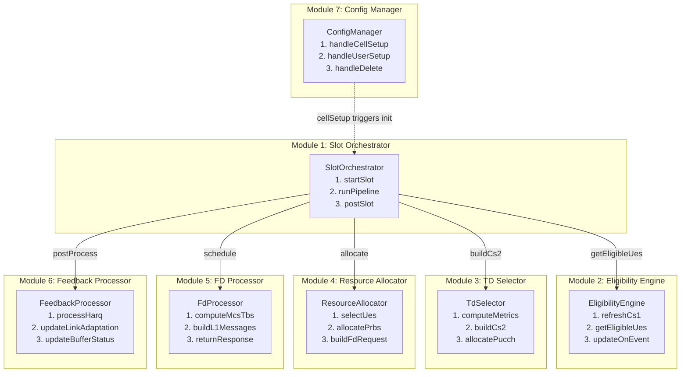

### Module Responsibilities

| Module                    | Public Interface (≤ 4 methods)                                                   | DB Access                                            | Writes To          |
| ------------------------- | -------------------------------------------------------------------------------- | ---------------------------------------------------- | ------------------ |
| **1. Slot Orchestrator**  | `startSlot()`, `runPipeline()`, `postSlot()`, `handleFdResponse()`               | TimeBudgetStore (R), SlotStateStore (RW)             | SlotStateStore     |
| **2. Eligibility Engine** | `refreshCs1()`, `getEligibleUes()`, `updateOnEvent()`                            | UeEligibilityStore (RW), CellConfigStore (R)         | UeEligibilityStore |
| **3. TD Selector**        | `computeMetrics()`, `buildCs2()`, `allocatePucch()`                              | UeMetricStore (RW), CellConfigStore (R)              | UeMetricStore      |
| **4. Resource Allocator** | `selectUes()`, `allocatePrbs()`, `buildFdRequest()`                              | PrbAllocationStore (RW), UeMetricStore (R)           | PrbAllocationStore |
| **5. FD Processor**       | `computeMcsTbs()`, `buildL1Messages()`, `returnResponse()`                       | L1MessageStore (RW), CellConfigStore (R)             | L1MessageStore     |
| **6. Feedback Processor** | `processHarq()`, `updateLinkAdaptation()`, `updateBufferStatus()`                | HarqStore (RW), LaStore (RW), UeEligibilityStore (R) | HarqStore, LaStore |
| **7. Config Manager**     | `handleCellSetup()`, `handleUserSetup()`, `handleUserModify()`, `handleDelete()` | CellConfigStore (RW), UeEligibilityStore (RW)        | CellConfigStore    |

### DB Store Isolation

| DB Store           | Single Writer Module              | Readers                                         |
| ------------------ | --------------------------------- | ----------------------------------------------- |
| SlotStateStore     | Slot Orchestrator                 | All (read-only view)                            |
| UeEligibilityStore | Eligibility Engine                | TD Selector, Resource Allocator, Config Manager |
| UeMetricStore      | TD Selector                       | Resource Allocator                              |
| PrbAllocationStore | Resource Allocator                | FD Processor                                    |
| L1MessageStore     | FD Processor                      | (output to L1, no internal readers)             |
| HarqStore          | Feedback Processor                | Eligibility Engine, TD Selector                 |
| LaStore            | Feedback Processor                | TD Selector, Resource Allocator                 |
| CellConfigStore    | Config Manager                    | All (read-only view)                            |
| TimeBudgetStore    | Slot Orchestrator (overload ctrl) | All (read-only view)                            |

### Design Principles Applied

1. **Zero direct coupling**: Only the Slot Orchestrator calls other modules. Modules never call each other.
2. **DB isolation**: Each mutable store has exactly one writer.
3. **Interface minimalism**: Each module exposes 2–4 public methods.
4. **UT independence**: Each module can be tested by mocking its DB read views + the Orchestrator interface (for modules called by Orchestrator).
5. **Hot-path guarantee**: All stores use pre-allocated fixed-size arrays. Zero heap allocation after cell setup.
6. **No CRTP sharing**: Modules are independent concrete classes with no template coupling.

### Self-Check Table

| Question                                                | Answer                                                                                              |
| ------------------------------------------------------- | --------------------------------------------------------------------------------------------------- |
| Are modules directly coupled?                           | **No** — only Orchestrator calls other modules via interfaces                                       |
| Is mutable state shared?                                | **No** — each store has exactly 1 writer; others get read-only views                                |
| How many modules change for a typical feature addition? | **1–2** (e.g., new MU-MIMO feature → Resource Allocator + possibly FD Processor)                    |
| Can modules be developed in parallel?                   | **Yes** — interfaces are stable; mock DB views for testing                                          |
| Is timing behavior independently testable?              | **Yes** — TimeBudgetStore is isolated; Orchestrator's time decisions are mockable                   |
| Does the FD EO boundary remain clean?                   | **Yes** — FD Processor maps 1:1 to existing FD EO; communication is via FdScheduleReq/Resp messages |
| Can HARQ feedback be tested without slot scheduling?    | **Yes** — Feedback Processor is independent; mock HarqStore + LaStore                               |

### Boundary clarifications (consistent with FD EO refactoring)

| # | Item | Clarification |
|---|------|---------------|
| 1 | Module 5 "FD Processor" | **Not** a DL-internal scheduling module. It is the **boundary stub** to the external FD EO (see `l2ps_fd_mermaid.md`). It owns `FdScheduleReq` construction + `FdScheduleResp` parsing; the actual MCS/TBS/PDSCH-PDCCH building lives in FD EO's 6 modules. |
| 2 | `L1MessageStore` in this doc | Refers to the **FD-EO-owned** L1MessageStore (FD EO module 5 is its single writer). DL SCH sees its symbolic effect via `FdScheduleResp` only. |
| 3 | BBRM `ResourceResp` consumer | Consumed by Module 1 (Slot Orchestrator) and forwarded to Module 4 (Resource Allocator) which writes `PrbAllocationStore` based on the budget. |
| 4 | SRS-BM `SrsBeamSelectionInd` / `DlSrsComaPowerInd` consumer | Consumed by Module 2 (Eligibility Engine) and Module 4 (Resource Allocator) respectively. |

---

## 14. Cross-EO Refactoring Consistency

This section validates that the DL SCH refactoring above is mutually consistent with the parallel proposals in `l2ps_srsbm_mermaid.md`, `l2ps_ulsch_mermaid.md`, `l2ps_fd_mermaid.md`, and `l2ps_bbrm_mermaid.md`. **You are here: DL SCH** (Module IDs in the table below refer to that EO's own refactoring numbering).

### 14.1 Common refactoring shape

| Property                              | SRS-BM      | DL SCH (here) | UL SCH      | FD EO       | BBRM        |
| ------------------------------------- | ----------- | ------------- | ----------- | ----------- | ----------- |
| Module count                          | 7           | **7**         | 7           | 6           | 7           |
| Has Event Dispatcher module?          | No (FSM)    | **No (FSM)**  | No (FSM)    | Yes         | Yes         |
| Has Orchestrator / Pipeline module?   | Yes (M7)    | **Yes (M1)**  | Yes (M1)    | Yes (M2)    | No (M6 sync) |
| Single-writer DB store invariant      | ✓           | **✓**         | ✓           | ✓           | ✓           |
| ≤ 4 public methods per module         | ✓           | **✓**         | ✓           | ✓           | ✓           |
| Self-Check Table                      | ✓           | **✓**         | ✓           | ✓           | ✓           |
| Hot-path fixed-size storage           | ✓           | **✓**         | ✓           | ✓           | ✓           |

All five EOs follow the same skeleton: 6–7 independent modules, one writer per store, ≤ 4 public methods per module, with mandatory self-check and migration notes.

### 14.2 Inter-EO message-to-module mapping (DL SCH endpoint highlighted)

| Message                                    | Producer EO (Module)                          | Consumer EO (Module)                          |
| ------------------------------------------ | --------------------------------------------- | --------------------------------------------- |
| `FdInitInd` / `FdDeleteInd`                | **DL SCH (M7 Config Manager)**                | FD EO (M1 Event Dispatcher)                   |
| `FdScheduleReq`                            | **DL SCH (M4 Resource Allocator → M5 stub)**  | FD EO (M1 Event Dispatcher → M2 Slot Pipeline)|
| `FdScheduleResp`                           | FD EO (M5 L1 Builder)                         | **DL SCH (M1 Slot Orchestrator)**             |
| `TdMetricOrderReq`                         | **DL SCH (M3 TD Selector)**                   | FD EO (M1 Event Dispatcher)                   |
| `ResourceReq`                              | **DL SCH (M1 Slot Orchestrator → M4)**, UL SCH (M1) | BBRM (M1 Dispatcher → M6 Period Sync → M7 Response Builder) |
| `ResourceResp` / `RimResourceResp`         | BBRM (M7 Response Builder)                    | **DL SCH (M1 Slot Orchestrator)**, UL SCH (M1) |
| `DlMetricInd`                              | **DL SCH (M1 Slot Orchestrator)**             | BBRM (M3 PRB / M4 UE / M5 SubCell Pooling Engines) |
| `UlMetricInd`                              | UL SCH (M1)                                   | BBRM (M3 / M4 / M5)                           |
| `PdschSendReq` / `PdcchSendReq`            | FD EO (M5 L1 Builder)                         | L1-DL                                         |
| `PucchReceiveRespHarqD` / `PuschReceiveRespHarqD` | L1-UL                                  | **DL SCH (M6 Feedback Processor)**            |
| `UlToDlIntraSchedUpdate` / `DlHarqFeedbackReq` | UL SCH (M5 L1 Response Processor)         | **DL SCH (M6 Feedback Processor)**            |
| `DlToUlIntraSchedUpdate`                   | **DL SCH (M6 Feedback Processor)**            | UL SCH (M5 L1 Response Processor)             |
| `SrsBeamSelectionInd` / `DlSrsComaPowerInd`| SRS-BM (M6 Output Gateway)                    | **DL SCH (M2 Eligibility Engine / M4 Resource Allocator)** |
| `UlSrsBeamSelectionInd`                    | SRS-BM (M6 Output Gateway)                    | UL SCH (M2 Pre-Scheduler)                     |
| `CellSetupReq` / `UserSetupReq` / `*DeleteReq` | SGNL EO                                   | **DL SCH (M7 Config Manager)**, UL SCH (M6), FD EO (M1→M2 init), BBRM (M2 Lifecycle), SRS-BM (M1 Lifecycle) |
| `SlotSynchroInd`                           | Platform Timer                                | **DL SCH (M1 Slot Orchestrator)**, UL SCH (M1), FD EO (none — gated by DL SCH), BBRM (M6 Period Sync), SRS-BM (M7 Slot Scheduler) |

### 14.3 DB store namespace check (no collisions across EOs)

Each EO owns its DB stores; identical-sounding names in different docs refer to different stores.

| Logical concept   | SRS-BM                       | DL SCH (here)                          | UL SCH                  | FD EO                                      | BBRM                                |
| ----------------- | ---------------------------- | -------------------------------------- | ----------------------- | ------------------------------------------ | ----------------------------------- |
| Cell config       | `CellConfigStore` (SRS local)| **`CellConfigStore` (DL local)**       | (Cell DB)               | (read via pointer hand-off from DL SCH)    | `CellConfigStore` (BBRM pool config)|
| UE state          | `UeRegistry`                 | **`UeEligibilityStore` + `UeMetricStore`** | (UE DB)             | `EoDb` (per-slot scratch)                  | `UePoolStore` (pool side)           |
| PRB allocation    | (n/a)                        | **`PrbAllocationStore` (per-slot grant)** | (FD internal)        | (per-slot)                                 | `PrbPoolStore` (long-period budget) |
| L1 messages       | (n/a)                        | **(symbolic — owned by FD EO)**        | (built by FD Scheduler) | `L1MessageStore` (writer)                  | (n/a)                                |
| Throughput pool   | (n/a)                        | (n/a)                                  | (n/a)                   | `TputPoolStore` (instantaneous)            | (PRB pool budget overlap)            |
| Runtime policy / sync | `RuntimePolicy`          | **`TimeBudgetStore`**                  | (Slot Dynamic DB)       | (slot-scoped)                              | `SyncStore`                          |

### 14.4 Observed cross-EO issues and resolutions

| # | Issue                                                                           | Resolution                                                                                                                            |
| - | ------------------------------------------------------------------------------- | ------------------------------------------------------------------------------------------------------------------------------------- |
| 1 | DL "FD Processor" sounds like an internal module                                | Explicitly clarified as a **boundary stub**: see §13 "Boundary clarifications" item 1. FD scheduling lives in FD EO's 6 modules.       |
| 2 | Two `L1MessageStore` declarations (DL SCH §13 and FD EO §13)                    | They refer to the **same physical store**, owned by FD EO M5. DL SCH sees only `FdScheduleResp` (a typed message), not the raw store. |
| 3 | `ResourceResp` consumer is not explicit in DL/UL SCH refactoring                 | Consumed by Module 1 (Slot Orchestrator) → forwarded to PRB Allocator. Documented in §13 "Boundary clarifications" item 3.             |
| 4 | BBRM has explicit `Event Dispatcher` (M1) but DL/UL SCH do not                   | Intentional — DL/UL keep their lifecycle FSM (Startup/Default/Delete) as the dispatcher gate; BBRM's trivial FSM was collapsed into M1 Dispatcher. Both are valid module choices, both isolate dispatch from business logic. |
| 5 | SRS-BM `RuntimePolicy` has no DL SCH equivalent                                  | DL SCH equivalent is `CellConfigStore` (set once at cell setup) + `TimeBudgetStore` (slot-scoped). Functionally equivalent.            |
| 6 | BBRM Period Synchronizer fires "milestone slots" that overlap DL/UL slot ticks   | Resolved: BBRM `SyncStore` is BBRM-local (pooling milestone bookkeeping). DL/UL slot state lives in DL/UL local stores. Cross-EO via `MetricInd`/`ResourceResp` only — no shared mutable state. |

**Conclusion**: The five refactoring proposals are **mutually consistent**. Cross-EO interaction is exclusively via typed messages, with each message having clearly identified producer/consumer modules. No DB store is shared across EOs.

---

## 15. Reading Map

| File / Directory                                  | Purpose                                                    |
| ------------------------------------------------- | ---------------------------------------------------------- |
| `dl/em/Eo.hpp`                                    | EO shell — queue creation, EM init, owns MainComponent     |
| `dl/em/QueueFsm.hpp`                              | Boost.SML FSM (Startup/Default/Delete transitions)         |
| `dl/em/StateDefaultHandler.hpp`                   | Default state handler (delegates to MainComponent)         |
| `dl/em/StateDefaultRouter.hpp`                    | Event routing in Default state                             |
| `dl/em/DlDispatcherStateDefault.hpp`              | Dispatcher state: normal processing                        |
| `dl/em/DlDispatcherWaitFdSchedRespState.hpp`      | Dispatcher state: waiting for FD response                  |
| `dl/sch/MainComponent.hpp`                        | Central coordinator: owns all sub-schedulers and handlers  |
| `dl/sch/SlotHandler.hpp`                          | Per-cell slot processing entry point                       |
| `dl/sch/SlotSynchroIndHandler.cpp`                | SlotSynchroInd handling entry                              |
| `dl/sch/bfgroup/Scheduler.hpp`                    | Beam-forming group scheduler: CS1 → TD → FDM orchestration |
| `dl/sch/pre/Cs1ListProcessingController.hpp`      | CS1 eligibility logic                                      |
| `dl/sch/pre/LinkAdaptor.hpp`                      | PRE-level link adaptation helper                           |
| `dl/sch/td/Scheduler.hpp`                         | TD scheduler: PF metric, CS2 build, carrier scheduling     |
| `dl/sch/td/CarrierScheduler.hpp`                  | Per-carrier scheduling + FDM invocation                    |
| `dl/sch/td/PfMetricDl.hpp`                        | Proportional Fair metric computation                       |
| `dl/sch/td/PdcchSchedulerTd.hpp`                  | PDCCH resource allocation at TD level                      |
| `dl/sch/fdm/Scheduler.hpp`                        | FDM scheduler: UE selection, PRB allocation                |
| `dl/sch/fdm/ResourceAllocator.hpp`                | RBG/PRB allocation logic                                   |
| `dl/sch/fdm/selection/UeSelector.hpp`             | UE selection from CS2                                      |
| `dl/sch/muMimoEnhance/Scheduler.hpp`              | DL MU-MIMO enhanced pairing                                |
| `dl/sch/fd/Scheduler.hpp`                         | Per-subcell FD scheduler (MCS/TBS)                         |
| `fd/sch/MainComponent.hpp`                        | FD EO main component                                       |
| `dl/sch/harq/`                                    | HARQ process management                                    |
| `dl/sch/la/DlCqiMcsCalculator.hpp`                | CQI→MCS mapping + outer-loop BLER                          |
| `dl/sch/paging/PagingHandler.hpp`                 | Paging scheduling                                          |
| `dl/sch/csi/CsiRsScheduler.hpp`                   | CSI-RS scheduling                                          |
| `dl/sch/pucch/Pucch.hpp`                          | PUCCH resource management                                  |
| `dl/sch/dss/DssManagerDl.hpp`                     | Dynamic Spectrum Sharing manager                           |
| `dl/sch/intraSchedCom/IntraSchedUpdateSender.hpp` | DL→UL slot update sender                                   |
| `dl/sch/intracore/FdSchMsgBufferizer.cpp`         | Same-core DL↔FD communication                              |
| `dl/synchro/overload/OverloadController.hpp`      | Adaptive slot time budget                                  |
| `dl/drx/DrxManager.hpp`                           | DRX state management                                       |
| `dl/db/cell/CellDbDl.hpp`                         | DL cell database                                           |
| `dl/db/cell/CellDynamicData.hpp`                  | Per-cell mutable slot state                                |
| `dl/db/ue/UeDbDl.hpp`                             | DL UE database                                             |
| `dl/db/ue/BufferStatus.hpp`                       | UE DL buffer tracking                                      |
