# L2-PS FD Scheduler EO (`L2PsFdYySch`) Architecture And Mermaid Diagrams

**Scope.** This document describes the **DL-only** FD Scheduler Execution Object (`L2RtPool<P>_L2PsFdYySch`, queue name pattern `L2PsFdsDDYy`). It is the back-half of the DL scheduling pipeline that the **DL Scheduler EO** (`L2PsDlYySch`) hands work off to. The FD EO performs per-UE MCS/TBS computation, PDSCH/PDCCH L1 message building, SIB / Paging / MSG2 scheduling, throughput pooling shaving, and L1 message emission for one subcell at a time.

**Applicability.** FR1 only (TDD and FDD). FR2 paths are excluded. The FD EO runs **only when DL scheduling is active** — there is **no UL traffic** here. The UL Scheduler's FD stage (`ul/sch/fd/Scheduler`) runs inline inside the UL EO and is **not** part of this EO.

**Deployment.** Count `F` of FD EOs per pool = output of `FdDlCoresProvider::getListOfCoreFdDl()`. Site-mode: `F = S` (one FD per cell-group scheduler). TDD FR1 with `rdEnableDlFdSchOnULCores = 1`: `F = 2·S` (FD EOs share UL cores). When `dlFdParallelSchedulerEnabled = false`, DL SCH and FD EO share a core and communicate via `FdSchMsgBufferingService::send(FdScheduleReq)` instead of EM event-queue dispatch.

> **Mermaid rendering notes.**
> - `flowchart LR` for Runtime Position uses `curve: "basis"` for smooth routing.
> - `flowchart TB` for pipelines uses `curve: "linear"`.
> - `classDiagram` uses `%%{init: {"layout": "elk"}}%%` for complex layouts.
> - `sequenceDiagram` has no special init.

---

## 1. Runtime Position

The FD EO is **slave to the DL Scheduler EO**: it receives initialisation and per-slot work via `FdInitInd` / `FdScheduleReq` / `FdDeleteInd` / `TdMetricOrderReq`, processes them, and replies with `FdScheduleResp`. It directly sends PDSCH / PDCCH L1 messages to L1-DL (the only EO outside DL SCH that talks directly to L1 for DL data).

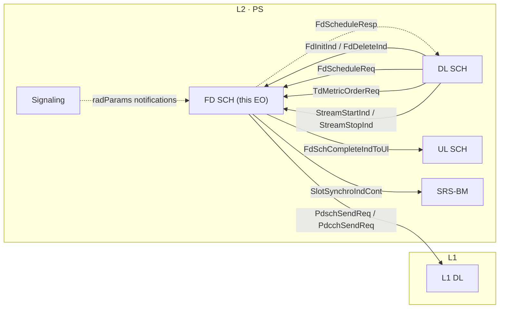

**Key facts:**
- One FD EO covers **one or more subcells** (`MAX_NUM_DL_SUBCELLS_PER_L2_PS_CORE`) — it owns a `SchedulerArray` of per-subcell `dl::sch::fd::Scheduler` instances created by `createFdScheduler(...)` on each `FdInitInd`.
- The DL SCH EO **waits for** `FdScheduleResp` before re-entering its Default dispatcher state (see DL SCH doc, `DlDispatcherWaitFdSchedRespState`).
- All PDSCH / PDCCH L1 messages for DL come from here — DL SCH never sends them directly.

---

## 2. Top-Level Class Overview

```mermaid
%%{init: {"layout": "elk"}}%%
classDiagram
direction TB

namespace fd_em {
    class Eo {
        -queue : EmQueue
        -queueDbItem : EmQueueDbItem
        -eventHandler : EventHandler
        +init() bool
        +start() EmStatus
        +stop() EmStatus
    }
    class EventHandler {
        -mainComponent : unique_ptr~fd::sch::MainComponent~
        -intelPtSupport : IntelPtSupport
        -schedulerIndex : SchedulerIndex
        +processEvent(EmFsmEvent)
        +stop()
        -processFdInitInd(FdInitInd)
        -processFdDeleteInd(FdDeleteInd)
        -processFdScheduleReq(FdScheduleReq)
        -processStreamStartInd(StreamStartInd)
        -processStreamStopInd(StreamStopInd)
        -lockDlDatabases()
        -unlockDlDatabases()
    }
}

namespace fd_sch {
    class FdMainComponent["fd::sch::MainComponent"] {
        -schedulers : SchedulerArray
        -cellPrbInfos : CellPrbInfoArray
        -beamSelection : BeamSelectionResultSender
        -fdScheludeResp : unique_ptr~Event~FdScheduleResp~~
        -fdSchCompleteIndToUl : Event~FdSchCompleteIndToUl~
        -metricsDetermination : MetricsDetermination
        -periodicLog : PeriodicLog
        -slotSynchroIndContSender : SlotSynchroIndContSender
        -eoDb : eoDb::EoDb
        +createFdScheduler(FdInitInd, CellConfigData)
        +handleFdDeleteInd(FdDeleteInd)
        +handleEventFdScheduleReq(FdScheduleReq)
        +handleTdMetricOrderReq(TdMetricOrderReq)
        +stop()
    }
    class FdSubScheduler["dl::sch::fd::Scheduler"] {
        -cellDynamicData
        -rtCellDynamicData
        -cell
        -pagingScheduler : PagingScheduler
        -sibScheduler : SibScheduler
        -uesScheduler : UesScheduler
        -xpdsch : Xpdsch
        -xpdcch : Xpdcch
        -prbResourceAllocation : PrbResourceAllocation
        -throughputHandler : throughputPooling::ThroughputHandler
        -tbParameterHandler : TbParameterHandler
        -fdScheduleRespFiller : FdScheduleRespFiller
        -fdMsgSchedulerCommon : FdMsgSchedulerCommon
        -alCounter : AlCounter
        -mcsDowngradeForDataRate : McsDowngradeForMaxDataRate
        -pdschAvailableCalculator : PdschAvailableCalculator
        +schedule(...)
        +fillPdcch(...)
        +postProcessPdcch(...)
        +activateOutputBuffer(xsfn)
    }
    class UesScheduler {
        -newTxScheduler : NewTxScheduler
        -reTxScheduler : ReTxScheduler
        -msg2Scheduler : Msg2Scheduler
        -pdschSymbolAllocator : PdschSymbolAllocator
        -tbSizeCalculation : TbSizeCalculation
        +scheduleUes(...) uint8_t
    }
    class EoDb {
        -scheduledUesInEo : UeInFdEo
        -indexer : UeIndexer
        -subCellsInThisEo : SubcellArray
        -numFdUes / numScheduled
        +addUe(ue) Result~EoUe~
        +getUe(rnti) Result~EoUe~
        +saveSubCellIdsInEo(req)
        +resetFd()
    }
}

Eo *-- EventHandler
EventHandler *-- FdMainComponent
FdMainComponent *-- FdSubScheduler : per-subcell
FdMainComponent *-- EoDb
FdSubScheduler *-- UesScheduler
FdSubScheduler ..> EoDb : shared eoDb
```

**Notes:**
- `EventHandler` extends `EmFsmBase` — but the FD EO does **not** use a multi-state FSM. There is only one functional state (Running) since the per-cell lifecycle is driven by `FdInitInd` / `FdDeleteInd` messages, not by state transitions.
- `MainComponent` owns one `dl::sch::fd::Scheduler` instance per subcell (in `schedulers : SchedulerArray`), created lazily when its subcell's `FdInitInd` arrives.
- `EoDb` is the **per-EO scratch DB** holding the per-slot scheduled UE list for the current `FdScheduleReq` — used by `UesScheduler` to track which UEs are already counted.

---

## 3. EO FSM And Event Dispatch

Unlike DL SCH / UL SCH, the FD EO has **no state machine** — it processes events via a single `switch` on `event.getEventId()` in `EventHandler::processEvent()`. Lifecycle is implicit: each subcell becomes "active" when its `FdInitInd` is processed and "inactive" when its `FdDeleteInd` arrives.

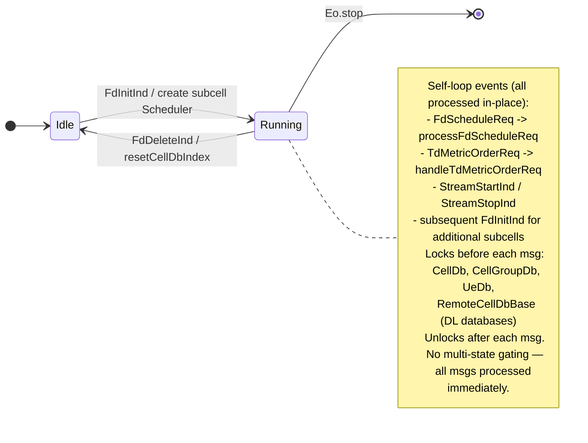

### Event ID dispatch table (`EventHandler::processEvent`)

| Event ID                  | Handler                                  | Lock DBs? | Special               |
| ------------------------- | ---------------------------------------- | --------- | --------------------- |
| `TdMetricOrderReq`        | `handleTdMetricOrderReq(msg)`            | No (early return) | Pre-slot metric hint |
| `FdInitInd`               | `processFdInitInd(msg)` + `prepareIntelPtPebs` | Yes      | Per-subcell create   |
| `FdDeleteInd`             | `processFdDeleteInd(msg)`                | Yes       | Per-subcell teardown |
| `FdScheduleReq`           | `processFdScheduleReq(msg)`              | Yes       | **Main hot path**    |
| `StreamStartInd`          | `MainComponent::handleStreamStartInd`    | Yes       | TTI tracer enable    |
| `StreamStopInd`           | `MainComponent::handleStreamStopInd`     | Yes       | TTI tracer disable   |
| (default)                 | `CommonIf::logUnexpectedMsg`             | Yes       | Logged as error      |

**Scheduler-index handoff.** Before processing any event the handler captures the **current** `SchedulerIndexDb` value, overrides it with the FD EO's own index (`schedulerIndex` from `FdInitInd`), and restores the previous value on exit. This lets shared per-scheduler data (e.g. rad-params) follow whichever cell-group the FD EO is currently servicing.

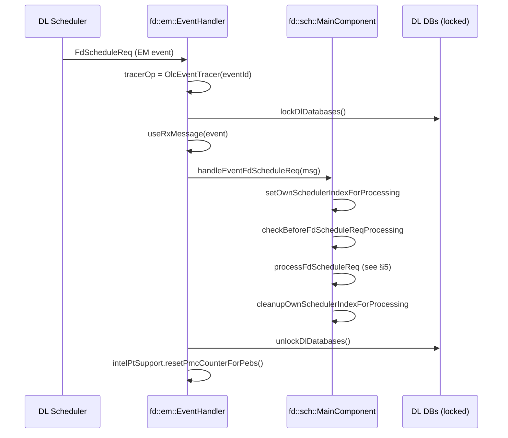

---

## 4. Per-Subcell Scheduler Class Diagram

This is the heart of the FD EO. Each `dl::sch::fd::Scheduler` instance handles **one subcell**.

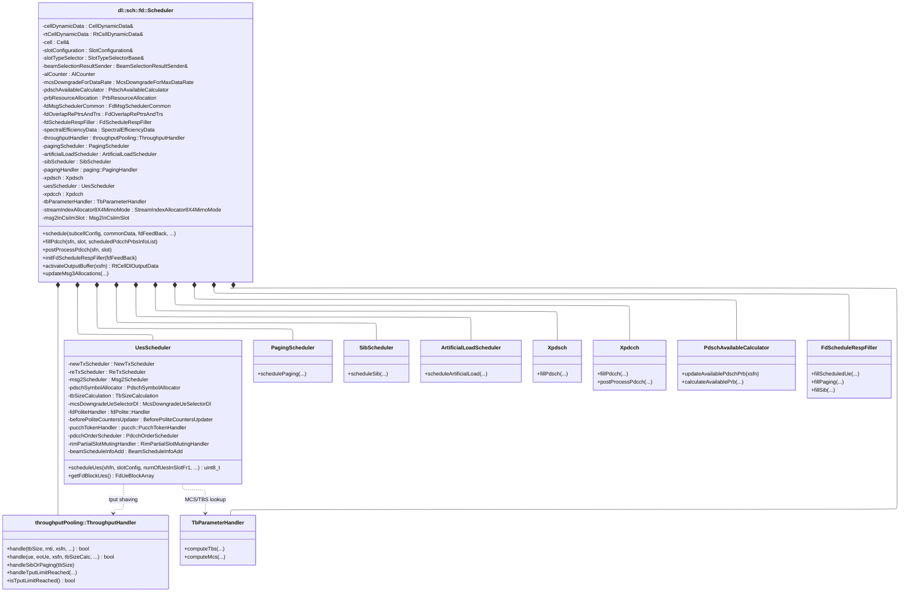

### Sub-component responsibilities

| Component                  | Purpose                                                                                        |
| -------------------------- | ---------------------------------------------------------------------------------------------- |
| `PdschAvailableCalculator` | Updates available PDSCH PRB pool every slot (accounts for CSI-RS / SSB / SIB / paging / TRS).  |
| `PrbResourceAllocation`    | Maps logical PRB allocations from `FdScheduleReq` to concrete PDSCH bitmaps.                   |
| `UesScheduler`             | Orchestrates per-UE scheduling: NewTx (`NewTxScheduler`), ReTx (`ReTxScheduler`), Msg2 (`Msg2Scheduler`). |
| `TbParameterHandler`       | MCS → TBS lookup, layer / rank application, DCI-payload TB derivation.                         |
| `ThroughputHandler`        | TDD instantaneous throughput pooling. Reduces UE PRB allocation (`shave*`) when cell-tput exceeded. |
| `Xpdcch`                   | Builds the per-UE / per-CCE `PdcchSendReq` for L1.                                              |
| `Xpdsch`                   | Builds the per-UE `PdschSendReq` (including MU-pairing fields, DMRS port assignment).           |
| `PagingScheduler`          | Fills paging PDSCH+DCI for the slot.                                                            |
| `SibScheduler`             | Fills SIB PDSCH+DCI for the slot.                                                               |
| `ArtificialLoadScheduler`  | Generates fake load DCIs/PDSCHs for test modes.                                                 |
| `FdScheduleRespFiller`     | Fills `FdScheduleResp` payload for DL SCH (per-UE feedback: actual TBS, MCS, PRB count).        |
| `McsDowngradeForMaxDataRate` | Caps UE MCS to enforce per-UE data-rate cap.                                                  |
| `EoDb` (shared)            | Per-slot scheduled-UE tracker (cross-subcell within this FD EO).                                |

---

## 5. Slot-Level Processing Flow (Main Hot Path)

This is the FD EO's main pipeline, executed once per `FdScheduleReq`.

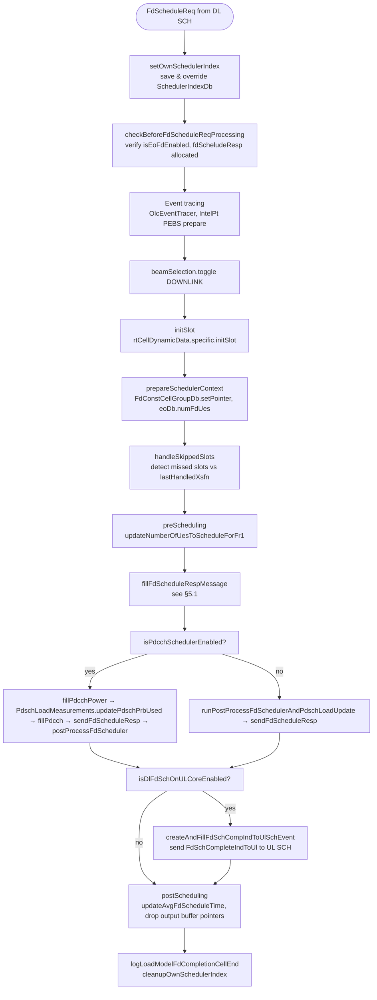

### 5.1 `fillFdScheduleRespMessage` (the work)

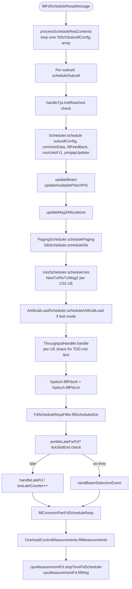

### 5.2 Timing budget (TDD FR1 30 kHz, slot = 500 µs)

| FD EO phase                       | Typical budget |
| --------------------------------- | -------------- |
| Lock DBs + DBpointers + preprocessing | ~10 µs    |
| Per-subcell schedule loop (1 cell)    | ~80–120 µs |
| Throughput-pooling shaving (per UE)   | ~3–5 µs    |
| PDSCH / PDCCH L1 message fill (per UE)| ~5–10 µs   |
| Post-process + FdScheduleResp send    | ~15–25 µs  |
| **Total FD EO**                       | **~120–180 µs** |

`rdFdSchedLateThresholdForFdEo` is the trigger to fall into `handleLateFd()` and start aggressive UE-skipping.

### 5.3 Complete Scheduling Sequence (per slot, per cell-group, per subcell)

End-to-end view of one `FdScheduleReq` from DL SCH all the way to L1-DL and back to DL SCH as `FdScheduleResp`. This shows the **collaborators of `dl::sch::fd::Scheduler` for one subcell** inside `MainComponent::fillFdScheduleRespMessage`.

```mermaid
sequenceDiagram
    autonumber
    participant DLS as DL Scheduler EO
    participant EQ as FdY EQ
    participant EH as fd::em::EventHandler
    participant MC as fd::sch::MainComponent
    participant DBP as FdConst*Db / FdRtCellDb<br/>(pointer-injection)
    participant SCH as dl::sch::fd::Scheduler<br/>(per subcell)
    participant TPUT as throughputPooling::<br/>ThroughputHandler
    participant UES as UesScheduler
    participant TB as TbParameterHandler
    participant MSG2 as Msg2Scheduler
    participant PAG as PagingScheduler
    participant SIB as SibScheduler
    participant DCI as Xpdcch / DciFormat1x
    participant TBR as Xpdsch
    participant FILL as FdScheduleRespFiller
    participant EODB as eoDb::EoDb (scratch)
    participant L1DL as L1-DL
    participant DLDISP as DL Dispatcher

    DLS->>EQ: FdScheduleReq.send (per cell-group)
    EQ->>EH: dispatch event
    EH->>EH: OlcEventTracer start, prepareIntelPtPebs
    EH->>EH: lockDlDatabases (CellDb, CellGroupDb, UeDb, RemoteCellDbBase)
    EH->>MC: handleEventFdScheduleReq(msg)

    MC->>MC: setOwnSchedulerIndexForProcessing
    MC->>MC: checkBeforeFdScheduleReqProcessing
    MC->>DBP: setPointer(payload) for FdCellDb /<br/>FdCellGroupDb / FdConstCellDb / FdConstCellGroupDb
    MC->>EODB: resetFd + saveSubCellIdsInEo(req)
    MC->>MC: handleSkippedSlots(xsfn)
    MC->>MC: preScheduling -- updateNumberOfUesToScheduleForFr1

    loop for each subcell in fdSchSubcellConfig
        MC->>SCH: schedule(subcellConfig, commonData, fdFeedBack, numUesFr1)
        SCH->>SCH: updateBeam + updateAvailablePdschPrb
        SCH->>SCH: updateMsg3Allocations

        SCH->>PAG: schedulePaging(slot, beam)
        SCH->>SIB: scheduleSib(slot, beam)
        SCH->>MSG2: scheduleMsg2 (RACH msg2 from CS2)

        loop for each UE in CS2 (UesScheduler.scheduleUes)
            SCH->>UES: scheduleUes(xhfn, slotCfg, numUes)
            alt isRaMsg2TxPending(ue)
                UES->>MSG2: scheduleMsg2(ue)
                Note over UES,MSG2: RACH RAR path — TBS is fixed,<br/>uses common search space.
            else newTx (no pending HARQ retx)
                UES->>UES: NewTxScheduler.scheduleNewTx(ue)
                UES->>TB: TbSizeCalculation.calculateTbs(ue, prbCount, mcs)
                TB-->>UES: tbs
            else reTx (HARQ retransmission)
                UES->>UES: ReTxScheduler.prepareReTxScheduling(ue)
                UES->>UES: ReTxScheduler.scheduleReTx(ue)
                Note over UES: TBS reused from previous tx;<br/>MCS may be adapted.
            end
            UES->>TB: computeMcs (LA outer-loop + CQI)
            TB-->>UES: mcs
            UES->>TPUT: handle(ue, eoUe, xsfn, tbsCalc)
            alt limit not reached
                TPUT-->>UES: keep
            else over throughput cap
                TPUT-->>UES: shave / drop
                UES->>UES: mcsDowngradeUeSelectorDl
            end
            UES->>EODB: addUe(ue) → EoUe handle
        end

        SCH->>TBR: fillPdsch(scheduledUes, beam, prb)
        SCH->>DCI: fillPdcch / build DCI 1_0 / 1_1
        SCH->>FILL: fillScheduledUe per UE (TBS, MCS, harq pid, dmrs)
    end

    MC->>MC: areWeLateForFd? tickSlotEnd
    alt late
        MC->>MC: handleLateFd, tooLateCounter++
    end

    MC->>MC: fillCommonPartFdScheduleResp
    MC->>L1DL: PdcchSendReq.send
    MC->>L1DL: PdschSendReq.send (per UE / per subcell)
    MC-->>DLDISP: FdScheduleResp.send (back to DL Scheduler EO)

    MC->>MC: runPostProcessFdSchedulerAndPdschLoadUpdate
    opt isDlFdSchOnULCoreEnabled
        MC->>MC: createAndFillFdSchCompIndToUlSchEvent
    end
    MC->>DBP: resetPointer for FdConstCellDb / FdConstCellGroupDb
    MC->>MC: cleanupOwnSchedulerIndexForProcessing
    EH->>EH: unlockDlDatabases
    EH->>EH: intelPtSupport.resetPmcCounterForPebs
    Note over DLDISP: WaitFdSchedResp → DispatcherDefault<br/>postSchedule runs in DL SCH EO
```

---

## 6. L1 Response / Feedback Processing

The FD EO is a one-way producer to L1-DL; **L1 responses go back to the DL Scheduler EO**, not the FD EO. The FD EO has no incoming L1 traffic at all.

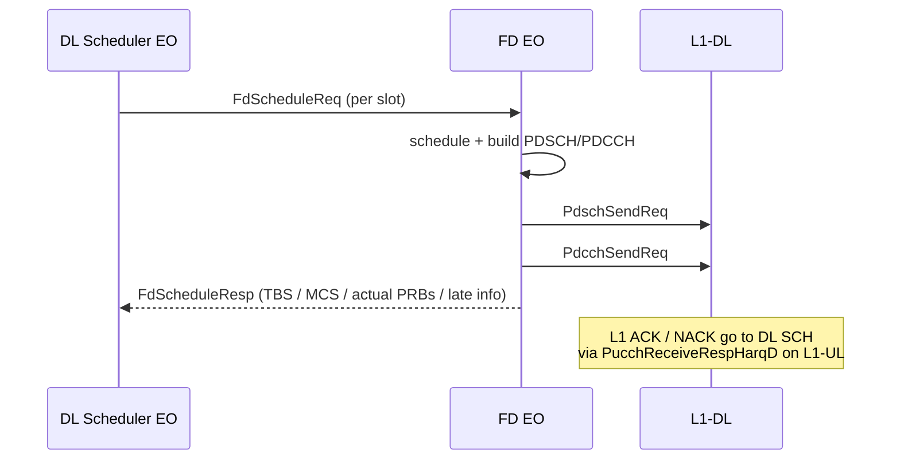

---

## 7. DB Model

The FD EO does NOT own any persistent DB. It accesses **shared DL databases** (write-locked during processing) and maintains a small per-EO scratch DB (`EoDb`).

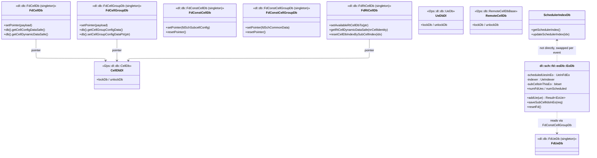

**Pointer-injection pattern.** Because the FD EO runs on a different core than the DL SCH EO (or sharing core via FdSchMsgBufferingService), it cannot directly access DL SCH-owned cell/UE structures. The DL SCH packs **raw pointers** into `FdInitInd` (for cell config) and `FdScheduleReq.fdSchCommonData` (per-slot data) at the start of every slot, and the FD EO's `EventHandler::setDbPointers` / `MainComponent::setCellGroupConfigDataPtr` install them as transient "const" views (`FdConstCellDb`, `FdConstCellGroupDb`). The pointers are reset after the event finishes.

This is a **lock-free zero-copy data hand-off** but requires the DL SCH to keep the underlying objects alive for the duration of the FD EO processing.

---

## 8. Cell Bring-Up And Delete Flow

Triggered by DL SCH on cell setup / delete; the FD EO simply maintains its per-subcell scheduler array.

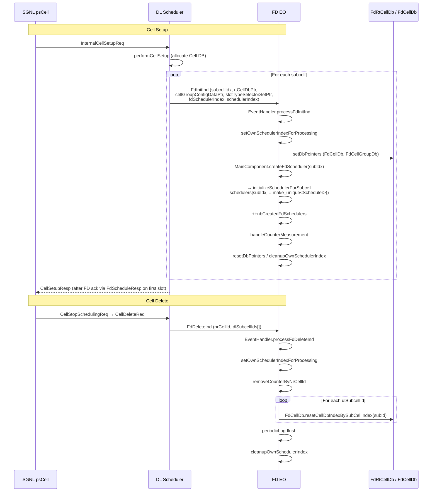

**Note:** The FD EO does **not** delete the per-subcell `Scheduler` from the `schedulers` array on `FdDeleteInd` — only the DB index is reset. The scheduler slot is overwritten on a subsequent `FdInitInd` for the same subcell index. This keeps memory pre-allocated and avoids heap activity.

---

## 9. UE Lifecycle In FD EO

The FD EO does NOT have a per-UE setup/delete message path. UEs become visible to it implicitly via `FdScheduleReq.fdSchSubcellConfig[].scheduledUes` — the DL SCH already filtered candidate UEs (CS1 → CS2) and the FD EO simply processes the ones handed over.

The `EoDb` (per-slot scratch DB) tracks the UEs currently being scheduled within the FD EO. It is **cleared at slot end** via `eoDb.init()` / `resetFd()`.

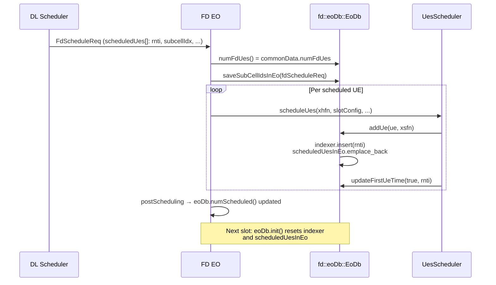

---

## 10. Output Messages

| Message                  | Destination     | Trigger                                              | Builder / Sender                                |
| ------------------------ | --------------- | ---------------------------------------------------- | ----------------------------------------------- |
| `PdschSendReq`           | L1-DL           | Per scheduled UE / paging / SIB / MSG2 in this slot  | `Xpdsch::fillPdsch` (via `dl::sch::fd::Scheduler`) |
| `PdcchSendReq`           | L1-DL           | Per DCI in this slot (DCI 1_0 / 1_1, paging, MSG2)   | `Xpdcch::fillPdcch`                              |
| `FdScheduleResp`         | DL SCH          | One per `FdScheduleReq` (always)                     | `fdScheludeResp` (`Event<FdScheduleResp>`)       |
| `FdSchCompleteIndToUl`   | UL SCH          | After FD-on-UL-core processing finishes              | `createAndFillFdSchCompIndToUlSchEvent`          |
| `SlotSynchroIndCont` (notify) | SRS-BM (continuation) | `dlFdSchOnPairCoreInCurrSlot()` is true     | `slotSynchroIndContSender.sendSlotSynchroIndContToSrsBmIfNeeded` |
| `BeamSelectionResultInd` | SRS-BM          | Per slot — selected beam IDs for next slot           | `beamSelection.send(...)` via `BeamSelectionResultSender` |

**No DL feedback path:** The FD EO never produces `InternalSetupResp`, `UserSetupResp`, etc. — those are owned by the DL SCH EO.

---

## 11. Special Mechanisms

### 11.1 Throughput pooling (TDD instantaneous)

TDD-only feature. When DL slot demand exceeds the pool's allowed cell-throughput, `throughputPooling::ThroughputHandler::handle(ue, eoUe, ...)` shaves PRBs from individual UEs (per-RBG bitmap manipulation) to bring the cell tput under the limit. Iteration is bounded by `maxIterForShaving = 2`. Shaved UEs may be dropped entirely if even minimum-PRB allocation fails (`numUesToBeDropped = 1` per attempt).

### 11.2 Late-FD handling

If `tickSlotEnd` is exceeded (`areWeLateForFd()`), `handleLateFd()` is called: scheduling is truncated for the rest of the slot, `tooLateCounter` is incremented, `handleEventTtiTooLong` records the event. The thresholds `rdFdSchedLateThresholdForFdEo` (parallel) vs `rdFdSchedLateThresholdForFdEoSequential4CC` (sequential 4CC) come from radParams.

### 11.3 IntelPT PEBS counters

For perf profiling: at start of each `FdInitInd`, `prepareIntelPtPebs()` calls `intelPtSupport.configPcmCounterResetForPebs(IntelPtPebsCounterResetPoint::atFdEo)`. After every event, `intelPtSupport.resetPmcCounterForPebs()` resets the counter. This is only active when PEBS sampling is enabled in deployment config.

### 11.4 Skipped-slot handling

`handleSkippedSlots()` detects gap between `lastHandledXsfn` and the incoming `xsfn`. If `slotSkippingDetector` confirms slots were dropped, periodic-log and counters are advanced for the skipped slots so PM stats stay aligned with wall-clock time.

### 11.5 PdcchScheduler split

When `cellGroupConfigData->isPdcchSchedulerEnabled() && dlFdSchOnPairCoreInCurrSlot()` is true, **PDCCH** is filled **after** `FdScheduleResp` is built — the response is sent as a clone (via `sendCloneEventOnly()`) and the final PDCCH fill runs on a separate core to overlap with DL SCH post-processing. Otherwise PDCCH fill happens **before** `sendFdScheduleResp` (the common case).

---

## 12. Design Issues Observed

| #   | Issue                                                                                                                                  | Location                                | Impact                                                                              |
| --- | -------------------------------------------------------------------------------------------------------------------------------------- | --------------------------------------- | ----------------------------------------------------------------------------------- |
| 1   | **No explicit FSM**: lifecycle is hidden in implicit FdInitInd/FdDeleteInd handling without state model — only Idle vs Running         | `fd/em/EventHandler.cpp`                | Harder to reason about message ordering guarantees, especially during cell delete    |
| 2   | **Pointer-injection coupling to DL SCH**: FD EO reaches into DL SCH-owned memory via raw pointers stored in FdInitInd / FdScheduleReq | `processFdInitInd` / `prepareSchedulerContext` | Lifetime guarantees depend on DL SCH not freeing memory under the FD EO            |
| 3   | **Bulk lock of 4 databases** (`CellDb`, `CellGroupDb`, `UeDb`, `RemoteCellDbBase`) for every event                                     | `EventHandler::lockDlDatabases`         | Coarse-grained — even `TdMetricOrderReq` (which doesn't touch UeDb) locks everything |
| 4   | **`fd::sch::MainComponent` is a god class** (~30 private methods, ~200-line `processFdScheduleReq` path)                              | `fd/sch/MainComponent.hpp`              | Hard to isolate any single concern (e.g. late-handling vs scheduling)               |
| 5   | **PDCCH-scheduler split adds dual code-paths**: `isPdcchSchedulerEnabled` branches the entire post-process logic in 2 places          | `postProcessEventFdScheduleReq`         | Implicit ordering: PDCCH after vs before resp send — easy to break                  |
| 6   | **dl::sch::fd::Scheduler owns 18+ collaborators** (UesScheduler, PagingScheduler, SibScheduler, ThroughputHandler, Xpdsch, Xpdcch, …) | `dl/sch/fd/Scheduler.hpp`                | Tight composition; difficult to substitute or mock individual sub-schedulers         |
| 7   | **Scheduler-index swap on every event**: `setOwnSchedulerIndexForProcessing` is called twice (in EventHandler AND MainComponent)      | `EventHandler.cpp` + `MainComponent.cpp` | Double accounting risks drift; one place should own it                              |
| 8   | **EoDb singleton-ish behaviour**: shared state across subcells within one slot; reset between slots only                              | `dl/sch/fd/eoDb/EoDb.hpp`                | Cross-subcell ordering deps in subscheduler code                                    |

---

## 13. Refactoring Direction (Modular Decomposition)

### Proposed Module Structure (6 modules)

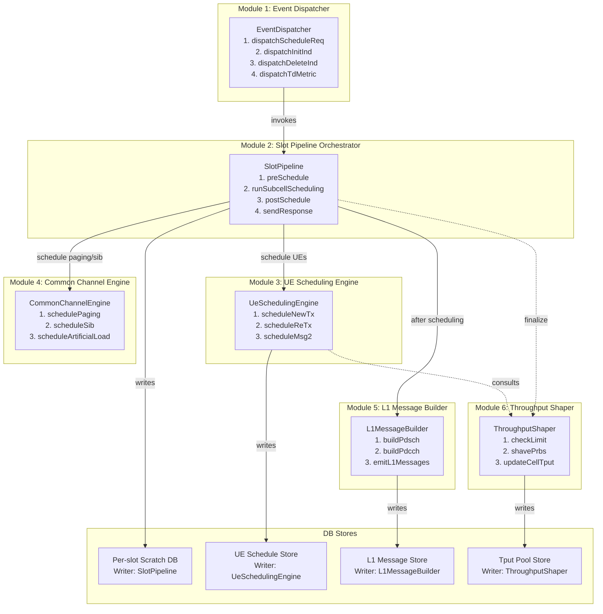

### Module Responsibilities

| Module                           | Public Interface (≤ 4 methods)                                                       | DB Access                                          | Writes To       |
| -------------------------------- | ------------------------------------------------------------------------------------ | -------------------------------------------------- | --------------- |
| **1. Event Dispatcher**          | `dispatchScheduleReq()`, `dispatchInitInd()`, `dispatchDeleteInd()`, `dispatchTdMetric()` | (DL DB locks)                                  | (none)          |
| **2. Slot Pipeline Orchestrator**| `preSchedule()`, `runSubcellScheduling()`, `postSchedule()`, `sendResponse()`       | SlotScratchStore (RW)                              | SlotScratchStore |
| **3. UE Scheduling Engine**      | `scheduleNewTx()`, `scheduleReTx()`, `scheduleMsg2()`                                | UeScheduleStore (RW), CellConfigStore (R)          | UeScheduleStore  |
| **4. Common Channel Engine**     | `schedulePaging()`, `scheduleSib()`, `scheduleArtificialLoad()`                       | CellConfigStore (R), L1MessageStore (W)            | L1MessageStore   |
| **5. L1 Message Builder**        | `buildPdsch()`, `buildPdcch()`, `emitL1Messages()`                                    | L1MessageStore (RW), UeScheduleStore (R)           | L1MessageStore   |
| **6. Throughput Shaper**         | `checkLimit()`, `shavePrbs()`, `updateCellTput()`                                     | TputPoolStore (RW), UeScheduleStore (R)            | TputPoolStore    |

### DB Store Isolation

| DB Store          | Single Writer Module       | Readers                                       |
| ----------------- | -------------------------- | --------------------------------------------- |
| SlotScratchStore  | Slot Pipeline Orchestrator | UE Scheduling Engine, L1 Message Builder      |
| UeScheduleStore   | UE Scheduling Engine       | L1 Message Builder, Throughput Shaper         |
| L1MessageStore    | L1 Message Builder + Common Channel Engine¹ | (output to L1 only)              |
| TputPoolStore     | Throughput Shaper          | UE Scheduling Engine (read for shaving hints) |
| CellConfigStore   | (read-only, owned by DL SCH via pointer hand-off) | All modules                |

¹ Both modules write to `L1MessageStore` but to **non-overlapping sections** (UEs vs common channels). Enforce via sub-store APIs (`L1MessageStore::ueSection()` vs `L1MessageStore::commonSection()`).

### Design Principles Applied

1. **Zero direct coupling**: Only Slot Pipeline Orchestrator calls UE Engine / Common Channel / L1 Builder / Throughput Shaper. Modules never call each other.
2. **DB isolation**: Each DB store has a single writer (with L1MessageStore split into sub-sections).
3. **Interface minimalism**: Each module exposes 3–4 public methods.
4. **UT independence**: Each module testable by mocking its DB read view and (for Slot Pipeline) the module interfaces.
5. **Hot-path guarantee**: All stores fixed-size pre-allocated. Zero heap activity after cell setup.
6. **No CRTP sharing**: Modules are independent concrete classes.

### Self-Check Table

| Question                                                | Answer                                                                                       |
| ------------------------------------------------------- | -------------------------------------------------------------------------------------------- |
| Are modules directly coupled?                           | **No** — only Slot Pipeline calls other modules via interfaces                               |
| Is mutable state shared?                                | **No** — each store has 1 writer; readers get read-only views                                |
| How many modules change for a typical feature addition? | **1–2** (e.g., new MCS table → UE Engine + possibly L1 Builder)                              |
| Can modules be developed in parallel?                   | **Yes** — interfaces are stable; mock DB views for testing                                   |
| Is timing behavior independently testable?              | **Yes** — Slot Pipeline owns the clock; other modules receive pre-computed `xsfn`           |
| Is the DL-SCH ↔ FD-EO boundary cleaner?                | **Yes** — pointer hand-off contained in Event Dispatcher; modules see typed read-only views  |
| Can throughput pooling be tested without slot scheduling?| **Yes** — Throughput Shaper takes only `(tbSize, rnti, currentCellTput)` interface           |

### Boundary clarifications (consistent with DL SCH refactoring)

| # | Item | Clarification |
|---|------|---------------|
| 1 | Module 1 "Event Dispatcher" | Triggered by `FdScheduleReq` / `FdInitInd` / `FdDeleteInd` / `TdMetricOrderReq` from DL SCH. **No SlotSynchroInd subscription** — the FD EO is gated by DL SCH (no slot-tick of its own). |
| 2 | Module 5 "L1 Message Builder" | Sole writer of `L1MessageStore`; emits `PdschSendReq` and `PdcchSendReq` to L1-DL and `FdScheduleResp` back to DL SCH. |
| 3 | `CellConfigStore` reads | All cell/UE configuration is **read-only via pointer hand-off** from DL SCH (`FdInitInd` carries pointers, `FdScheduleReq.fdSchCommonData` carries per-slot snapshots). FD EO owns no persistent cell DB. |
| 4 | `EoDb` (per-slot scratch) | Lives in Module 3 (UE Scheduling Engine) — reset per slot, populated per UE; not visible outside FD EO. |

---

## 14. Cross-EO Refactoring Consistency

This section validates that the FD EO refactoring above is mutually consistent with the parallel proposals in `l2ps_srsbm_mermaid.md`, `l2ps_dlsch_mermaid.md`, `l2ps_ulsch_mermaid.md`, and `l2ps_bbrm_mermaid.md`. **You are here: FD EO**.

### 14.1 Common refactoring shape

| Property                              | SRS-BM      | DL SCH      | UL SCH      | FD EO (here) | BBRM        |
| ------------------------------------- | ----------- | ----------- | ----------- | ------------ | ----------- |
| Module count                          | 7           | 7           | 7           | **6**        | 7           |
| Has Event Dispatcher module?          | No (FSM)    | No (FSM)    | No (FSM)    | **Yes (M1)** | Yes (M1)    |
| Has Orchestrator / Pipeline module?   | Yes (M7)    | Yes (M1)    | Yes (M1)    | **Yes (M2)** | No (M6 sync)|
| Single-writer DB store invariant      | ✓           | ✓           | ✓           | **✓**        | ✓           |
| ≤ 4 public methods per module         | ✓           | ✓           | ✓           | **✓**        | ✓           |
| Self-Check Table                      | ✓           | ✓           | ✓           | **✓**        | ✓           |
| Hot-path fixed-size storage           | ✓           | ✓           | ✓           | **✓**        | ✓           |

FD EO has 6 modules (one fewer than the others) because it has no own cell/UE lifecycle (DL SCH owns it) and no slot-tick (DL SCH gates it via `FdScheduleReq`).

### 14.2 Inter-EO message-to-module mapping (FD EO endpoint highlighted)

| Message                                    | Producer EO (Module)                          | Consumer EO (Module)                          |
| ------------------------------------------ | --------------------------------------------- | --------------------------------------------- |
| `FdInitInd` / `FdDeleteInd`                | DL SCH (M7 Config Manager)                    | **FD EO (M1 Event Dispatcher)**               |
| `FdScheduleReq`                            | DL SCH (M4 Resource Allocator → M5 stub)      | **FD EO (M1 Event Dispatcher → M2 Slot Pipeline)** |
| `FdScheduleResp`                           | **FD EO (M5 L1 Message Builder)**             | DL SCH (M1 Slot Orchestrator)                 |
| `TdMetricOrderReq`                         | DL SCH (M3 TD Selector)                       | **FD EO (M1 Event Dispatcher)**               |
| `FdSchCompleteIndToUl` (DLFD-on-UL-core)   | **FD EO (M5 L1 Message Builder)**             | UL SCH (M1 Slot Orchestrator)                 |
| `PdschSendReq` / `PdcchSendReq`            | **FD EO (M5 L1 Message Builder)**             | L1-DL                                         |
| `StreamStartInd` / `StreamStopInd`         | TTI tracer / management                       | **FD EO (M1 Event Dispatcher)**               |
| `BeamSelectionEvent` (per UE)              | **FD EO (M2 Slot Pipeline / M3 UE Engine)**   | DL SCH (M2 Eligibility / via UE DB)           |
| `CellSetupReq` / `UserSetupReq` / `*DeleteReq` (indirect) | SGNL EO → DL SCH                | DL SCH (M7) → propagated via `FdInitInd`/`FdDeleteInd` to **FD EO (M1)** |
| `SlotSynchroInd`                           | Platform Timer                                | DL SCH (M1) — **NOT FD EO** (FD is gated by DL FdScheduleReq) |

### 14.3 DB store namespace check (no collisions)

Each EO owns its DB stores; identically-named stores in different docs are distinct.

| Logical concept   | SRS-BM                       | DL SCH                                 | UL SCH                  | FD EO (here)                              | BBRM                                |
| ----------------- | ---------------------------- | -------------------------------------- | ----------------------- | ----------------------------------------- | ----------------------------------- |
| Cell config       | `CellConfigStore`            | `CellConfigStore`                      | (Cell DB)               | **(read via pointer hand-off, no own store)** | `CellConfigStore` (pool config) |
| UE state          | `UeRegistry`                 | `UeEligibilityStore` + `UeMetricStore` | (UE DB)                 | **`EoDb` (per-slot scratch)**             | `UePoolStore`                        |
| Per-slot scratch  | (n/a)                        | (n/a — slot context spread)            | (Slot Dynamic DB)       | **`SlotScratchStore` (per FdScheduleReq)**| (n/a)                                |
| L1 messages       | (n/a)                        | (symbolic — owned by FD EO)            | (built in FD Scheduler) | **`L1MessageStore` (own — written by M5)**| (n/a)                                |
| Throughput pool   | (n/a)                        | (n/a)                                  | (n/a)                   | **`TputPoolStore` (instantaneous, per slot)** | (PRB pool budget — different scope) |
| Beam result       | `DlBeamResultStore`          | (consumed via UE state)                | (consumed via UE state) | (consumed via UE state)                   | (n/a)                                |

### 14.4 Observed cross-EO issues and resolutions

| # | Issue                                                                           | Resolution                                                                                                                                |
| - | ------------------------------------------------------------------------------- | ----------------------------------------------------------------------------------------------------------------------------------------- |
| 1 | FD EO and DL SCH both refer to `L1MessageStore`                                  | **FD EO owns** the L1MessageStore (writer = M5). DL SCH refers to it symbolically; communication is via `FdScheduleResp` (typed message).  |
| 2 | FD EO `TputPoolStore` (instantaneous) vs BBRM `PrbPoolStore` (long-period budget)| Different scopes: FD EO does per-slot TDD shaving; BBRM does long-period (~100ms) PRB pooling. They are orthogonal and never share data.   |
| 3 | FD EO has no `SlotSynchroInd` subscription                                       | Intentional — FD EO is gated entirely by DL SCH's `FdScheduleReq`. This avoids dual-clock skew between DL SCH and FD EO.                  |
| 4 | FD EO `EoDb` vs DL SCH UE stores                                                 | `EoDb` is **per-slot scratch only**, lives entirely in M3 (UE Scheduling Engine). DL SCH `UeEligibilityStore` is per-EO persistent. No collision. |
| 5 | Pointer hand-off (DL → FD) — fragile across refactoring boundaries               | Resolved in §13 module 1 (Event Dispatcher): the pointer install/reset cycle is encapsulated in Event Dispatcher's `dispatchInitInd()` and `dispatchScheduleReq()`. Lifetime contract is explicit. |
| 6 | FD EO has 6 modules (others have 7)                                              | Intentional — FD has no own lifecycle module (DL handles it via `FdInitInd`/`FdDeleteInd`) and no own slot-tick module. The 6 modules are sufficient. |

**Conclusion**: The five refactoring proposals are **mutually consistent**. The FD EO ↔ DL SCH boundary (the only tight inter-EO coupling) is fully encapsulated in Event Dispatcher / L1 Message Builder. No DB store is shared across EOs.

---

## 15. Reading Map

| File / Directory                                                | Purpose                                                                       |
| --------------------------------------------------------------- | ----------------------------------------------------------------------------- |
| `fd/em/Eo.hpp`                                                  | EO shell: queue creation, EventHandler ownership                              |
| `fd/em/EventHandler.hpp` + `.cpp`                               | Event dispatch table; DB lock/unlock; scheduler-index swap                     |
| `fd/sch/MainComponent.hpp` + `.cpp`                             | Per-EO main component; per-subcell scheduler array; main hot path             |
| `fd/sch/MainComponentLogger.hpp`                                | Logging helpers for MainComponent                                              |
| `fd/sch/MainComponentOverloadControl.cpp`                       | Overload-control / late-FD handling                                            |
| `fd/sch/CellPrbInfo.hpp`                                        | Per-subcell PRB pool tracking                                                  |
| `fd/sch/FdPdcchScheduleRunner.hpp`                              | PDCCH-on-pair-core invocation helper                                           |
| `fd/sch/OverloadControlMeasurements.hpp`                        | Fill OLC fields in `FdScheduleResp`                                            |
| `fd/sch/PdschLoadMeasurements.hpp` + `.cpp`                     | PDSCH PRB usage counter update                                                 |
| `fd/sch/PdschPrbCounterUpdater.hpp`                             | Per-cell PDSCH PRB used counter                                                |
| `fd/sch/PdschReUsedCounterCalculator.hpp`                       | Re-used PRB tracking for tput shaping                                          |
| `fd/sch/PeriodicLog.hpp`                                        | Periodic log emission                                                          |
| `fd/sch/SlotSynchroIndContSender.hpp`                           | SlotSynchroIndCont relay to SRS-BM                                             |
| `dl/sch/fd/Scheduler.hpp` + `.cpp`                              | **Per-subcell FD scheduler** (the heart) — orchestrates all sub-components     |
| `dl/sch/fd/SchedulerArray.hpp`                                  | Storage of per-subcell schedulers                                              |
| `dl/sch/fd/eoDb/EoDb.hpp`                                       | Per-EO per-slot scratch DB (UE indexer, subcell bitmap)                       |
| `dl/sch/fd/eoDb/EoUe.hpp`                                       | Per-UE per-slot scratch entry                                                  |
| `dl/sch/fd/UesScheduler.hpp`                                    | UE scheduling: NewTx / ReTx / Msg2 / fdPolite / mcsDowngrade                  |
| `dl/sch/fd/NewTxScheduler.hpp`                                  | New transmission per-UE scheduling                                              |
| `dl/sch/fd/ReTxScheduler.hpp`                                   | Retransmission per-UE scheduling                                                |
| `dl/sch/fd/Msg2Scheduler.hpp`                                   | RACH MSG2 (RAR) scheduling                                                      |
| `dl/sch/fd/PagingScheduler.hpp`                                 | Paging PDSCH/PDCCH                                                              |
| `dl/sch/fd/SibScheduler.hpp`                                    | SIB PDSCH/PDCCH                                                                 |
| `dl/sch/fd/ArtificialLoadScheduler.hpp`                         | Artificial-load DCI/PDSCH (test mode)                                           |
| `dl/sch/fd/TbParameterHandler.hpp`                              | MCS → TBS + layers / rank application                                           |
| `dl/sch/fd/TbSizeCalculation.hpp`                               | TB size derivation                                                              |
| `dl/sch/fd/McsDowngradeForMaxDataRate.hpp`                      | Cap per-UE data rate via MCS downgrade                                          |
| `dl/sch/fd/PdschAvailableCalculator.hpp`                        | Per-slot available PDSCH PRB                                                    |
| `dl/sch/fd/PrbResourceAllocation.hpp`                           | RBG / PRB allocation to L1 bitmap                                               |
| `dl/sch/fd/FdMsgSchedulerCommon.hpp`                            | Common helpers for FD message scheduling                                        |
| `dl/sch/fd/FdOverlapRePtrsAndTrs.hpp`                           | Re ptr / TRS overlap handling                                                   |
| `dl/sch/fd/Xpdsch.hpp`                                          | PDSCH L1 message fill                                                           |
| `dl/sch/fd/Xpdcch.hpp`                                          | PDCCH L1 message fill                                                           |
| `dl/sch/fd/DciFormat10.hpp` / `DciFormat11.hpp`                 | DL DCI format 1_0 / 1_1 fillers                                                |
| `dl/sch/fd/throughputPooling/ThroughputHandler.hpp`             | TDD instantaneous tput pooling shaver                                          |
| `dl/sch/fd/metrics/MetricsDetermination.hpp`                    | FD metric computation helpers                                                  |
| `dl/sch/fd/PdcchSchedulerFd.hpp`                                | PDCCH-on-pair-core scheduler                                                   |
| `dl/db/cell/RtCellDbDlFd.hpp`                                   | FD-side RT cell DB pointer view                                                |
| `dl/db/cell/FdCellDependencies.hpp`                             | Aggregated per-subcell deps for FD scheduling                                  |
| `dl/sch/fd/FdCellDb.hpp` / `FdCellGroupDb.hpp` / `FdUeDb.hpp`   | FD-side database pointer wrappers                                              |
| `dl/sch/bfgroup/SchedulerFdHandle.hpp` + `.cpp`                 | **DL-side** counterpart: builds & sends FdInitInd to FD EO                     |
