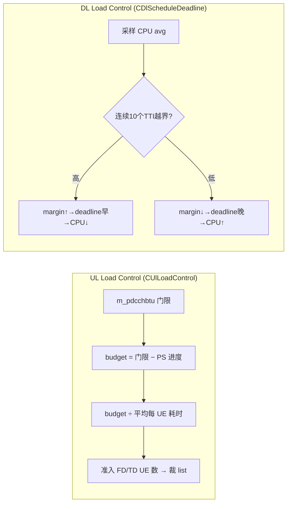
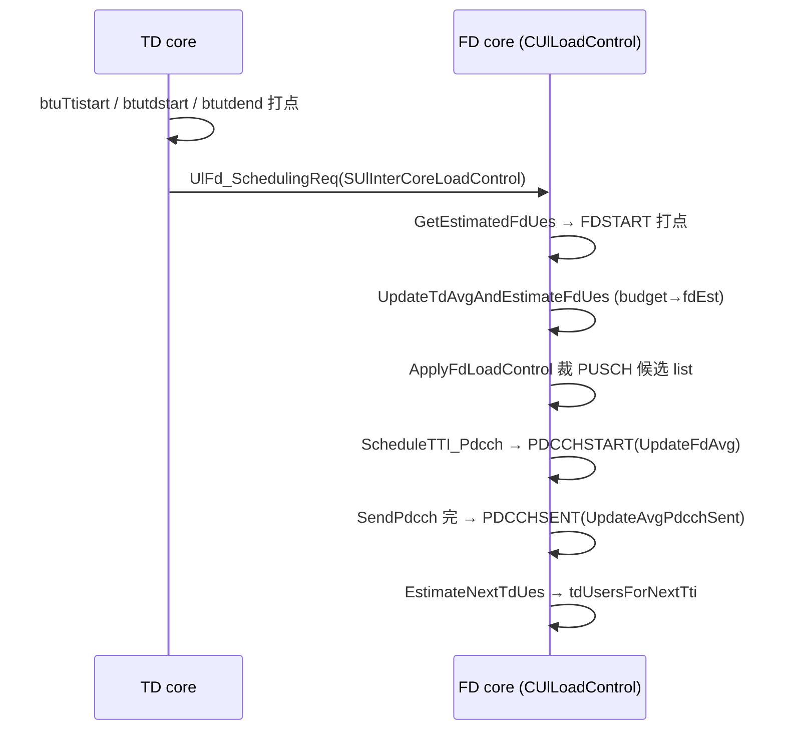
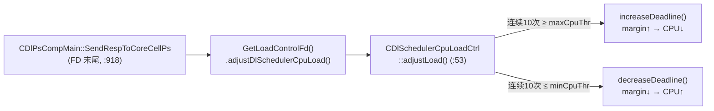

# LTE TDD MAC PS — 调度 Timing 与 Load Control 梳理

> 代码基线:`BTS_SC_MAC_PS_TDD`(Nokia C++)。本文只做代码走读梳理,不含任何代码改动。
> 所有数值均按代码常量核对。
> 全文分两部分:**第一部分 Timing**(TTI timer 偏移、frame/subframe ↔ 空口 offset 的计算);**第二部分 Load Control**(UL/DL 各自如何算 deadline、估 CPU/预算、并据此限制调度)。

---

## 0. 时间基准与单位

| 量             | 值                               | 说明                                          |
| -------------- | -------------------------------- | --------------------------------------------- |
| 1 TTI          | 1 ms = 14 symbol = **30720 BTU** | `BTU_PER_MILLISECOND = 30720`(`DPsDefs.h:53`) |
| 1 slot         | 0.5 ms = **15360 BTU**           | `BTU_PER_SLOT = 15360`(`CPsMacUtils.hpp:265`) |
| 1 子帧         | 2 slot = **30720 BTU**           | `BTUS_PER_TTI = 30720`                        |
| CPRI 延迟单位  | **BTU**,`1us = 30.72 BTU`        | 30720 BTU / 1000 us                           |
| eCPRI 延迟单位 | **UTU**,`1us = 1228.8 UTU`       | 见 `CDlScheduleDeadline.hpp` 注释             |
> 百分比 → BTU 统一换算:`BTU = BTU_PER_MILLISECOND(30720) × percent / 100`。
>
> `SLteTimeBtu{slot, btu}`:`slot` = 帧内绝对 slot 号(0~19),`btu` = slot 内偏移(0~15359);`subframe = slot>>1`;`slot&1`:0=子帧前半(0~0.5ms),1=子帧后半(0.5~1ms)。系统时钟取值:`MacUtils::GetBtuOfLteTime(&btu)`。

---

# 第一部分:Timing(调度时序)

> 本部分回答两个问题:(1) 一次 UL PS 调度涉及哪几条时间轴、它们怎么从 TTI timer 推出来;(2) 系统 frame/subframe 如何换算到空口的 PUSCH/PDCCH 子帧 offset。

## 1. 三条时间轴:timeOut / currentUl / pdcch

每次 `UlFD_SCHEDULING_REQ` 携带一个 `SUlTtiScheduleTimePara`,里面是**三套** (frame, subframe, xsfn):

| 时间轴        | 字段                                       | 含义                                                         |
| ------------- | ------------------------------------------ | ------------------------------------------------------------ |
| **timeOut**   | `timeOutFrame/SubFrame`、`timeOutXsfn`     | TTI timer 触发点 = 本 TTI **PS 开始处理**的子帧(驱动时钟)    |
| **pdcch**     | `pdcchFrame/SubFrame`、`pdcchXsfn`         | 本 TTI 要在空口发出的 **PDCCH(含 UL grant)**所在 DL 子帧 = N |
| **currentUl** | `currentUlFrame/SubFrame`、`currentUlXsfn` | grant 指向的 **PUSCH** 子帧(N + 提前量,∈ {2,3,4,7,8,9})      |

落地代码 `SetCommonParamsFrmMsg`([CUlPsCompMain.cpp](../../../../../code/lte/trunk/BTS_SC_MAC_PS_TDD/C_Application/SC_MAC_PS_TDD/ul/sch/mgmt/src/CUlPsCompMain.cpp)):

```cpp
m_commonParams.timeOutFrame      = timeOutReq.frameNumber;       // PS 处理 TTI N-x
m_commonParams.timeOutSubFrame   = timeOutReq.subFrameNumber;
m_commonParams.currentUlFrame    = timeOutReq.currentUlFrame;    // PUSCH TTI
m_commonParams.currentUlSubFrame = timeOutReq.currentUlSubFrame;
m_commonParams.pdcchFrame        = timeOutReq.pdcchFrame;        // PDCCH 空口 TTI N
m_commonParams.pdcchSubFrame     = timeOutReq.pdcchSubFrame;
m_commonParams.timeOutXsfn       = timeOutReq.timeOutXsfn;
m_commonParams.currentUlXsfn     = timeOutReq.currentUlXsfn;
m_commonParams.pdcchXsfn         = timeOutReq.pdcchXsfn;
```


**图说明**:时间往右推进。`timeOut` 是软件被 TTI timer 唤醒、**开始算**的时刻;算出来的 PDCCH 必须赶在 `pdcch` 子帧 N 的空口边界前发出;UE 收到 grant 后再隔若干子帧在 `currentUl` 发 PUSCH。三者是同一 TTI 调度的「处理时刻 / grant 发送时刻 / 数据到达时刻」。Timing 的全部计算就是从 `timeOut` 推出 `pdcch` 与 `currentUl`。

## 2. PUSCH grant 提前量与空口 offset 计算

### 2.1 grant 提前量 `ulPsPuschAdvanceTti`(查表)

从 DL 调度结果拿到 PDCCH 子帧后,查表得到「PDCCH→PUSCH」的子帧提前量:

```cpp
// CUlPsCompMain::HandleDlSchedulingInfoInd  (:987)
u32 ulPsPuschAdvanceTti =
    CUlPsResTables::GetUlInternalSchAdvanceTTI(subFrameNumber, m_tddFrameConf);
```

```cpp
// CResTablesCommon::GetUlInternalSchAdvanceTTI  (:228)
return UlInternalSchAdvanceTTITable[tddUlDlCfg][subframe];   // 0 表示该子帧无 UL grant
```

提前量随 (tdd 配置, 子帧) 不同;`>0` 即代表「该 DL 子帧负责发某个 UL 子帧的 grant」,`CUlLoadMeasureForBbpool.cpp:51` 用它判定 `isUlgrantTti`。

### 2.2 timeOut → PUSCH 子帧映射 `CalcUlXSfnByTimeOutXsfn`

把 timer 的 (frame, subframe) 映射到最近的 UL(PUSCH)子帧,**输出恒落在 {2,3,4,7,8,9}**:

```cpp
// CUlPsResTables::CalcUlXSfnByTimeOutXsfn  (:1000)
u8 nearestUlEsfnOffset[][10] = {
  { 7,7,7,6,5,7,7,7,6,5 },   // config 0
  { 7,6,6,5,4,7,6,6,5,4 },   // config 1
  { 7,6,5,4,8,7,6,5,4,8 },   // config 2
};
CalcTTIAddSubframes(0, timeOutSfn, timeOutESfn,
                    nearestUlEsfnOffset[tddFrameConf][timeOutESfn],
                    GLO_NULL, currentUlFrame, currentUlSubFrame);
SCT_ASSERT(currentUlSubFrame ∈ {2,3,4,7,8,9});
```

`nearestUlEsfnOffset[cfg][esfn]` = 从当前 timeOut 子帧再加多少个子帧才到那个 PUSCH 子帧。

### 2.3 frame/subframe/hyperframe 进位 `CalcTTIAddSubframes`

所有「子帧 + offset」的换算都走这里,负责 subframe→frame→hyperframe 的逐级进位与回绕:

```cpp
// CUlPsResTables::CalcTTIAddSubframes
*nextESfn = currentESfn + eSfnsToAdd;
*nextSfn  = currentSfn  + (*nextESfn / DAALTE_SUBFRAMES_IN_FRAME);   // 子帧满 10 进 1 帧
*nextHfn  = (currentHfn + (*nextSfn >> 10)) % DAALTE_HYPERFRAME_CYCLE; // 帧满 1024 进 1 超帧
*nextSfn  = *nextSfn  % LTE_MAC_FRAME_CYCLE;
*nextESfn = *nextESfn % DAALTE_SUBFRAMES_IN_FRAME;
```

> **每帧 UL 子帧数** `GetUlPsPuschNumTTI(cfg)`(`UlPsPuschTTITable[cfg]`)和 **UL 子帧索引** `GetUlSchedSubframeIndex(cfg, dlEsfn)`(`m_ulScheduleSubframeIndex[cfg][esfn]`)在 Load Control 里用来给「每个 UL 子帧」各开一组滑动平均(见 §6.4)。

## 3. BTU 时间轴与 `m_pdcchbtu` 原点(N−2)

Load Control 用 BTU 系统时钟来量「PS 处理进度」。设 N = PDCCH 空口子帧:

- UL 调度提前量 `LTE_SCHEDULING_ADVANCE_UL ≈ 1500us`(1c1c=1571,非 1c1c=1500;`PsConstants.h:202-223`)≈ 1.5 TTI。
- 真正 PS 处理起点 `btuTtistart`(`GetBtuOfLteTime` @ `CUlPsCompMainTD.cpp:824` → `SetCurrentLoadControlBtu` @ `CUlPsAlgorithmData.hpp:2860`)落在子帧 **N−2 的第 2 个 slot**。
- 经奇数 slot 折叠(+15360)后,门限 `m_pdcchbtu` 的原点 **O = 子帧 N−2 起点**(1c1c 略有不同,见 §6.2)。

提前量参考(`PsConstants.h:202-223`):

| 常量                                   | 1c1c    | 非 1c1c |
| -------------------------------------- | ------- | ------- |
| `LTE_SCHEDULING_ADVANCE_UL`            | 1571 us | 1500 us |
| `LTE_SCHEDULING_ADVANCE_UL_CONFIG0`    | 1060 us | 1000 us |
| `LTE_SCHEDULING_ADVANCE_UL_ADVPROCESS` | 1700 us | 2000 us |

- config0 提前量 ~1000-1060us ≈ N−1。
- `pdcchXsfn = timeOutXsfn`;`CalcUlXSfnByTimeOutXsfn` 映射到 PUSCH `N + offset`(offset ∈ {4..8})。

## 4. DL Timing:`calcDeadline`(margin → 时刻)

DL 把「保留 margin」换算成时间轴上的截止 slot/btu(`CDlScheduleDeadline.hpp:148`):

```cpp
subframeAdvanced = (btuMargin > 30720) ? 3 : 2;          // 提前 2~3 子帧
btuMargin        = (btuMargin > 30720) ? btuMargin-30720 : btuMargin;
additionalSlot   = (btuMargin > 15360) ? 0 : 1;
deadline.slot    = ((sfn + 10 - subframeAdvanced) % 10) * 2 + additionalSlot;
deadline.btu     = (btuMargin > 15360) ? 30720 - btuMargin : 15360 - btuMargin;
```

**说明**:margin 越大 ⇒ 提前越多子帧(2→3)、`deadline.btu` 越靠子帧前部 ⇒ deadline 越早 ⇒ scheduler 越早收手。margin 的取值与闭环见 §7。

---

# 第二部分:Load Control

## 5. 总览:互斥的两条线

UL 与 DL 是两套独立机制,且 `delayOfAbsoluteDist` 的距离自适应**二选一**(由 `actECpri` 决定走哪条):

| 维度         | UL / CPRI                          | DL / eCPRI                                 |
| ------------ | ---------------------------------- | ------------------------------------------ |
| 选择条件     | `ISFALSE(actECpri)`                | `ISTRUE(actECpri)`                         |
| 入口         | `CUlPsCompMain.cpp:785`            | `CDlPsCompMain.cpp:686`                    |
| 控制对象     | `m_pdcchbtu` 固定门限              | `CDlScheduleDeadline` 动态 margin          |
| 调度限制方式 | 估 **FD/TD UE 准入数**,裁候选 list | 调 **deadline margin**,scheduler 早/晚收手 |
| CPU 闭环     | 无(固定门限 + 预算估计)            | `CDlSchedulerCpuLoadCtrl` 动态升降         |



**图说明**：UL 是**前馈**——拿固定 deadline 减去已花时间得到预算，再除以「平均每个 UE 要花多少 BTU」反推这一 TTI 能放几个 UE，直接裁掉多出来的候选；DL 是**反馈**——直接看 CPU 占用率，连续越界才调 margin，让 deadline 早/晚一点。

## 6. UL Load Control(预算 → 准入 UE 数)

`CUlLoadControl` 是 header-only 类。核心思想:把「从 PS 起点到 PDCCH 必须发出」这段固定 deadline 当作**执行预算上限**，按历史平均反推这一 TTI 能准入多少 UE。

### 6.1 deadline 门限 `m_pdcchbtu`

基值(`CUlLoadControl.hpp`,注释 `// for the time being we define bandwidth independent limits` — 即手调的临时常量):

| 部署                           | `SEND_PDCCH_BTU_THRESHOLD` | 时间    |
| ------------------------------ | -------------------------- | ------- |
| 默认                           | 36864                      | 1200 us |
| LIONFISH \| SNOWFISH \| MARLIN | 39936                      | 1300 us |
| 1c1c                           | 21504                      | 700 us  |
| CONFIG0(默认)                  | 15360                      | 500 us  |
| CONFIG0(1c1c)                  | 12288                      | 400 us  |

`Configure()` 按 `m_tddFrameConf==0` 选 CONFIG0 或标准值。

### 6.2 budget 折叠与计算 `CalcBudgetTtiStartToPdcch`

把 PS 处理起点 `btuTtistart{slot, btu}` 折算到 `m_pdcchbtu` 的同一原点 O,再 `budget = m_pdcchbtu − btuAtPsStart`([CUlLoadControl.hpp:319](../../../../../code/lte/trunk/BTS_SC_MAC_PS_TDD/C_Application/SC_MAC_PS_TDD/ul/sch/loadCtrl/inc/CUlLoadControl.hpp)):

```cpp
u32 btuAtPsStart   = m_ulInterCoreLoadControl.btuTtistart.btu;
u32 currentBtuslot = m_ulInterCoreLoadControl.btuTtistart.slot;
if (0 != m_tddFrameConf) {
#if defined(SNOWFISH_1CORE1CELL)                 // 1c1c:以 FD-start 子帧为支点
  u32 fdBtuslot = m_eventBtus[ULLOADCTRL_FDSTART].slot;
  if ((currentBtuslot>>1) == (fdBtuslot>>1)) {   // 同子帧
    if (currentBtuslot & 0x1) btuAtPsStart += BTUS_PER_TTI/2;   // 奇 +15360,偶 +0
  } else {
    btuAtPsStart += BTUS_PER_TTI;                // 跨子帧 +30720
  }
#else                                            // 非 1c1c:纯奇偶
  if (currentBtuslot & 0x1) btuAtPsStart += BTUS_PER_TTI/2;     // 奇 +15360
  else                      btuAtPsStart += BTUS_PER_TTI;       // 偶 +30720
#endif
}
if (m_pdcchbtu > btuAtPsStart) m_budgetTtiStartToPdcch = m_pdcchbtu - btuAtPsStart;
else                           DefaultMonitor().setIsHighLoad(true);   // 预算耗尽 = 高负载
```

> **1c1c 与非 1c1c 的折叠原点不同**:同子帧、偶 slot 时非 1c1c 加 30720 而 1c1c 加 0 ⇒ 1c1c 原点锚在 **FD-start 子帧起点**(晚一个子帧),与它较小的 `m_pdcchbtu`(700 vs 1300)是同一坐标系内自洽的两个量,**不能跨架构直接比 700 vs 1300**。

代码验证([CUlLoadControlTest.cpp:225-260](../../../../../code/lte/trunk/BTS_SC_MAC_PS_TDD/C_Application/SC_MAC_PS_TDD/ul/sch/loadCtrl/tst/CUlLoadControlTest.cpp),1c1c,`m_pdcchbtu=21504`):

| `btuTtistart(slot,btu)` | FDSTART slot | 折叠              | btuAtPsStart | budget                 |
| ----------------------- | ------------ | ----------------- | ------------ | ---------------------- |
| (8, 15359)              | 9            | 同子帧偶 `+0`     | 15359        | 21504−15359 = **6145** |
| (9, 46)                 | 9            | 同子帧奇 `+15360` | 15406        | 21504−15406 = **6098** |
| (9, 500)                | 10           | 跨子帧 `+30720`   | 31220        | <0 → **0**(置高负载)   |

### 6.3 budget → FD UE 估计 `UpdateTdAvgAndEstimateFdUes`

预算先扣掉 TD 阶段已花时间(`FDSTART − btuTtistart`),再扣掉 DL PDCCH 与保底 FD 开销,余量除以「平均每个 FD UE 耗时」反推可准入 FD UE 数:

```cpp
u32 deltabtus = m_eventBtus[FDSTART] - m_ulInterCoreLoadControl.btuTtistart;  // TD+intercore 已花
CalcBudgetTtiStartToPdcch(dlEsfn);
if (deltabtus < m_budgetTtiStartToPdcch) {
  u32 budgetFdToPdcch = m_budgetTtiStartToPdcch - deltabtus;                  // FD→PDCCH 剩余
  u32 avgUlFdPdcch    = avgBtusPerFdUe + avgBtusPerPdcchUe;
  // 余量 = 剩余 − DL PDCCH 开销 − 保底 4 个 FD 的开销
  i32 extra = budgetFdToPdcch - avgBtusPerPdcchUe * m_dlPdcchUeNum - MIN_NUM_FD_UE * avgUlFdPdcch;
  fdUes = CalcEstFdUe(extra, avgUlFdPdcch);
} else {
  DefaultMonitor().setIsHighLoad(true);  // "fd start late" 日志,准入退回 MIN_NUM_FD_UE
}
m_fdEst = min(fdUes, m_configNumFdUes);
setMaxUEMacLoCo(m_fdEst);                 // 下发给 FD scheduler 的准入上限
```

贪心反推(`CalcEstFdUe`,4~20 步进 1):

```cpp
u32 fdUes = MIN_NUM_FD_UE;                 // 4
for (u32 t = MIN_NUM_FD_UE; t < MAX_NUM_FD_UE; t += FD_STEP) {  // ..20
  fdBudgetBtus -= FD_STEP * avgBtusPerFdUe;
  if (fdBudgetBtus < 0) break;
  fdUes += FD_STEP;
}
return fdUes;
```

### 6.4 事件驱动的滑动平均

平均值不是凭空给的,而是每拍由三个事件打点、按 EWMA(权重 90/10)更新。每个 UL 子帧各一组 `m_avgParams[index]`(`index = GetUlSchedSubframeIndex`):

```cpp
#define AVERAGING_WEIGHT_UL 90
#define AVERAGING_DATA(old,new) (0.9*old + 0.1*new)   // 示意

void EventTrigger(EUlLoadCtrlEvent e) {
  m_eventBtus[e] = GetBtuOfLteTime();
  switch (e) {
    case ULLOADCTRL_PDCCHSTART: UpdateFdAvg();                       break; // FD 段耗时/UE
    case ULLOADCTRL_PDCCHSENT:  UpdateAvgPdcchSent(); EstimateNextTdUes(); break;
  }
}
```

| 事件         | 打点位置                         | 更新的平均量                                |
| ------------ | -------------------------------- | ------------------------------------------- |
| `FDSTART`    | `GetEstimatedFdUes`(FD 调度开始) | 作为 `deltabtus`/FD 段起点                  |
| `PDCCHSTART` | `ScheduleTTI_Pdcch` 前(`:1469`)  | `avgBtusPerFdUe`(FD 段总耗时 ÷fdEst)        |
| `PDCCHSENT`  | PDCCH 发送后(`:2473`)            | `avgBtusPerPdcchUe`、并触发下一 TTI TD 估计 |



**图说明**:TD core 先在 cell 核上把 `btuTtistart/btutdstart/btutdend` 三个时刻戳进 `SUlInterCoreLoadControl`,随 `UlFd_SchedulingReq` 发给 FD core;FD core 用这些时刻 + 自己打的 `FDSTART/PDCCHSTART/PDCCHSENT`,既算**本 TTI**的 FD 准入数,又更新平均、估**下一 TTI**的 TD 数。整个环每 TTI 闭合一次。

### 6.5 下一 TTI TD UE 估计与下发

`EstimateNextTdUes` 用对称公式倒扣出 TD 可准入数(50~250 步进 10):

```cpp
// tdbudget = avg预算 − TD后到FD − FdMax开销 − TdMin开销 − (FdMax+dlpdcch)*pdcch开销
i32 tdBudget = avgbudgetTdToPdcch - avgBtusTdEndToFdStart
             - m_configNumFdUes*avgBtusPerFdUe - MIN_NUM_TD_UE*avgBtusPerTdUe
             - (m_configNumFdUes + dlPdcchUeNumQ.average)*avgBtusPerPdcchUe;
for (u32 t = MIN_NUM_TD_UE; t < m_maxNumTdUE; t += TD_STEP) {
  tdBudget -= TD_STEP * avgBtusPerTdUe;
  if (tdBudget < 0) break;
  tdUes += TD_STEP;
}
estNextTdUeNum = max(MIN_NUM_TD_UE, tdUes - extraTdDowngrades);
```

结果经 `UpdateLoadControlInfo → GetEstimatedNextTdUes` 写入跨核结构，回传 TD core 限制下一 TTI 进入 FD 的 UE 数:

```cpp
// CUlPsCompMain::UpdateLoadControlInfo
m_InterCoreUlPsCompMain.tdUsersForNextTti =
    m_ulLoadControl.GetEstimatedNextTdUes(subFrameNumber, tdCaUeLimitNumInCs2List);
```

### 6.6 为什么 1c1c 的 700us 是「保守的执行预算上限」

> 这是上面机制的设计意图,便于以后调参时不被直觉误导。

- `m_pdcchbtu` **不是 CPU 利用率指标**，而是单核上单个 TTI UL PS 的**执行时间预算上限**（execution-budget cap）。准入数有界 ⇒ 本 TTI 执行时间有界 ⇒ 保证**下一 TTI 的实时调度准时起跑**（下一子帧 DL/PS 在 1c1c 与本 TTI UL 抢同一颗核）。
- 超预算的硬后果:`else { setIsHighLoad; "fd start late" }`,以及 `SendPdcch` 里 `LTE5194PDCCH ... send late`(`CUlPsMainFd.cpp:1301`)——子帧错位时整批 DL grant 被清零丢弃。
- 损失**非对称**:少准入 1 个 UE = 线性小损失(挪到下一 TTI/PUCCH list);多准入 1 个 = 整批 grant 丢 + UE stall/重传(newsvendor 型代价)。故最优 setpoint 必然落在物理边界**之下**,留 `k·σ` 余量吸收单核抖动。
- 700 是 `// for the time being ... bandwidth independent` 的手调保守值;要上调须实测单核 PS 完成时间分布(均值+尾部 σ),并用 `fd start late`/LTE5194/`setIsHighLoad` 计数校验,而非按「实时系统该吃满 90%」拍数。

### 6.7 CPRI 下 20km/30km 对 `m_pdcchbtu` 的收紧(仅 CPRI)

触发:[CUlPsCompMain.cpp:785](../../../../../code/lte/trunk/BTS_SC_MAC_PS_TDD/C_Application/SC_MAC_PS_TDD/ul/sch/mgmt/src/CUlPsCompMain.cpp) `if (hasDelayOfAbsoluteDist && ISFALSE(actECpri)) SetPdcchBtuThreshold(delay)`。

常量(`CUlLoadControl.hpp:77-78`,单位 **BTU**):

| 常量                              | 值   | =      | 物理含义                     |
| --------------------------------- | ---- | ------ | ---------------------------- |
| `DELAY_OF_ABSOLUTE_DIST_BTU_20KM` | 3072 | 100 us | 20km 光纤纯单向传播(~5us/km) |
| `DELAY_OF_ABSOLUTE_DIST_BTU_30KM` | 4608 | 150 us | 30km 光纤单向传播            |

逻辑(`SetPdcchBtuThreshold`):
- `delay ≤ 3072`(≤20km):不变(20km 余量已含在基值)。
- `delay > 3072`:`clamped = min(delay, 4608)`;`m_pdcchbtu = base + 3072 − clamped` = `base − (delay−3072)`,最多缩短 1536 BTU(50us)。

> 测试佐证 UL 字段为 BTU 单位:`CUlPsCompMainTest.cpp:601` 设 `delayOfAbsoluteDist = 3072`(正好 20km/100us)。

## 7. DL Load Control(deadline margin ↔ CPU 闭环)

### 7.1 DL deadline = "截止余量 margin"

DL 侧 load control 是单例类 `CDlScheduleDeadline`。它在 TTI 末尾保留一段 margin 给 post-TTI 处理(约 10/14 symbol + SRIO),deadline = TTI 时间轴上"扣掉 margin"的时刻。

- margin ↑ ⇒ deadline 提前 ⇒ scheduler 早收手 ⇒ CPU↓。
- margin ↓ ⇒ deadline 推后 ⇒ 调度更充分 ⇒ CPU↑。

三类子帧各有独立 margin(`getBtusMargin()` @ `CDlScheduleDeadline.hpp:127`):

| 子帧类型 | margin 变量                   | 默认百分比                      |
| -------- | ----------------------------- | ------------------------------- |
| Special  | `btusMarginSpecialScheduling` | `BTU_MARGIN_PERCENT_DLUL = 33%` |
| DL-only  | `btusMarginDlScheduling`      | `BTU_MARGIN_PERCENT_DL = 15%`   |
| DL+UL    | `btusMarginDlUlScheduling`    | `BTU_MARGIN_PERCENT_DLUL = 33%` |

extreme-high TTI 再加 `extremeHighextraMargin`;mMIMO 经 `getDeadlineForMMimo()` 再 ×0.7(`DEADLINE_SCALING_FACTOR_FOR_MMIMO_Q7 = 90/128`)。

`getAvailableBtus()` = `getDeadlineForMMimo()` − 当前 BTU,供 FD scheduler 判断"还能否再调一个 UE"(时刻换算见 §4 `calcDeadline`)。

### 7.2 CPU 上下限闭环



**图说明**:每子帧在 FD 末尾采样一次 CPU avg,只有**连续** 10 次(`loadMoniterPeriod`)同向越界才动一步 margin,期满清零。这种「连续计数 + 单步」抑制了抖动导致的来回震荡。

判决(`CDlSchedulerCpuLoadCtrl::adjustLoad`):
- 每子帧采样 `getAvgCpuLoad()`,累计**连续**超阈次数;窗口 `loadMoniterPeriod = 10`。
- 连续 10 次 `avg ≥ maxCpuLoadThreshold` → `increaseDeadline()`。
- 连续 10 次 `avg ≤ minCpuLoadThreshold` → `decreaseDeadline()`。

步进与封顶(`CDlScheduleDeadline.hpp:215-227`):

```cpp
increaseDeadline(): margin = min(maxDeadline, margin + increaseStep);  // 上限封顶
decreaseDeadline(): margin = max(minDeadline, margin - decreaseStep);  // 下限托底
```
margin 在 **[minDeadline, maxDeadline]** 内、按 ±step 步进震荡。

### 7.3 上下限/阈值/步长来源(两个 R&D 位域)

`updateRdParameter()`(margin/deadline @ `CDlScheduleDeadline.hpp:97`;CPU 阈值 @ `CDlSchedulerCpuLoadCtrl.hpp:77`):

| R&D 参数                                           | bits  | 含义                    | 字段                     |
| -------------------------------------------------- | ----- | ----------------------- | ------------------------ |
| `rdDynamicCpuLoadCtrlUP`                           | 0-7   | max deadline(%)         | `maxDeadline`            |
| (`ERadSwDomainLteMac_TRDynamicCpuLoadControlUp`)   | 8-15  | increase step(×100)     | `increaseStep`           |
|                                                    | 16-23 | max CPU load 阈值(%)    | `maxCpuLoadThreshold`    |
|                                                    | 24-31 | extremeHigh 额外 margin | `extremeHighextraMargin` |
| `rdDynamicCpuLoadCtrlDown`                         | 0-7   | min deadline(%)         | `minDeadline`            |
| (`ERadSwDomainLteMac_TRDynamicCpuLoadControlDown`) | 8-15  | decrease step(×100)     | `decreaseStep`           |
|                                                    | 16-23 | min CPU load 阈值(%)    | `minCpuLoadThreshold`    |

R&D 默认值(`PsLteMacRadParams_TDD.c:508-509`):

| 部署                | UP                                | Down                    |
| ------------------- | --------------------------------- | ----------------------- |
| 非 1c1c / 非 mMIMO  | `(15<<24)\|(90<<16)\|(50<<8)\|50` | `(80<<16)\|(25<<8)\|40` |
| SNOWFISH_1CORE1CELL | `(0<<24)\|(90<<16)\|(50<<8)\|70`  | `(80<<16)\|(25<<8)\|60` |

非 1c1c 默认换算结果:

| 量             | 计算           | 结果                  |
| -------------- | -------------- | --------------------- |
| `maxDeadline`  | 30720×50/100   | **15360 BTU (0.5ms)** |
| `minDeadline`  | 30720×40/100   | **12288 BTU (0.4ms)** |
| `increaseStep` | 30720×50/10000 | **153 BTU**           |
| `decreaseStep` | 30720×25/10000 | **76 BTU**            |
| max CPU 阈值   | —              | **90%**               |
| min CPU 阈值   | —              | **80%**               |

mMIMO 专用默认(`LoadCtrlCommonParameter.hpp:32-50`,经 `CLoadCtrlRadParameter` 在 `IsActMassiveMimo()` 时替换):
- `MIMO_DYNAMIC_CPU_LOAD_CONTROL_UP/DOWN`、`MassiveMIMO_*` 等。

---

## 8. eCPRI 20km/30km 对 DL 的覆盖(仅 eCPRI)

触发:[CDlPsCompMain.cpp:686](../../../../../code/lte/trunk/BTS_SC_MAC_PS_TDD/C_Application/SC_MAC_PS_TDD/dl/sch/mgmt/src/CDlPsCompMain.cpp) `if (ISTRUE(actECpri) && hasDelayOfAbsoluteDist) updateLoadControlParams(delay)`
→ `CDlLoadControlFd.cpp:393` → `CDlScheduleDeadline::updateLoadControlParams`(`:186`)。

延迟门限常量(`CDlScheduleDeadline.hpp:32-33`,单位 **UTU**):

| 常量                         | 值     | =      | 含义                           |
| ---------------------------- | ------ | ------ | ------------------------------ |
| `ecpri20KmsMinOnewayHwDelay` | 419021 | 341 us | 20km 单向 **HW+光纤** 最小延迟 |
| `ecpri30KmsMinOnewayHwDelay` | 468173 | 381 us | 30km 单向 HW+光纤最小延迟      |

> 名字含 `MinOnewayHwDelay`,故 341us 远大于纯光纤传播,内含 eCPRI 传输链路固定流水线延迟。

逻辑:
- `delay ≥ 419021`(≥20km):margin 与 max/minDeadline **直接置为 `ecpri30Kms*` 预设**(`LoadCtrlCommonParameter.hpp:44-50`):
  - `ecpri30KmsSchLoadControlConfigDlUl = 70`、`...Dl = (90<<8)|70`、`...Special = (92<<8)|68`
  - `ecpri30KmsDynamicCpuLoadControlUp = (90<<16)|(50<<8)|72`、`...Down = (80<<16)|(25<<8)|68`
- `419021 ≤ delay < 468173`(20~30km):上述全部 ×0.9(`ecpriDeadlineScalingFactorMin20KmsQ7 = 115/128`)。
- 置 `isDelayOfAbsoluteDistApplied = true` ⇒ `updateRdParameter()` 提前 return,**R&D 参数被屏蔽,光纤延迟预设优先**。
- `cellDelete()` 复位该标志。

### 8.1 10km / 20km / 30km × 3 部署 DL 汇总

范围说明(DL 的距离自适应仅在 **eCPRI** 下、且 `delay ≥ 20km 门限`(341us)时生效):
- **10km**:`delay < 419021` ⇒ `updateLoadControlParams` 不触发 ⇒ 走 `updateRdParameter` 正常 R&D 路径 ⇒ **按部署区分**。
- **20km / 30km**:`updateLoadControlParams` 覆盖 margin 与 max/minDeadline,取自 `ecpri30Kms*` 常量 ⇒ **与部署无关**(三部署存同一组值);mMIMO 仅在取 deadline 时(`getDeadlineForMMimo`)再 ×0.7。
- `updateLoadControlParams` **只改** margin + max/minDeadline;**不改** increaseStep/decreaseStep(仍 153/76),也**不改** CPU 上下限(仍 90%/80%,位于 `CDlSchedulerCpuLoadCtrl`,不被 eCPRI 覆盖)。

**① 10km(正常 R&D 路径,按部署,单位 %/BTU/us)**

| 量                | 2c1c 非mMIMO     | 2c1c mMIMO       | 1c1c             |
| ----------------- | ---------------- | ---------------- | ---------------- |
| margin DlUl       | 41 / 12595 / 410 | 50 / 15360 / 500 | 61 / 18739 / 610 |
| margin Dl         | 41 / 12595 / 410 | 50 / 15360 / 500 | 61 / 18739 / 610 |
| margin Special    | 41 / 12595 / 410 | 50 / 15360 / 500 | 61 / 18739 / 610 |
| maxDeadline(上限) | 50 / 15360       | 50 / 15360       | 70 / 21504       |
| minDeadline(下限) | 40 / 12288       | 50 / 15360       | 60 / 18432       |
| CPU 上限 / 下限   | 90% / 80%        | 90% / 80%        | 90% / 80%        |
| inc / dec step    | 153 / 76         | 153 / 76         | 153 / 76         |
| extremeHigh 额外  | 15% / 4608       | 15% / 4608       | 0                |

> mMIMO 列:`min=max=15360`(区间塌缩,margin 不再随 CPU 闭环震荡);三类 margin 取 deadline 时再 ×0.7(`15360×0.7≈10800 BTU≈351us`)。

**② 20km(eCPRI 20~30km,`ecpri30Kms* × 0.9`,与部署无关)**

| 量             | 值(BTU / us) | 来源               |
| -------------- | ------------ | ------------------ |
| margin DlUl    | 19320 / 629  | `21504 × 115 >> 7` |
| margin Dl      | 19320 / 629  | `21504 × 115 >> 7` |
| margin Special | 18767 / 611  | `20889 × 115 >> 7` |
| maxDeadline    | 19871 / 647  | `22118 × 115 >> 7` |
| minDeadline    | 18767 / 611  | `20889 × 115 >> 7` |
| CPU 上限/下限  | 90% / 80%    | 未被覆盖           |
| inc / dec      | 153 / 76     | 未被覆盖           |

**③ 30km(eCPRI ≥30km,`ecpri30Kms*` 直用,无缩放,与部署无关)**

| 量             | 值(%/BTU/us)     | 来源(`ecpri30Kms*` 低字节)          |
| -------------- | ---------------- | ----------------------------------- |
| margin DlUl    | 70 / 21504 / 700 | `…ConfigDlUl = 70`                  |
| margin Dl      | 70 / 21504 / 700 | `…ConfigDl = (90<<8)\|70` → 70      |
| margin Special | 68 / 20889 / 680 | `…ConfigSpecial = (92<<8)\|68` → 68 |
| maxDeadline    | 72 / 22118 / 720 | `…CpuLoadControlUp` 低字节 = 72     |
| minDeadline    | 68 / 20889 / 680 | `…CpuLoadControlDown` 低字节 = 68   |
| CPU 上限/下限  | 90% / 80%        | 未被覆盖                            |
| inc / dec      | 153 / 76         | 未被覆盖                            |

> mMIMO 在 20/30km 存值与上表相同,仅在 `getDeadlineForMMimo()` 再 ×0.7。例:30km DlUl `21504×0.7≈15053 BTU≈490us`;20km DlUl `19320×0.7≈13584 BTU≈442us`。
> 测试佐证:`CDlLoadControlFdTest.cpp:912` `maxDeadline=22118`(30km 档);`:903-904` `maxDeadline=19871 / minDeadline=18767`(20~30km ×0.9 档)。

---

## 9. 关键输入来源:`delayOfAbsoluteDist`

- 字段路径:`wmpCellContainer.commonCellParamsWmp.commonCellParamsWmpTdd.delayOfAbsoluteDist`。
- 字段含义:
	- **不是 MAC 计算**,而是小区建立消息携带的配置/测量输入(前传 RF↔BBU 单向"绝对距离"延迟)。
	- MAC 只读取并与 20km/30km 门限比较后调整调度余量。
	- 物理基础: CPRI: ≈ 光纤传播 ~5us/km; eCPRI:  额外含 RU 的处理延迟,故大于纯传播。
- 字段用途: **两种用途互斥**(由 `wmpCellContainer.actECpri` 选择):
- **CPRI**(`ISFALSE(actECpri)`)→ 影响 **UL** 的 `m_pdcchbtu` 门限。
- **eCPRI**(`ISTRUE(actECpri)`)→ 影响 **DL** 的调度 deadline 余量。


---

## 10. 速查表:互斥两条线

| 维度      | UL / CPRI               | DL / eCPRI                         |
| --------- | ----------------------- | ---------------------------------- |
| 选择条件  | `ISFALSE(actECpri)`     | `ISTRUE(actECpri)`                 |
| 入口      | `CUlPsCompMain.cpp:785` | `CDlPsCompMain.cpp:686`            |
| 控制对象  | `m_pdcchbtu` 固定门限   | `CDlScheduleDeadline` 动态 margin  |
| 延迟单位  | BTU(1us=30.72)          | UTU(1us=1228.8)                    |
| 20km 基准 | 3072 BTU = 100us        | 419021 UTU = 341us                 |
| 30km 基准 | 4608 BTU = 150us        | 468173 UTU = 381us                 |
| CPU 闭环  | 无(固定门限)            | `CDlSchedulerCpuLoadCtrl` 动态升降 |
