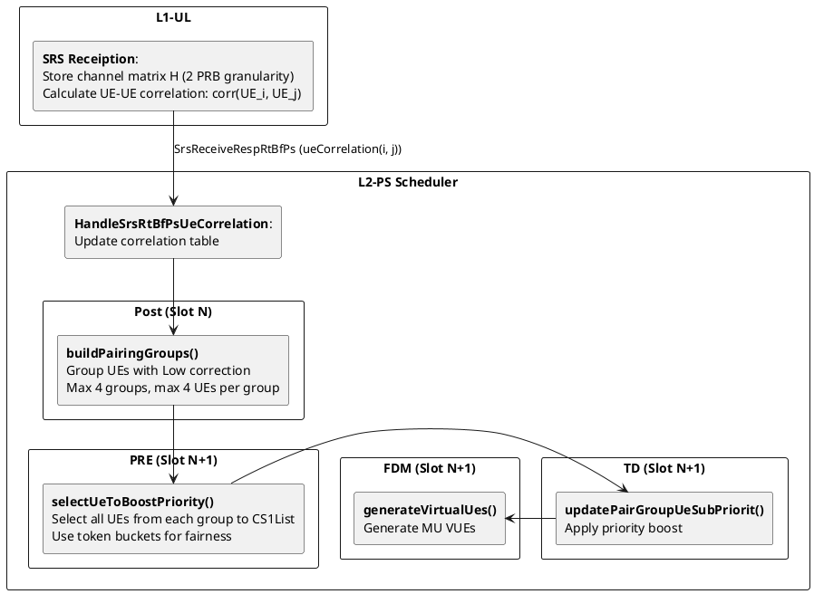
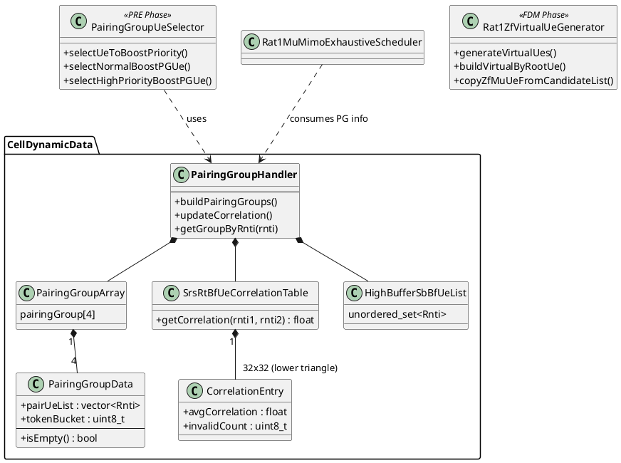

## System Architecture
### High-Level Data Flow

### Component Diagram

## Integration to scheduling phase
### POST
**Function:** `PairingGroupHandler::buildPairingGroups()`

***Source code:***
```cpp
void PairingGroupHandler::buildPairingGroups(const l2ps::utils::Xsfn& currentXsfn)
{
    ...
    for (auto it = highBufferSbBfUeList().begin(); it != highBufferSbBfUeList().end();) // N: number of SB-BF users
    {
        ...
        if (tryAddCandidate(it->key.getUeDataRef(), isLastCandidate))
        {
            it = highBufferSbBfUeList().erase(it);
        }
        else
        {
            ++it;
        }
    }
    clearSingleUeGroups();
    processGroupsWithTwoUes(currentXsfn);
}

bool PairingGroupHandler::tryAddCandidate(const std::reference_wrapper<Ue>& ueDataRef, bool isLastCandidate)
{
    for (auto& pairGroupIndexInfo : pairGroupIndexArray) // G: Number of PairGroup
    {
        ...
        if (group.addUe(ueDataRef, srsRtBfUeCorrelationTable(), dlMuMimoZfCorrThd))
        {
            ...
            return true;
        }
    }
    return false;
}

bool PairingGroupData::addUe(
    const UeDataRef& ueDataRef,
    SrsRtBfUeCorrelationTable& srsRtBfUeCorrelationTable,
    float dlMuMimoZfCorrThd,
    bool needCheckCorrelation)
{
    ...
    if (needCheckCorrelation and
        not checkCorrelationWithExistingUes<true>(newAddUe, srsRtBfUeCorrelationTable, dlMuMimoZfCorrThd)) // U: Max 4 UEs per Group
    {
        return false;
    }
    ...
    return true;
}
```
**Algorithm:**
1. Clear existing groups
2. For each candidate UE in `highBufferSbBfUeList`:
   - Try to add UE to existing group (correlation check)
   - If no suitable group, create new group (max 4 groups)
3. Consolidate 2-UE groups (merge or keep separate based on correlation)
4. Update token buckets for each group

**Complexity:** O(N × G × C)
- N = number of SB-BF UEs
- G = number of groups (4)
- C = correlation checks (2-3 per UE)

### PRE
**Function:** `PairingGroupUeSelector::selectUeToBoostPriority()`
***Source code***:
```cpp
uint8_t PairingGroupUeSelector::selectUeToBoostPriority(
    uint8_t cs1ListSize,
    const BuildCs1Args& buildCs1Args,
    BoostUeVector& boostUeVec,
    const Cs1UeRntiVec& retxUeRntis,
    const Cs1UeRntiVec& dlMacCeUeRntis,
    const bool rdDlZfMuDisableRankDowngrade)
{
    ...
    auto success = [&](auto& cellConfigData, auto& cellDynamicData)
    {
        auto maxNumUeToBoost = std::min(buildCs1Args.cs1ListMaxSize, buildCs1Args.avgSchedUeNum);
        if (cellConfigData.cellParams().mimoConfigData().dlMuMimoEnhConfig().actDlMuPairingGroup() and
            maxNumUeToBoost > cs1ListSize)
        {
            ...
            realBoostUeNum = selectBoostUeForScheduling(
                cellDynamicData.specific().pairingGroupHandler().pairingGroupArray(),
                boostUeNum,
                cellConfigData.cellParams(),
                buildCs1Args.xsfn,
                boostUeVec,
                retxUeRntis,
                dlMacCeUeRntis,
                rdDlZfMuDisableRankDowngrade);
        }
    };
    db::CellDb::db().forVotedCell(buildCs1Args.nrCellGrpId, std::move(success));
    return realBoostUeNum;
}

uint8_t PairingGroupUeSelector::selectBoostUeForScheduling(
    PairingGroupArray& pairingGroupArray,
    const uint32_t boostUeNum,
    const l2ps::db::Cell& cellParams,
    const l2ps::utils::Xsfn& xsfn,
    BoostUeVector& boostUeVec,
    const Cs1UeRntiVec& retxUeRntis,
    const Cs1UeRntiVec& dlMacCeUeRntis,
    const bool rdDlZfMuDisableRankDowngrade)
{
    ...

    if (pscommon::radParams::RadParamsBase::db().rdDlZfMuSupportReTx())
    {
        selectHighPriorityBoostPGUe(pairingGroupArray, xsfn, retxUeRntis, true, boostUeNum, boostUeParams, boostUeVec);
        selectHighPriorityBoostPGUe(
            pairingGroupArray, xsfn, dlMacCeUeRntis, false, boostUeNum, boostUeParams, boostUeVec);
    }

    auto realBoostUeNum = selectNormalBoostPGUe(pairingGroupArray, boostUeNum, boostUeParams, boostUeVec);
    logPairGroupUeList(boostUeParams.inputPGUeList, boostUeVec);
    return realBoostUeNum;
}

uint8_t PairingGroupUeSelector::selectNormalBoostPGUe(
    PairingGroupArray& pairingGroupArray,
    const uint32_t boostUeNum,
    BoostUeParameters& boostUeParams,
    BoostUeVector& boostUeVec)
{
    const uint32_t totalSize = getPairingGroupUeNumber(pairingGroupArray);
    uint8_t maxIndex = getMaxTokenBucketIndex(pairingGroupArray, boostUeParams.pairingGroupBitFlag);
    for (uint8_t index = 0; index < pairingGroupArray.size() and (boostUeVec.empty()) and
         (maxIndex != l2ps::dl::db::maxPairingGroupNumber);
         ++index)
    {
        boostUeParams.pairingGroupBitFlag.set(maxIndex);
        if (pushUeToBoostUeVec(pairingGroupArray[maxIndex], boostUeNum, boostUeParams, boostUeVec))
        {
            updateTokenForPairingGroup(pairingGroupArray, maxIndex, static_cast<uint8_t>(totalSize));
        }
        maxIndex = getMaxTokenBucketIndex(pairingGroupArray, boostUeParams.pairingGroupBitFlag);
    }
    auto realBoostUeNum = static_cast<uint8_t>(boostUeVec.size());
    boostUeVec.insert(boostUeVec.end(), boostUeParams.nonBoostUeVec.begin(), boostUeParams.nonBoostUeVec.end());
    if (maxIndex != l2ps::dl::db::maxPairingGroupNumber)
    {
        pushNonBoostUeToVec(pairingGroupArray, boostUeParams, maxIndex + 1, boostUeVec);
    }
    return realBoostUeNum;
}
```
