# L2PS DL EirpControl

## Current EIRP Design
- **SlotSynchroInd**
  - **PRE and TD**
    - CSI-RS Scheduling: 
      CsiRsSendReq::accumulateCsiRsNormalizedTransmittedPowerForBeamId()
      CsiRsSendReq::accumulateCsiRsTrackingNormalizedPowerForOneBeam()
      CsiRsSendReq::accumulateCsiRsBeamMgmtNormalizedPowerForOneBeam()
 
## class diagram

```plantuml
@startuml L2PS DL EirpControl Class diagram
!pragma graphviz svg
' scale 1920*1080

' skinparam linetype ortho
set namespaceSeparator ::

!$MAX_ALL_BEAMS = 2720
!$MAX_CELL_SEGMENT = 60

package l2ps {
  namespace db {
    class EirpInfo {
      - numberOfCellSegments : numberOfCellSegments_t
      - normalizedSrsBeamGain : NormalizedSrsBeamGainArray
      - normalizedSrsTaperingBeamGain : NormalizedSrsBeamGainArray
      - normalizedLbMMimoPowerSavingSrsBeamGain : NormalizedSrsBeamGainArray
      - normalizedSubBandBeamGain : NormalizedSubBandBeamGainArray
      - eirpBeamGainSelector : EirpBeamGainSelector

    }

    class EirpContext {
      + actEirpControl : bool
      + actEpic : bool
      - eirpCurrentConfiguration : EirpInfo
    }

    class CellStorage {
      - eirpContext : EirpContext
    }

    CellStorage *-l- EirpContext
    EirpContext *-u- EirpInfo
  }

  namespace dl {
    namespace db {
      class SlotEirpControl #LightBlue {
        - eirpDataForSegments : EirpControlSlotDataForSegments
        - segmentIndicesPerBeam : SegmentIndicesPerBeam*
        - monitoredCellSegments : vector<numberOfCellSegments_t>
        - monitoredBeamIdsSet : MonitoredBeamIdsSet&
        - samplingPeriodTokensRetriever : SamplingPeriodTokensRetriever
        - consumedTokenCalculator : ConsumedTokenCalculator
        - monitoredCellSegmentsIndicator : FastBitset<$MAX_CELL_SEGMENT>
        - eirpRestrictionNotifiedOnSegmentIndicator : FastBitset<$MAX_CELL_SEGMENT>
        - eirpContext : EirpContext&

        + getRrmNumberOfRemainingRbFromEirp(beamId) : numOfPrb_t
        + consumeTokensForPdschForFdm(beamId, numOfPrb)
        + isPrbReductionOccured()

        + isEnoughPrbForEntireDlBandwidth(cell, beamId) : bool
        + consumeTokensForPdsch()
        + consumeTokensForDlPdcchOnBeam()
        + consumeTokensForUlPdcchOnBeam()
        + consumeTokensForCsiRsPbch()
        + notifyPrbReductionOccurred(beamId)
        + updateSegmentIndicesForOneRtBeam(beamId)
        + setupSegmentInfoIndexation()
        + reconfigure()
      }
      hide SlotEirpControl methods

      class EirpControlSlotDataForSegments <<typedef>> {
        ::common::utils::StaticVectorFixedSize<EirpControlSlotDataForSegment, $MAX_CELL_SEGMENT>
      }

      class EirpControlSlotDataForSegment {
        - segmentId : numberOfCellSegments_t
        - isEirpControlActivated : bool
        - rrmAvailableEirpTokensInCurrentSlot : double
        - guaranteedTokensPerSymbol : double
        - slotsPerPeriod : double
        - currentSlotInPeriod : double
        - tokensConsumedInPeriod : double
        - rrmEirpControlTokenInTheBucket : double
      }

      namespace cell::eirp {
        class SegmentBeamMappings <<typedef>> {
          ::common::utils::SharedVector<SegmentBeamMapping>
        }

        class SegmentBeamMapping {
          - segmentIndex : numberOfCellSegments_t
          - tokensPerRb : TokensPerRb
        }

        class Data {
          - eirpControl : EirpControlCellDb
          - epicData : epic::Data
        }

        class epic::Data {
          - ues : UE[16]
          - uesPerSegments : UesPerSegments
        }

        class SegmentIndicesPerBeam <<typedef>> {
          ::common::utils::StrongIndexArray<SegmentBeamMappings, SsbPmiBeamId, $MAX_ALL_BEAMS>
        }

        Data *-u- epic::Data
      }

      class CellDynamicSpecificData {
        - eirpData : cell::eirp::Data
        - bucketManager : BucketManager
      }

      class EirpControlCellDb #LightCyan {
        - **eirpControlSlotPerSlot : shared_ptr<SlotEirpControl>**
        + segmentIndicesPerBeam : cell::eirp::SegmentIndicesPerBeam
      }

      class BucketManager {
        - monitoredBuckets : MonitoredBucketMapping
        - monitoredBeamsSet : pscommon::eirp::MonitoredBeamIdsSet
      }

      CellDynamicSpecificData *-d- BucketManager
      CellDynamicSpecificData *-l- cell::eirp::Data

      cell::eirp::Data *-r- EirpControlCellDb
      EirpControlCellDb o-d- SlotEirpControl : [owns]\n(allocated on cell setup)
      EirpControlCellDb *-u- SegmentIndicesPerBeam : [contains]

      SlotEirpControl *-l- EirpControlSlotDataForSegments : [contains]
      SlotEirpControl o-r- EirpContext : [reference]
      SlotEirpControl -u-> "1" SegmentIndicesPerBeam : segmentIndicesPerBeam *
      EirpControlSlotDataForSegments o-l- "0..$MAX_CELL_SEGMENT" EirpControlSlotDataForSegment : [contains]
      SegmentIndicesPerBeam *-u- "$MAX_ALL_BEAMS" SegmentBeamMappings : [contains]
      SegmentBeamMappings *-u- "0..$MAX_CELL_SEGMENT" SegmentBeamMapping : [contains]
    }
    'end of db

    namespace sch {
      class eirp::EirpResourceCalculator {
        - slotEirpControl : db::SlotEirpControl&
        - cellDynamicData : CellDynamicData&
        - eirpBeamIdHelper : EirpBeamIdHelper
      }

      namespace fdm {
        class Scheduler #LightCyan {
          - **slotEirpControlCopy : db::SlotEirpControl**
          - eirpResourceCalculator : eirp::EirpResourceCalculator
          - beamIdsCalculator : BeamIdsCalculator
          - roundRobin : fdm::RoundRobin
          - muEnhScheduler : muMimoEnhance::Scheduler

          + Scheduler()
          + getSlotEirpControl() : db::SlotEirpControl&
          + initEirpResources()
          + prepareScheduling()
          + distributeResources()
          + doMuMimoEnhanceSchedule()
        }
        class RoundRobin {
          - slotEirpControl : db::SlotEirpControl&
          - cellDynamicData : CellDynamicData&

          + RoundRobin()
          + distributeResourcesForResAllocType1()
          + distributeRat1MuMimoResources()
        }

        class DistributionStrategyResAllocType1 {

          + DistributionStrategyResAllocType1()
          + distributeResourcesForMultiBwp()
          + distributeResourcesForMuMimo()
        }

        class DistributionStrategyType1Base #LightCyan {
          - **slotEirpControl : db::SlotEirpControl**
          - cellDynamicData : CellDynamicData&
          - eirpResourceCalculator : eirp::EirpResourceCalculator
          - beamIdsCalculator : BeamIdsCalculator
          + distributeResourcesEirp()
        }
        Scheduler *-r- RoundRobin : [contains]
        RoundRobin .r.> "1" DistributionStrategyResAllocType1 : [constructs]\ndistributeResourcesForResAllocType1()
        DistributionStrategyResAllocType1 -u-|> DistributionStrategyType1Base : <<extends>>
      }
      'end of fdm

      ' Notes '
      note bottom of Scheduler
        **Scheduler Operations**: construct temporary every slot
        1. **Scheduler()**
        - constructs eirpResourceCalculator
        - constructs slotEirpControlCopy
        - constructs roundRobin
        - constructs muEnhScheduler

        2. initEirpResources()
        - Copy from eirpControlSlotPerSlot to slotEirpControlCopy

        3. distributeResources()
        - exhaustive: construct ExhaustiveDistribution to distribute resources
        - non exhaustive:
        - rat0: call roundRobin.distributeResources()
        - rat1: call roundRobin.distributeResourcesForResAllocType1(),
        it constructs distributionStrategyResAllocType1
        which also constructs a new slotEirpControl instance,
        then calls distributionStrategyResAllocType1.distributeResourcesForMultiBwp()

        4. doMuMimoEnhanceSchedule(): called after distributeResources()
        - calls muEnhScheduler.schedule()
      end note
              
      namespace muMimoEnhance {
        class Scheduler {
          - ratSelector : RatSelector
          - roundRobin : fdm::RoundRobin

          + schedule()
        }

        class RatSelector {
          - ratType : RatType

          + RatSelector()
          + schedule()
        }

        ' Represent the type alias with a stereotype'
        class RatType <<typedef>> {
          std::variant<Rat0MuMimoScheduler, Rat1MuMimoScheduler>
        }
        note bottom of RatType
          Select one of:
          - Rat0MuMimoScheduler
          - Rat1MuMimoScheduler
        end note

        class Rat0MuMimoScheduler <<typedef>> {
          + schedule()
          + doWrrForInitTx()
        }

        class Rat1MuMimoScheduler <<typedef>> {
          + schedule()
          + doWrrForInitTx()
        }

        class CommonMuMimoScheduler<T> <<template>> {
          roundRobin : fdm::RoundRobin&
        }

        Scheduler *-r- RatSelector : [contains]
        RatSelector *-r- RatType : [contains]
        RatType .u.> Rat0MuMimoScheduler : [alternative]
        RatType .u.> Rat1MuMimoScheduler : [alternative]
        Rat0MuMimoScheduler -u-|> CommonMuMimoScheduler : <<T=Rat0MuMimoScheduler>>
        Rat1MuMimoScheduler -u-|> CommonMuMimoScheduler : <<T=Rat1MuMimoScheduler>>
      }

'      eirp::EirpResourceCalculator -[hidden]right-> fdm::Scheduler

      fdm::Scheduler *-l- eirp::EirpResourceCalculator : [contains]
      fdm::Scheduler *-d- muMimoEnhance::Scheduler : [contains]
      muMimoEnhance::CommonMuMimoScheduler o-u- fdm::RoundRobin : [reference]
      muMimoEnhance::Scheduler *-u- fdm::RoundRobin : [contains]
    } 
    ' end sch
'    db -[hidden]d-> sch
    sch::eirp::EirpResourceCalculator o-u- db::SlotEirpControl : [reference]
    sch::fdm::Scheduler *-u- db::SlotEirpControl : [contains]
    sch::fdm::DistributionStrategyType1Base *-u- db::SlotEirpControl : [contains]
    sch::fdm::RoundRobin o-u- db::SlotEirpControl : [reference]
  }
  'end of dl

 ' db -[hidden]r-> dl
}
@enduml
```

## Sequence chart
TODO