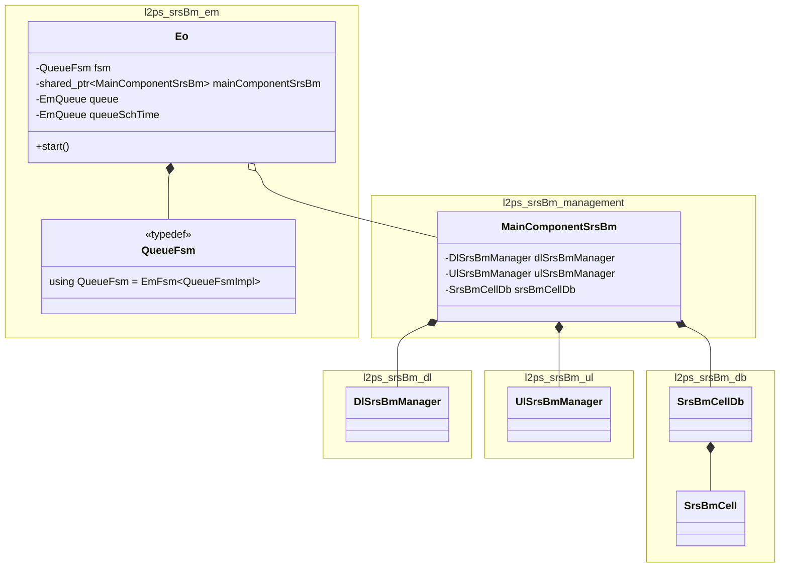
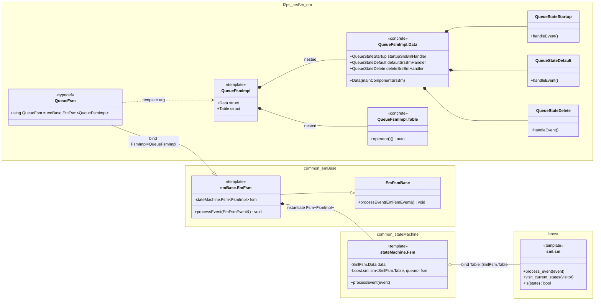
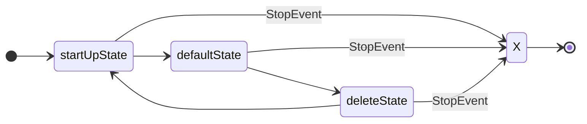
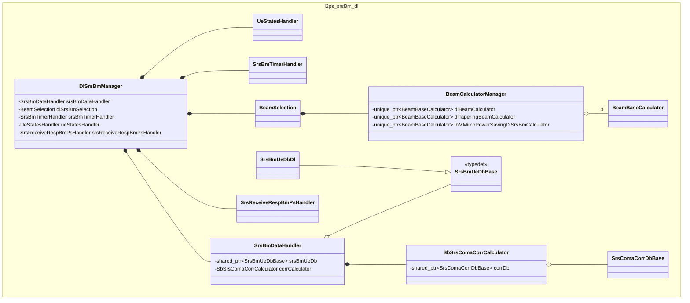
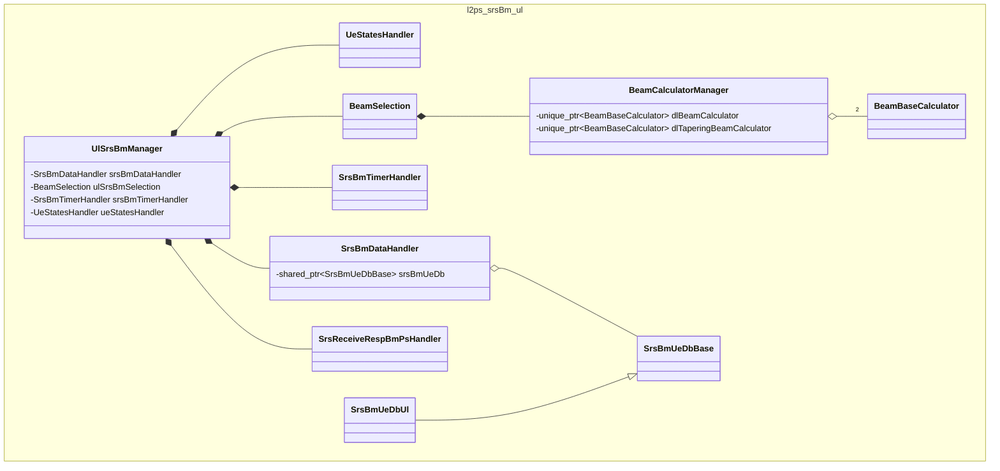
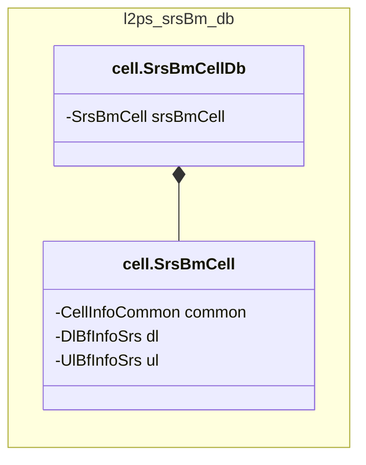

# L2PS SRS BM Mermaid Class Diagrams

本文档根据 [l2ps_srsbm.md](l2ps_srsbm.md) 中的 PlantUML 类图整理而来，并拆分为多张 Mermaid 类图，便于在 Obsidian / VS Code 中查看。

## 1. Top-Level Overview

## 2. Common FSM Template And Queue FSM

## 3. Queue FSM Transition Table

## 4. DL SRS BM

## 5. UL SRS BM

## 6. DB Model

