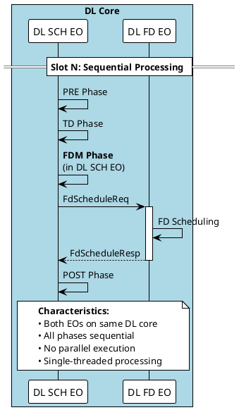
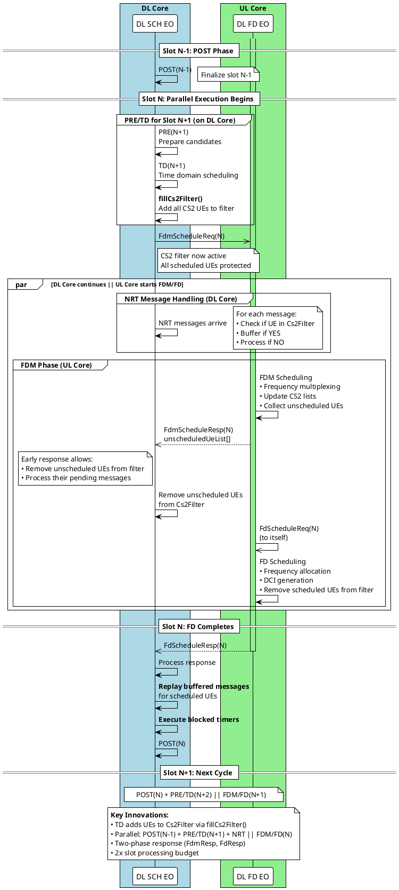
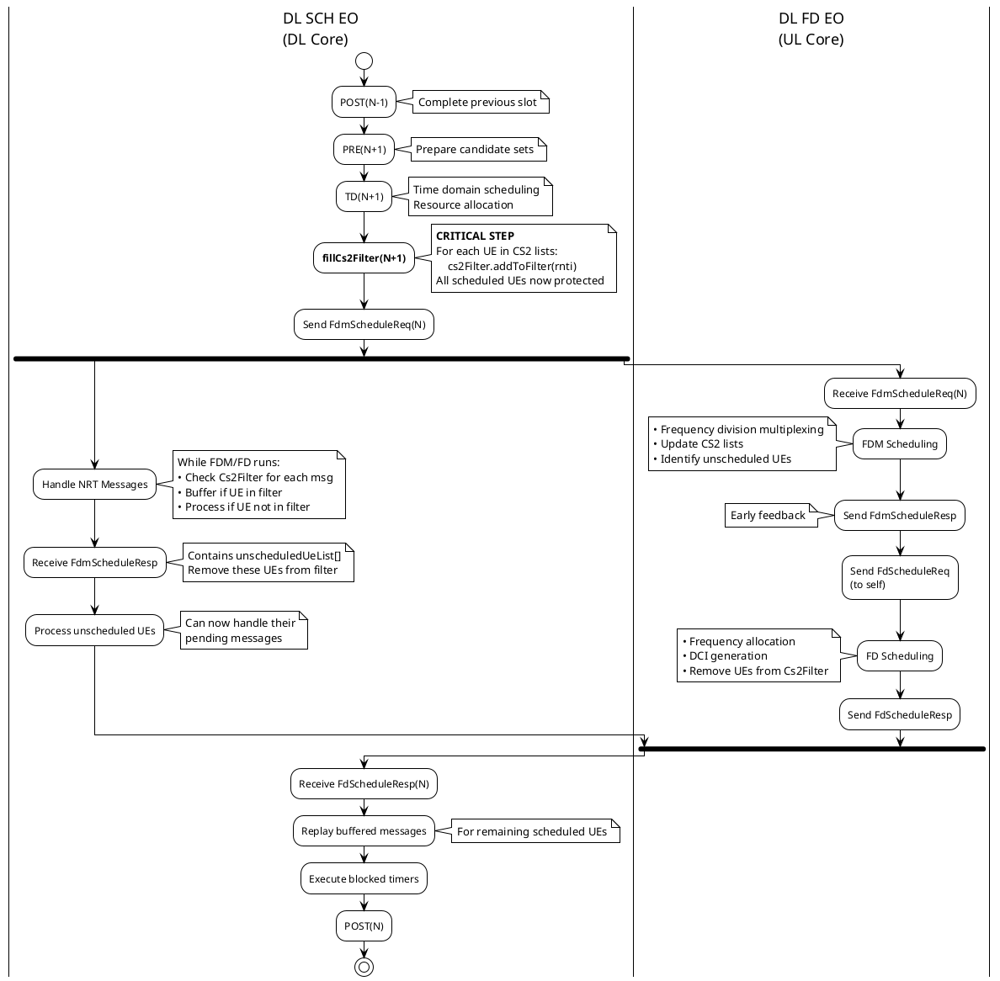
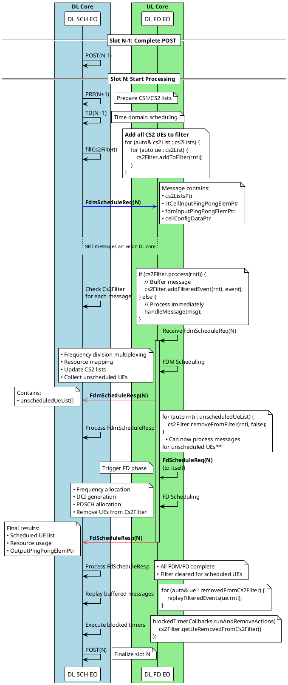
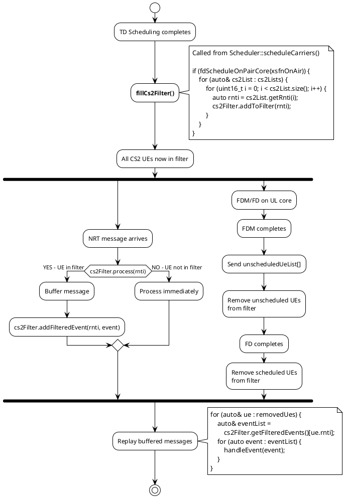
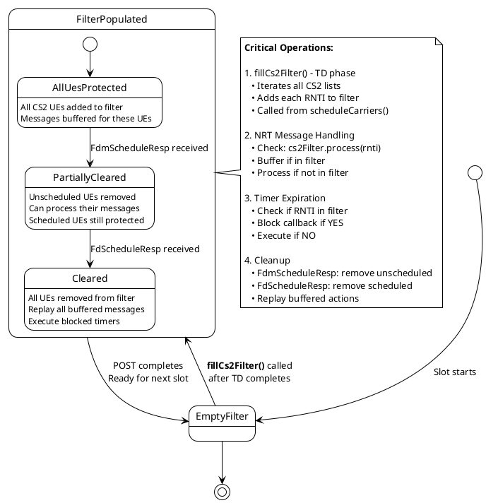
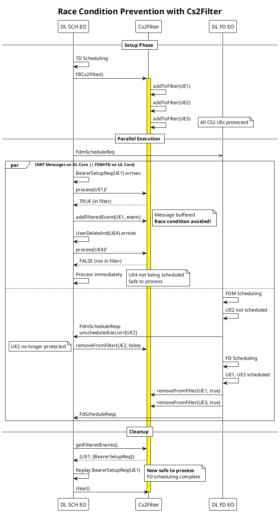
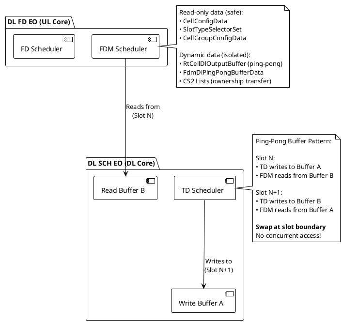
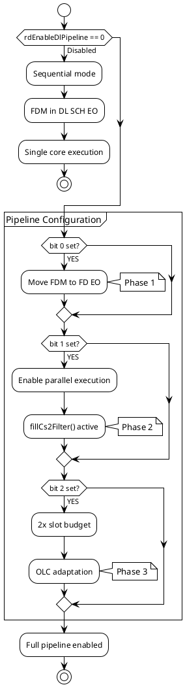
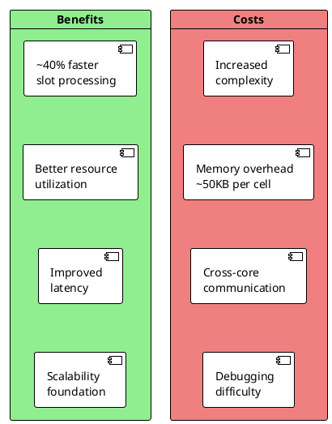

# Parallel Scheduling Design Document
## TDD FR1 Single Cell Pipeline Architecture

**Branch**: `dev/POC_PARASCH`  
**Base Commit**: `8c3395d7212e`  
**Feature**: CB014670 - DL Pipeline for Parallel Scheduling  
**Target**: TDD FR1, Single Cell per Cell Group Deployments  

---

## Table of Contents

1. [Executive Summary](#executive-summary)
2. [Architecture Overview](#architecture-overview)
3. [Message Flow](#message-flow)
4. [Key Software Components](#key-software-components)
5. [Cs2Filter Mechanism](#cs2filter-mechanism)
6. [Data Isolation Strategy](#data-isolation-strategy)
7. [Timeline Execution](#timeline-execution)
8. [Implementation Details](#implementation-details)
9. [Configuration Control](#configuration-control)
10. [Performance Considerations](#performance-considerations)

---

## Executive Summary

### Scope
- **Deployment**: TDD FR1 only
- **Configuration**: Single cell per cell group (no multi-carrier)
- **Objective**: Enable parallel execution of scheduling phases across DL and UL cores

### Key Achievement
Transform sequential single-core DL scheduler into a two-core pipeline where:
- **DL Core**: POST (slot N-1) + NRT message handling + PRE/TD (slot N+1)
- **UL Core**: FDM/FD (slot N) in parallel
- **Synchronization**: Cs2Filter mechanism prevents race conditions

### Code Impact
- **944 files** modified in `uplane/L2-PS/src/`
- **~22,200 lines** added, ~7,600 lines deleted
- **166 commits** related to pipeline/parallel/FDM features

---

## Architecture Overview

### Before: Sequential Execution on Single Core



---

### After: Parallel Pipeline Execution (Multi-Slot View)



### Detailed Slot N Processing Flow



**Implementation Notes:**
- **DL SCH EO** on DL core, **DL FD EO** on UL core
- **TD phase calls `fillCs2Filter()`** (in `Scheduler::scheduleCarriers()`) to add all CS2 UEs to filter
- Parallel execution: `POST(N-1) + PRE/TD(N+1) + NRT handling || FDM/FD(N)`
- Two-phase response mechanism enables early processing of unscheduled UEs
- Cs2Filter prevents race conditions by buffering messages for UEs being scheduled
- 2x slot processing budget for pipeline slots

---

## Message Flow

### Complete Message Sequence with Timing



### Message Structures

**FdmScheduleReq_t** (defined in `/workspace/itf/l2/ps/internal/FdmScheduleReq.mt`):

```cpp
structure FdmScheduleReq_t {
    // Timing info
    hfn, sfn, slot
    nrCellIdentity
    
    // Critical pointers for data isolation
    cs2ListsPtr                    // → CS2 candidate lists
    rtCellInputPingPongElemPtr     // → Cell input buffer
    fdmInputPingPongElemPtr        // → FDM input buffer
    
    // Read-only DB pointers (no race condition)
    cellGroupConfigDataPtr
    slotTypeSelectorSetPtr
    cellConfigDataPtr
    remotePCellConfigDataPtrs[MAX_NUM_REMOTE_CELL]
    remoteSCellConfigDataPtrs[MAX_NUM_REMOTE_CELL]
    
    // Direct data structures
    fdDlInputParams                // Input parameters
    remotePucchInfos[MAX_NUM_REMOTE_CELL]
    pointerParams                  // Dynamic data pointers
    miscParams                     // Miscellaneous params
    informationBlocks              // SIB/OSI info
    
    // Timing control
    slotEndTsc                     // Slot end timestamp
}
```

**FdmScheduleResp_t**:
```cpp
structure FdmScheduleResp_t {
    // Sent after FDM completes
    sfn, slot, hfn
    nrCellIdentity
    
    // List of UEs not scheduled by FDM
    unscheduledUeList[]            // RNTIs removed from CS2
    
    // Early feedback allows DL SCH EO to:
    // - Remove unscheduled UEs from Cs2Filter
    // - Process pending messages for these UEs
}
```

**FdScheduleReq_t** (DL FD EO sends to itself):
```cpp
structure FdScheduleReq_t {
    // Timing info
    sfn, slot, hfn
    
    // Subcell configuration
    fdSchSubcellConfig[]           // Per-subcell scheduling info
    
    // Common data from FDM phase
    fdSchCommonData {
        numFdUes
        cs2Lists                   // Updated by FDM
        resourceInfo
    }
    
    // Triggers FD scheduling phase
}
```

**FdScheduleResp_t** (Final response):
```cpp
structure FdScheduleResp_t {
    // Final scheduling results
    sfn, slot, hfn
    nrCellIdentity
    
    // Results per subcell
    dataFdFeedbackPerSubcell[] {   // Scheduled UE info
        subcellIdx
        scheduledUeInfo[]          // RNTI, MCS, PRBs, etc.
        OutputPingPongElemPtr      // Output buffer pointer
    }
    
    // Resource usage
    prbUsageInfo
    cceUsageInfo
    
    // Timing measurements
    fdmProcessingTime
    fdProcessingTime
    fdEoSchedTime
}
```

---

## Key Software Components

### 1. Cs2FilterDl - Message Buffering Engine

**Location**: `/workspace/uplane/L2-PS/src/dl/sch/Cs2FilterDl.hpp`

**Purpose**: Prevent race conditions by buffering NRT messages for UEs being scheduled in parallel

```cpp
class Cs2FilterDl {
    // Core filter: RNTI → boolean (in filter or not)
    FixedSizeHashMap<Rnti, bool, maxNbTdUes, bucketSize> filter;
    
    // Buffered events: RNTI → list of events
    FixedSizeHashMap<Rnti, EventList, maxNbTdUes, bucketSize> filteredEvents;
    
    // Buffered CA actions
    StaticVectorFixedSize<BufferedCaAction, maxBufferedCaActions> caActionBuffer;
    
    // Removed UEs (for callback execution)
    UeRemovedFromCs2Filter ueRemovedFromCs2Filter;
    
public:
    // Add UE to filter when TD completes (via fillCs2Filter)
    void addToFilter(const Rnti rnti);
    
    // Check if message should be processed or buffered
    bool process(const Rnti rnti);
    
    // Check if UE is in filter
    bool isRntiInCs2Filter(const Rnti rnti) const;
    
    // Remove UE from filter when FDM/FD completes
    void removeFromFilter(const Rnti rnti, bool scheduledStatus);
    
    // Buffer event for later processing
    bool addFilteredEvent(const Rnti rnti, em_event_t event);
    
    // Get removed UEs (for callback execution)
    const UeRemovedFromCs2Filter& getUeRemovedFromCs2Filter() const;
    
    // Clear filter at slot boundary
    void clear();
};
```

**Usage Flow**:



### 2. BlockedTimerCallbacks - Timer Management

**Location**: `/workspace/uplane/L2-PS/src/dl/sch/BlockedTimerCallbacks.hpp`

**Purpose**: Defer timer expiration callbacks for UEs being scheduled in parallel

```cpp
class BlockedTimerCallbacks {
    // RNTI → list of callback actions
    FixedSizeHashMap<Rnti, CallBackActions, maxBlockedTimers, bucketSize> actionList;
    
public:
    // Check if UE has blocked timers
    bool isRntiInActionList(const Rnti rnti) const;
    
    // Add timer callback to blocked list
    void addToActionList(const CallBackAction& action);
    
    // Execute and remove callbacks for UEs removed from Cs2Filter
    void runAndRemoveActions(
        const UeRemovedFromCs2Filter& ueRemovedFromCs2Filter,
        BlockedTimerCallBackRunPhase runPhase = PostFdResp);
        
private:
    // Execute callbacks for single UE
    void runAndRemoveActionsForSingleUe(
        const UeRemovedFromCs2FilterElem& ue,
        BlockedTimerCallBackRunPhase runPhase);
        
    // Special handling for specific timer types
    bool shouldRunAction(
        CallBackAction action,
        BlockedTimerCallBackRunPhase runPhase,
        const UeRemovedFromCs2FilterElem& ue) const;
};
```

**Special Handling**:
- **DRX inactivity timer**: Skip if UE was scheduled (avoid restarting timer immediately after scheduling)
- **Other timers**: Execute normally after FD completes

### 3. FdmSchedulerProxy - Request Preparation

**Location**: `/workspace/uplane/L2-PS/src/pscommon/sch/td/FdmSchedulerProxy.hpp`

**Purpose**: Prepare FdmScheduleReq message with pointer-based data sharing

```cpp
class FdmSchedulerProxy {
    // FDM schedule elements per cell
    std::array<FdmSchedElement<FdmScheduleReqFiller>, maxCells> fdmSchedElements;
    
public:
    // Initialize FDM element for cell
    void initFdmSchedElement(const Cell& cell);
    
    // Fill request parameters
    void fillMiscParams(Cell& cell, CellDynamicData& cellDynamicData, 
                        CellGroupConfigData& cellGroupConfigData);
    
    void fillPointerParams(Cell& cell, CellDynamicData& cellDynamicData,
                          SlotTypeSelectorBase* slotTypeSelector,
                          Xsfn& onAirPucchXsfn);
    
    void fillFdDlInputParams(Cell& cell, CellDynamicData& cellDynamicData,
                            const Xhfn& xhfnOnAir);
    
    void fillRemotePucchInfo(Cell& cell, const Xsfn& onAirXsfn);
    
    // Send request to FD EO
    void sendMessageIfNeeded(const NrCellDbIndex& nrCellDbIndex);
};
```

**Key Design**: Zero-copy pointer passing to avoid expensive data copies

---

## Cs2Filter Mechanism

### State Machine with fillCs2Filter



### Race Condition Prevention



**Without Cs2Filter** (RACE CONDITION):
```
Time:    0ms         5ms         10ms
         │           │           │
DL Core: │──────────BearerSetup(UE1)──┤
         │           ▲           │
         │           │ Modifies UE1 bearers
         │           │ CONFLICT! │
UL Core: │─────FDM/FD reads UE1 bearers─┤
         └───────────┴───────────┘
         CRASH or incorrect scheduling!
```

**With Cs2Filter** (SAFE):
```
Time:    0ms         5ms         10ms        15ms
         │           │           │           │
DL Core: │──────────BearerSetup(UE1)──┤     │
         │           │           │           │
         │    Check Cs2Filter    │           │
         │    UE1 in filter      │           │
         │    → Buffer message   │           │
         │                  FdScheduleResp   │
         │                       │ Process buffered
UL Core: │─────FDM/FD(UE1)───────┤           │
         └───────────────────────┴───────────┘
         No conflict! Message processed after scheduling
```

---

## Data Isolation Strategy

### Ping-Pong Buffer Architecture



---

## Timeline Execution

### Timing Comparison

```plantuml
@startuml
!theme plain
scale 2

concise "Sequential\n(Before)" as SEQ
concise "Parallel\n(After)" as PAR

@0
SEQ is "PRE"
PAR is "POST(N-1)"

@50
SEQ is "TD"
PAR is "PRE(N+1)"

@200
SEQ is "FDM"
PAR is "TD(N+1)" #LightBlue

@300
SEQ is "FD"
PAR is "NRT Handling" #Yellow

@450
SEQ is "POST"
PAR is "FDM/FD(N)" #LightGreen

@500
SEQ is {hidden}
PAR is "POST(N)"

@SEQ
0 is {labeled}
50 is {labeled}
200 is {labeled}
300 is {labeled}
450 is {labeled}
500 is {labeled}

@PAR
0 is {labeled}
350 is {labeled:Speedup}

note bottom of PAR
    **Speedup = 500μs / 350μs = 1.43x**
    
    Sequential: 500μs per slot
    Parallel: 350μs per slot
    
    Actual speedup depends on:
    • NRT message load
    • Number of scheduled UEs
    • FDM/FD complexity
end note

@enduml
```

### Pipeline Slot Execution

```plantuml
@startuml
!theme plain

concise "DL Core\nDL SCH EO" as DL
concise "UL Core\nDL FD EO" as UL

@0
DL is "POST(N-1)"
UL is {hidden}

@50
DL is "PRE(N+1)"
UL is {hidden}

@150
DL is "TD(N+1)"
UL is {hidden}

@200
DL is "fillCs2Filter"
UL is {hidden}

@220
DL is "Send FdmReq"
UL is "Recv FdmReq"

@250
DL is "NRT Handling" #Yellow
UL is "FDM" #LightGreen

@400
DL is "Recv FdmResp\nProcess unscheduled"
UL is "FdScheduleReq\n(self)"

@450
DL is "Continue NRT" #Yellow
UL is "FD" #LightGreen

@650
DL is "Recv FdResp"
UL is "Send FdResp"

@700
DL is "Replay messages\nExecute timers"
UL is {hidden}

@800
DL is "POST(N)"
UL is {hidden}

@DL
0 is {labeled}
250 is {labeled:Parallel\nStarts}
650 is {labeled:Parallel\nEnds}
800 is {labeled}

note bottom
    **Pipeline Benefits:**
    • DL core utilization: 100%
    • UL core utilization: 430μs / 800μs = 54%
    • Total throughput: 1.43x improvement
    • Slot budget doubled (2x) for safety
end note

@enduml
```

---

## Implementation Details

### Critical Code Locations

**File**: `/workspace/uplane/L2-PS/src/dl/sch/td/Scheduler.cpp`

```cpp
void Scheduler::fillCs2Filter(const utils::Xsfn& xsfnOnAir)
{
    if (fdScheduleOnPairCore(xsfnOnAir))
    {
        candidateSets.cs2Filter.setDlFdToUlCore(true);
        for (auto& cs2List : candidateSets.cs2Lists())
        {
            for (uint16_t i = 0; i < cs2List.size(); i++)
            {
                auto rnti = cs2List.getRnti(i);
                candidateSets.cs2Filter.addToFilter(rnti);
            }
        }
    }
}

void Scheduler::scheduleCarriers(const utils::Xhfn& xhfnOnAir)
{
    // ... PRE phase ...
    // ... TD scheduling ...
    
    carrierScheduler.scheduleCarriers(xhfnOnAir);
    
    if (not fdScheduleFence.isFdSchedulerActive())
    {
        // Non-parallel mode: handle FdScheduleResp immediately
        FdScheduleRespArray fdScheduleRespArray{{carrierScheduler.getFdScheduleResp()}};
        messageHandler.handle(fdScheduleRespArray, xsfnOnAir);
    }
    else
    {
        // Parallel mode: fill filter and wait for async response
        fillCs2Filter(xsfnOnAir);
        updateFdEndTicks();
    }
    slotMeasurements.stopTimeTdScheduler();
}
```

**File**: `/workspace/uplane/L2-PS/src/dl/sch/FilterWrapper.cpp`

```cpp
void FilterWrapper::handle(const itf::l2::ps::internal::FdmScheduleResp& fdmScheduleResp)
{
    auto& filter = scheduler.getCs2Filter();
    const auto& ueList = fdmScheduleResp.payload().unscheduledUeList();

    // Remove unscheduled UEs from filter
    for (const auto rnti : ueList)
    {
        filter.removeFromFilter(rnti, false);
    }
    // Now safe to process messages for these UEs
}
```

**File**: `/workspace/uplane/L2-PS/src/fd/sch/MainComponent.cpp`

```cpp
void MainComponent::handleEventFdmScheduleReq(
    const itf::l2::ps::internal::FdmScheduleReq& fdmScheduleReqMsg,
    const uint64_t& currentTsc)
{
    // ... setup ...
    
    // Step 1: Update RT cell dynamic data
    updateRtCellDynamicData(fdmScheduleReqPayload, rtCellDynamicData);
    
    // Step 2: FDM scheduling
    fdmScheduler.scheduleFdm(fdmScheduleReqPayload, rtCellDynamicData, fdmOverloadController);
    
    // Send FdmScheduleResp with unscheduled UEs
    fillAndProcessFdmScheduleResp(fdmScheduleReqPayload, rtCellDynamicData);
    
    // Step 3: Continue to FD scheduling
    runFdScheduling(fdmScheduleReqPayload, rtCellDynamicData, 
                   fdmOverloadController, ticksSlotEnd);
}
```

---

## Configuration Control

### RAD Parameters

#### rdEnableDlPipeline (0x7A2)



**Bitmap Configuration**:
```cpp
enum DlPipelineBits {
    FDM_IN_FD_EO       = 0b00000001,  // bit 0: Move FDM to FD EO
    PIPELINE_BEHAVIOR  = 0b00000010,  // bit 1: Enable parallel execution
    OLC_ADAPTATION     = 0b00000100,  // bit 2: 2x slot budget
    // bits 3-7: Reserved
};
```

**Usage Examples**:
- `rdEnableDlPipeline = 0b001` → FDM in FD EO only (no parallel)
- `rdEnableDlPipeline = 0b011` → FDM in FD EO + parallel execution
- `rdEnableDlPipeline = 0b111` → Full pipeline with OLC adaptation ✓

---

## Performance Considerations

### Benefits & Costs



### Memory Overhead Breakdown

| Component | Size | Purpose |
|-----------|------|---------|
| Cs2FilterDl filter | ~2KB | 64 UEs × 32 bytes |
| Cs2FilterDl filteredEvents | ~5KB | 64 UEs × 10 events × 8 bytes |
| Cs2FilterDl caActionBuffer | ~1KB | 20 actions × 50 bytes |
| BlockedTimerCallbacks | ~4KB | 32 timers × 4 callbacks × 32 bytes |
| RtCellDlOutputBuffer | ~20KB | 2 buffers × 10KB |
| FdmInputBuffer | ~10KB | 2 buffers × 5KB |
| **Total per cell group** | **~50KB** | |

---

## Appendix: Key File Changes

### New Files (Core Components)

| File | Lines | Purpose |
|------|-------|---------|
| `dl/sch/Cs2FilterDl.hpp` | 200 | Message buffering filter |
| `dl/sch/BlockedTimerCallbacks.hpp` | 118 | Timer callback deferral |
| `dl/db/cell/PipelineSlotType.hpp` | 15 | Pipeline slot classification |
| `dl/db/cell/RtCellDlOutputBuffer.hpp` | 154 | Output buffer for TD→FDM |
| `pscommon/sch/td/FdmSchedulerProxy.hpp` | 486 | FDM request preparation |
| `fd/sch/FdmScheduler.{cpp,hpp}` | 500+ | FDM scheduler in FD EO |

### Modified Files (Major Changes)

| File | Changes | Key Modification |
|------|---------|-----------------|
| `dl/sch/td/Scheduler.cpp` | +180 lines | Added fillCs2Filter() |
| `dl/sch/FilterWrapper.cpp` | +791 lines | CS2 filter integration |
| `dl/sch/MainComponent.cpp` | +148 lines | Message filtering logic |
| `fd/sch/MainComponent.cpp` | +350 lines | FDM/FD EO message handlers |

### Message Interface

| Message | Type | Direction | Purpose |
|---------|------|-----------|---------|
| FdmScheduleReq | New | DL SCH → DL FD | Trigger FDM on UL core |
| FdmScheduleResp | New | DL FD → DL SCH | Early feedback (unscheduled UEs) |
| FdScheduleReq | Existing | DL FD → DL FD | Trigger FD phase (self) |
| FdScheduleResp | Existing | DL FD → DL SCH | Final results |

---

## Glossary

- **PRE**: Pre-scheduling phase (candidate selection)
- **TD**: Time Domain scheduling (resource allocation, calls fillCs2Filter)
- **FDM**: Frequency Division Multiplexing scheduling
- **FD**: Frequency Domain scheduling (final allocation)
- **POST**: Post-scheduling phase (cleanup, metrics)
- **NRT**: Non-Real-Time messages (configuration, setup, delete)
- **CS2**: Candidate Set 2 (scheduled UE list)
- **Cs2Filter**: Filter mechanism to protect CS2 list during parallel execution
- **fillCs2Filter()**: Function that adds all CS2 UEs to filter after TD completes
- **Pipeline Slot**: Slot where parallel execution is enabled
- **Ping-Pong Buffer**: Double buffer for concurrent read/write access
- **RNTI**: Radio Network Temporary Identifier (UE identifier)
- **EO**: Execution Object (thread of execution in event machine)

---

## Revision History

| Version | Date | Author | Changes |
|---------|------|--------|---------|
| 1.0 | 2026-01-06 | System | Initial design document |
| 2.0 | 2026-01-06 | System | Updated with PlantUML diagrams, multi-slot view, fillCs2Filter() clarification |

---

*End of Document*
